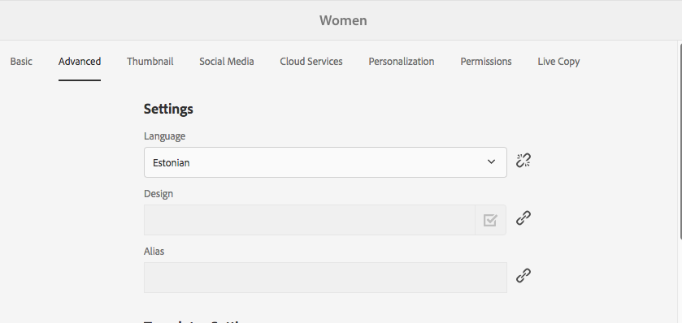

# Adicionar ativos Dynamic Media às páginas {#adding-dynamic-media-assets-to-pages}

Para adicionar a funcionalidade de mídia dinâmica aos ativos que você usa em seus sites, é possível adicionar o **Dynamic Media** ou **Mídia interativa** diretamente na página. Para isso, entre no modo Layout e ative os componentes de mídia dinâmica. Em seguida, adicione esses componentes à página e adicionar ativos ao componente. A mídia dinâmica e os componentes de mídia interativa são inteligentes: eles sabem se você está adicionando uma imagem ou um vídeo, e as opções disponíveis mudam de acordo.

Você adiciona ativos de mídia dinâmica diretamente à página se estiver usando o AEM como o WCM. Se estiver usando um dispositivo de terceiros no WCM, [vincule](linking-urls-to-yourwebapplication.md) ou [incorpore](embed-code.md) os ativos. Para obter um site responsivo de terceiros, consulte [Fornecer imagens otimizadas para um site responsivo](responsive-site.md).

>[!NOTE]
>
>Você deve publicar ativos antes de adicioná-los às páginas no AEM. Consulte [Publicação de ativos Dynamic Media](publishing-dynamicmedia-assets.md).

## Adicionar um componente Dynamic Media a uma página {#adding-a-dynamic-media-component-to-a-page}

Adicionar um componente do Dynamic Media a uma página é o mesmo que adicionar um componente a qualquer página. Os componentes do Dynamic Media são descritos detalhadamente nas seções a seguir.

>[!NOTE]
>
>Se houver um componente do Dynamic Media em uma página da Web acessada por um usuário com permissões somente leitura, a página será quebrada e os componentes não serão renderizados corretamente. O motivo é que a página é reconstruída para garantir que as propriedades dos componentes sejam boas e que os ativos e configurações referenciados sejam acessíveis. A página é renderizada novamente, fazendo com que os componentes se quebrem; o código do componente respectivo na página não pode ser renderizado novamente devido ao acesso somente leitura do usuário.
>  
>Para evitar esse problema, verifique se os usuários do AEM Sites têm as permissões necessárias para acessar os ativos.

1. No AEM, abra a página à qual você deseja adicionar o componente Mídia dinâmica.
1. No painel no lado esquerdo da página (talvez seja necessário alternar a exibição do painel lateral), clique no botão **[!UICONTROL Componentes]** ícone .
1. Em **[!UICONTROL Componentes]** , na lista suspensa, selecione **[!UICONTROL Dynamic Media]**. Se nenhuma lista de componentes do Dynamic Media estiver disponível, você provavelmente precisará ativar os componentes do Dynamic Media que deseja usar. Consulte [Ativar componentes do Dynamic Media](#enabling-dynamic-media-components).

   

1. Arraste um componente Dynamic Media que você deseja usar para a página no local desejado.
1. Passe o ponteiro do mouse sobre o componente. Quando o componente estiver rodeado por uma caixa azul, toque uma vez para exibir a barra de ferramentas do componente. Toque no **[!UICONTROL Configuração]** ícone (chave).
1. [Editar os componentes](#dynamic-media-components) conforme necessário e clique na marca de seleção para salvar as alterações.

### Ativar componentes do Dynamic Media {#enabling-dynamic-media-components}

Se nenhum componente do Dynamic Media estiver disponível para ser adicionado a uma página, isso provavelmente significa que você precisa primeiro ativar os componentes que deseja usar.

1. No AEM, abra a página à qual você deseja adicionar o componente Mídia dinâmica.
1. No lado esquerdo da barra de ferramentas, próximo à parte superior da página, toque no ícone Informações da página e, em seguida, toque em **[!UICONTROL Editar modelo]** na lista suspensa.

   

1. No lado direito da barra de ferramentas, perto da parte superior da página, na lista suspensa, toque em **[!UICONTROL Estrutura]**.

   

1. Próximo à parte inferior da página, toque em **[!UICONTROL Contêiner de layout]** para abrir a barra de ferramentas, toque no ícone Política .
1. No **[!UICONTROL Contêiner de layout]** na página **[!UICONTROL Propriedades]** verifique se o **[!UICONTROL Componentes permitidos]** é selecionada.

   

1. Role até ver **[!UICONTROL Dynamic Media]**.
1. Toque no ícone > à esquerda de **[!UICONTROL Dynamic Media]** para expandir a lista, selecione os componentes do Dynamic Media que deseja ativar.

   

1. Próximo ao canto superior direito do **[!UICONTROL Contêiner de layout]** toque no ícone Concluído (marca de seleção) .

1. No lado direito da barra de ferramentas, perto da parte superior da página, na lista suspensa, toque em **[!UICONTROL Conteúdo inicial]**, em seguida [adicionar um componente Dynamic Media a uma página](#adding-a-dynamic-media-component-to-a-page) como de costume.

## Localização dos componentes do Dynamic Media {#localizing-dynamic-media-components}

Você pode localizar componentes do Dynamic Media de uma das duas maneiras:

* Em uma página da Web no Sites, abra **[!UICONTROL Propriedades]** e selecione a guia **[!UICONTROL Avançado]**. Selecione o idioma desejado para localização.

   

* No seletor do site, selecione a página ou grupo de páginas desejado. Toque **[!UICONTROL Propriedades]** e selecione o **[!UICONTROL Avançado]** guia . Selecione o idioma desejado para localização.

   >[!NOTE]
   >
   >Observe que nem todos os idiomas disponíveis no **[!UICONTROL Idioma]** no momento, têm tokens atribuídos.

## Componentes do Dynamic Media {#dynamic-media-components}

O Dynamic Media e a Mídia interativa estão disponíveis na variável [!UICONTROL Dynamic Media] em [!UICONTROL Componentes]. Você usa o componente [!UICONTROL Mídia interativa] para quaisquer ativos interativos, como vídeo interativo, imagens interativas ou conjuntos de carrossel. Para todos os outros componentes de mídia dinâmica, use o componente Mídia dinâmica.

>[!NOTE]
>
>Esses componentes não estão disponíveis por padrão e precisam ser disponibilizados por meio do editor de modelos antes de usar o . [Após a sua disponibilização](/help/sites-authoring/templates.md#editing-templates-template-authors) no editor de modelos, é possível adicionar os componentes à sua página como você faria com qualquer outro componente AEM.

### Componente Mídia dinâmica {#dynamic-media-component}

O componente Dynamic Media é inteligente — dependendo de você adicionar uma imagem ou um vídeo, você terá várias opções. O componente oferece suporte a predefinições de imagem, visualizadores baseados em imagem, como conjuntos de imagens, conjuntos de rotação, conjuntos de mídia mista e vídeo. Além disso, o visualizador é responsivo. Ou seja, o tamanho da tela muda automaticamente com base no tamanho da tela. Todos são visualizadores HTML5.

>[!NOTE]
>
>Se houver um componente Dynamic Media, um componente Mídia interativa ou ambos em uma página da Web acessada por um usuário com permissões somente leitura, a página será quebrada e os componentes não serão renderizados corretamente. O motivo é que a página é reconstruída para garantir que as propriedades dos componentes sejam boas e que os ativos e configurações referenciados sejam acessíveis. A página é renderizada novamente, fazendo com que os componentes se quebrem; o código do componente respectivo na página não pode ser renderizado novamente devido ao acesso somente leitura do usuário.
>  
>Para evitar esse problema, verifique se os usuários do AEM Sites têm as permissões necessárias para acessar os ativos.

>[!NOTE]
>
>Quando você adiciona o componente Mídia dinâmica e as **[!UICONTROL Configurações de mídia dinâmica]** estão em branco ou não é possível adicionar um ativo corretamente, verifique o seguinte:
>
>* Você [ativou a Mídia dinâmica](config-dynamic.md). As mídias dinâmicas são desativadas por padrão.
>* A imagem tem um arquivo tiff de pirâmide. As imagens importadas antes de a mídia dinâmica ser ativada não possuem um arquivo tiff de pirâmide.

>

#### Ao trabalhar com imagens {#when-working-with-images}

O componente Mídia dinâmica permite adicionar imagens dinâmicas, incluindo conjuntos de imagens, conjuntos de rotação e conjuntos de mídia mista. Você pode ampliar, reduzir e, se aplicável, transformar uma imagem em um conjunto de giro ou selecionar uma imagem de outro tipo de conjunto.

Você também pode configurar a predefinição do visualizador, a predefinição da imagem ou o formato da imagem diretamente no componente. Para tornar uma imagem responsiva, você pode definir os pontos de interrupção ou aplicar uma predefinição de imagem responsiva.

Você deve editar as seguintes configurações do Dynamic Media clicando no botão **[!UICONTROL Editar]** no componente e, em seguida, **[!UICONTROL Configurações do Dynamic Media]**.

>[!NOTE]
>
>Por padrão, o componente de imagem do Dynamic Media é adaptável. Se quiser torná-lo de um tamanho fixo, defina-o no componente no **[!UICONTROL Avançado]** com a guia **[!UICONTROL Largura]** e **[!UICONTROL Altura]** configurações.

* **[!UICONTROL Predefinição do visualizador]**
Selecione uma predefinição do visualizador existente no menu suspenso. Se a predefinição de visualizador que você está procurando não estiver visível, pode ser necessário torná-la visível. Consulte Gerenciar predefinições do visualizador. Não é possível selecionar uma predefinição de visualizador se você estiver usando uma predefinição de imagem e vice-versa.
Essa será a única opção disponível se você estiver visualizando conjuntos de imagens, conjuntos de rotação ou conjuntos de mix de mídia. As predefinições do visualizador exibidas também são inteligentes: apenas as predefinições relevantes do visualizador são exibidas.

* **[!UICONTROL Modificadores do visualizador]**
Os modificadores do visualizador assumem a forma de par name=value com um delimitador &amp; e permitem alterar os visualizadores, conforme descrito no Guia de referência de visualizadores. Um exemplo de um modificador de visualizador é posterimage=img.jpg&amp;caption=text.vtt,1 que define uma imagem diferente para a miniatura do vídeo e associa um arquivo de legenda/subtítulo fechado ao vídeo.

* **[!UICONTROL Predefinição de imagem]**
Selecione uma predefinição de imagem existente no menu suspenso. Se a predefinição de imagem que você está procurando não estiver visível, pode ser necessário torná-la visível. Consulte Gerenciar predefinições de imagens. Não é possível selecionar uma predefinição de visualizador se você estiver usando uma predefinição de imagem e vice-versa.
Essa opção não estará disponível se você estiver visualizando conjuntos de imagens, conjuntos de rotação ou conjuntos de mix de mídia.

* **[!UICONTROL Modificadores de imagem]**
Você pode aplicar efeitos de imagem fornecendo comandos de imagem adicionais. Eles estão descritos em Predefinições de imagem e na referência do Comando de disponibilização de imagens.
Essa opção não estará disponível se você estiver visualizando conjuntos de imagens, conjuntos de rotação ou conjuntos de mix de mídia.

* **[!UICONTROL Pontos de interrupção]**
Se você estiver usando esse ativo em um site responsivo, precisará adicionar os pontos de interrupção da imagem. Os pontos de interrupção da imagem precisam ser separados por vírgulas (,). Essa opção funciona quando não há altura ou largura definida em uma predefinição de imagem.
Essa opção não estará disponível se você estiver visualizando conjuntos de imagens, conjuntos de rotação ou conjuntos de mix de mídia.
Você pode editar as seguintes Configurações avançadas clicando em **[!UICONTROL Editar]** no componente .

* **[!UICONTROL Título]**
Altere o título da imagem.

* **[!UICONTROL Texto alternativo]**
Adicione um título à imagem para os usuários que tenham os gráficos desativados.
Essa opção não estará disponível se você estiver visualizando conjuntos de imagens, conjuntos de rotação ou conjuntos de mix de mídia.

* **[!UICONTROL URL, Abrir em]**
É possível definir um ativo para abrir um link. Defina o URL e, em Abrir em, indique se você deseja que ele abra na mesma janela ou em uma nova.
Essa opção não estará disponível se você estiver visualizando conjuntos de imagens, conjuntos de rotação ou conjuntos de mix de mídia.

* **[!UICONTROL Largura]** e **[!UICONTROL Altura]**
Insira o valor em pixels se desejar que a imagem tenha um tamanho fixo. Deixar esses valores em branco torna o recurso adaptável.

#### Ao trabalhar com vídeo {#when-working-with-video}

Use o componente Dynamic Media para adicionar vídeo dinâmico às suas páginas da Web. Ao editar o componente, você pode optar por usar uma predefinição de visualizador de vídeo predefinida para reproduzir o vídeo na página.

Você deve editar as seguintes configurações do Dynamic Media clicando em **[!UICONTROL Editar]** no componente .

>[!NOTE]
>
>Por padrão, o componente de vídeo Mídia dinâmica é adaptável. Se quiser torná-lo de um tamanho fixo, defina-o no componente com a variável **[!UICONTROL Largura]** e **[!UICONTROL Altura]** no [!UICONTROL Avançado] guia .

* **[!UICONTROL Predefinição do visualizador]**
Selecione uma predefinição de visualizador de vídeo existente no menu suspenso. Se a predefinição de visualizador que você está procurando não estiver visível, pode ser necessário torná-la visível. Consulte Gerenciar predefinições do visualizador.

* **[!UICONTROL Modificadores do visualizador]**
Os modificadores do visualizador assumem a forma de par name=value com um delimitador &amp; e permitem alterar os visualizadores, conforme descrito no Guia de referência de visualizadores do Adobe. Um exemplo de um modificador de visualizador é posterimage=img.jpg&amp;caption=text.vtt,1

   Com modificadores do visualizador, por exemplo, você pode fazer o seguinte:

   * Associar um arquivo de legenda a um vídeo [legenda.](https://experienceleague.adobe.com/docs/dynamic-media-developer-resources/library/viewers-aem-assets-dmc/video/command-reference-url-video/r-html5-video-viewer-url-caption.html)
   * Associar um arquivo de navegação a um vídeo [navegação.](https://experienceleague.adobe.com/docs/dynamic-media-developer-resources/library/viewers-aem-assets-dmc/video/command-reference-url-video/r-html5-video-viewer-url-navigation.html)

Você pode editar o seguinte [!UICONTROL Configurações avançadas] clicando em **[!UICONTROL Editar]** no componente .

* **[!UICONTROL Título]**
Altere o título do vídeo.

* **[!UICONTROL Largura]** e **[!UICONTROL Altura]**
Insira o valor em pixels se desejar que o vídeo tenha um tamanho fixo. Deixar esses valores em branco faz com ele que seja adaptável.

#### Ao trabalhar com o Recorte inteligente {#when-working-with-smart-crop}

Use o componente Dynamic Media para adicionar ativos de imagem de Corte inteligente às suas páginas da Web. Ao editar o componente, você pode optar por usar uma predefinição de visualizador de vídeo predefinida para reproduzir o vídeo na página.

Consulte também [Perfis de imagem](image-profiles.md).

Você pode editar o seguinte [!UICONTROL Configurações do Dynamic Media] clicando em **[!UICONTROL Editar]** no componente .

>[!NOTE]
>
>Por padrão, o componente de imagem do Dynamic Media é adaptável. Se desejar torná-lo de um tamanho fixo, defina-o no componente na guia [!UICONTROL Avançado] com a **[!UICONTROL Largura]** e a **[!UICONTROL Altura]**.

* **[!UICONTROL Modificadores de imagem]**
Você pode aplicar efeitos de imagem fornecendo comandos de imagem adicionais. Eles estão descritos em Predefinições de imagem e na referência do Comando de disponibilização de imagens.
Essa opção não estará disponível se você estiver visualizando conjuntos de imagens, conjuntos de rotação ou conjuntos de mix de mídia.

Você pode editar o seguinte **[!UICONTROL Avançado]** clicando em **[!UICONTROL Editar]** no componente .

* **[!UICONTROL Título]**
Altere o título da imagem de Recorte inteligente.

* **[!UICONTROL Texto alternativo]**
Adicione um título à imagem de recorte inteligente para os usuários que têm gráficos desativados.
Essa opção não estará disponível se você estiver visualizando conjuntos de imagens, conjuntos de rotação ou conjuntos de mix de mídia.

* **[!UICONTROL URL, Abrir em]**
É possível definir um ativo para abrir um link. Defina o URL e, em Abrir em, indique se você deseja que ele abra na mesma janela ou em uma nova.
Essa opção não estará disponível se você estiver visualizando conjuntos de imagens, conjuntos de rotação ou conjuntos de mix de mídia.

* **[!UICONTROL Altura]** e **[!UICONTROL Largura]**
Insira o valor em pixels se desejar que a imagem de recorte inteligente tenha um tamanho fixo. Deixar esses valores em branco faz com ele que seja adaptável.

### Componente Mídia interativa {#interactive-media-component}

O componente Mídia interativa é para ativos que possuem interatividade em pontos de acesso ou mapas de imagem. Se você tiver uma imagem interativa, um vídeo interativo ou um banner de carrossel, use o componente Mídia interativa.

O componente Mídia interativa é inteligente — dependendo de você adicionar uma imagem ou um vídeo, você terá várias opções. Além disso, o visualizador é responsivo: o tamanho da tela muda automaticamente com base no tamanho da tela. Todos são visualizadores HTML5.

>[!NOTE]
>
>Se houver um componente Dynamic Media, um componente Mídia interativa ou ambos em uma página da Web acessada por um usuário com permissões somente leitura, a página será quebrada e os componentes não serão renderizados corretamente. O motivo é que a página é reconstruída para garantir que as propriedades dos componentes sejam boas e que os ativos e configurações referenciados sejam acessíveis. A página é renderizada novamente, fazendo com que os componentes se quebrem; o código do componente respectivo na página não pode ser renderizado novamente devido ao acesso somente leitura do usuário.
> 
>Para evitar esse problema, verifique se os usuários do AEM Sites têm as permissões necessárias para acessar os ativos.

É possível editar as seguintes configurações **[!UICONTROL Gerais]** clicando em **[!UICONTROL Editar]** no componente.

* **[!UICONTROL Predefinição do visualizador]**
Selecione uma predefinição do visualizador existente no menu suspenso. Se a predefinição de visualizador que você está procurando não estiver visível, pode ser necessário torná-la visível. As Predefinições do visualizador devem ser publicadas para poderem ser usadas. Consulte Gerenciar predefinições do visualizador.

* **[!UICONTROL Título]**
Altere o título do vídeo.

* **[!UICONTROL Largura]** e **[!UICONTROL Altura]**
Insira o valor em pixels se desejar que o vídeo tenha um tamanho fixo. Deixar esses valores em branco faz com ele que seja adaptável.

É possível editar as seguintes configurações de **[!UICONTROL Adicionar ao carrinho]** clicando em **[!UICONTROL Editar]** no componente.

* **[!UICONTROL Mostrar ativo do produto]**
Por padrão, esse valor é selecionado. O ativo do produto mostra uma imagem do produto, conforme definido no módulo Comércio. Limpe a marca de seleção para não mostrar o ativo do produto.

* **[!UICONTROL Mostrar preço do produto]**
Por padrão, esse valor é selecionado. O preço do produto mostra o preço do item, conforme definido no módulo Comércio. Limpe a marca de seleção para não mostrar o preço do produto.

* **[!UICONTROL Mostrar formulário do produto]**
Por padrão, esse valor não está selecionado. O Formulário de produto inclui quaisquer variantes de produto, como tamanho e cor. Limpe a marca de seleção para não mostrar as variantes do produto.

### Componente de mídia panorâmica {#panoramic-media-component}

O componente Mídia panorâmica é para os ativos que são imagens panorâmicas esféricas. Essas imagens fornecem uma experiência de visualização de 360° de uma sala, propriedade, local ou paisagem. Para que uma imagem seja qualificada como um panorama esférico, ela deve ter um OU ambos os itens a seguir:

* Uma proporção de aspecto de 2:1.
* Marcada com as palavras-chave &quot;equirectangular&quot; ou (&quot;esférico&quot; + &quot;panorama&quot;) ou (&quot;esférico&quot; + &quot;panorâmico&quot;). Consulte [Uso de tags](/help/sites-authoring/tags.md).

Tanto a proporção quanto os critérios de palavra-chave se aplicam aos ativos panorâmicos da página de detalhes do ativo e ao componente WCM &quot;Mídia panorâmica&quot;.

Você pode editar a seguinte configuração ao tocar em **[!UICONTROL Configurar]** no componente .

* **[!UICONTROL Predefinição do visualizador]**
Selecione um visualizador existente no menu suspenso Predefinição do visualizador .

Se a predefinição do visualizador que você está procurando não estiver visível, verifique se ela foi publicada. Você deve publicar as predefinições do visualizador antes de usá-las. Consulte [Gerenciar predefinições do visualizador](managing-viewer-presets.md).

### Usar HTTP/2 para fornecer ativos do Dynamic Media {#using-http-to-delivery-dynamic-media-assets}

HTTP/2 é o novo protocolo da Web atualizado que melhora a maneira como os navegadores e servidores se comunicam. Ele oferece transferência mais rápida de informações e reduz a quantidade de poder de processamento necessário. A entrega de ativos do Dynamic Media agora pode ser feita via HTTP/2, o que oferece melhor resposta e tempo de carregamento.

Consulte [Entrega de conteúdo HTTP2](http2.md) para obter detalhes completos sobre a introdução ao HTTP/2 com sua conta do Dynamic Media.

>[!MORELIKETHIS]
>
>* [Como entender o gerenciamento de cores com o AEM Dynamic Media](https://helpx.adobe.com/experience-manager/kt/assets/using/dynamic-media-color-management-technical-video-setup.html)
>* [Utilização da miniatura de vídeo personalizada com o AEM Dynamic Media](https://helpx.adobe.com/experience-manager/kt/assets/using/dynamic-media-video-thumbnails-feature-video-use.html)
>* [Noções básicas sobre o Visualizador de ativos com o AEM Dynamic Media](https://helpx.adobe.com/experience-manager/kt/assets/using/dynamic-media-viewer-feature-video-understand.html)
>* [Uso de vídeo interativo com AEM Dynamic Media](https://helpx.adobe.com/experience-manager/kt/assets/using/dynamic-media-interactive-video-feature-video-use.html)
>* [Uso do reprodutor de vídeo no AEM Dynamic Media](https://helpx.adobe.com/experience-manager/kt/assets/using/dynamic-media-video-player-feature-video-use.html)
>* [Uso da nitidez da imagem com o AEM Dynamic Media](https://helpx.adobe.com/experience-manager/6-4/assets/using/best-practices-for-optimizing-the-quality-of-your-images.html)

