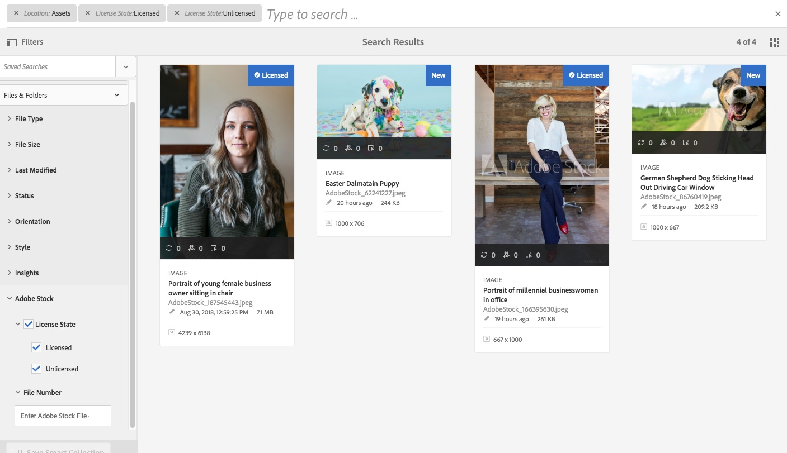

# Use [!DNL Adobe Stock] ativos em [!DNL Adobe Experience Manager Assets] {#use-adobe-stock-assets-in-aem-assets}

>[!CAUTION]
>
>AEM 6.4 chegou ao fim do suporte estendido e esta documentação não é mais atualizada. Para obter mais detalhes, consulte nossa [períodos de assistência técnica](https://helpx.adobe.com/br/support/programs/eol-matrix.html). Encontre as versões compatíveis [here](https://experienceleague.adobe.com/docs/).

As organizações podem integrar seus [!DNL Adobe Stock] plano corporativo com [!DNL Experience Manager Assets] para garantir que os ativos licenciados estejam amplamente disponíveis para seus projetos criativos e de marketing, com os poderosos recursos de gerenciamento de ativos da [!DNL Experience Manager].

[!DNL Adobe Stock] O serviço fornece aos designers e empresas acesso a milhões de fotos, vetores, ilustrações, vídeos, modelos e ativos 3D de alta qualidade e com curadoria e isenta de royalties. [!DNL Experience Manager] os usuários podem localizar, visualizar e licenciar rapidamente [!DNL Adobe Stock] ativos que são salvos em [!DNL Experience Manager], sem deixar o [!DNL Experience Manager] interface.

## Pré-requisitos {#prerequisites}

A integração exige um [plano corporativo Adobe Stock](https://stockenterprise.adobe.com/) e [!DNL Experience Manager] 6.4 com pelo menos o Service Pack 2 implantado. Para [!DNL Experience Manager] 6.4 detalhes do service pack, veja estes [notas de versão](/help/release-notes/sp-release-notes.md).

## Integrar [!DNL Experience Manager] e [!DNL Adobe Stock] {#integrate-aem-and-adobe-stock}

Para permitir a comunicação entre [!DNL Experience Manager] e [!DNL Adobe Stock], crie uma configuração IMS e um [!DNL Adobe Stock] configuração em [!DNL Experience Manager].

>[!NOTE]
>
>Somente [!DNL Experience Manager] administradores e [!DNL Admin Console] os administradores de uma organização podem executar a integração, pois ela requer privilégios de administrador.

### Criar uma configuração IMS {#create-an-ims-configuration}

1. No [!DNL Experience Manager] interface do usuário, navegue até **[!UICONTROL Ferramentas]** > **[!UICONTROL Segurança]** > **[!UICONTROL Configurações do Adobe IMS]**. Clique em **[!UICONTROL Criar]** e selecione **[!UICONTROL Solução da nuvem]** > **[!UICONTROL Adobe Stock]**.
1. Reutilize um certificado existente ou selecione **[!UICONTROL Criar novo certificado]**.
1. Clique em **[!UICONTROL Criar certificado]**. Depois de criada, baixe a chave pública. Clique em **[!UICONTROL Avançar]**. Deixe o [!UICONTROL Configuração de conta técnica do Adobe IMS] será aberta para fornecer os valores necessários em breve.
1. Acesso [Console do Adobe Developer](https://console.adobe.io). Certifique-se de que sua conta tenha permissões de administrador para a organização para a qual a integração é necessária.
1. Clique em **[!UICONTROL Criar novo projeto]** e clique em **[!UICONTROL Adicionar API]**. Selecionar **[!UICONTROL Adobe Stock]** na lista de APIs disponíveis para você. Selecionar [!UICONTROL Web OAUTH 2.0].
1. Fornecer **[!UICONTROL URI de redirecionamento padrão]** e **[!UICONTROL Redirecionar padrão de URI]** valores. Clique em **[!UICONTROL Salvar API configurada]**. Copie a ID gerada e o segredo.
1. Em [!UICONTROL Configuração de conta técnica do Adobe IMS] , forneça os valores nas caixas intituladas **[!UICONTROL Título]**, **[!UICONTROL Servidor de autorização]**, **[!UICONTROL Chave da API]**, **[!UICONTROL Segredo do cliente]** e **[!UICONTROL Carga]**. Para obter informações detalhadas sobre esses valores, consulte [Início rápido da autenticação JWT](https://www.adobe.io/authentication/auth-methods.html#!AdobeDocs/adobeio-auth/master/JWT/JWT.md).

<!-- TBD: Update the URL when the new URL is available. Logged issue github.com/AdobeDocs/adobeio-auth/issues/63.
-->

### Criar [!DNL Adobe Stock] configuração em [!DNL Experience Manager] {#create-adobe-stock-configuration-in-aem}

1. No [!DNL Experience Manager] interface do usuário, navegue até **[!UICONTROL Ferramentas]** > **[!UICONTROL Cloud Services]** > **[!UICONTROL Adobe Stock]**.
1. Clique em **[!UICONTROL Criar]** para criar uma configuração e associá-la à sua configuração IMS existente. Selecionar `PROD` como o parâmetro de ambiente.
1. Em **[!UICONTROL Caminho de ativos licenciados]** , deixe um local como está. Não altere o local onde deseja armazenar a variável [!DNL Adobe Stock] ativos.
1. Conclua a criação adicionando todas as propriedades necessárias. Clique em **[!UICONTROL Salvar e fechar]**.
1. Adicionar [!DNL Experience Manager] usuários ou grupos que podem licenciar os ativos.

>[!NOTE]
>
>Se houver vários [!DNL Adobe Stock] configurações, selecione a configuração desejada no painel Preferências do usuário (**[!UICONTROL AEM]** > **[!UICONTROL Ícone do usuário]** > **[!UICONTROL Preferências do usuário]** > **[!UICONTROL Configuração de estoque]**).

## Usar e gerenciar [!DNL Adobe Stock] ativos em [!DNL Experience Manager] {#usemanage}

Com esse recurso, as organizações podem permitir que seus usuários trabalhem usando [!DNL Adobe Stock] ativos em [!DNL Experience Manager Assets]. No [!DNL Experience Manager] interface do usuário, os usuários podem pesquisar [!DNL Adobe Stock] ativos e licencie os ativos necessários.

Uma vez [!DNL Adobe Stock] o ativo é licenciado em [!DNL Experience Manager], ele pode ser usado e gerenciado como um ativo típico. Em [!DNL Experience Manager], os usuários podem pesquisar e visualizar os ativos; copiar e publicar os ativos; compartilhar os ativos em [!DNL Brand Portal]; acessar e usar os ativos por meio de [!DNL Experience Manager] aplicativo de desktop; e assim por diante.

*Figura: Procurar por [!DNL Adobe Stock] ativos e filtrar resultados de seus [!DNL Experience Manager] interface.*

**A.**[!DNL Adobe Stock] Pesquise ativos semelhantes aos ativos cuja ID do é fornecida. **B.** Pesquise ativos que correspondem à seleção de forma ou orientação. **C.** Procure um dos tipos de ativos mais compatíveis **D.** Abra ou recolha o painel Filtros **E.** Licencie e salve o ativo selecionado no [!DNL Experience Manager]**F.**[!DNL Experience Manager] Salve o ativo no com a marca d&#39;água **G.**[!DNL Adobe Stock] Explore os ativos no site do que são semelhantes ao ativo selecionado **H.**[!DNL Adobe Stock] Exiba os ativos selecionados no site do **I.** Número de ativos selecionados dos resultados de pesquisa **J.** Alterne entre a exibição Cartão e a exibição em Lista

### Localizar ativos {#find-assets}

Seu [!DNL Experience Manager] os usuários do podem pesquisar ativos em ambos, [!DNL Experience Manager] e [!DNL Adobe Stock]. Quando o local de pesquisa não estiver limitado a [!DNL Adobe Stock], os resultados da pesquisa de [!DNL Experience Manager] e [!DNL Adobe Stock] são exibidas.

* Para pesquisar por [!DNL Adobe Stock] ativos, clique em **[!UICONTROL Navegação]** > **[!UICONTROL Ativos]** > **[!UICONTROL Pesquisar Adobe Stock]**.

* Para pesquisar ativos em [!DNL Adobe Stock] e [!DNL Experience Manager Assets], clique em pesquisar .

Como alternativa, comece a digitar `Location: Adobe Stock` na barra de pesquisa para selecionar [!DNL Adobe Stock] ativos. [!DNL Experience Manager] O oferece recursos de filtragem avançados nos ativos pesquisados, permitindo que os usuários entrem rapidamente nos ativos necessários usando filtros, como tipos de ativos compatíveis, orientação de imagem e estado licenciado.

>[!NOTE]
>
>Ativos pesquisados [!DNL Adobe Stock] são exibidos em [!DNL Experience Manager]. [!DNL Adobe Stock] os ativos são buscados e armazenados em [!DNL Experience Manager] repositório somente após um usuário [salva um ativo](/help/assets/aem-assets-adobe-stock.md#saveassets) ou [licencia e salva um ativo](/help/assets/aem-assets-adobe-stock.md#licenseassets). Ativos já armazenados em [!DNL Experience Manager] são exibidos e destacados para facilitar a referência e o acesso. Além disso, a variável [!DNL Stock] os ativos são salvos com alguns metadados adicionais para indicar a fonte como [!DNL Stock].

*Figura: Pesquisar filtros em [!DNL Experience Manager] e destacado [!DNL Adobe Stock] ativos em resultados de pesquisa.*

### Salvar e exibir os ativos necessários {#saveassets}

Selecione um ativo que deseja salvar em [!DNL Experience Manager]. Clique em [!UICONTROL Salvar] na barra de ferramentas na parte superior e forneça o nome e o local do ativo. Os ativos não licenciados são salvos localmente com uma marca d&#39;água.

Na próxima vez que você pesquisar ativos, os ativos salvos serão destacados com um selo, para indicar que tais ativos estão disponíveis em [!DNL Experience Manager Assets].

>[!NOTE]
>
>Os ativos adicionados recentemente exibem um novo selo em vez do selo Licenciado .

### Ativos da licença {#licenseassets}

Os usuários podem licenciar [!DNL Adobe Stock] usando a cota de seus [!DNL Adobe Stock] plano empresarial. Ao licenciar um ativo, ele é salvo sem uma marca d&#39;água e está disponível para pesquisa e uso no [!DNL Experience Manager Assets].

*Figura: Caixa de diálogo para licenciar e salvar [!DNL Adobe Stock] ativos em [!DNL Experience Manager Assets].*

### Acessar metadados e propriedades de ativos {#access-metadata-and-asset-properties}

Os usuários podem acessar e visualizar os metadados, incluindo o [!DNL Adobe Stock] propriedades de metadados para os ativos salvos em [!DNL Experience Manager]e adicionar **[!UICONTROL Referências de licença]** para um ativo. No entanto, as atualizações para referência de licença não são sincronizadas entre [!DNL Experience Manager] e [!DNL Adobe Stock] site.

Os usuários podem ver as propriedades dos ativos licenciados e não licenciados.

*Figura: Visualize e acesse metadados e referências de licença de ativos salvos.*

## Limitações conhecidas {#known-limitations}

* **O aviso de imagem editorial não é apresentado**: Ao licenciar uma imagem, os usuários não podem verificar se uma imagem é Somente para uso editorial. Para evitar um possível uso indevido, os administradores podem desativar o acesso a ativos editoriais no Admin Console.

* **Tipo de licença incorreto exibido**: É possível que um tipo de licença incorreto seja exibido em [!DNL Experience Manager] para um ativo. Os usuários podem fazer logon na [!DNL Adobe Stock] para ver o tipo de licença.

* **Os campos e metadados de referência não são sincronizados**: Quando um usuário atualiza um campo de referência de licença, as informações de referência da licença são atualizadas em [!DNL Experience Manager] mas não no [!DNL Adobe Stock] site. Da mesma forma, se o usuário atualizar os campos de referência na variável [!DNL Adobe Stock] no site, as atualizações não são sincronizadas no [!DNL Experience Manager].

>[!MORELIKETHIS]
>
>* [Tutorial em vídeo sobre como usar [!DNL Adobe Stock] ativos com [!DNL Experience Manager Assets]](https://experienceleague.adobe.com/docs/experience-manager-learn/assets/creative-workflows/adobe-stock.html)
>* [[!DNL Adobe Stock] ajuda do plano empresarial](https://helpx.adobe.com/enterprise/admin-guide.html/enterprise/using/adobe-stock-enterprise.ug.html)
>* [[!DNL Adobe Stock] Perguntas frequentes](https://helpx.adobe.com/stock/faq.html)

