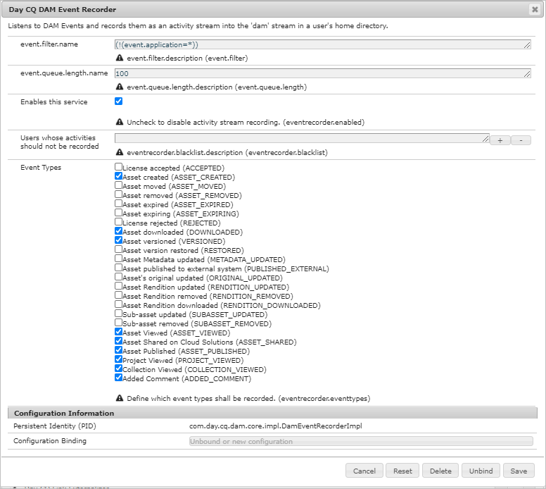
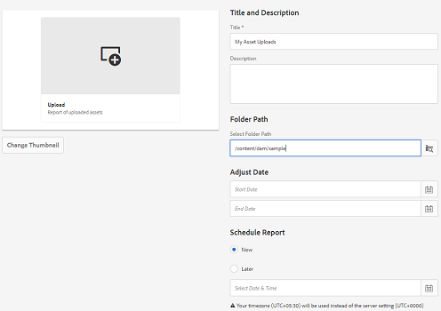
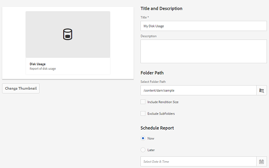

# Relatórios de ativos {#asset-reports}

>[!CAUTION]
>
>AEM 6.4 chegou ao fim do suporte estendido e esta documentação não é mais atualizada. Para obter mais detalhes, consulte nossa [períodos de assistência técnica](https://helpx.adobe.com/br/support/programs/eol-matrix.html). Encontre as versões compatíveis [here](https://experienceleague.adobe.com/docs/).

O relatório de ativos permite avaliar a utilidade da [!DNL Adobe Experience Manager Assets] implantação. Com [!DNL Assets], você pode gerar vários relatórios para seus ativos digitais. Os relatórios fornecem informações úteis sobre o uso do sistema, como os usuários interagem com ativos e quais ativos são baixados e compartilhados.

Use as informações nos relatórios para obter as métricas principais de sucesso e medir a adoção de [!DNL Assets] na empresa e pelos clientes.

O [!DNL Assets] uso da estrutura de relatórios [!DNL Sling] tarefas para processar de forma assíncrona solicitações de relatório de maneira ordenada. É escalável para repositórios grandes. O processamento assíncrono de relatórios aumenta a eficiência e a velocidade com que os relatórios são gerados.

A interface de gerenciamento de relatórios é intuitiva e inclui opções e controles otimizados para acessar relatórios arquivados e visualizar status de execução de relatórios (sucesso, falha e enfileirado).

Quando um relatório é gerado, você é notificado por meio de um email (opcional) e uma notificação da caixa de entrada. Você pode exibir, baixar ou excluir um relatório da página de listagem de relatório, onde todos os relatórios gerados anteriormente são exibidos.

## Pré-requisitos {#prerequisite-for-reporting}

Para gerar relatórios, verifique se:

* Habilitar [!UICONTROL Gravador de eventos CQ DAM] de **[!UICONTROL Ferramentas]** > **[!UICONTROL Operações]** > **[!UICONTROL Console da Web]**.
* Selecione as atividades ou eventos sobre os quais deseja criar relatórios. Por exemplo, para gerar relatórios sobre ativos baixados, selecione [!UICONTROL Ativo baixado (BAIXADO)].

## Gerar relatórios {#generate-reports}

[!DNL Experience Manager Assets] gera os seguintes relatórios padrão para você:

* Upload
* Download
* Expiração
* Modificação
* Publicação
* [!DNL Brand Portal] publicação
* Uso do disco
* Arquivos
* Compartilhamento de link

[!DNL Adobe Experience Manager] Os administradores do podem gerar e personalizar facilmente esses relatórios para sua implementação. Um administrador pode seguir estas etapas para gerar um relatório:

1. Em [!DNL Experience Manager] clique em **[!UICONTROL Ferramentas]** > **[!UICONTROL Ativos]** > **[!UICONTROL Relatórios]**.

   

1. No [!UICONTROL Relatórios de ativos] página, clique em **[!UICONTROL Criar]** na barra de ferramentas.
1. No **[!UICONTROL Página Criar relatório]** escolha o relatório que deseja criar e clique em **[!UICONTROL Próximo]**.

   

   >[!NOTE]
   >
   >Por padrão, os Fragmentos de conteúdo e os compartilhamentos de link são incluídos no ativo [!UICONTROL Relatório baixado]. Selecione a opção apropriada para criar um relatório de compartilhamentos de link ou excluir Fragmentos de conteúdo do relatório de download.

   >[!NOTE]
   >
   >O [!UICONTROL Baixar] exibe detalhes apenas dos ativos selecionados individualmente e baixados ou baixados por meio da Ação rápida. No entanto, não inclui os detalhes dos ativos que estavam dentro de uma pasta baixada.

1. Configure os detalhes do relatório, como título, descrição, miniatura e caminho da pasta no repositório CRX, onde o relatório é armazenado. Por padrão, o caminho da pasta é `/content/dam`. Você pode especificar um caminho diferente.

   

   Escolha o intervalo de datas do seu relatório.

   Você pode optar por gerar o relatório agora ou em uma data e hora futuras.

   >[!NOTE]
   >
   >Se optar por agendar o relatório posteriormente, especifique a data e a hora nos campos Data e hora . Se você não especificar um valor, o mecanismo de relatório o tratará como um relatório que deve ser gerado instantaneamente.

   Os campos de configuração podem ser diferentes com base no tipo de relatório que você cria. Por exemplo, a variável **[!UICONTROL Uso de disco]** fornece opções para incluir representações de ativos ao calcular o espaço em disco usado por ativos. Você pode optar por incluir ou excluir ativos em subpastas para o cálculo do uso do disco.

   >[!NOTE]
   >
   >O relatório **[!UICONTROL Uso de disco]** não inclui campos de intervalo de datas porque indica apenas o uso atual do espaço em disco.

   

   Ao criar o **[!UICONTROL Arquivos]** , é possível incluir/excluir subpastas. No entanto, não é possível incluir representações de ativos para esse relatório.

   

   O relatório **[!UICONTROL Compartilhamento de links]** exibe URLs de ativos que são compartilhados com usuários externos a partir do [!DNL Assets]. Inclui IDs de email do usuário que compartilhou os ativos, IDs de email de usuários com os quais os ativos são compartilhados, data de compartilhamento e data de expiração do link. As colunas não são personalizáveis.

   O **[!UICONTROL Compartilhamento de links]** , não inclui opções para subpastas e representações porque apenas publica os URLs compartilhados que aparecem em `/var/dam/share`.

   

1. Clique em **[!UICONTROL Próximo]** na barra de ferramentas.

1. No **[!UICONTROL Configurar colunas]** por padrão, algumas colunas são selecionadas para serem exibidas no relatório. Você pode selecionar mais colunas. Desmarque uma coluna selecionada para excluí-la do relatório.

   

   Para exibir um nome de coluna ou caminho de propriedade personalizado, configure as propriedades para o binário de ativo sob o `jcr:content` no CRX. Como alternativa, adicione-o por meio do seletor de caminho de propriedade.

   

1. Clique em **[!UICONTROL Criar]** na barra de ferramentas. Uma mensagem notifica que a geração de relatório foi iniciada.
1. No [!UICONTROL Relatórios de ativos] , o status de geração do relatório é baseado no estado atual do trabalho de relatório, por exemplo [!UICONTROL Sucesso], [!UICONTROL Falha], [!UICONTROL Em fila]ou [!UICONTROL Programado]. O mesmo status aparece na caixa de entrada de notificações.Para exibir a página do relatório, clique no link do relatório. Como alternativa, selecione o relatório e clique em **[!UICONTROL Exibir]** na barra de ferramentas.

   

   Clique em **[!UICONTROL Baixar]** na barra de ferramentas para baixar o relatório no formato CSV.

## Adicionar colunas personalizadas {#add-custom-columns}

Você pode adicionar colunas personalizadas aos seguintes relatórios para exibir mais dados para seus requisitos personalizados:

* Upload
* Download
* Expiração
* Modificação
* Publicação
* [!DNL Brand Portal] publicação
* Arquivos

Para adicionar colunas personalizadas a esses relatórios, siga estas etapas:

1. No [!DNL Manager interface], clique em **[!UICONTROL Ferramentas]** > **[!UICONTROL Ativos]** > **[!UICONTROL Relatórios]**.
1. No [!UICONTROL Relatórios de ativos] página, clique em **[!UICONTROL Criar]** na barra de ferramentas.

1. No **[!UICONTROL Criar relatório]** escolha o relatório que deseja criar e clique em **[!UICONTROL Próximo]**.
1. Configure os detalhes do relatório, como título, descrição, miniatura, caminho da pasta e intervalo de datas, conforme aplicável.

1. Para exibir uma coluna personalizada, especifique o nome da coluna em **[!UICONTROL Colunas personalizadas]**.

   

1. Adicione o caminho da propriedade sob o `jcr:content` no CRXDE usando o seletor de caminho de propriedade. Como alternativa, digite o caminho no campo do caminho da propriedade.

   

   Como alternativa, digite o caminho no campo do caminho da propriedade.

   

   Para adicionar mais colunas personalizadas, clique em **[!UICONTROL Adicionar]** e repita os passos 5 e 6.

1. Clique em **[!UICONTROL Criar]** na barra de ferramentas. Uma mensagem notifica que a geração de relatório foi iniciada.

## Configurar o serviço de limpeza {#configure-purging-service}

Para remover relatórios que não são mais necessários, configure o serviço de Expurgação de relatórios do DAM no console da Web para limpar relatórios existentes com base em sua quantidade e idade.

1. Acesse o console da Web (gerenciador de configuração) em `https://[aem_server]:[port]/system/console/configMgr`.
1. Abra o **[!UICONTROL Serviço de limpeza de relatórios DAM]** configuração.
1. Especifique a frequência (intervalo de tempo) do serviço de limpeza no `scheduler.expression.name` campo. Você também pode configurar a idade e o limite de quantidade para os relatórios.
1. Salve as alterações.
