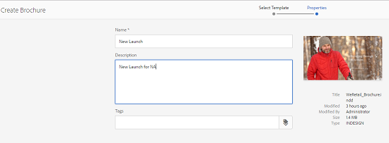
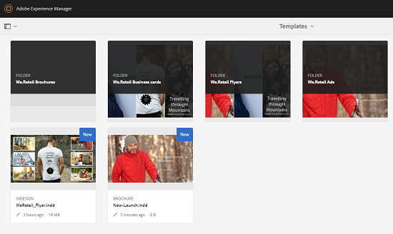

# Modelos de ativos {#asset-templates}

Os modelos de ativos são uma classe especial de ativos que facilitam a rápida redefinição de objetivos de conteúdo visualmente rico para mídia digital e impressa. Um modelo de ativo inclui duas partes, a seção de mensagens fixas e a seção editável.

A seção de mensagens fixas pode conter conteúdo proprietário, como o logotipo da marca e as informações de direitos autorais que estão desativados para edição. A seção editável pode conter conteúdo visual e textual em campos que podem ser editados para personalizar as mensagens.

A flexibilidade para fazer edições limitadas e, ao mesmo tempo, proteger assinaturas globais torna os modelos de ativos os blocos de construção ideais para adaptação e distribuição rápidas de conteúdo como artefatos de conteúdo para várias funções. A redefinição de objetivos de conteúdo ajuda a reduzir o custo de gerenciamento de canais digitais e impressos, além de proporcionar experiências holísticas e consistentes nesses canais.

Como comerciante, você pode armazenar e gerenciar modelos no AEM Assets e usar um único modelo básico para criar várias experiências de impressão personalizadas com facilidade. Você pode criar vários tipos de materiais de suporte de marketing, incluindo folhetos, folhetos, cartões postais, cartões de visita e assim por diante, para transmitir de forma lúdica sua mensagem de marketing aos clientes. Você também pode reunir saídas de impressão de várias páginas de saídas de impressão novas ou existentes. Acima de tudo, você pode fornecer experiências digitais e de impressão simultaneamente com facilidade, para proporcionar uma experiência consistente e integrada aos usuários.

Embora os modelos de ativos sejam principalmente arquivos de InDesign, a proficiência no InDesign não é uma barreira para a criação de artefatos estelares. Não é necessário mapear os campos do modelo de InDesign com os campos do produto que você precisaria para criar catálogos. Você pode editar os modelos no modo WYSIWYG diretamente na interface da Web. Entretanto, para que o InDesign processe suas alterações de edição, é necessário configurar primeiro o AEM Assets para integrar-se ao servidor de InDesigns.

A capacidade de editar modelos de InDesigns na interface da Web ajuda a promover maior colaboração entre a equipe da Creative e da Marketing, além de reduzir o tempo de comercialização para iniciativas promocionais locais.

Você pode fazer o seguinte com modelos de ativos:

* Modificar campos de modelo editáveis da interface da Web
* Controle o estilo básico do texto, por exemplo, tamanho da fonte, estilo e tipo no nível da tag
* Alterar imagens no modelo usando o Seletor de conteúdo
* Edições de modelo de pré-visualização
* Mesclar vários arquivos de modelo para criar um artefato de várias páginas

Quando você escolhe um modelo para seu material de apoio, a AEM Assets cria uma cópia do modelo que você pode editar. O modelo original é preservado, garantindo que sua assinatura global permaneça intacta e possa ser reutilizada para reforçar a consistência da marca.

Você pode exportar o arquivo atualizado dentro da pasta pai nos seguintes formatos:

* INDD
* PDF
* JPG

Também é possível baixar a saída nesses formatos para o sistema local.

## Criar um material promocional {#creating-a-collateral}

Considere um cenário em que você deseja criar materiais de suporte para impressão digital, como folhetos, folhetos e anúncios para uma próxima campanha e compartilhar com lojas de varejo globalmente. A criação de material de apoio com base em um modelo ajuda a fornecer uma experiência unificada ao cliente em todos os canais. Os designers podem criar os templates de campanha (página única ou página múltipla) usando uma solução criativa, como o InDesign e fazer upload dos modelos para a AEM Assets para você. Antes de criar um material de apoio, faça com que um ou mais modelos INDD sejam carregados e disponibilizados com Experience Manager antecipadamente.

1. Clique ou toque no logotipo AEM e, em seguida, clique/toque em **[!UICONTROL Ativos]** na página Navegação.
1. Nas opções, escolha **[!UICONTROL Modelos]**.

   

1. Clique/toque em **[!UICONTROL Criar]** e escolha o material de apoio que deseja criar no menu. Por exemplo, escolha **[!UICONTROL Brochura]**.

   

1. Faça com que um ou mais modelos INDD sejam carregados e disponibilizados antecipadamente no Experience Manager. Escolha um modelo para o folheto e clique/toque em **[!UICONTROL Próximo]**.

   

1. Especifique um nome e uma descrição opcional para o folheto.

   

1. (Opcional) Clique/toque no ícone **[!UICONTROL Tags]** ao lado do campo **[!UICONTROL Tags]** e selecione uma ou mais tags para o folheto. Clique/toque em **[!UICONTROL Confirmar]** para confirmar sua seleção.

   

1. Clique em **[!UICONTROL Criar]**. Uma caixa de diálogo confirma que um novo folheto foi criado. Clique/toque em **[!UICONTROL Abrir]** para abrir o folheto no modo de edição.

   

   Como alternativa, feche a caixa de diálogo e navegue até a pasta na página Modelos que você começou para visualização o folheto que você criou. O tipo de garantia aparece na sua miniatura na visualização do cartão. Por exemplo, neste caso, Brochure é exibido na miniatura.

   

## Editar um material de apoio {#editing-a-collateral}

Você pode editar um material de apoio imediatamente após criá-lo. Como alternativa, abra-o na página Modelos ou na página do ativo.

1. Para abrir o material promocional para edição, execute um dos procedimentos a seguir:

   * Abra o material de apoio (neste caso, folheto) criado na etapa 7 de [Criação de um material de apoio](asset-templates.md#creating-a-collateral).
   * Na página Modelos, navegue até uma pasta na qual você criou o material colateral e clique/toque na ação rápida Editar na miniatura de um material colateral.
   * Na página de ativos do material de apoio, clique/toque no ícone Editar na barra de ferramentas.
   * Selecione o material de apoio e clique/toque no ícone Editar na barra de ferramentas.

   

   O localizador de ativos e o editor de texto são exibidos à esquerda da página. O editor de texto é aberto por padrão.

   Você pode usar o editor de texto para modificar o texto que deseja exibir no campo de texto. É possível modificar o tamanho, o estilo, a cor e o tipo da fonte no nível da tag.

   Usando o localizador de ativos, você pode procurar ou procurar por imagens no AEM Assets e substituir as imagens editáveis no modelo por imagens de sua escolha.

   

   Os editáveis são exibidos à direita. Para que um campo possa ser editado no AEM Assets, o campo correspondente no modelo deve estar marcado no InDesign. Por outras palavras, devem ser tornadas editáveis como InDesigns.

   

   >[!NOTE]
   >
   >Certifique-se de que sua instância de AEM esteja integrada a um servidor de InDesigns para permitir que a AEM Assets extraia dados do modelo de InDesign e disponibilize-os para edição. Para obter detalhes, consulte [Integração do AEM Assets com o InDesign Server](indesign.md).

1. Para modificar o texto em um campo editável, clique/toque no campo de texto a partir da lista de campos editáveis e edite o texto no campo.

   

   É possível editar as propriedades do texto, por exemplo, estilo da fonte, cor e tamanho usando as opções fornecidas.

1. Clique/toque no ícone **[!UICONTROL Pré-visualização]** para pré-visualização das alterações de texto.

   

1. Para trocar uma imagem, clique/toque no ícone **[!UICONTROL Localizador de ativos]**.

   

1. Selecione o campo de imagem na lista de campos editáveis e arraste uma imagem desejada do seletor de ativos para o campo editável.

   

   Você também pode pesquisar por imagens usando palavras-chave, tags e com base no status de publicação. Você pode navegar pelo repositório do AEM Assets e navegar até o local da imagem desejada.

   

1. Clique/toque no ícone **[!UICONTROL Pré-visualização]** para pré-visualização da imagem.

   

1. Para editar uma página específica em um material promocional de várias páginas, use o navegador da página na parte inferior.

   

1. Clique/toque no ícone **[!UICONTROL Pré-visualização]** na barra de ferramentas para pré-visualização de todas as alterações. Clique/toque em **[!UICONTROL Concluído]** para salvar as alterações de edição no material de apoio.

   >[!NOTE]
   >
   >Os ícones Pré-visualização e Concluído são ativados somente quando os campos de imagem editáveis no material de apoio não têm ícones ausentes. Se houver ícones ausentes em seu material promocional, é porque AEM não consegue resolver as imagens no modelo de InDesign. Normalmente, AEM não consegue resolver imagens nos seguintes casos:
   >
   >* As imagens não são incorporadas no modelo de InDesign subjacente
   >* As imagens são vinculadas do sistema de arquivos local

   >
   >Para habilitar AEM para resolver imagens, faça o seguinte:
   >
   >* Incorpore imagens ao criar modelos de InDesigns (Consulte [Sobre links e gráficos incorporados](https://helpx.adobe.com/indesign/using/graphics-links.html)).
   >* Monte AEM em seu sistema de arquivos local e mapeie ícones ausentes com ativos AEM existentes.

   >
   >Para obter mais informações sobre como trabalhar com documentos de InDesigns, consulte [Práticas recomendadas para trabalhar com Documentos de InDesigns em AEM](https://helpx.adobe.com/experience-manager/kb/best-practices-idd-docs-aem.html).

1. Para gerar uma representação em PDF para o folheto, selecione a opção Acrobat na caixa de diálogo e clique em **[!UICONTROL Continuar]**.
1. O material de apoio é criado na pasta com a qual você começou. Para visualização das representações, abra o material de apoio e escolha **[!UICONTROL Representações]** na lista GlobalNav.

   

1. Clique/toque na execução do PDF na lista de execuções para baixar o arquivo PDF. Abra o arquivo PDF para revisar o material adicional.

   

## Mesclar ativos de garantia {#merge-collateral}

1. Clique ou toque em **[!UICONTROL Ferramentas > Ativos]**.
1. Nas opções, escolha **[!UICONTROL Modelos]**.
1. Clique/toque em **[!UICONTROL Criar]** e escolha **[!UICONTROL Mesclar]** no menu.

   

1. Na página Mesclar modelo, clique/toque no ícone Mesclar.

   

1. Navegue até o local do material de apoio que deseja mesclar, clique/toque nas miniaturas do material de apoio que deseja mesclar para selecioná-las.

   

   Você pode até mesmo procurar modelos na caixa OmniSearch.

   

   Você pode navegar pelo repositório ou coleções do AEM Assets, navegar até o local dos modelos desejados e selecioná-los para mesclar.

   

   Você pode aplicar vários filtros para pesquisar os modelos desejados. Por exemplo, você pode pesquisar por modelos com base no tipo de arquivo ou tags.

   

1. Clique/toque em **[!UICONTROL Próximo]** na barra de ferramentas.
1. Na tela **[!UICONTROL Pré-visualização e reorganização]**, reorganize os modelos, se necessário, e pré-visualização a seleção de modelos para mesclar. Em seguida, clique/toque em **[!UICONTROL Próximo]** na barra de ferramentas.

   

1. Na tela Configurar modelo, especifique um nome para o material de apoio. Opcionalmente, especifique quaisquer tags que você considerar apropriadas. Se desejar exportar a saída no formato PDF, selecione a opção **[!UICONTROL Acrobat (.PDF)]**. Por padrão, o material de apoio é exportado no formato JPG e InDesign. Para alterar a miniatura de exibição para o material de suporte de várias páginas, clique/toque em **[!UICONTROL Alterar miniatura]**.

   

1. Clique/toque em **[!UICONTROL Salvar]** e, em seguida, clique/toque em **[!UICONTROL OK]** na caixa de diálogo para fechar a caixa de diálogo. O material de apoio multipáginas é criado na pasta com a qual você começou.

   >[!NOTE]
   >
   >Não é possível editar um colateral mesclado posteriormente ou usá-lo para criar outro colateral.

