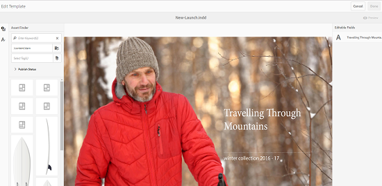
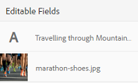
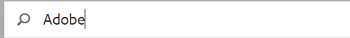
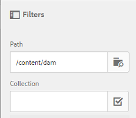

# Modelos de ativos {#asset-templates}

Os modelos de ativos são uma classe especial de ativos que facilitam o redirecionamento rápido de conteúdo visualmente rico para mídia digital e impressa. Um modelo de ativo inclui duas partes, a seção de mensagens fixas e a seção editável.

A seção de mensagens fixas pode conter conteúdo proprietário, como logotipo da marca e informações de direitos autorais que estão desativados para edição. A seção editável pode conter conteúdo visual e textual em campos que podem ser editados para personalizar mensagens.

A flexibilidade para fazer edições limitadas e, ao mesmo tempo, proteger assinaturas globais torna os modelos de ativos blocos fundamentais ideais para adaptação e distribuição rápidas de conteúdo como artefatos de conteúdo para várias funções. Redefinir conteúdo ajuda a reduzir o custo de gerenciamento de canais digitais e de impressão, além de proporcionar experiências holísticas e consistentes nesses canais.

Como comerciante, você pode armazenar e gerenciar modelos no AEM Assets e usar um único modelo básico para criar várias experiências de impressão personalizadas com facilidade. Você pode criar vários tipos de materiais de apoio de marketing, incluindo folhetos, cartões postais, cartões comerciais e assim por diante, para transmitir de forma lúdica sua mensagem de marketing aos clientes. Também é possível reunir saídas de impressão de várias páginas de saídas de impressão existentes ou novas. Acima de tudo, você pode oferecer simultaneamente experiências digitais e de impressão com facilidade para fornecer uma experiência consistente e integrada para os usuários.

Embora os modelos de ativos sejam principalmente arquivos InDesign, a proficiência no InDesign não é uma barreira para criar artefatos estelares. Não é necessário mapear os campos do modelo de InDesign com os campos de produto que, de outra forma, seriam necessários ao criar catálogos. Você pode editar os modelos no modo WYSIWYG diretamente na interface da Web. No entanto, para que o InDesign processe suas alterações de edição, primeiro você deve configurar o AEM Assets para se integrar ao servidor do InDesign.

A capacidade de editar modelos de InDesigns na interface da Web ajuda a promover maior colaboração entre a equipe de Creative e Marketing, além de reduzir o tempo de comercialização para iniciativas promocionais locais.

Você pode fazer o seguinte com modelos de ativos:

* Modificar campos de modelo editáveis da interface da Web
* Controlar o estilo básico do texto, por exemplo, tamanho da fonte, estilo e tipo no nível da tag
* Alterar imagens no modelo usando o Seletor de conteúdo
* Visualizar edições do modelo
* Mesclar vários arquivos de modelo para criar um artefato de várias páginas

Quando você escolhe um modelo para sua garantia, o AEM Assets cria uma cópia do modelo que você pode editar. O modelo original é preservado, o que garante que sua assinatura global permaneça intacta e possa ser reutilizada para reforçar a consistência da marca.

Você pode exportar o arquivo atualizado dentro da pasta pai nos seguintes formatos:

* INDD
* PDF
* JPG

Também é possível baixar a saída nesses formatos para o sistema local.

## Criar um material de apoio {#creating-a-collateral}

Considere um cenário em que você deseja criar materiais de apoio para impressão digitais, como folhetos, panfletos e anúncios para uma campanha futura e compartilhar com lojas de varejo globalmente. Criar ativos de garantia com base em um modelo ajuda a fornecer uma experiência unificada do cliente em todos os canais. Os designers podem criar os modelos de campanha (página única ou várias páginas) usando uma solução criativa, como o InDesign, e fazer upload dos modelos para a AEM Assets, para você. Antes de criar um material adicional, faça upload de um ou mais modelos INDD para e disponibilize-os antecipadamente no Experience Manager.

1. Clique ou toque no logotipo do AEM e em **[!UICONTROL Assets]** na página Navegação.
1. Nas opções, escolha **[!UICONTROL Templates]**.

   

1. Clique/toque em **[!UICONTROL Criar]** e escolha o material adicional que deseja criar no menu. Por exemplo, escolha **[!UICONTROL Brochura]**.

   

1. Tenha um ou mais modelos INDD carregados e disponíveis no Experience Manager com antecedência. Escolha um modelo para o folheto e clique/toque em **[!UICONTROL Próximo]**.

   

1. Especifique um nome e uma descrição opcional para a brochura.

   

1. (Opcional) Clique/toque no ícone **[!UICONTROL Tags]** ao lado do campo **[!UICONTROL Tags]** e selecione uma ou mais tags para o folheto. Clique/toque em **[!UICONTROL Confirmar]** para confirmar a seleção.

   

1. Clique em **[!UICONTROL Criar]**. Uma caixa de diálogo confirma que uma nova brochura foi criada. Clique/toque em **[!UICONTROL Abrir]** para abrir o folheto no modo de edição.

   

   Como alternativa, feche a caixa de diálogo e navegue até a pasta na página Modelos que você começou a usar para exibir o folheto que você criou. O tipo de material de apoio aparece na miniatura na exibição de cartão. Por exemplo, neste caso, Brochura é exibida na miniatura.

   

## Editar um material de apoio {#editing-a-collateral}

Você pode editar um material adicional imediatamente depois de criá-lo. Como alternativa, você a abre na página Modelos ou na página de ativo.

1. Para abrir o material para edição, execute um dos seguintes procedimentos:

   * Abra o material de apoio (brochura neste caso) criado na etapa 7 de [Criação de um material de apoio](asset-templates.md#creating-a-collateral).
   * Na página Modelos , navegue até uma pasta onde você criou o material de apoio e clique/toque na ação rápida Editar na miniatura de um material de apoio.
   * Na página do ativo do material de apoio, clique/toque no ícone Editar na barra de ferramentas.
   * Selecione o material de apoio e clique/toque no ícone Editar na barra de ferramentas.

   

   O localizador de ativos e o editor de texto são exibidos à esquerda da página. O editor de texto é aberto por padrão.

   Você pode usar o editor de texto para modificar o texto que deseja exibir no campo de texto. Você pode modificar o tamanho, estilo, cor e tipo da fonte no nível da tag.

   Usando o localizador de ativos, você pode procurar ou procurar imagens no AEM Assets e substituir as imagens editáveis no modelo por imagens de sua escolha.

   

   Os editáveis são exibidos à direita. Para que um campo possa ser editado no AEM Assets, o campo correspondente no modelo deve ser marcado no InDesign. Em outras palavras, eles devem ser marcados como editáveis no InDesign.

   

   >[!NOTE]
   >
   >Certifique-se de que a instância do AEM esteja integrada a um servidor do InDesign para permitir que o AEM Assets extraia dados do template do InDesign e disponibilize-os para edição. Para obter detalhes, consulte [Integração do AEM Assets com o InDesign Server](indesign.md).

1. Para modificar o texto em um campo editável, clique/toque no campo de texto da lista de campos editáveis e edite o texto no campo.

   

   É possível editar as propriedades do texto, por exemplo, estilo da fonte, cor e tamanho usando as opções fornecidas.

1. Clique/toque no ícone **[!UICONTROL Preview]** para visualizar as alterações de texto.

   

1. Para trocar uma imagem, clique/toque no ícone **[!UICONTROL Localizador de ativos]**.

   

1. Selecione o campo de imagem da lista de campos editáveis e arraste uma imagem desejada do seletor de ativos para o campo editável.

   

   Também é possível pesquisar por imagens usando palavras-chave, tags e com base em seu status de publicação. Você pode navegar pelo repositório do AEM Assets e navegar até o local da imagem desejada.

   

1. Clique/toque no ícone **[!UICONTROL Preview]** para visualizar a imagem.

   

1. Para editar uma página específica em um material de várias páginas, use o navegador da página na parte inferior.

   

1. Clique/toque no ícone **[!UICONTROL Preview]** na barra de ferramentas para visualizar todas as alterações. Clique/toque em **[!UICONTROL Concluído]** para salvar as alterações de edição nas garantias.

   >[!NOTE]
   >
   >Os ícones Visualizar e Concluído são ativados somente quando os campos de imagem editáveis na garantia não têm ícones ausentes. Se houver ícones ausentes em seu material de apoio, é porque o AEM não consegue resolver as imagens no modelo do InDesign. Normalmente, o AEM não consegue resolver imagens nos seguintes casos:
   >
   >* As imagens não são incorporadas no modelo de InDesign subjacente
   >* As imagens são vinculadas do sistema de arquivos local

   >
   >Para permitir que AEM resolvam imagens, faça o seguinte:
   >
   >* Incorpore imagens ao criar modelos de InDesign (Consulte [Sobre links e gráficos incorporados](https://helpx.adobe.com/indesign/using/graphics-links.html)).
   >* Monte AEM no seu sistema de arquivos local e mapeie ícones ausentes com ativos de AEM existentes.

   >
   >Para obter mais informações sobre como trabalhar com documentos do InDesign, consulte [Práticas recomendadas para trabalhar com documentos do InDesign em AEM](https://helpx.adobe.com/experience-manager/kb/best-practices-idd-docs-aem.html).

1. Para gerar uma representação PDF para o folheto, selecione a opção Acrobat na caixa de diálogo e clique em **[!UICONTROL Continuar]**.
1. O material adicional é criado na pasta com a qual você começou. Para visualizar as representações, abra o material de apoio e escolha **[!UICONTROL Representações]** na lista GlobalNavigation.

   

1. Clique/toque na representação em PDF da lista de representações para baixar o arquivo PDF. Abra o arquivo PDF para revisar o material adicional.

   

## Mesclar ativos de garantia {#merge-collateral}

1. Clique ou toque em **[!UICONTROL Ferramentas > Ativos]**.
1. Nas opções, escolha **[!UICONTROL Templates]**.
1. Clique/toque em **[!UICONTROL Criar]** e escolha **[!UICONTROL Mesclar]** no menu.

   

1. Na página Mesclar modelos , clique/toque no ícone Mesclar .

   

1. Navegue até o local do material de apoio que deseja mesclar, clique/toque nas miniaturas do material de apoio que deseja mesclar para selecioná-las.

   

   Você pode até pesquisar modelos na caixa OmniSearch.

   

   Você pode navegar pelo repositório ou coleções do AEM Assets, navegar até o local dos modelos desejados e, em seguida, selecioná-los para mesclar.

   

   Você pode aplicar vários filtros para pesquisar os modelos desejados. Por exemplo, você pode pesquisar modelos com base no tipo de arquivo ou tags.

   

1. Clique/toque em **[!UICONTROL Próximo]** na barra de ferramentas.
1. Na tela **[!UICONTROL Preview &amp; Reorder]**, reorganize os modelos, se necessário, e visualize a seleção de modelos para mesclar. Em seguida, clique/toque em **[!UICONTROL Próximo]** na barra de ferramentas.

   

1. Na tela Configurar modelo , especifique um nome para o material adicional. Opcionalmente, especifique quaisquer tags que você considere apropriadas. Se quiser exportar a saída no formato PDF, selecione a opção **[!UICONTROL Acrobat (.PDF)]**. Por padrão, o material de apoio é exportado no formato JPG e InDesign. Para alterar a miniatura de exibição do material de apoio de várias páginas, clique/toque em **[!UICONTROL Alterar miniatura]**.

   

1. Clique/toque em **[!UICONTROL Salvar]** e em seguida clique/toque em **[!UICONTROL OK]** na caixa de diálogo para fechar a caixa de diálogo. O material de apoio multipáginas é criado na pasta com a qual você começou.

   >[!NOTE]
   >
   >Não é possível editar posteriormente uma garantia resultante da fusão ou usá-la para criar outra garantia.

