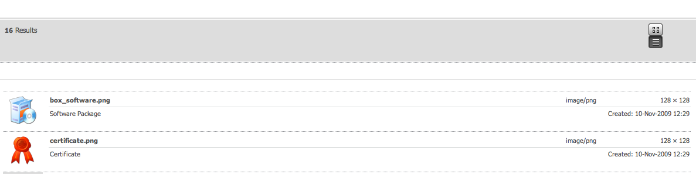
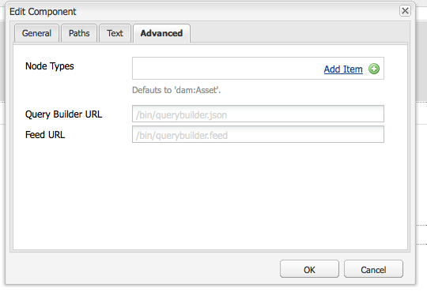
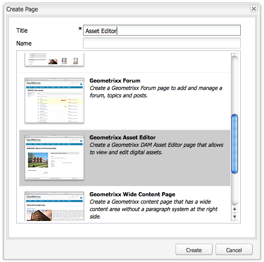
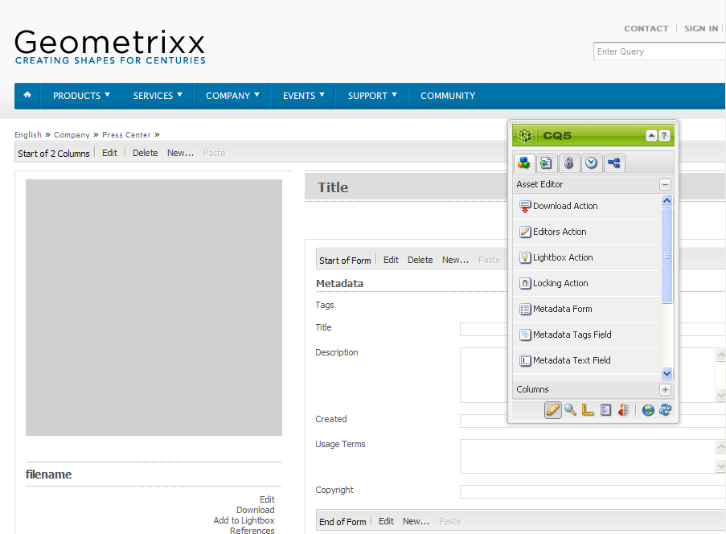

# Criar e configurar as páginas do Editor de ativos {#creating-and-configuring-asset-editor-pages}

Este documento descreve o seguinte:

* Por que você criaria páginas personalizadas do Editor de ativos.
* Como criar e personalizar páginas do Editor de ativos, que são páginas do WCM que permitem exibir e editar metadados, bem como executar ações no ativo.
* Como editar vários ativos simultaneamente.

>[!NOTE]
>
>O Compartilhamento de ativos está disponível como uma implementação de referência de código aberto. Consulte [Compartilhamento de Ativos Commons](https://adobe-marketing-cloud.github.io/asset-share-commons/) . Não é suportado oficialmente.

## Por que criar e configurar páginas do editor de ativos? {#why-create-and-configure-asset-editor-pages}

O Gerenciamento de ativos digitais está sendo usado em mais e mais cenários. Ao migrar de uma solução de pequena escala para um pequeno grupo de usuários treinados profissionalmente - por exemplo, fotógrafos ou taxonomistas - para grupos de usuários maiores e mais diversos - por exemplo, usuários empresariais, autores de WCM, jornalistas e assim por diante - a poderosa interface do usuário [!DNL Adobe Experience Manager Assets] para usuários profissionais pode fornecer muitas informações e as partes interessadas começam a solicitar interfaces do usuário ou aplicativos específicos para acessar os ativos digitais que são relevantes para eles.

Esses aplicativos centrados em ativos podem ser simples galerias de fotos em uma intranet onde os funcionários podem fazer upload de fotos de visitas comerciais ou de um centro de imprensa em um site aberto ao público, como o exemplo fornecido com o Geometrixx. Os aplicativos centrados em ativos também podem se estender para soluções completas, incluindo carrinhos de compras, processos de check-out e verificação.

A criação de um aplicativo centrado em ativos se torna, em grande medida, um processo de configuração que não requer codificação, somente conhecimento dos grupos de usuários e suas necessidades, bem como conhecimento dos metadados que estão sendo usados. Os aplicativos centrados em ativos criados com [!DNL Assets] são extensíveis: com o esforço moderado de codificação, os componentes reutilizáveis para pesquisar, visualizar e modificar ativos podem ser criados.

Um aplicativo centrado em ativos em [!DNL Experience Manager] consiste em uma página do Editor de ativos, que pode ser usada para obter uma exibição detalhada de um ativo específico. Uma página Editor de ativos também permite a edição de metadados, desde que o usuário que acessar o ativo tenha as permissões necessárias.

## Criar e configurar uma página de Compartilhamento de ativos {#creating-and-configuring-an-asset-share-page}

Você personaliza a funcionalidade do Localizador do DAM e cria páginas com todas as funcionalidades necessárias, chamadas de páginas de Compartilhamento de ativos. Para criar uma nova página Compartilhamento de ativos, adicione a página usando o modelo Compartilhamento de ativos do Geometrixx e, em seguida, personalize as ações que os usuários podem realizar nessa página, determine como os visualizadores veem os ativos e decida como os usuários podem criar suas consultas.

Estes são alguns casos de uso para criar uma página de Compartilhamento de ativos personalizada:

* Centro de Imprensa para Jornalistas
* Mecanismo de pesquisa de imagem para usuários empresariais internos
* Banco de dados de imagem para usuários do site
* Interface de marcação de mídia para editores de metadados

### Criar uma página de Compartilhamento de ativos {#creating-an-asset-share-page}

Para criar uma nova página de Compartilhamento de ativos, você pode criá-la quando estiver trabalhando em sites ou no gerenciador de ativos digitais.

>[!NOTE]
>
>Por padrão, ao criar uma página de Compartilhamento de ativos a partir de **Novo** no gerenciador de ativos digitais, um visualizador de ativos e um editor de ativos são criados automaticamente para você.

Para criar uma nova página de Compartilhamento de ativos no console **Sites**:

1. Na guia **[!UICONTROL Sites]**, navegue até o local em que deseja criar uma página de compartilhamento de ativos e clique em **[!UICONTROL Novo]**.

1. Selecione a página **[!UICONTROL Compartilhamento de Ativos]** e clique em **[!UICONTROL Criar]**. A nova página é criada e a página de compartilhamento de ativos é listada na guia **[!UICONTROL Sites]**.

A página básica criada usando o modelo de Compartilhamento de ativos do Geometrixx DAM tem a seguinte aparência:

Para personalizar a página Compartilhamento de ativos, use elementos do sidekick e também edite as propriedades do construtor de consultas. A página **[!UICONTROL Geometrixx Press Center]** é uma versão personalizada de uma página com base neste modelo:

Para criar uma nova página de compartilhamento de ativos por meio do gerenciador de ativos digitais:

1. No gerenciador de ativos digitais, em **[!UICONTROL Novo]**, selecione **[!UICONTROL Novo compartilhamento de ativos]**.
1. No **[!UICONTROL Title]**, digite o nome da página de compartilhamento de ativos. Se desejar, insira um nome para o URL.

   

1. Clique duas vezes na página de compartilhamento de ativos para abri-la e configurar a página.

   

   Por padrão, ao criar uma página de Compartilhamento de ativos a partir de **[!UICONTROL Novo]**, um visualizador de Ativos e o editor de Ativos são criados automaticamente para você.

#### Personalizar ações {#customizing-actions}

Você pode determinar quais ações os usuários podem executar em ativos digitais selecionados a partir de uma seleção de ações predefinidas.

Para adicionar ações à página Compartilhamento de ativos:

1. Na página Compartilhamento de ativos que você deseja personalizar, clique em **[!UICONTROL Ações]** no sidekick.

   As seguintes ações estão disponíveis:
   

| Ação | Descrição |
|---|---|
| [!UICONTROL Ação de exclusão] | Os usuários podem excluir os ativos selecionados. |
| [!UICONTROL Ação de download] | Permite que os usuários baixem ativos selecionados em seus computadores. |
| [!UICONTROL Ação do Lightbox] | Salva ativos em um &quot;lightbox&quot;   onde você pode executar outras ações. Isso é útil ao trabalhar   com ativos em várias páginas. O lightbox também pode ser usado como um   carrinho de compras para ativos. |
| [!UICONTROL Ação de mover] | Os usuários podem mover o ativo para outro   localização |
| [!UICONTROL Ação de tags] | Permite que os usuários adicionem tags aos ativos selecionados |
| [!UICONTROL Exibir ação de ativo] | Abre o ativo no editor de Ativos para   manipulação do usuário. |

1. Arraste a ação apropriada para a área **Actions** na página. Isso cria um botão usado para executar essa ação.

   

#### Determine como os resultados da pesquisa são apresentados {#determining-how-search-results-are-presented}

Você determina como os resultados são exibidos de uma lista predefinida de lentes.

Para alterar a forma como os resultados da pesquisa são exibidos:

1. Na página Compartilhamento de ativos que você deseja personalizar, clique em **[!UICONTROL Pesquisar]**.

   

1. Arraste a lente apropriada para o centro superior da página. No Press Center, as lentes já estão disponíveis. Os usuários pressionam o ícone de lente apropriado para exibir os resultados da pesquisa, conforme desejado.

Estão disponíveis as seguintes lentes:

| Lente | Descrição |
|---|---|
| **[!UICONTROL Listas lentes]** | Apresenta os ativos em uma lista com detalhes. |
| **[!UICONTROL Lentes mosaico]** | Apresenta ativos de forma mosaica. |

#### Lentes mosaico {#mosaic-lens}

#### Listas lentes {#list-lens}

#### Personalizar o Construtor de consultas {#customizing-the-query-builder}

O construtor de consultas permite inserir termos de pesquisa e criar conteúdo para a página Compartilhamento de ativos . Ao editar o construtor de consultas, você também pode determinar quantos resultados de pesquisa são exibidos por página, qual editor de ativos abre quando você clica duas vezes em um ativo, o caminho que a consulta pesquisa e personaliza tipos de nó.

Para personalizar o construtor de consultas:

1. Na página Compartilhamento de ativos que você deseja personalizar, clique em **[!UICONTROL Editar]** no Construtor de consultas. Por padrão, a guia **[!UICONTROL General]** é aberta.

1. Selecione o número de resultados por página, o caminho do editor de ativos (se você tiver um editor de ativos personalizado) e o título Ações.

   

1. Clique na guia **[!UICONTROL Caminhos]**. Insira um caminho ou vários caminhos que a pesquisa executará. Esses caminhos serão substituídos se o usuário usar o predicado Caminhos .

   

1. Insira outro tipo de nó, se desejar.

1. No campo **[!UICONTROL URL do construtor de consultas]**, você pode substituir ou quebrar o construtor de consultas e inserir os novos URLs do servlet com o componente do construtor de consultas existente. No campo **[!UICONTROL URL do feed]**, você também pode substituir o URL do feed.

   

1. No campo **[!UICONTROL Text]**, insira o texto que deseja que apareça para os resultados e os números de página dos resultados. Clique em **[!UICONTROL OK]** quando terminar de fazer alterações.

   

#### Adicionar predicados {#adding-predicates}

[!DNL Experience Manager Assets] O inclui vários predicados que podem ser adicionados à página Compartilhamento de ativos. Isso permite que seus usuários restrinjam ainda mais as pesquisas. Em alguns casos, eles podem substituir um parâmetro do construtor de consultas (por exemplo, o parâmetro Caminho ).

Para adicionar predicados:

1. Na página Compartilhamento de ativos que você deseja personalizar, clique em **[!UICONTROL Pesquisar]**.

   

1. Arraste os predicados apropriados para a página Compartilhamento de ativos abaixo do construtor de consultas. Isso cria os campos apropriados.

   

   Os seguintes predicados estão disponíveis:

| Predicado | Descrição |
|---|---|
| **[!UICONTROL Predicado de data]** | Permite que os usuários pesquisem ativos que foram modificados antes e depois de determinadas datas. |
| **[!UICONTROL Predicado de opções]** | O proprietário do site pode especificar uma propriedade para pesquisa (como no predicado da propriedade, por exemplo cq:tags) e uma árvore de conteúdo a partir da qual as opções serão preenchidas (por exemplo, a árvore de tags). Isso gera uma lista de opções em que os usuários podem selecionar os valores (tags) que a propriedade selecionada (propriedade tag) deve ter. Esse predicado permite criar controles de lista como a lista de tags, tipos de arquivo, orientações de imagem e assim por diante. É ótimo para um conjunto fixo de opções. |
| **[!UICONTROL Predicados de caminho]** | Permite que os usuários definam o caminho e as subpastas, se desejado. |
| **[!UICONTROL Predicado da propriedade]** | O proprietário do site especifica uma propriedade a ser pesquisada, por exemplo, tiff:ImageLength e o usuário pode inserir um valor, por exemplo, 800. Isso retorna todas as imagens que têm 800 pixels de altura. Dever se sua propriedade pode ter valores arbitrários é útil. |

Para obter mais informações, consulte o [predicado javadocs](https://helpx.adobe.com/experience-manager/6-4/sites/developing/using/reference-materials/javadoc/com/day/cq/search/eval/package-summary.html).

1. Para configurar o predicado ainda mais, clique duas vezes nele. Por exemplo, ao abrir o Predicado de caminho, é necessário atribuir o caminho raiz.

   

## Criar e configurar uma página do Editor de ativos {#creating-and-configuring-an-asset-editor-page}

Personalize o editor de ativos para determinar como os usuários podem visualizar e editar os ativos digitais. Para fazer isso, crie uma nova página Editor de ativos e personalize as exibições e as ações que os usuários podem executar nessa página.

>[!NOTE]
>
>Se quiser adicionar campos personalizados ao editor de ativos do DAM, adicione novos nós cq:Widget a `/apps/dam/content/asseteditors.`

### Criar a página Editor de ativos {#creating-the-asset-editor-page}

Ao criar a página Editor de ativos , uma boa prática é criar a página logo abaixo da página Compartilhamento de ativos .

Para criar uma página do Editor de ativos:

1. Na guia **[!UICONTROL Sites]**, navegue até o local em que deseja criar uma página de editor de ativos e clique em **[!UICONTROL Novo]**.

1. Selecione **[!UICONTROL Geometrixx Asset Editor]** e clique em **[!UICONTROL Criar]**. A nova página é criada e é listada na guia **[!UICONTROL Sites]**.

A página básica criada usando o modelo do Editor de ativos do Geometrixx tem a seguinte aparência:

Para personalizar a página Editor de ativos, use elementos do sidekick. A página Editor de ativos acessada do **[!UICONTROL Geometrixx Press Center]** é uma versão personalizada de uma página baseada neste modelo:

#### Definir qual editor de ativos abre de uma página de Compartilhamento de ativos {#setting-which-asset-editor-opens-from-an-asset-share-page}

Depois de criar a página Editor de ativos personalizados, é necessário garantir que, ao clicar duas vezes em ativos, o Compartilhamento de ativos personalizado criado abra os ativos na página Editor personalizado.

Para definir a página Editor de ativos:

1. Na página Compartilhamento de ativos , clique em **[!UICONTROL Editar]** ao lado do Construtor de consultas.

   

1. Clique na guia **[!UICONTROL General]** se ela ainda não estiver selecionada.

1. No campo **[!UICONTROL Caminho do Editor de ativos]**, insira o caminho para o editor de ativos no qual deseja que a página Compartilhamento de ativos abra ativos e clique em **[!UICONTROL OK]**.

   

#### Adicionar componentes do Editor de ativos {#adding-asset-editor-components}

Você determina qual funcionalidade um editor de ativos tem, adicionando componentes à página.

Para adicionar componentes do editor de ativos:

1. Na página Editor de ativos que você deseja personalizar, selecione **[!UICONTROL Editor de ativos]** no sidekick. Todos os componentes disponíveis do editor de ativos são exibidos.

   >[!NOTE]
   >
   >O que você pode personalizar depende de quais componentes estão disponíveis. Para ativar componentes, vá para o Modo de design e selecione os componentes necessários ativados.

1. Arraste os componentes do sidekick para o editor de ativos e faça quaisquer modificações nas caixas de diálogo do componente. Os componentes são descritos na tabela a seguir e descritos nas instruções detalhadas a seguir.

   >[!NOTE]
   >
   >Ao criar a página do editor de ativos, você cria componentes que são somente leitura ou editáveis. Os usuários sabem que um campo pode ser editado se uma imagem de um lápis for exibida nesse componente. Por padrão, a maioria dos componentes é configurada como somente leitura.

   | Componente | Descrição |
   |---|---|
   | **[!UICONTROL Campo de texto ] de metadados e  [!UICONTROL formulário de metadados]** | Permite adicionar metadados adicionais a um ativo e executar uma ação, como enviar, nesse ativo. |
   | **[!UICONTROL Subativos]** | Permite personalizar subativos. |
   | **Tags** | Permite que os usuários selecionem e adicionem tags a um ativo. |
   | **[!UICONTROL Miniatura]** | Mostra uma miniatura do ativo, seu nome de arquivo e permite adicionar um texto alternativo. Também é possível adicionar ações do editor de ativos aqui. |
   | **[!UICONTROL Título]** | Exibe o título do ativo, que pode ser personalizado. |

   

#### Formulário de metadados e campo de texto - Configuração do componente Exibir metadados {#metadata-form-and-text-field-configuring-the-view-metadata-component}

O Formulário de metadados é um formulário que inclui uma ação de início e fim. No meio, você insere campos **[!UICONTROL Text]**. Consulte [Forms](../sites-authoring/default-components.md) para obter mais informações sobre como trabalhar com formulários.

1. Crie uma ação de início clicando em **[!UICONTROL Edit]** na área Iniciar do formulário. Você pode inserir um título de Caixa, se desejar. Por padrão, o título da Caixa é **[!UICONTROL Metadados]**. Marque a caixa de seleção Validação do cliente se desejar que o código de cliente do script java para validação seja gerado.

   

1. Crie uma ação End clicando em **[!UICONTROL Edit]** na área End do formulário. Por exemplo, você pode criar um botão **[!UICONTROL Submit]** para permitir que os usuários enviem suas alterações de metadados. Como opção, você pode adicionar um botão **[!UICONTROL Reset]** que redefine os metadados para seu estado original.

   

1. Entre o **[!UICONTROL Início do formulário]** e o **Fim do formulário**, arraste os Campos de texto de metadados para o formulário. Os usuários preenchem metadados nesses campos de texto, nos quais podem enviar ou concluir outra ação.

1. Clique duas vezes no nome do campo, por exemplo, **Title** para abrir o campo de metadados e fazer alterações. Na guia **[!UICONTROL General]** da janela [!UICONTROL Editar componente], defina o namespace e o rótulo do campo, bem como o tipo, por exemplo, `dc:title`.

   

   Consulte [Personalização e extensão [!DNL Assets]](extending-assets.md) para obter informações sobre como modificar os namespaces disponíveis no formulário de metadados.

1. Clique na guia **[!UICONTROL Restrições]**. Aqui, é possível selecionar se um campo é obrigatório e, se necessário, adicionar restrições.

   

1. Clique na guia **[!UICONTROL Display]**. Aqui, é possível inserir uma nova largura e número de linhas para o campo de metadados. Marque a caixa de seleção **Field is read only** para permitir que os usuários editem os metadados.

   

   Este é um exemplo de um formulário de Metadados com vários campos:

   

Na página Editor de ativos, os usuários podem inserir valores nos campos de metadados (se forem editáveis) e executar a ação final (por exemplo, enviar as alterações).

#### Subativos {#sub-assets}

O componente Subativos é onde você pode exibir e selecionar subativos. Você pode determinar quais nomes aparecem no [ativo principal](assets.md#what-are-digital-assets) e subativos.

Clique duas vezes no componente Sub Assets para abrir a caixa de diálogo sub-ativos, onde é possível alterar os títulos do ativo principal e de quaisquer sub-ativos. Os valores padrão são exibidos abaixo do campo correspondente.

Este é um exemplo de um componente Sub Assets preenchido:

Por exemplo, se você selecionar um subativo, observe como o componente exibe a página apropriada e o título da Caixa muda de Subativos para Irmãos.

#### Tags {#tags}

O componente Tags é um componente onde os usuários podem atribuir tags existentes a um ativo, o que ajuda posteriormente na organização e na recuperação. Você pode tornar esse componente somente leitura, de modo que os usuários não possam adicionar tags, mas somente visualizá-las.

Clique duas vezes no componente Tags para abrir a caixa de diálogo tags, onde é possível alterar o título de Tags, se desejado, e onde é possível selecionar os namespaces alocados. Para tornar esse campo editável, desmarque a caixa de seleção **Ocultar botão Editar**. Por padrão, as tags são editáveis.

Se os usuários puderem editar tags, eles poderão clicar no lápis para adicionar tags, selecionando-as no menu suspenso Tags .

A seguir, um componente de Tags preenchido:

#### Miniatura  {#thumbnail}

O componente Miniatura é onde o ativo exibe a miniatura selecionada (para muitos dos formatos, a miniatura é extraída automaticamente). Além disso, o componente exibe o nome do arquivo e as ações [que você pode modificar](assets-finder-editor.md#adding-asset-editor-actions).

Clique duas vezes no componente de miniatura para abrir a caixa de diálogo de miniatura, onde é possível alterar o texto alternativo. Por padrão, o texto alternativo em miniatura assume o padrão **[!UICONTROL Clique para baixar]** o ativo.

Este é um exemplo de um componente Miniatura preenchido:

#### Título {#title}

O componente Título exibe o título do ativo e uma descrição.

Por padrão, ele está no modo somente leitura, portanto, os usuários não podem editá-lo. Para torná-lo editável, clique duas vezes no componente e desmarque a caixa de seleção **Ocultar botão de edição**. Além disso, insira um título para vários ativos.

Se o Título puder ser editado, você poderá adicionar um título e uma descrição clicando no Lápis para abrir a janela **Propriedades do ativo**. Além disso, é possível ativar e desativar o ativo selecionando a data e a hora.

Quando os usuários editam o Título clicando no ícone Lápis, eles podem alterar o **Título**, **Descrição**, e inserir **Em** e **Desligado** para ativar e desativar o ativo.

Este é um exemplo de um componente de Título preenchido:

#### Adicionar ações do Editor de ativos {#adding-asset-editor-actions}

Você pode determinar quais ações os usuários podem executar em ativos digitais selecionados a partir de uma seleção de ações predefinidas.

Para adicionar ações à página Editor de ativos:

1. Na página Editor de ativos que você deseja personalizar, clique em **[!UICONTROL Editor de ativos]** no sidekick. 

   

   As seguintes ações estão disponíveis:

   | Ação | Descrição |
   |---|---|
   | [!UICONTROL Download] | Permite que os usuários baixem as   ativos para seus computadores. |
   | [!UICONTROL Editores] | Permite que os usuários editem uma imagem   (edição interativa) |
   | [!UICONTROL Lightbox] | Salva ativos em um   &quot;lightbox&quot; onde você pode executar outras ações. Isso vem   útil ao trabalhar com ativos em várias páginas. |
   | [!UICONTROL Bloqueio] | Permite que os usuários bloqueiem um ativo. Essa   não está ativada por padrão e precisa ser ativada na lista   de componentes. |
   | [!UICONTROL Referências] | Clique para mostrar em quais páginas   o ativo está sendo usado. |
   | [!UICONTROL Versões] | Permite criar e restaurar   versões de um ativo. |

1. Arraste a ação apropriada para a área **Actions** na página. Isso cria um botão usado para executar essa ação.

## Editar vários ativos com a página Editor de ativos {#multi-editing-assets-with-the-asset-editor-page}

Com [!DNL Assets] você pode fazer alterações em vários ativos de uma só vez. Depois de ter selecionado ativos, é possível alterar simultaneamente seus itens:

* Tags
* Metadados

Para fazer várias edições de ativos com a página Editor de ativos:

1. Abra a página do Geometrixx **[!UICONTROL Pressione Center]** em `http://localhost:4502/content/geometrixx/en/company/press.html`.
1. Selecione os ativos:

   * no Windows: `Ctrl + click` cada ativo.
   * no Mac: `Cmd + click` cada ativo.

   Para selecionar um intervalo de ativos: clique no primeiro ativo e em `Shift + click` no último ativo.

1. Clique em **[!UICONTROL Editar metadados]** no campo **Ações** (parte esquerda da página).

1. A página Geometrixx **[!UICONTROL Press Center Asset Editor]** é aberta em uma nova guia. Os metadados dos ativos são exibidos da seguinte maneira:

   * Uma tag , que não se aplica a todos os ativos, mas somente a alguns, é exibida em itálico.
   * Uma tag que se aplica a todos os ativos é exibida com uma fonte normal.
   * Metadados diferentes das tags: o valor do campo será exibido somente se for o mesmo para todos os ativos selecionados.

1. Clique em **[!UICONTROL Baixar]** para baixar um arquivo ZIP contendo as representações originais dos ativos.
1. Clique no ícone de lápis ao lado do campo **[!UICONTROL Tags]** para editar as tags:

   * Uma tag que não se aplica a todos os ativos, mas somente a alguns tem um fundo cinza.
   * Uma tag que se aplica a todos os ativos tem um fundo branco.

   É possível:

   * Clique no ícone `x` para remover a tag de todos os ativos.
   * Clique no ícone `+` para adicionar a tag a todos os ativos.
   * Clique em `arrow` e selecione uma tag para adicionar uma nova tag a todos os ativos.

   Clique em **[!UICONTROL OK]** para gravar as alterações no formulário. A caixa ao lado do campo **Tags** é automaticamente marcada.

1. Edite o campo Description . Por exemplo, defina-o como: `This is a common description`. Quando um campo é editado, seu valor substitui os valores existentes dos ativos selecionados quando o formulário é enviado. A caixa ao lado do campo é automaticamente marcada quando o campo é editado.

   `This is a common description`

   Quando um campo é editado, seu valor substitui os valores existentes dos ativos selecionados quando o formulário é enviado.

   Observação: a caixa ao lado do campo é automaticamente marcada quando o campo é editado.

1. Clique em **[!UICONTROL Atualizar metadados]** para enviar o formulário e salvar as alterações para todos os ativos. Somente os metadados verificados são modificados.
