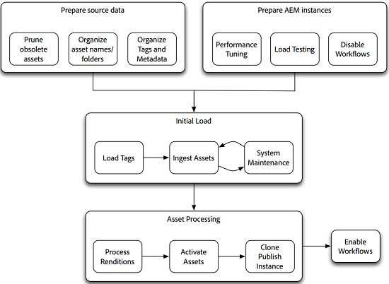

# Guia de migração de ativos {#assets-migration-guide}

Ao migrar ativos para o AEM, há várias etapas a serem consideradas. A extração de ativos e metadados para fora de sua casa atual está fora do escopo deste documento, pois varia muito entre as implementações. Em vez disso, este documento descreve como trazer esses ativos para AEM, aplicar seus metadados, gerar representações e ativar ou publicar os ativos.

## Pré-requisitos {#prerequisites}

Antes de executar qualquer uma das etapas descritas abaixo, reveja e implemente as orientações nas dicas [de ajuste de desempenho do](performance-tuning-guidelines.md)Assets. Muitas etapas, como configurar o máximo de trabalhos simultâneos, melhoram a estabilidade e o desempenho do servidor com carga. Outras etapas, como a configuração do File Data Store, são difíceis de executar depois que o sistema é carregado com ativos.

>[!NOTE]
>
>As seguintes ferramentas de migração de ativos não fazem parte da Adobe Experience Manager. O Atendimento ao cliente do Adobe não suporta essas ferramentas.
>
>* Criador de tags de ferramentas AEM ACS
>* Importador de ativos CSV das ferramentas AEM ACS
>* Gerenciador de fluxo de trabalho em massa do ACS
>* Gerenciador de ações rápidas do ACS Commons
>* Fluxo de trabalho sintético

>
>
Este software é de código aberto e é coberto pela [Licença Apache v2](https://adobe-consulting-services.github.io/pages/license.html). Para fazer uma pergunta ou relatar um problema, visite os respectivos [Problemas do GitHub para as ferramentas do ACS AEM](https://github.com/Adobe-Consulting-Services/acs-aem-commons/issues) e os [ACS AEM Commons](https://github.com/Adobe-Consulting-Services/acs-aem-tools/issues).

## Migrar para AEM {#migrate-to-aem}

A migração de ativos para AEM requer várias etapas e deve ser exibida como um processo em fases. As fases da migração são as seguintes:

1. Desative workflows.
1. Carregar tags.
1. Ativos de assimilação.
1. Processar execuções.
1. Ativar ativos.
1. Ative workflows.

### Desativar workflows {#disable-workflows}

Antes de start de uma migração, desative os iniciadores para o `DAM Update Asset` fluxo de trabalho. É melhor assimilar todos os ativos no sistema e, em seguida, executar os workflows em lotes. Se você já estiver ao vivo enquanto a migração estiver ocorrendo, poderá agendar essas atividades para serem executadas fora das horas.

### Carregar tags {#load-tags}

Talvez você já tenha uma taxonomia de tag aplicada às suas imagens. Ferramentas como o Importador de ativos CSV e a funcionalidade perfis de metadados podem ajudar a automatizar a aplicação de tags para ativos. Antes disso, adicione as tags no Experience Manager. O recurso [ACS AEM Tools Tag Maker](https://adobe-consulting-services.github.io/acs-aem-tools/features/tag-maker/index.html) permite preencher tags usando uma planilha do Microsoft Excel carregada no sistema.

### Ativos de assimilação {#ingest-assets}

Desempenho e estabilidade são preocupações importantes ao assimilar ativos ao sistema. Ao carregar muitos dados no Experience Manager, verifique se o sistema está funcionando bem. Isso minimizou o tempo necessário para adicionar os dados e ajuda a evitar sobrecarregar o sistema. Isso ajuda a evitar falhas no sistema, especialmente em sistemas que já estão em produção.

Há duas abordagens para carregar os ativos no sistema: uma abordagem baseada em push usando HTTP ou uma abordagem baseada em pull usando as APIs JCR.

#### Enviar por HTTP {#push-through-http}

A equipe do Adobe Managed Services usa uma ferramenta chamada Glutton para carregar dados em ambientes do cliente. O Glutton é um pequeno aplicativo Java que carrega todos os ativos de um diretório para outro em uma instância AEM. Em vez do Glutton, você também pode usar ferramentas como scripts Perl para publicar os ativos no repositório.

Há duas desvantagens principais ao usar a abordagem de passar por https:

1. Transmita os ativos por HTTP para o servidor. Isso requer bastante sobrecarga e é demorado, aumentando assim o tempo necessário para executar sua migração.
1. Se você tiver tags e metadados personalizados que devem ser aplicados aos ativos, essa abordagem exigirá um segundo processo personalizado que será necessário executar para aplicar esses metadados aos ativos depois que eles forem importados.

A outra abordagem para assimilar ativos é extrair ativos do sistema de arquivos local. No entanto, se você não conseguir que uma unidade externa ou compartilhamento de rede seja montado no servidor para executar uma abordagem baseada em pull, a publicação dos ativos por HTTP é a melhor opção.

#### Retire do sistema de arquivos local {#pull-from-the-local-file-system}

O Importador [de ativos CSV das ferramentas](https://adobe-consulting-services.github.io/acs-aem-tools/features/csv-asset-importer/index.html) ACS AEM extrai ativos do sistema de arquivos e metadados de ativos de um arquivo CSV para a importação de ativos. A API do AEM Asset Manager é usada para importar os ativos para o sistema e aplicar as propriedades de metadados configuradas. Idealmente, os ativos são montados no servidor por meio de uma montagem de arquivos de rede ou por meio de uma unidade externa.

Quando os ativos não são transmitidos através de uma rede, o desempenho geral melhora bastante. Normalmente, esse método é o mais eficiente para carregar ativos no repositório. Além disso, você pode importar todos os ativos e metadados em uma única etapa, já que a ferramenta suporta a ingestão de metadados. Nenhuma outra etapa é necessária para aplicar os metadados, digamos, usando uma ferramenta separada.

### Processar execuções {#process-renditions}

Depois de carregar os ativos no sistema, é necessário processá-los por meio do fluxo de trabalho Atualizar ativo do DAM para extrair metadados e gerar execuções. Antes de executar esta etapa, é necessário duplicado e modificar o fluxo de trabalho do Ativo de atualização do DAM para atender às suas necessidades. Algumas etapas no fluxo de trabalho padrão podem não ser necessárias para você, como a geração do Scene7 PTIFF ou a integração do servidor do InDesign.

Depois de configurar o fluxo de trabalho de acordo com suas necessidades, você tem duas opções para executá-lo:

1. A abordagem mais simples é o Gerenciador [de Fluxo de Trabalho em Massa da](https://adobe-consulting-services.github.io/acs-aem-commons/features/bulk-workflow-manager.html)ACS Commons. Essa ferramenta permite que você execute um query e processe os resultados do query por meio de um fluxo de trabalho. Há opções para definir tamanhos de lote também.
1. Use o [ACS Commons Fast Action Manager](https://adobe-consulting-services.github.io/acs-aem-commons/features/fast-action-manager.html) em conjunto com [Fluxos de trabalho sintéticos](https://adobe-consulting-services.github.io/acs-aem-commons/features/synthetic-workflow.html). Embora essa abordagem seja muito mais abrangente, ela permite remover a sobrecarga do mecanismo de fluxo de trabalho do AEM e, ao mesmo tempo, otimizar o uso dos recursos do servidor. Além disso, o Fast Action Manager aumenta ainda mais o desempenho, monitorando dinamicamente os recursos do servidor e diminuindo a carga colocada no sistema. Os exemplos de scripts foram fornecidos na página de recursos ACS Commons.

### Ativar ativos {#activate-assets}

Para implantações com uma camada de publicação, é necessário ativar os ativos fora do farm de publicação. Embora a Adobe recomende a execução de mais de uma única instância de publicação, é mais eficiente replicar todos os ativos para uma única instância de publicação e clonar essa instância. Ao ativar grandes números de ativos, depois de disparar uma ativação em árvore, talvez seja necessário intervir. Eis o porquê: Ao desligar o ativação, os itens são adicionados às tarefas/fila de evento do Sling. Depois que o tamanho desta fila começar a exceder aproximadamente 40.000 itens, o processamento diminuirá drasticamente. Depois que o tamanho desta fila exceder 100.000 itens, a estabilidade do sistema será afetada.

Para contornar esse problema, você pode usar o [Fast Action Manager](https://adobe-consulting-services.github.io/acs-aem-commons/features/fast-action-manager.html) para gerenciar a replicação de ativos. Isso funciona sem usar as filas Sling, diminuindo a sobrecarga e, ao mesmo tempo, limitando a carga de trabalho para impedir que o servidor fique sobrecarregado. Um exemplo de uso do FAM para gerenciar a replicação é mostrado na página de documentação do recurso.

Outras opções para obter ativos para o farm de publicação incluem o uso de [vlt-rcp](https://jackrabbit.apache.org/filevault/rcp.html) ou [oak-run](https://github.com/apache/jackrabbit-oak/tree/trunk/oak-run), que são fornecidos como ferramentas, como parte do Jackrabbit. Outra opção é usar uma ferramenta de software livre para a infraestrutura do AEM chamada [Grabbit](https://github.com/TWCable/grabbit), que alega ter desempenho mais rápido do que o vlt.

Para qualquer uma dessas abordagens, a advertência é que os ativos na instância do autor não mostram que foram ativados. Para manipular o sinalizador desses ativos com o status de ativação correto, também é necessário executar um script para marcar os ativos como ativados.

>[!NOTE]
>
>O Adobe não mantém nem suporta Grabbit.

### Clonar publicação {#clone-publish}

Depois que os ativos tiverem sido ativados, você poderá clonar sua instância de publicação para criar quantas cópias forem necessárias para a implantação. A clonagem de um servidor é bastante simples, mas há alguns passos importantes a serem lembrados. Para clonar a publicação:

1. Faça backup da instância de origem e do armazenamento de dados.
1. Restaure o backup da instância e do armazenamento de dados para o local do público alvo. As etapas a seguir referem-se a essa nova instância.
1. Execute uma pesquisa do sistema de arquivos em `crx-quickstart/launchpad/felix` Procurar `sling.id`. Exclua esse arquivo.
1. No caminho raiz do armazenamento de dados, localize e exclua quaisquer `repository-XXX` arquivos.
1. Edite `crx-quickstart/install/org.apache.jackrabbit.oak.plugins.blob.datastore.FileDataStore.config` e aponte `crx-quickstart/launchpad/config/org/apache/jackrabbit/oak/plugins/blob/datastore/FileDataStore.config` para o local do armazenamento de dados no novo ambiente.
1. Start do ambiente.
1. Atualize a configuração de qualquer agente de replicação no(s) autor(es) para apontar para as instâncias de publicação corretas ou os agentes de descarga do dispatcher na nova instância para apontar para os despachantes corretos para o novo ambiente.

### Ativar workflows {#enable-workflows}

Após a conclusão da migração, os iniciadores dos workflows de ativos de atualização do DAM devem ser reativados para suportar a geração de execução e a extração de metadados para uso diário contínuo do sistema.

## Migrar ativos em implantações AEM {#migrate-between-aem-instances}

Embora não seja tão comum, às vezes é necessário migrar grandes quantidades de dados de uma instância AEM para outra; por exemplo, ao executar uma atualização AEM, atualize seu hardware ou migre para um novo datacenter, como com uma migração do AMS.

Nesse caso, seus ativos já estão preenchidos com metadados e as execuções já são geradas. Você pode simplesmente se concentrar em mover ativos de uma instância para outra. Ao migrar entre instâncias AEM, execute as seguintes etapas:

1. Desativar workflows: Como você está migrando execuções juntamente com nossos ativos, deseja desativar os iniciadores de fluxo de trabalho para o Ativo de atualização do DAM.

1. Migrar tags: Como as tags já foram carregadas na instância de AEM de origem, é possível criá-las em um pacote de conteúdo e instalá-las na instância de público alvo.

1. Migrar ativos: Há duas ferramentas recomendadas para mover ativos de uma instância AEM para outra:

   * **Cofre Remote Copy**, ou `vlt rcp`, permite que você use vlt em uma rede. Você pode especificar um diretório de origem e destino e vlt baixa todos os dados do repositório de uma instância e os carrega na outra. O Vlt rcp está documentado em [https://jackrabbit.apache.org/filevault/rcp.html](https://jackrabbit.apache.org/filevault/rcp.html)
   * **O Grabbit** é uma ferramenta de sincronização de conteúdo de código aberto desenvolvida pela Time Warner Cable para sua implementação de AEM. Como ele usa fluxos contínuos de dados, em comparação ao vlt rcp, ele tem uma latência mais baixa e exige uma melhoria de velocidade de duas a dez vezes mais rápida que o vlt rcp. O Grabbit também oferece suporte apenas à sincronização do conteúdo delta, o que permite sincronizar as alterações após a conclusão de uma passagem de migração inicial.

1. Ativar ativos: Siga as instruções para [ativar ativos](#activate-assets) documentados para a migração inicial para AEM.

1. Publicação de clone: Como ocorre com uma nova migração, carregar uma única instância de publicação e clonar é mais eficiente do que ativar o conteúdo em ambos os nós. Consulte [Clonando publicação.](#clone-publish)

1. Ativando workflows: Após concluir a migração, ative novamente os iniciadores para os workflows de ativos de atualização do DAM para suportar a geração de execução e a extração de metadados para uso diário do sistema.
