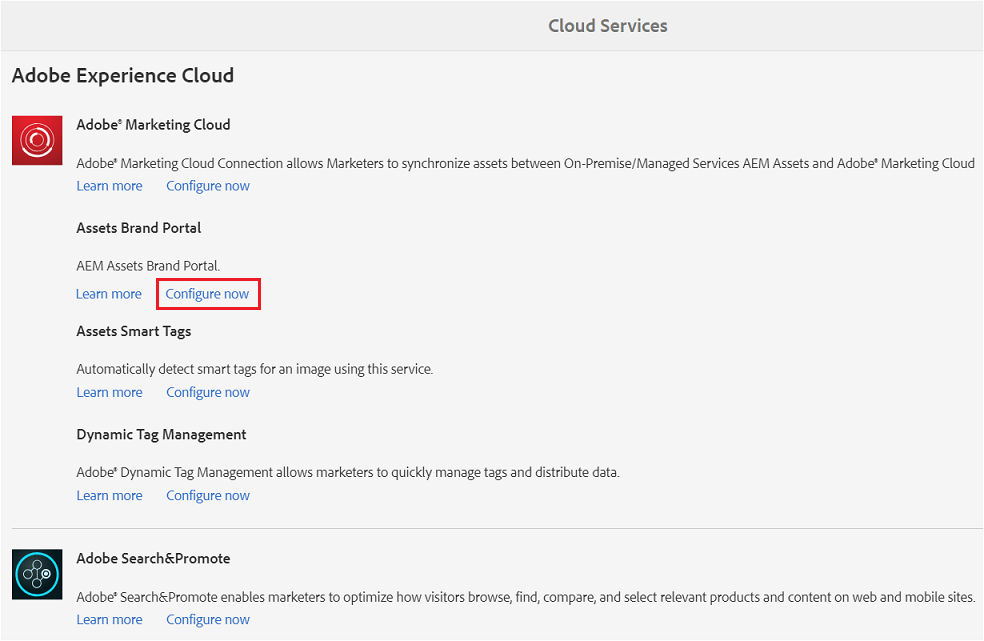
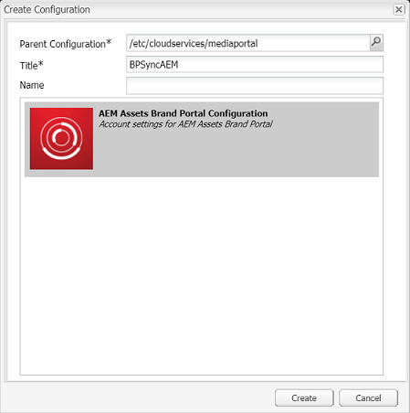

# Configure AEM Assets integration with Brand Portal {#configure-aem-assets-integration-with-brand-portal}

Saiba como integrar os ativos AEM ao Portal de marcas para publicar ativos e coleções no Portal de marcas.

Se você for um cliente do portal de marcas dos ativos Adobe Experience Manager (AEM), poderá integrar os ativos AEM ao portal de marcas para permitir a publicação de ativos no portal de marcas. Você pode configurar essa integração por meio da interface do Adobe.io.

> [!Nnota]
>
>A Adobe recomenda atualizar para o AEM 6.4.1.0 ou posterior para garantir que o AEM Assets Brand Portal esteja integrado aos ativos AEM. Uma limitação no AEM 6.4 apresenta um erro ao configurar a integração com o Brand Portal e a replicação falha.

Primeiro, crie um aplicativo, que inclua um mecanismo de autenticação, no gateway público da Marketing Cloud. Em seguida, crie um perfil na instância do AEM Assets usando a ID do aplicativo obtida do gateway.

Use essa configuração para publicar ativos dos ativos AEM no Portal de marcas. No back-end, o servidor AEM autentica seu perfil com o gateway e, em seguida, integra os ativos AEM ao Portal da Marca.

>[!NOTE]
>
>A interface do usuário para configurar integrações do oAuth está hospedada em [https://legacy-oauth.cloud.adobe.io/](https://legacy-oauth.cloud.adobe.io/), que foi hospedada anteriormente em [https://marketing.adobe.com/developer/](https://marketing.adobe.com/developer/).

## Criar aplicativo JWT {#create-jwt-application}

1. Faça logon em [https://legacy-oauth.cloud.adobe.io/](https://legacy-oauth.cloud.adobe.io/) com sua Adobe ID. Você acessa a página Aplicativos  JWT.

   >[!NOTE]
   >
   >Você pode criar uma ID de aplicativo somente se for o administrador de sistema de sua organização. Locatário é o nome técnico da sua organização que está registrado na Adobe Marketing Cloud.

2. Selecione **[!UICONTROL Adicionar aplicativo]** para criar um aplicativo.
3. Especifique um Nome **[!UICONTROL de]** aplicativo e uma **[!UICONTROL Descrição]** opcional.
4. Na lista **[!UICONTROL Organização]** , selecione a organização para a qual deseja sincronizar ativos.
5. Na lista **[!UICONTROL Escopo]** , selecione **[!UICONTROL dam-read]**, **[!UICONTROL dam-sync]**, **[!UICONTROL dam-write]** e **[!UICONTROL cc-share]**.
6. Toque/ clique em **[!UICONTROL Adicionar]**. Um aplicativo JWT Service é criado. Você pode editar o aplicativo e Salvar.
7. Copie a ID do aplicativo gerada para o novo aplicativo.

   >[!NOTE]
   >
   >Certifique-se de não copiar inadvertidamente o segredo do aplicativo em vez da ID do aplicativo.

## Criar uma nova configuração de nuvem {#create-a-new-cloud-configuration}

1. Na página **[!UICONTROL Navegação]** da instância local dos ativos AEM, toque/clique no ícone **[!UICONTROL Ferramentas]** à esquerda.

   

2. Navigate to **[!UICONTROL Cloud Services > Legacy Cloud Services]**.

   

3. Na página Serviços [!UICONTROL da] Cloud, localize o serviço **[!UICONTROL Assets Brand Portal]** na **[!UICONTROL Adobe Experience Cloud]**.

   

4. Toque/ clique no link **[!UICONTROL Configurar agora]** abaixo do serviço para exibir a caixa de diálogo [Criar configuração] .
5. Na caixa de diálogo [!UICONTROL Criar configuração] , especifique um título e nome para a nova configuração e toque/clique em **[!UICONTROL Criar]**.

   

6. Na caixa de diálogo Replicação [!UICONTROL do portal de marcas do] AEM Assets, especifique o URL de sua organização no campo URL [!UICONTROL do] locatário.
7. No campo ID [!UICONTROL do] cliente, cole a ID do aplicativo copiada ao final do procedimento [Criar um aplicativo](#create-jwt-application). Clique em **[!UICONTROL OK]**.

   

8. Para tornar os ativos (publicados do AEM) disponíveis publicamente para usuários gerais do Brand Portal, ative a caixa de seleção Publicação **[!UICONTROL de pasta]** pública.

   >[!NOTE]
   >
   >A opção para ativar a Publicação **[!UICONTROL de pasta]** pública está disponível no AEM 6.3.2.1 em diante.

9. Na página Configuração [!UICONTROL do portal de] marcas, toque/clique em **[!UICONTROL Exibir chave]** pública para exibir a chave pública gerada para sua instância.

   

   Como alternativa, clique em **[!UICONTROL Baixar chave pública para o gateway]** OAuth para baixar o arquivo que contém a chave pública. Em seguida, abra o arquivo para exibir a chave pública.

## Habilitar integração {#enable-integration}

1. Exiba a chave pública usando um dos métodos a seguir mencionados na última etapa do procedimento [Adicionar uma nova configuração à Marketing Cloud](#create-a-new-cloud-configuration).

   * Clique no botão **[!UICONTROL Exibir chave]** pública para exibir a chave.
   * Abra o arquivo baixado que contém a chave.

2. Abra a interface do desenvolvedor da Marketing Cloud e clique no aplicativo criado em [Criar um aplicativo](#create-jwt-application).
3. Cole a chave pública no campo Chave **** pública da interface de configuração
4. Tap/click **[!UICONTROL Save]**. Uma mensagem confirma que o aplicativo foi atualizado.

## Teste a integração {#test-the-integration}

1. Na página **[!UICONTROL Navegação]** da instância local dos ativos AEM, clique no ícone **[!UICONTROL Ferramentas]** à esquerda.

   

2. Navegue até **[!UICONTROL Implantação > Replicação]**.

   

3. Na página [!UICONTROL Replicação] , toque/clique em **[!UICONTROL Agentes no autor]**.

   

4. Para verificar a conexão entre o AEM Author e o Brand Portal, abra qualquer um dos quatro agentes de replicação e clique em **[!UICONTROL Testar conexão]**.

   >[!NOTE]
   >
   >Os agentes de replicação trabalham em paralelo e compartilham a distribuição de tarefas igualmente, aumentando assim a velocidade de publicação em quatro vezes a velocidade original. Depois que o serviço de nuvem é configurado, não é necessária configuração adicional para habilitar os agentes de replicação que são ativados por padrão para habilitar a publicação paralela de vários ativos.

   >[!NOTE]
   >
   >Evite desativar qualquer um dos agentes de replicação, pois isso pode causar falha na replicação de alguns ativos.

   

5. Examine a parte inferior dos resultados do teste para verificar se a replicação foi bem-sucedida.

   

Depois que a replicação for bem-sucedida, você poderá publicar ativos, pastas e coleções no Brand Portal. Para obter detalhes, consulte:

* [Publicar ativos e pastas no Brand Portal](brand-portal-publish-folder.md)
* [Publicar coleções no portal de marcas](brand-portal-publish-collection.md)

## Publish assets to Brand Portal {#publish-assets-to-brand-portal}

Depois que a replicação for bem-sucedida, você poderá publicar ativos, pastas e coleções no Brand Portal. Para publicar ativos no Brand Portal, siga estas etapas:

>[!NOTE]
>
>A Adobe recomenda uma publicação escalonada, de preferência durante horas que não sejam de pico, para que o autor do AEM não ocupe recursos excessivos.

1. No console Ativos, passe o mouse sobre os ativos desejados e selecione a opção **[!UICONTROL Publicar]** nas ações rápidas.

   Como alternativa, selecione os ativos que deseja publicar no Brand Portal.

   

2. Para publicar os ativos no Brand Portal, duas opções estão disponíveis:
   * [Publicar ativos imediatamente](#publish-now)
   * [Publicar ativos mais tarde](#publish-later)

### Publicar ativos agora {#publish-now}

Para publicar os ativos selecionados no Brand Portal, execute um dos seguintes procedimentos:

* Na barra de ferramentas, selecione Publicação **[!UICONTROL rápida]**. Em seguida, no menu, selecione **[!UICONTROL Publicar no Brand Portal]**.

* Na barra de ferramentas, selecione **[!UICONTROL Gerenciar publicação]**.

   1. Em seguida, na **[!UICONTROL Ação]** , selecione **[!UICONTROL Publicar no Brand Portal]** e, em **[!UICONTROL Agendamento]** , selecione **[!UICONTROL Agora]**. Tap/ click **[!UICONTROL Next].**

   2. Dentro do **[!UICONTROL Escopo]**, confirme sua seleção e toque/clique em **[!UICONTROL Publicar no Portal]** da Marca.

Será exibida uma mensagem informando que os ativos foram enfileirados para publicação no Brand Portal. Faça logon na interface do Brand Portal para ver os ativos publicados.

### Publicar ativos mais tarde {#publish-later}

Para agendar a publicação dos ativos no Brand Portal para uma data ou hora posterior:

1. Depois de selecionar os ativos/ pastas a serem publicados, selecione **[!UICONTROL Gerenciar publicação]** na barra de ferramentas na parte superior.
2. Na página **[!UICONTROL Gerenciar publicação]** , selecione **[!UICONTROL Publicar no portal]** da marca em **[!UICONTROL Ação]** e selecione **[!UICONTROL Mais tarde]** em **[!UICONTROL Agendamento]**.

   

3. Selecione uma data **[!UICONTROL de]** ativação e especifique a hora. Tap/ click **[!UICONTROL Next]**.
4. Selecione uma data **[!UICONTROL de]** ativação e especifique a hora. Tap/ click **[!UICONTROL Next]**.
5. Especifique um título de Fluxo de trabalho em **[!UICONTROL Fluxos de trabalho]**. Toque/clique em **[!UICONTROL Publicar mais tarde]**.

   

Agora, faça logon no Brand Portal para verificar se os recursos publicados estão disponíveis na interface do Brand Portal.

