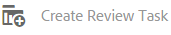

# Revisar ativos e coleções de pastas {#review-folder-assets-and-collections}

>[!CAUTION]
>
>AEM 6.4 chegou ao fim do suporte estendido e esta documentação não é mais atualizada. Para obter mais detalhes, consulte nossa [períodos de assistência técnica](https://helpx.adobe.com/br/support/programs/eol-matrix.html). Encontre as versões compatíveis [here](https://experienceleague.adobe.com/docs/).

Configure fluxos de trabalho de revisão para ativos em uma pasta ou coleção e compartilhe-os com revisores ou parceiros criativos para buscar feedback.

Os ativos Adobe Experience Manager permitem configurar um fluxo de trabalho de revisão ad hoc para ativos em uma pasta ou coleção e compartilhá-lo com revisores ou parceiros criativos para buscar feedback.

Você pode associar o fluxo de trabalho de revisão a um projeto ou criar uma tarefa de revisão independente.

Após compartilhar os ativos, os revisores podem aprová-los ou rejeitá-los. As notificações são enviadas em vários estágios do workflow para notificar os recipients pretendidos sobre a conclusão de várias tarefas. Por exemplo, quando você compartilha uma pasta ou coleção, o revisor recebe uma notificação de que uma pasta/coleção foi compartilhada para revisão.

Depois que o revisor concluir a revisão (aprova ou rejeita ativos), você receberá uma notificação de conclusão da revisão.

## Criar uma tarefa de revisão para pastas {#creating-a-review-task-for-folders}

1. Na interface do usuário do Assets, selecione a pasta para a qual deseja criar uma tarefa de revisão.
1. Na barra de ferramentas, toque/clique no ícone **[!UICONTROL Criar tarefa de revisão]** para abrir a página **[!UICONTROL Verificar tarefa]**. Se não conseguir ver o ícone na barra de ferramentas, toque/clique em **[!UICONTROL Mais]** e selecione o ícone.

   

1. (Opcional) Na **[!UICONTROL Projeto]** selecione o projeto ao qual deseja associar a tarefa de revisão. Por padrão, a variável **[!UICONTROL Nenhum]** está selecionada. Se não quiser associar um projeto à tarefa de revisão, mantenha essa seleção.

   >[!NOTE]
   >
   >Somente os projetos para os quais você tem permissões de nível de Editor (ou superior) estão visíveis na variável **[!UICONTROL Projetos]** lista.

1. Insira um nome para a tarefa de revisão e selecione um aprovador na **[!UICONTROL Atribuir a]** lista.

   >[!NOTE]
   >
   >Os membros/grupos do projeto selecionado estão disponíveis como aprovadores no **[!UICONTROL Atribuir a]** lista.

1. Insira uma descrição, a prioridade da tarefa e a data de vencimento da tarefa de revisão.

   

1. Na guia Advanced , insira um rótulo a ser usado para criar o URI.

   

1. Toque/clique em **[!UICONTROL Enviar]** e em **[!UICONTROL Concluído]** para fechar a mensagem de confirmação. Uma notificação para a nova tarefa é enviada ao aprovador.
1. Faça logon em [!DNL Experience Manager] Ativos como Aprovador e navegue até a interface do usuário do Assets. Para aprovar ativos, clique/toque na guia **[!UICONTROL Notificações]** e selecione a tarefa de revisão na lista.

   

1. Na página **[!UICONTROL Tarefa de revisão]**, examine os detalhes da tarefa de revisão e toque/clique em **[!UICONTROL Revisar]**.
1. Na página **[!UICONTROL Revisar tarefa]**, selecione os ativos e toque/clique no ícone **[!UICONTROL Aprovar/Rejeitar]** para aprovar ou rejeitar, conforme apropriado.

   

1. Toque/clique no botão **[!UICONTROL Concluído]** ícone na barra de ferramentas. Na caixa de diálogo, insira um comentário e toque/clique  **[!UICONTROL Concluído]** para confirmar.
1. Navegue até a interface do usuário do Assets e abra a pasta . Os ícones de status de aprovação dos ativos são exibidos nas exibições Cartão e Lista.

   **Exibição de cartão**

   

   **Exibição de lista**

   

## Criar uma tarefa de revisão para coleções {#creating-a-review-task-for-collections}

1. Na página Coleções , selecione a coleção para a qual deseja criar uma tarefa de revisão.
1. Na barra de ferramentas, toque/clique no ícone **[!UICONTROL Criar tarefa de revisão]** para abrir a página **[!UICONTROL Verificar tarefa]**. Se não conseguir ver o ícone na barra de ferramentas, toque/clique em **[!UICONTROL Mais]** e selecione o ícone.

   

1. (Opcional) Na **[!UICONTROL Projeto]** selecione o projeto ao qual deseja associar a tarefa de revisão. Por padrão, a variável **[!UICONTROL Nenhum]** está selecionada. Se não quiser associar um projeto à tarefa de revisão, mantenha essa seleção.

   >[!NOTE]
   >
   >Somente os projetos para os quais você tem permissões de nível de Editor (ou superior) estão visíveis na variável **[!UICONTROL Projetos]** lista.

1. Insira um nome para a tarefa de revisão e selecione um aprovador na **[!UICONTROL Atribuir a]** lista.

   >[!NOTE]
   >
   >Os membros/grupos do projeto selecionado estão disponíveis como aprovadores no **[!UICONTROL Atribuir a]** lista.

1. Insira uma descrição, a prioridade da tarefa e a data de vencimento da tarefa de revisão.

   

1. Toque/clique em **[!UICONTROL Enviar]** e em **[!UICONTROL Concluído]** para fechar a mensagem de confirmação. Uma notificação para a nova tarefa é enviada ao aprovador.
1. Faça logon em [!DNL Experience Manager] Ativos como Aprovador e navegue até o console Ativos . Para aprovar ativos, toque/clique no botão **[!UICONTROL Notificações]** e selecione a tarefa de revisão na lista.
1. Na página **[!UICONTROL Tarefa de revisão]**, examine os detalhes da tarefa de revisão e toque/clique em **[!UICONTROL Revisar]**.
1. Todos os ativos na coleção estão visíveis na página de revisão. Selecione os ativos e toque/clique no botão **[!UICONTROL Aprovar/Rejeitar]** para aprovar ou rejeitar ativos, conforme apropriado.

   

1. Toque/clique no botão **[!UICONTROL Concluído]** ícone na barra de ferramentas. Na caixa de diálogo, insira um comentário e toque/clique **[!UICONTROL Concluído]** para confirmar.
1. Navegue até o console Coleções e abra a coleção. Os ícones de status de aprovação dos ativos são exibidos nas exibições Cartão e Lista.

   **Exibição de cartão**

   

   **Exibição de lista**

   
