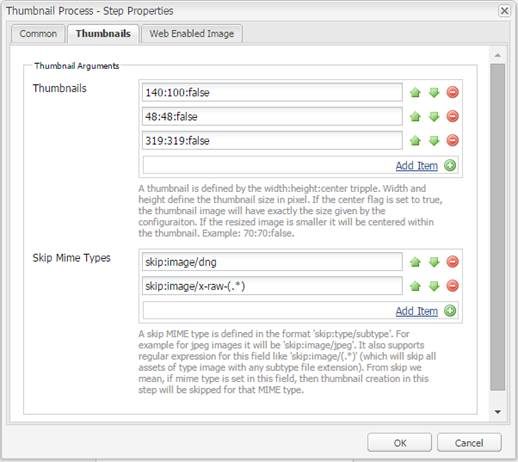

# Usar o Camera Raw para processar imagens {#camera-raw-support}

>[!CAUTION]
>
>AEM 6.4 chegou ao fim do suporte estendido e esta documentação não é mais atualizada. Para obter mais detalhes, consulte nossa [períodos de assistência técnica](https://helpx.adobe.com/br/support/programs/eol-matrix.html). Encontre as versões compatíveis [here](https://experienceleague.adobe.com/docs/).

Você pode ativar o suporte Camera Raw para processar formatos de arquivo brutos, como CR2, NEF e RAF, e renderizar as imagens no formato JPEG. A funcionalidade é compatível com o Adobe Experience Manager Assets usando o [Pacote Camera Raw](https://experience.adobe.com/#/downloads/content/software-distribution/en/aem.html?package=/content/software-distribution/en/details.html/content/dam/aem/public/adobe/packages/aem630/product/assets/aem-assets-cameraraw-pkg) disponível na Distribuição de software.

>[!NOTE]
>
>A funcionalidade suporta apenas JPEG renditions. Ele é compatível com Windows 64 bits, Mac OS e RHEL 7.x.

Para ativar o suporte Camera Raw no Adobe Experience Manager Assets, siga estas etapas:

1. Baixe o [Pacote Camera Raw](https://experience.adobe.com/#/downloads/content/software-distribution/en/aem.html?package=/content/software-distribution/en/details.html/content/dam/aem/public/adobe/packages/aem630/product/assets/aem-assets-cameraraw-pkg) da Distribuição de software.

1. Acesso `https://[aem_server]:[port]/workflow`. Abra o **[!UICONTROL Ativo de atualização DAM]** fluxo de trabalho.

1. Abra o **[!UICONTROL Processar miniaturas]** etapa.

1. Forneça a seguinte configuração no **[!UICONTROL Miniaturas]** guia :

   * **[!UICONTROL Miniaturas]**: `140:100:false, 48:48:false, 319:319:false`
   * **[!UICONTROL Ignorar tipos Mime]**: `skip:image/dng, skip:image/x-raw-(.*)`

   

1. No **[!UICONTROL Imagem ativada na Web]** na guia , no **[!UICONTROL Ignorar Lista]** , especifique `audio/mpeg, video/(.*), image/dng, image/x-raw-(.*)`.

   

1. No painel lateral, adicione o **[!UICONTROL Manipulador Camera Raw/DNG]** etapa abaixo do **[!UICONTROL Criação de miniaturas]** etapa.

1. No **[!UICONTROL Manipulador Camera Raw/DNG]** adicione a seguinte configuração no **[!UICONTROL Argumentos]** guia :

   * **[!UICONTROL Tipos Mime]**: `image/dng` e `image/x-raw-(.*)`
   * **[!UICONTROL Comando]**:

      * `DAM_Raw_Converter ${directory}/${filename} ${directory} cq5dam.web.1280.1280.jpeg 1280 1280`
      * `DAM_Raw_Converter ${directory}/${filename} ${directory} cq5dam.thumbnail.319.319.jpeg 319 319`
      * `DAM_Raw_Converter ${directory}/${filename} ${directory} cq5dam.thumbnail.140.100.jpeg 140 100`
      * `DAM_Raw_Converter ${directory}/${filename} ${directory} cq5dam.thumbnail.48.48.jpeg 48 48`

   

1. Clique em **[!UICONTROL Salvar]**.

>[!NOTE]
>
>Certifique-se de que a configuração acima seja a mesma que a **[!UICONTROL Exemplo de ativo de atualização do DAM com etapa de manuseio de DNG e Camera Raw]** configuração.

Agora você pode importar arquivos brutos da câmera para [!DNL Experience Manager] Ativos. Depois de instalar o pacote Camera Raw e configurar o workflow necessário, **[!UICONTROL Ajuste da imagem]** é exibida na lista de painéis laterais.

*Figura: Opções no painel lateral*

*Figura: Use a opção para fazer edições leves em suas imagens*

Depois de salvar as edições em uma imagem Camera Raw, uma nova representação `AdjustedPreview.jpg` é gerada para a imagem. Para outros tipos de imagens, exceto Camera Raw, as alterações são refletidas em todas as representações.

## Práticas recomendadas, problemas conhecidos e limitações {#best-practices}

A funcionalidade tem as seguintes limitações:

* A funcionalidade suporta apenas JPEG renditions. Ele é compatível com Windows 64 Bit, Mac OS e RHEL 7.x.
* Não há suporte para o write-back de metadados para formatos RAW e DNG.
* A biblioteca Camera Raw tem limitações em relação ao total de pixels que pode ser processado de cada vez. Atualmente, ele pode processar no máximo 65000 pixels no lado longo de um arquivo ou 512 MP, independentemente dos critérios encontrados primeiro.
