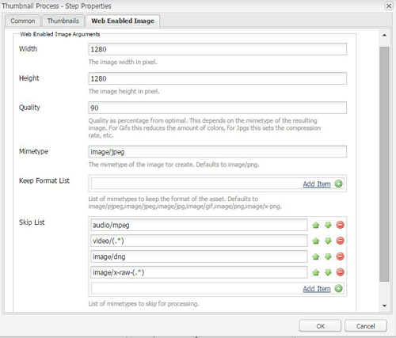

# Usar o Camera Raw para processar imagens {#camera-raw-support}

Você pode ativar o suporte Camera Raw para processar formatos de arquivo brutos, como CR2, NEF e RAF, e renderizar as imagens no formato JPEG. A funcionalidade é suportada no Adobe Experience Manager Assets usando o pacote  Camera Raw disponível na Distribuição de software.

>[!NOTE]
>
>A funcionalidade suporta apenas execuções JPEG. É compatível com Windows 64 bits, Mac OS e RHEL 7.x.

Para habilitar o suporte Camera Raw no Adobe Experience Manager Assets, siga estas etapas:

1. Baixe o pacote  Camera Raw da Distribuição de software.

1. Acesso `https://[aem_server]:[port]/workflow`. Abra o fluxo de trabalho Atualizar ativo **[!UICONTROL do]** DAM.

1. Abra a etapa **[!UICONTROL Processar miniaturas]** .

1. Forneça a seguinte configuração na guia **[!UICONTROL Miniaturas]** :

   * **[!UICONTROL Miniaturas]**: `140:100:false, 48:48:false, 319:319:false`
   * **[!UICONTROL Ignorar tipos Mime]**: `skip:image/dng, skip:image/x-raw-(.*)`

   

1. Na guia Imagem **[!UICONTROL ativada pela]** Web, no campo **[!UICONTROL Ignorar Lista]** , especifique `audio/mpeg, video/(.*), image/dng, image/x-raw-(.*)`.

   

1. No painel lateral, adicione a etapa **[!UICONTROL Camera Raw/Manipulador]** DNG abaixo da etapa de criação **[!UICONTROL de]** Miniaturas.

1. Na etapa Manipulador **[!UICONTROL de DNG/]** Camera Raw, adicione a seguinte configuração na guia **[!UICONTROL Argumentos]** :

   * **[!UICONTROL Tipos]** Mime: `image/dng` e `image/x-raw-(.*)`
   * **[!UICONTROL Comando]**:

      * `DAM_Raw_Converter ${directory}/${filename} ${directory} cq5dam.web.1280.1280.jpeg 1280 1280`
      * `DAM_Raw_Converter ${directory}/${filename} ${directory} cq5dam.thumbnail.319.319.jpeg 319 319`
      * `DAM_Raw_Converter ${directory}/${filename} ${directory} cq5dam.thumbnail.140.100.jpeg 140 100`
      * `DAM_Raw_Converter ${directory}/${filename} ${directory} cq5dam.thumbnail.48.48.jpeg 48 48`

   

1. Clique em **[!UICONTROL Salvar]**.

>[!NOTE]
>
>Certifique-se de que a configuração acima seja a mesma do Amostra de ativo de atualização de DAM com configuração Camera Raw e DNG Handling Step **** .

Agora você pode importar arquivos do Camera Raw para o AEM Assets. Depois de instalar o pacote Camera Raw e configurar o fluxo de trabalho necessário, a opção **[!UICONTROL Ajustar]** imagem é exibida na lista dos painéis laterais.

*Figura: Opções no painel lateral*

*Figura: Use a opção para fazer edições leves em suas imagens*

Depois de salvar as edições em uma imagem Camera Raw, uma nova execução `AdjustedPreview.jpg` é gerada para a imagem. Para outros tipos de imagem, exceto Camera Raw, as alterações são refletidas em todas as execuções.

## Práticas recomendadas, problemas conhecidos e limitações {#best-practices}

A funcionalidade tem as seguintes limitações:

* A funcionalidade suporta apenas execuções JPEG. É compatível com Windows 64 Bit, Mac OS e RHEL 7.x.
* Não há suporte para o write-back de metadados nos formatos RAW e DNG.
* A biblioteca Camera Raw tem limitações em torno do total de pixels que pode ser processado de cada vez. Atualmente, ele pode processar no máximo 65000 pixels no lado longo de um arquivo ou 512 MP, independentemente do critério encontrado primeiro.
