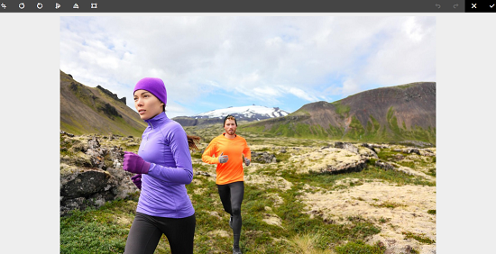
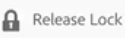

# Arquivos de check-in e check-out no Assets {#check-in-and-check-out-files-in-assets}

>[!CAUTION]
>
>AEM 6.4 chegou ao fim do suporte estendido e esta documentação não é mais atualizada. Para obter mais detalhes, consulte nossa [períodos de assistência técnica](https://helpx.adobe.com/br/support/programs/eol-matrix.html). Encontre as versões compatíveis [here](https://experienceleague.adobe.com/docs/).

Os Ativos da Adobe Experience Manager permitem que você faça check-out de ativos para edição e check-in deles novamente depois de concluir as alterações. Após fazer check-out de um ativo, somente você pode editar, anotar, publicar, mover ou excluir o ativo. Fazer check-out de um ativo bloqueia o ativo. Outros usuários não podem executar nenhuma dessas operações no ativo até que você verifique o ativo de volta para [!DNL Experience Manager] Ativos. No entanto, eles ainda podem alterar os metadados do ativo bloqueado.

Para fazer check-out ou check-in de ativos, é necessário ter acesso de gravação.

Esse recurso ajuda a impedir que outros usuários substituam as alterações feitas por um autor, onde vários usuários colaboram na edição de fluxos de trabalho entre equipes.

## Ativos de check-out {#checking-out-assets}

1. Na interface do usuário do Assets, selecione o ativo que deseja fazer check-out. Você também pode selecionar vários ativos para fazer check-out.

   

1. Na barra de ferramentas, clique/toque no botão **[!UICONTROL Check-out]** ícone .

   

   Observe que a variável **[!UICONTROL Check-out]** alterna para o ícone **[!UICONTROL Check-in]** com o bloqueio aberto.

   

   Para verificar se outros usuários podem editar o ativo com check-out, faça logon como um usuário diferente. Um ícone de cadeado é exibido na miniatura do ativo que você fez check-out.

   

   Selecione o ativo. Observe que a barra de ferramentas não exibe opções que permitem editar, anotar, publicar ou excluir o ativo.

   

   No entanto, você pode clicar/tocar no botão **[!UICONTROL Propriedades da exibição]** ícone para editar os metadados do ativo bloqueado.

1. Clique/toque no ícone Editar para abrir o ativo no modo de edição.

   

1. Edite o ativo e salve as alterações. Por exemplo, corte a imagem e salve.

   

   Também é possível optar por anotar ou publicar o ativo.

1. Selecione o ativo editado na interface do usuário do Assets e clique/toque no ícone **[!UICONTROL Check-in]**, da barra de ferramentas.

   

   O ativo modificado está marcado para [!DNL Assets] e está disponível para edição por outros usuários.

## Check-in forçado {#forced-check-in}

Os administradores podem fazer check-in de ativos que são check-out por outros usuários.

1. Faça logon em [!DNL Assets] como administrador.
1. Na interface do usuário do Assets, selecione um ou mais ativos que foram check-out por outros usuários.

   

1. Na barra de ferramentas, clique/toque no botão **[!UICONTROL Liberar trava]** ícone . O ativo é retornado e está disponível para edição para outros usuários.

   
