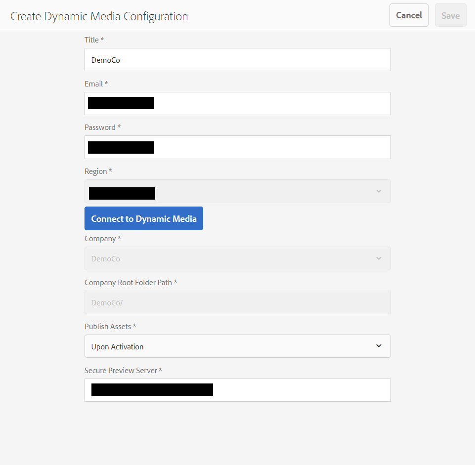

# Configuração do Dynamic Media - modo Scene7 {#configuring-dynamic-media-scene-mode}

Se você usar a configuração de Adobe Experience Manager para ambientes diferentes, como um para desenvolvimento, um para armazenamento temporário e outro para produção ao vivo, é necessário configurar Cloud Service Dynamic Media para cada um desses ambientes.

## Diagrama de arquitetura do Dynamic Media - modo Scene7 {#architecture-diagram-of-dynamic-media-scene-mode}

O diagrama de arquitetura a seguir descreve como o modo Dynamic Media - Scene7 funciona.

Com a nova arquitetura, AEM é responsável por ativos principais e sincronizações com a Dynamic Media para processamento e publicação de ativos:

1. Quando o ativo principal é carregado para AEM, é replicado para a Dynamic Media. Nesse ponto, a Dynamic Media lida com todo o processamento de ativos e geração de representação, como codificação de vídeo e variantes dinâmicas de uma imagem.
1. Depois que as renderizações são geradas, AEM podem acessar e pré-visualização com segurança as renderizações remotas do Dynamic Media (nenhum binário é enviado de volta à instância AEM).
1. Depois que o conteúdo estiver pronto para ser publicado e aprovado, ele aciona o serviço da Dynamic Media para enviar o conteúdo para os servidores de delivery e armazená-lo em cache no CDN.


## Ativação do Dynamic Media no modo Scene7 {#enabling-dynamic-media-in-scene-mode}

[As mídias dinâmicas são desativadas por padrão. ](https://www.adobe.com/solutions/web-experience-management/dynamic-media.html) Para aproveitar os recursos de mídia dinâmica, é necessário ativá-los.

>[OBSERVAÇÃO]
>
>Dynamic Media - O modo Scene7 é apenas para a instância AEM Author. Dessa forma, você deve configurar `runmode=dynamicmedia_scene7`na instância AEM Author, não na instância AEM Publish.

Para habilitar o Dynamic Media, é necessário inicializar o AEM usando o `dynamicmedia_scene7` modo de execução na linha de comando inserindo o seguinte em uma janela de terminal (por exemplo, a porta usada é 4502):

```shell
java -Xms4096m -Xmx4096m -Doak.queryLimitInMemory=500000 -Doak.queryLimitReads=500000 -jar cq-quickstart-6.4.0.jar -gui -r author,dynamicmedia_scene7 -p 4502
```

## (Opcional) Migração de predefinições e configurações do Dynamic Media de 6.3 para 6.4 Zero Downtime {#optional-migrating-dynamic-media-presets-and-configurations-from-to-zero-downtime}

Se você estiver atualizando AEM Dynamic Media de 6.3 para 6.4 (que agora inclui a capacidade de implantações de tempo de inatividade zero), é necessário executar o seguinte comando de ondulação para migrar todas as predefinições e configurações de `/etc` para `/conf` o CRXDE Lite.

>[OBSERVAÇÃO]
>
>Se você executar sua instância AEM no modo de compatibilidade, ou seja, se a compatibilidade estiver instalada, não será necessário executar esses comandos.

Para migrar suas predefinições e configurações personalizadas de `/etc` para `/conf`, execute o seguinte comando do Linux curl:

`curl -u admin:admin http://localhost:4502/libs/settings/dam/dm/presets.migratedmcontent.json`

Para todas as atualizações, com ou sem o pacote de compatibilidade, você pode copiar as predefinições do visualizador predefinidas executando o seguinte comando:

`curl -u admin:admin http://localhost:4502/libs/settings/dam/dm/presets/viewer.pushviewerpresets`

## (Opcional) Instalação do pacote de recursos 18912 para migração de ativos em massa {#installing-feature-pack}

O pacote de recursos 18912 permite que você ingira ativos em massa por meio do FTP ou migre ativos do modo Dynamic Media - Híbrido ou Dynamic Media Classic para o modo Dynamic Media - Scene7 no modo AEM. Ele está disponível na Adobe Professional Services.

Consulte [Instalação do pacote de recursos 18912 para migração](bulk-ingest-migrate.md) de ativos em massa para obter mais informações.

## Configuring Dynamic Media Cloud Services {#configuring-dynamic-media-cloud-services}

Altere a senha antes de configurar os Cloud Service Dynamic Media. Depois de receber seu email de provisionamento com credenciais da Dynamic Media, você deve [fazer logon](https://www.adobe.com/marketing-cloud/experience-manager/scene7-login.html) no Dynamic Media Classic para alterar sua senha. A senha fornecida no email de provisionamento é gerada pelo sistema e deve ser apenas uma senha temporária. É importante que você atualize a senha para que o Dynamic Media Cloud Service esteja configurado com as credenciais corretas.

>[!NOTE]
>
>Por padrão, o caminho de configuração para Cloud Service é `/content/dam`. Nenhum outro caminho de configuração é compatível com o modo Dynamic Media - Scene7.

Para configurar Cloud Service Dynamic Media:

1. Em AEM, toque no logotipo AEM para acessar o console de navegação global e toque no ícone Ferramentas, em seguida, toque em **[!UICONTROL Cloud Service > Configuração]** do Dynamic Media.
1. Na página Navegador de configuração do Dynamic Media, no painel esquerdo, toque em **[!UICONTROL global]** e em **[!UICONTROL Criar]**. Não toque nem selecione o ícone de pasta à esquerda de [!UICONTROL global].
1. Na página [!UICONTROL Criar configuração] Dynamic Media, digite um título, o endereço de email da conta Dynamic Media, a senha e selecione sua região. Eles são fornecidos por Adobe no e-mail de provisionamento. Entre em contato com o suporte se você não recebeu essa solicitação.

   Tap **[!UICONTROL Connect to Dynamic Media]**.

   >[!NOTE]
   >
   >Depois de receber seu email de provisionamento com credenciais da Dynamic Media, [faça logon](https://www.adobe.com/marketing-cloud/experience-manager/scene7-login.html) no Dynamic Media Classic para alterar sua senha. A senha fornecida no email de provisionamento é gerada pelo sistema e deve ser apenas uma senha temporária. É importante que você atualize a senha para que o serviço de nuvem da Dynamic Media seja configurado com as credenciais corretas.

1. Se a conexão for bem-sucedida, você também poderá definir o seguinte:

   * **[!UICONTROL Empresa]** - o nome da conta do Dynamic Media. É possível que você tenha várias contas da Dynamic Media para diferentes submarcas, divisões ou ambientes de preparo/produção diferentes.
   * **[!UICONTROL Caminho da pasta raiz da empresa]**
   * **[!UICONTROL Publicar ativos]** - a opção **[!UICONTROL Imediatamente]** significa que quando os ativos são carregados, o sistema ingere os ativos e fornece o URL/Incorporar instantaneamente. Não há necessidade de intervenção do usuário para publicar ativos. A opção **[!UICONTROL Na Ativação]** significa que você precisa publicar explicitamente o ativo primeiro antes que um link URL/Incorporado seja fornecido.
   * **[!UICONTROL Servidor]** de Pré-visualização seguro - permite que você especifique o caminho do URL para o servidor de pré-visualização de representações seguras. Ou seja, depois que as renderizações são geradas, AEM podem acessar e pré-visualização com segurança as renderizações remotas do Dynamic Media (nenhum binário é enviado de volta à instância AEM).

      A menos que você tenha uma disposição especial para usar seu próprio servidor empresa ou um servidor especial, o Adobe recomenda o uso da configuração padrão.
   >[!NOTE]
   >
   >Não há suporte para controle de versão no DMS7. Além disso, a ativação atrasada se aplica somente se **[!UICONTROL Publicar ativos]** na página Editar configuração do Dynamic Media estiver definida como **[!UICONTROL Na ativação]** e, em seguida, somente até a primeira vez que o ativo for ativado.
   >
   >Depois que um ativo é ativado, todas as atualizações são publicadas imediatamente no Delivery S7.

   

1. Toque em **[!UICONTROL Salvar]**.
1. Para pré-visualização segura do conteúdo Dynamic Media antes de ele ser publicado, é necessário &quot;lista de permissões&quot; a instância do autor AEM para se conectar ao Dynamic Media:

   * Faça logon em sua conta do Dynamic Media Classic: [https://www.adobe.com/marketing-cloud/experience-manager/scene7-login.html](https://www.adobe.com/marketing-cloud/experience-manager/scene7-login.html). Suas credenciais e logon foram fornecidos pelo Adobe no momento do provisionamento. Se você não tiver essas informações, entre em contato com o Suporte Técnico.
   * Na barra de navegação próxima à parte superior direita da página, toque em **[!UICONTROL Configuração > Configuração do aplicativo > Configuração de publicação > Servidor]** de imagem.
   * Na página de Publicação do Servidor de Imagens, na lista suspensa Contexto de Publicação, selecione **[!UICONTROL Testar Servidor]** de Imagens.
   * Para o Filtro de endereço do cliente, toque em **[!UICONTROL Adicionar]**.
   * Marque a caixa de seleção para ativar (ativar) o endereço e, em seguida, insira o endereço IP da instância do AEM Author (não Dispatcher IP).
   * Toque em **[!UICONTROL Salvar]**.

Agora você terminou com a configuração básica; você está pronto para usar o modo Dynamic Media - Scene7.

Se desejar personalizar ainda mais sua configuração, você pode, opcionalmente, concluir qualquer uma das tarefas em [(Opcional) Configuração de configurações avançadas no modo](#optional-configuring-advanced-settings-in-dynamic-media-scene-mode)Dynamic Media - Scene7.

## (Opcional) Configuração de configurações avançadas no Dynamic Media - modo Scene7 {#optional-configuring-advanced-settings-in-dynamic-media-scene-mode}

Se você quiser personalizar ainda mais a configuração e configuração do Dynamic Media - modo Scene7, ou otimizar seu desempenho, conclua uma ou mais das seguintes tarefas opcionais:

* [(Opcional) Configuração e configuração do Dynamic Media - configurações do modo Scene7](#optional-setup-and-configuration-of-dynamic-media-scene-mode-settings-p)

* [(Opcional) Ajuste do desempenho do Dynamic Media - modo Scene7](#optional-tuning-the-performance-of-dynamic-media-scene-mode)
* [(Opcional) Filtrar ativos para replicação](#optional-filtering-assets-for-replication)

### (Opcional) Configuração e configuração do Dynamic Media - configurações do modo Scene7</p> {#optional-setup-and-configuration-of-dynamic-media-scene-mode-settings-p}

Quando você estiver no modo de execução **dynamicmedia_sceno7**, use a interface do usuário do Dynamic Media Classic (Scene7) para fazer alterações nas configurações do Dynamic Media.

Algumas das tarefas acima exigem que você faça logon no Dynamic Media Classic aqui: [https://www.adobe.com/marketing-cloud/experience-manager/scene7-login.html](https://www.adobe.com/marketing-cloud/experience-manager/scene7-login.html)

As tarefas de configuração são:

* [Configuração de publicação para o Image Server](#publishing-setup-for-image-server)
* [Definição das configurações gerais do aplicativo](#configuring-application-general-settings)
* [Configuração do gerenciamento de cores](#configuring-color-management)
* [Configurar o processamento de ativos](#configuring-asset-processing)
* [Adicionar tipos MIME personalizados para formatos não suportados](#adding-custom-mime-types-for-unsupported-formats)
* [Criando predefinições de conjuntos de lotes para gerar automaticamente Conjuntos de imagens e Conjuntos de rotação](#creating-batch-set-presets-to-auto-generate-image-sets-and-spin-sets)

#### Configuração de publicação para o Image Server {#publishing-setup-for-image-server}

As configurações de publicação determinam como os ativos são entregues por padrão da Dynamic Media. Se nenhuma configuração for especificada, a Dynamic Media fornece um ativo de acordo com as configurações padrão definidas na Configuração de publicação. Por exemplo, uma solicitação para fornecer uma imagem que não inclui um atributo de resolução gera uma imagem com a configuração Resolução de objeto padrão.

Para configurar a Configuração de publicação: no Dynamic Media Classic, toque em **[!UICONTROL Configuração > Configuração do aplicativo > Configuração de publicação > Servidor]** de imagem.

A tela Servidor de imagens estabelece as configurações padrão para a entrega de imagens. Consulte a interface do usuário para obter uma descrição de cada configuração.

* **[!UICONTROL Atributos]** de solicitação - essas configurações impõem limites às imagens que podem ser entregues do servidor.
* **[!UICONTROL Atributos]** de solicitação padrão - essas configurações pertencem à aparência padrão das imagens.
* **[!UICONTROL Atributos]** de miniatura comuns - Essas configurações pertencem à aparência padrão das imagens em miniatura.
* **[!UICONTROL Padrões para campos]** de catálogo - Essas configurações pertencem à resolução e ao tipo de miniatura padrão das imagens.
* **[!UICONTROL Atributos]** de gerenciamento de cores - essas configurações determinam quais perfis de cores ICC são usados.
* **[!UICONTROL Atributos]** de compatibilidade - essa configuração permite que os parágrafos à esquerda e à direita em camadas de texto sejam tratados como na versão 3.6 para compatibilidade com versões anteriores.
* **[!UICONTROL Suporte]** à Localização - Essas configurações permitem gerenciar vários atributos de localidade. Ela também permite que você especifique uma string de mapa de localidade para que você possa definir quais idiomas deseja suportar para as várias dicas de ferramentas nos Visualizadores. Para obter mais informações sobre como configurar o suporte à Localização, consulte [Considerações ao configurar a localização de ativos](https://help.adobe.com/en_US/scene7/using/WS997f1dc4cb0179f034e07dc31412799d19a-8000.html).

#### Definição das configurações gerais do aplicativo {#configuring-application-general-settings}

Para abrir a página Configurações [!UICONTROL gerais do] aplicativo, na barra de navegação global do Dynamic Media Classic, toque em **[!UICONTROL Configuração > Configuração do aplicativo > Configurações]** gerais.

**[!UICONTROL Servidores]** - Ao provisionamento por conta, a Dynamic Media fornece automaticamente os servidores designados para sua empresa. Esses servidores são usados para construir strings de URL para seu site e aplicativos. Essas chamadas de URL são específicas para sua conta. Não altere nenhum nome de servidor, a menos que seja explicitamente instruído a fazê-lo pelo suporte AEM.

**[!UICONTROL Substituir imagens]** - o Dynamic Media não permite que dois arquivos tenham o mesmo nome. A ID do URL de cada item (o nome do arquivo menos a extensão) deve ser exclusiva. Essas opções especificam como os ativos de substituição são carregados: se eles substituem o original ou se tornam duplicados. Os ativos do Duplicado são renomeados com um &quot;-1&quot; (por exemplo, o nome &quot;President.tif&quot; é renomeado como President-1.tif). Essas opções afetam os ativos carregados em uma pasta diferente do original ou os ativos com uma extensão de nome de arquivo diferente do original (como JPG, TIF ou PNG).

* **[!UICONTROL Substituir na pasta atual, mesmo nome/extensão]** da imagem base - Essa opção é a regra mais estrita para substituição. Ele requer que você carregue a imagem de substituição na mesma pasta que a original e que a imagem de substituição tenha a mesma extensão de nome de arquivo que a original. Se esses requisitos não forem atendidos, será criado um duplicado.

>[!NOTE]
>
>Para manter a consistência com o AEM, selecione **[!UICONTROL Substituir na pasta atual, mesmo nome/extensão]** da imagem base.

* **[!UICONTROL Substituir em qualquer pasta, mesmo nome/extensão]** do ativo básico - exige que a imagem de substituição tenha a mesma extensão de nome de arquivo que a imagem original (por exemplo, `chair.jpg` substitui `chair.jpg` e não `chair.tif`). No entanto, é possível carregar a imagem de substituição para uma pasta diferente da original. A imagem atualizada reside na nova pasta; o arquivo não pode mais ser encontrado em seu local original.
* **[!UICONTROL Substituir em qualquer pasta, o mesmo nome do ativo básico independentemente da extensão]** - Essa opção é a regra de substituição mais inclusiva. Você pode carregar uma imagem de substituição para uma pasta diferente da original, carregar um arquivo com uma extensão de nome de arquivo diferente e substituir o arquivo original. Se o arquivo original estiver em uma pasta diferente, a imagem de substituição residirá na nova pasta para a qual foi carregada.

**[!UICONTROL Perfis]** de cor padrão - Consulte [Configuração do gerenciamento](#configuring-color-management) de cores para obter mais informações.

>[!NOTE]
>
>Por padrão, o sistema mostra 15 execuções ao selecionar **[!UICONTROL Representações]** e 15 predefinições do visualizador ao selecionar **[!UICONTROL Visualizadores]** na exibição detalhada do ativo. Você pode aumentar esse limite. See [Increasing the number of image presets that display](managing-image-presets.md#increasing-or-decreasing-the-number-of-image-presets-that-display) or [Increasing the number of viewer presets that display](managing-viewer-presets.md#increasing-the-number-of-viewer-presets-that-display).

#### Configuração do gerenciamento de cores {#configuring-color-management}

O gerenciamento dinâmico de cores de mídia permite que você corrija ativos. Com a correção de cores, os ativos ingeridos retêm seu espaço de cores (RGB, CMYK, Cinza) e o perfil de cores incorporado. Quando você solicita uma representação dinâmica, a cor da imagem é corrigida no espaço de cor do público alvo usando a saída CMYK, RGB ou Gray. See [Configuring Image Presets](managing-image-presets.md).

Para configurar as propriedades de cor padrão para ativar a correção de cores ao solicitar imagens:

1. [Faça logon no Dynamic Media Classic](https://www.adobe.com/marketing-cloud/experience-manager/scene7-login.html) usando as credenciais fornecidas durante o provisionamento. Navegue até **[!UICONTROL Configuração > Configuração]** do aplicativo.
1. Expanda a área **[!UICONTROL Publicar configuração]** e selecione **[!UICONTROL Servidor de imagens]**. Defina **[!UICONTROL Publicar contexto]** como **[!UICONTROL Serviço de imagem]** ao definir padrões para instâncias de publicação.
1. Role até a propriedade que você precisa alterar, por exemplo, uma propriedade na área Atributos **[!UICONTROL de gerenciamento de]** cores.

   É possível definir as seguintes propriedades de correção de cores:

   * [!UICONTROL Espaço] de cor padrão CMYK - Nome do perfil de cor padrão CMYK
   * [!UICONTROL Espaço] de cor padrão em escala de cinza - Nome do perfil de cor cinza padrão
   * [!UICONTROL Espaço] de cor padrão RGB - Nome do perfil de cor RGB padrão
   * [!UICONTROL Propósito] de renderização da conversão de cores - Especifica o propósito de renderização. Os valores aceitáveis são `perceptual`, `relative` `colometric`, `saturation`e `absolute colometric`. Adobe recommends `relative` as the default.

1. Toque em **[!UICONTROL Salvar]**.

Por exemplo, você pode definir o **[!UICONTROL Espaço de cor padrão RGB]** como `sRGB` e o **[!UICONTROL Espaço de cor padrão CMYK]** como `WebCoated`.

Isso faria o seguinte:

* Permite a correção de cores para imagens RGB e CMYK.
* Imagens RGB que não tenham um perfil colorido serão consideradas como estando no espaço de `sRGB` cores.
* Imagens CMYK que não têm um perfil colorido serão consideradas como estando no espaço `WebCoated` colorido.
* As representações dinâmicas que retornam a saída RGB retornarão no espaço de `sRGB` cores.
* As renderizações dinâmicas que retornam a saída CMYK retornarão no espaço de `WebCoated` cores.

#### Configurar o processamento de ativos {#configuring-asset-processing}

Você pode definir quais tipos de ativos devem ser processados pela Dynamic Media e personalizar parâmetros avançados de processamento de ativos. Por exemplo, você pode especificar parâmetros de processamento de ativos para fazer o seguinte:

* Converter um Adobe PDF em um ativo eCatalog.
* Converta um Documento Adobe Photoshop (.PSD) em um ativo de modelo de banner para personalização.
* Rasterize um arquivo Adobe Illustrator (.AI) ou um arquivo Adobe Photoshop Encapsulated Postscript (.EPS).

>[OBSERVAÇÃO]
>
>Perfis de vídeo e Perfis de imagem podem ser usados para definir o processamento de vídeos e imagens, respectivamente.

Consulte [Upload de ativos](managing-assets-touch-ui.md#uploading-assets).

**Para configurar o processamento** de ativos:

1. Em AEM, toque no logotipo AEM para acessar o console de navegação global, toque no ícone **[!UICONTROL Ferramentas]** (martelo) e navegue até **[!UICONTROL Geral > CRXDE Lite]**.
1. No painel esquerdo, navegue até o seguinte:

   `/conf/global/settings/cloudconfigs/dmscene7/jcr:content/mimeTypes`

   

1. Na `mimeTypes` pasta, selecione um tipo mime.
1. No lado direito da página CRXDE Lite, na parte inferior:

   * Clique com o duplo no campo **[!UICONTROL ativado]** . Por padrão, todos os tipos MIME de ativos são ativados (definidos como **[!UICONTROL true]**), o que significa que os ativos serão sincronizados com a Dynamic Media para processamento. Se desejar excluir esse tipo MIME de ativo do processamento, altere essa configuração para **[!UICONTROL false]**.
   * duplo-clique em **[!UICONTROL jobParam]** para abrir o campo de texto associado. Consulte Tipos [Mime](assets-formats.md#supported-mime-types) suportados para obter uma lista de valores de parâmetro de processamento permitidos que você pode usar para um determinado tipo mime.

1. Faça uma das seguintes opções:

   * Repita as etapas de 3 a 4 para editar tipos MIME adicionais.
   * Na barra de menus da página CRXDE Lite, toque em **[!UICONTROL Salvar tudo]**.

1. No canto superior esquerdo da página, toque em **[!UICONTROL CRXDE Lite]** para retornar ao AEM.

#### Adicionar tipos MIME personalizados para formatos não suportados {#adding-custom-mime-types-for-unsupported-formats}

Adicione tipos MIME personalizados para formatos não compatíveis com o AEM Assets. To ensure that any new node you add in CRXDE Lite is not deleted by AEM, you must ensure that you move the MIME type before **[!UICONTROL image_]** and its enabled value is set to **[!UICONTROL false]**.

**Para adicionar tipos MIME personalizados para formatos** não suportados:

1. Em AEM, clique em **[!UICONTROL Ferramentas > Operações > Console]** da Web.

   

1. Uma nova guia do navegador é aberta na página Configuração **[!UICONTROL do console da Web do]** Adobe Experience Manager.

   

1. On the page, scroll down to the name **[!UICONTROL Adobe CQ Scene7 Asset MIME type Service]**. To the right of the name, tap **[!UICONTROL Edit the configuration values]** (pencil icon).

   

1. Na página **[!UICONTROL Adobe CQ Scene7 Asset MIME type Service]** , clique em qualquer ícone de sinal de mais `+`. O local na tabela onde você clica no sinal de mais para adicionar o novo tipo mime é trivial.

   

1. Digite `DWG=image/vnd.dwg` o campo de texto vazio que acabou de ser adicionado.

   Observe que o exemplo `DWG=image/vnd.dwg` é apenas para fins ilustrativos. O tipo MIME que você adicionar aqui pode ser qualquer outro formato sem suporte.

   

1. In the lower-right corner of the page, click **[!UICONTROL Save]**.

   Nesse ponto, você pode fechar a guia do navegador que tem a página Adobe Experience Manager Web Console Configuration aberta.

1. Retorne à guia do navegador que tem seu console AEM aberto.

1. Em AEM, clique em **[!UICONTROL Ferramentas > Geral > CRXDE Lite]**.

   

1. No painel esquerdo, navegue até o seguinte:

   `conf/global/settings/cloudconfigs/dmscene7/jcr:content/mimeTypes`

1. Arraste o tipo mime `image_vnd.dwg` e solte-o diretamente acima `image_` na árvore.

   

1. With the mime type `image_vnd.dwg` still selected in the tree, from the **[!UICONTROL Properties]** tab, in the **[!UICONTROL enabled]** row, under the **[!UICONTROL Value]** column header, double-click the value to open the **[!UICONTROL Value]** drop-down list.

1. Digite `false` o campo (ou selecione `false` na lista suspensa).

   

1. Perto do canto superior esquerdo da página CRXDE Lite, clique em **[!UICONTROL Salvar tudo]**.

#### Criando predefinições de conjuntos de lotes para gerar automaticamente Conjuntos de imagens e Conjuntos de rotação {#creating-batch-set-presets-to-auto-generate-image-sets-and-spin-sets}

Use predefinições de conjuntos de lotes para automatizar a criação de conjuntos de imagens ou conjuntos de rotação enquanto os ativos são carregados para a Dynamic Media.

Primeiro, defina a convenção de nomenclatura para como os ativos devem ser agrupados em um conjunto. Em seguida, é possível criar uma predefinição de conjunto de lotes, que é um conjunto exclusivo de instruções autocontidas e nomeadas que define como construir o conjunto usando imagens que correspondem às convenções de nomenclatura definidas na fórmula predefinida.

Quando você carrega arquivos, o Dynamic Media cria automaticamente um conjunto com todos os arquivos que correspondem à convenção de nomenclatura definida nas predefinições ativas.

**Configuração da nomenclatura padrão**

Crie uma convenção de nomenclatura padrão que seja usada em qualquer fórmula predefinida de conjunto de lotes. A convenção de nomenclatura padrão selecionada na definição predefinida do conjunto de lotes pode ser tudo o que sua empresa precisa para gerar conjuntos em lote. Uma predefinição de conjunto de lotes é criada para usar a convenção de nomenclatura padrão definida. Você pode criar quantas predefinições de Conjunto de Lotes tiver convenções de nomenclatura alternativas e personalizadas, necessárias para um determinado conjunto de conteúdo, em casos em que haja uma exceção para a nomeação padrão definida pela empresa.

Embora a configuração de uma convenção de nomenclatura padrão não seja necessária para usar a funcionalidade predefinida de conjunto de lotes, as práticas recomendadas recomendam que você use a convenção de nomenclatura padrão para definir quantos elementos da convenção de nomenclatura você deseja agrupar em um conjunto, de modo a facilitar a criação de conjuntos de lotes.

Como alternativa, observe que você pode usar o Código **[!UICONTROL de]** Visualização sem campos de formulário disponíveis. Nessa visualização, você cria suas definições de convenção de nomenclatura totalmente usando expressões regulares.

Dois elementos estão disponíveis para definição, **[!UICONTROL Correspondência]** e Nome **** básico. Esses campos permitem que você defina todos os elementos de uma convenção de nomenclatura e identifique a parte da convenção usada para nomear o conjunto no qual eles estão contidos. A convenção de nomenclatura individual de uma empresa pode utilizar uma ou mais linhas de definição para cada um desses elementos. Você pode usar quantas linhas desejar para sua definição exclusiva e agrupá-las em elementos distintos, como para a Imagem principal, o elemento Cor, o elemento Visualização alternativa e o elemento Amostra.

**Para configurar a nomeação padrão:**

1. Faça logon em sua conta do Dynamic Media Classic (Scene7): [www.adobe.com/marketing-cloud/experience-manager/scene7-login.html](https://www.adobe.com/marketing-cloud/experience-manager/scene7-login.html)

   Suas credenciais e logon foram fornecidos pelo Adobe no momento do provisionamento. Se você não tiver essas informações, entre em contato com o Suporte Técnico.

1. Na barra de navegação próxima à parte superior da página, toque em **[!UICONTROL Configuração > Configuração do aplicativo > Predefinições do conjunto de lotes > Nomeação]padrão.**
1. Selecione **[!UICONTROL Exibir formulário]** ou **[!UICONTROL Exibir código]** para especificar como deseja exibir e inserir informações sobre cada elemento.

   Você pode marcar a caixa de seleção Código **[!UICONTROL de]** Visualização para visualização do valor de expressão comum ao lado das seleções de formulário. Você pode inserir ou alterar esses valores para ajudar a definir os elementos da convenção de nomenclatura, se a visualização de formulário limitar você por algum motivo. Se os valores não puderem ser analisados na visualização de formulário, os campos de formulário ficarão inativos.

   >[!NOTE]
   >
   >Campos de formulário desativados não executam nenhuma validação de que suas expressões normais estão corretas. Você verá os resultados da expressão regular que está criando para cada elemento após a linha de resultados. A expressão regular completa fica visível na parte inferior da página.

1. Expanda cada elemento conforme necessário e informe as convenções de nomenclatura que deseja usar.
1. Conforme necessário, execute um dos procedimentos a seguir:

   * Toque em **[!UICONTROL Adicionar]** para adicionar outra convenção de nomenclatura para um elemento.
   * Toque em **[!UICONTROL Remover]** para excluir uma convenção de nomenclatura para um elemento.

1. Faça uma das seguintes opções:

   * Toque em **[!UICONTROL Salvar como]** e digite um nome para a predefinição.
   * Toque em **[!UICONTROL Salvar]** se estiver editando uma predefinição existente.

**Criando uma predefinição de conjunto de lotes**

A Dynamic Media usa predefinições de conjuntos de lotes para organizar ativos em conjuntos de imagens (imagens alternativas, opções de cores, rotação 360) para exibição em visualizadores. As predefinições de conjunto de lotes são executadas automaticamente junto com os processos de upload de ativos no Dynamic Media.

Você pode criar, editar e gerenciar predefinições de conjuntos de lotes. Existem duas formas de definições predefinidas de conjuntos de lotes: uma para uma convenção de nomenclatura padrão que você pode ter configurado e outra para convenções de nomenclatura personalizadas que você cria dinamicamente.

Você pode usar o método de campo de formulário para definir uma predefinição de conjunto de lotes ou o método de código, que permite usar expressões regulares. Como em Nomenclatura padrão, você pode escolher Código [!UICONTROL de] Visualização ao mesmo tempo que está definindo na Visualização  de formulário e usar expressões comuns para criar suas definições. Como alternativa, você pode desmarcar qualquer visualização para usar uma ou a outra exclusivamente.

**Para criar uma predefinição de conjunto de lotes:**

1. Faça logon em sua conta do Dynamic Media Classic (Scene7): [www.adobe.com/marketing-cloud/experience-manager/scene7-login.html](https://www.adobe.com/marketing-cloud/experience-manager/scene7-login.html)

   Suas credenciais e logon foram fornecidos pelo Adobe no momento do provisionamento. Se você não tiver essas informações, entre em contato com o Suporte Técnico.

1. Na barra de navegação próxima à parte superior da página, toque em **[!UICONTROL Configuração > Configuração do aplicativo > Predefinições do conjunto de lotes > Predefinição]do conjunto de lotes.**

   Observe que o Formulário [!UICONTROL de]Visualização, conforme definido no canto superior direito da página [!UICONTROL Detalhes] , é a visualização padrão.

1. No painel Lista predefinida, toque em **[!UICONTROL Adicionar]** para ativar os campos de definição no painel **[!UICONTROL Detalhes]** , no lado direito da tela.
1. No painel **[!UICONTROL Detalhes]** , no campo Nome **[!UICONTROL da]** predefinição, digite um nome para a predefinição.
1. No menu suspenso Tipo **[!UICONTROL de conjunto de]** lotes, selecione um tipo predefinido.
1. Faça uma das seguintes opções:

   * If you are using a default naming convention that you previously set up under **[!UICONTROL Application Setup > Batch Set Presets > Default Naming]**, expand **[!UICONTROL Asset Naming Conventions]**, and then in the **[!UICONTROL File Naming]** drop-down list, tap **[!UICONTROL Default]**.
   * To define a new naming convention as you set up the preset, **[!UICONTROL Asset Naming Conventions]**, and then in the **[!UICONTROL File Naming]** drop-down list, tap **[!UICONTROL Custom]**.

1. Para a ordem [!UICONTROL de]sequência, defina a ordem na qual as imagens são exibidas depois que o conjunto é agrupado no Dynamic Media.

   Por padrão, seus ativos são ordenados alfanuméricos. Entretanto, é possível usar uma lista separada por vírgulas de expressões regulares para definir a ordem.

1. Para **[!UICONTROL Definir a Convenção]** de Nomeação e **[!UICONTROL Criação, especifique o sufixo ou o prefixo para o nome básico definido na Convenção]** de Nomeação de **** Ativos. Além disso, defina onde o conjunto será criado na estrutura de pastas do Dynamic Media.

   Se você definir grandes números de conjuntos, talvez prefira mantê-los separados das pastas que contêm os próprios ativos. Por exemplo, você pode criar uma pasta Conjuntos de imagens e colocar os conjuntos gerados aqui.

1. No painel **[!UICONTROL Detalhes]** , toque em **[!UICONTROL Salvar]**.
1. Toque em **[!UICONTROL Ativo]** ao lado do novo nome predefinido.

   A ativação da predefinição garante que, ao carregar ativos para a Dynamic Media, a predefinição do conjunto de lotes seja aplicada para gerar o conjunto.

**Criando uma predefinição de conjunto de lotes para a geração automática de um conjunto de rotação 2D**

Você pode usar o Conjunto de Lotes Tipo Conjunto de Lotes Conjunto de **[!UICONTROL rotação de vários eixos]** para criar uma fórmula que automatize a geração de Conjuntos de rotação 2D. O agrupamento de imagens usa expressões regulares de Linha e Coluna para que os ativos de imagem sejam alinhados corretamente no local correspondente na matriz multidimensional. Não há um número mínimo ou máximo de linhas ou colunas que você deve ter em um conjunto de rotação de vários eixos.

Por exemplo, suponha que você queira criar um conjunto de rotação de vários eixos chamado `spin-2dspin`. Você tem um conjunto de imagens de conjunto de rotação que contém três linhas, com 12 imagens por linha. As imagens são nomeadas da seguinte forma:

```
spin-01-01 
 spin-01-02 
 … 
 spin-01-12 
 spin-02-01 
 … 
 spin-03-12
```

Com essas informações, sua fórmula de Tipo [!UICONTROL de Conjunto de] Lotes pode ser criada da seguinte maneira:


O agrupamento para a parte do nome do ativo compartilhado do conjunto de rotação é adicionado ao campo **[!UICONTROL Correspondência]** (como destacado). A parte variável do nome do ativo que contém a linha e a coluna é adicionada aos campos **[!UICONTROL Linha]** e **[!UICONTROL Coluna]**, respectivamente.

When the Spin Set is uploaded and published, you activate the name of the 2D Spin Set recipe that is listed under **[!UICONTROL Batch Set Presets]** in the **[!UICONTROL Upload Job Options]** dialog box.

**Para criar uma predefinição de conjunto de lotes para a geração automática de um conjunto de rotação 2D:**

1. Faça logon em sua conta do Dynamic Media Classic (Scene7): [https://www.adobe.com/marketing-cloud/experience-manager/scene7-login.html](https://www.adobe.com/marketing-cloud/experience-manager/scene7-login.html)

   Suas credenciais e logon foram fornecidos pelo Adobe no momento do provisionamento. Se você não tiver essas informações, entre em contato com o Suporte Técnico.

1. Na barra de navegação próxima à parte superior da página, toque em **[!UICONTROL Configuração > Configuração do aplicativo > Predefinições do conjunto de lotes > Predefinição]** do conjunto de lotes.

   Observe que o Formulário [!UICONTROL de]Visualização, conforme definido no canto superior direito da página [!UICONTROL Detalhes] , é a visualização padrão.

1. No painel Lista **** predefinida, toque em **[!UICONTROL Adicionar]** para ativar os campos de definição no painel **[!UICONTROL Detalhes]** , no lado direito da tela.
1. No painel **[!UICONTROL Detalhes]** , no campo [!UICONTROL Preset Name[!UICONTROL, digite um nome para a predefinição.
1. In the **[!UICONTROL Batch Set Type]** drop-down menu, select **[!UICONTROL Asset Set]**.
1. Na lista suspensa **[!UICONTROL Subtipo]** , selecione Conjunto de rotação de **[!UICONTROL vários eixos]**.
1. Expanda Convenções **[!UICONTROL de nomenclatura de]** ativos e, na lista suspensa Nomenclatura de **[!UICONTROL arquivo]** , toque em **[!UICONTROL Personalizado]**.
1. Use os atributos **[!UICONTROL Correspondência]** e, opcionalmente, **[!UICONTROL Nome de base]** para definir uma expressão regular para nomear ativos de imagem que compõem o agrupamento.

   Por exemplo, sua expressão regular de Correspondência literal pode parecer com o seguinte:

   `(w+)-w+-w+`

1. Expanda a Posição **[!UICONTROL da Coluna da]** Linha e defina o formato do nome para a posição do ativo de imagem na matriz 2D do Conjunto de rotação.

   Use os parênteses para adotar a posição de linha ou coluna no nome do arquivo.

   Por exemplo, para a sua expressão regular de linha, ela pode parecer com o seguinte:

   `\w+-R([0-9]+)-\w+`

   ou

   `\w+-(\d+)-\w+`

   Para sua expressão regular de coluna, pode ser semelhante ao seguinte:

   `\w+-\w+-C([0-9]+)`

   ou

   `\w+-\w+-C(\d+)`

   Lembre-se de que esses são apenas exemplos. Você pode criar sua expressão normal da maneira que quiser, de acordo com suas necessidades.

   >[!NOTE]
   >
   >Se a combinação de expressões regulares de linha e coluna não puder determinar a posição do ativo dentro da matriz de fiação multidimensional, esse ativo não será adicionado ao conjunto e um erro será registrado.

1. Para **[!UICONTROL Definir a Convenção]** de Nomeação e **[!UICONTROL Criação, especifique o sufixo ou o prefixo para o nome básico definido na Convenção]** de Nomeação de **** Ativos.

   Além disso, defina onde o conjunto de rotação será criado na estrutura de pastas do Dynamic Media Classic.

   Se você definir grandes números de conjuntos, talvez prefira mantê-los separados das pastas que contêm os próprios ativos. Por exemplo, crie uma pasta Conjuntos de rotação para colocar os conjuntos gerados aqui.

1. No painel **[!UICONTROL Detalhes]** , toque em **[!UICONTROL Salvar]**.
1. Toque em **[!UICONTROL Ativo]** ao lado do novo nome predefinido.

   A ativação da predefinição garante que, ao carregar ativos para a Dynamic Media, a predefinição do conjunto de lotes seja aplicada para gerar o conjunto.

### (Opcional) Ajuste do desempenho do Dynamic Media - modo Scene7 {#optional-tuning-the-performance-of-dynamic-media-scene-mode}

Para manter o Dynamic Media - modo Scene7 funcionando sem problemas, o Adobe recomenda as seguintes dicas de ajuste de desempenho/escalabilidade de sincronização:

* Atualização dos parâmetros de trabalho predefinidos para processamento de diferentes formatos de arquivo.
* Atualizando os threads de trabalho de fila do fluxo de trabalho Granite (ativos de vídeo) predefinidos.
* Atualizando os threads de trabalho de fila de trabalho temporário Granite predefinidos (imagens e ativos que não sejam de vídeo).
* Atualização das conexões máximas de upload para o servidor Dynamic Media Classic.

#### Atualização dos parâmetros de trabalho predefinidos para processamento de diferentes formatos de arquivo

Você pode ajustar os parâmetros de trabalho para processamento mais rápido ao carregar arquivos. Por exemplo, se você estiver carregando arquivos PSD, mas não quiser processá-los como modelos, poderá definir a extração de camada como false (desligado). Nesse caso, o parâmetro de trabalho ajustado apareceria como `process=None&createTemplate=false`.

O Adobe recomenda usar os seguintes parâmetros de trabalho &quot;ajustados&quot; para arquivos PDF, Postscript e PSD:

<!-- OLD PDF JOB PARAMETERS `pdfprocess=Rasterize&resolution=150&colorspace=Auto&pdfbrochure=false&keywords=false&links=false` -->

<!-- OLD POSTSCRIPT JOB PARAMETERS `psprocess=Rasterize&psresolution=150&pscolorspace=Auto&psalpha=false&psextractsearchwords=false&aiprocess=Rasterize&airesolution=150&aicolorspace=Auto&aialpha=false` -->

| Tipo de arquivo | Parâmetros de tarefa recomendados |
| ---| ---|
| PDF | `pdfprocess=Thumbnail&resolution=150&colorspace=Auto&pdfbrochure=false&keywords=false&links=false` |
| Postscript | `psprocess=Rasterize&psresolution=150&pscolorspace=Auto&psalpha=false&psextractsearchwords=false&aiprocess=Thumbnail&airesolution=150&aicolorspace=Auto&aialpha=false` |
| PSD | `process=None&layerNaming=Layername&anchor=Center&createTemplate=false&extractText=false&extendLayers=false` |

Para atualizar qualquer um desses parâmetros, siga as etapas em [Habilitar o suporte](#enabling-mime-type-based-assets-scene-upload-job-parameter-support)ao parâmetro de trabalho de upload do Assets/Dynamic Media Classic baseado em MIME.

#### Atualizando a fila Fluxo de Trabalho Transitório do Granite {#updating-the-granite-transient-workflow-queue}

A fila Fluxo de trabalho de trânsito Granite é usada para o fluxo de trabalho de Atualização de ativo **[!UICONTROL do]** DAM. No Dynamic Media, é usado para assimilação e processamento de imagens.

**Para atualizar a fila** Fluxo de Trabalho Transitório do Granite:

1. Navegue até [https://&lt;server>/system/console/configMgr](http://localhost:4502/system/console/configMgr) e pesquise por **[!UICONTROL Fila: Fila]** de Fluxo de Trabalho Transitório Granite.

   >[!NOTE]
   >
   >Uma pesquisa de texto é necessária em vez de um URL direto, pois o PID do OSGi é gerado dinamicamente.

1. No campo **[!UICONTROL Máximo de trabalhos]** paralelos, altere o número para o valor desejado.

   Por padrão, o número máximo de trabalhos paralelos depende do número de núcleos de CPU disponíveis. Por exemplo, em um servidor de 4 núcleos, atribui 2 processos de trabalho. (Um valor entre 0,0 e 1,0 é baseado em relação, ou qualquer número maior que 1 atribuirá o número de threads de trabalho.)

   A Adobe recomenda que 32 **[!UICONTROL Máximo de tarefas]** paralelas sejam configuradas para suportar adequadamente o carregamento pesado de arquivos para o Dynamic Media Classic.

   

1. Toque em **[!UICONTROL Salvar]**.

#### Atualizando a fila Fluxo de Trabalho do Granite {#updating-the-granite-workflow-queue}

A fila Fluxo de trabalho Granite é usada para workflows não transitórios. No Dynamic Media, costumava processar vídeos com o fluxo de trabalho Codificar vídeo **[!UICONTROL da]** Dynamic Media.

**Para atualizar a fila do Fluxo de Trabalho de Granite:**

1. Navegue até `https://<server>/system/console/configMgr` e pesquise por **[!UICONTROL Fila: Fila]** de Fluxo de Trabalho Granite.

   >[!NOTE]
   >
   >Uma pesquisa de texto é necessária em vez de um URL direto, pois o PID do OSGi é gerado dinamicamente.

1. No campo **[!UICONTROL Máximo de trabalhos]** paralelos, altere o número para o valor desejado.

   Por padrão, o número máximo de trabalhos paralelos depende do número de núcleos de CPU disponíveis. Por exemplo, em um servidor de 4 núcleos, atribui 2 processos de trabalho. (Um valor entre 0,0 e 1,0 é baseado em relação, ou qualquer número maior que 1 atribuirá o número de threads de trabalho.)

   Para a maioria dos casos de uso, a configuração padrão 0.5 é suficiente.

   

1. Toque em **[!UICONTROL Salvar]**.

#### Atualização da conexão de upload do Scene7 {#updating-the-scene-upload-connection}

A configuração Scene7 Upload Connection sincroniza AEM ativos aos servidores Dynamic Media Classic.

**Para atualizar a conexão de upload do Scene7:**

1. Vá até `https://<server>/system/console/configMgr/com.day.cq.dam.scene7.impl.Scene7UploadServiceImpl`
1. No campo [!UICONTROL Número de conexões] e/ou no campo Tempo limite [!UICONTROL do trabalho] Ativo, altere o número conforme desejado.

   A configuração **[!UICONTROL Número de conexões]** controla o número máximo de conexões HTTP permitidas para AEM upload do Dynamic Media; normalmente, o valor predefinido de 10 conexões é suficiente.

   A configuração de tempo limite **[!UICONTROL do trabalho]** ativo determina o tempo de espera para que os ativos Dynamic Media carregados sejam publicados no servidor do delivery. Esse valor é de 2100 segundos ou 35 minutos por padrão.

   Para a maioria dos casos de uso, a configuração de 2100 é suficiente.

   

1. Toque em **[!UICONTROL Salvar]**.

### (Opcional) Filtrar ativos para replicação {#optional-filtering-assets-for-replication}

Em implantações que não sejam da Dynamic Media, você replica *todos os ativos *(imagens e vídeo) do ambiente do autor AEM para o nó de publicação AEM. Esse fluxo de trabalho é necessário porque os servidores de publicação AEM também fornecem os ativos.

No entanto, em implantações do Dynamic Media, como os ativos são fornecidos por meio do serviço em nuvem, não há necessidade de replicar esses mesmos ativos para AEM nós de publicação. Esse fluxo de trabalho de &quot;publicação híbrida&quot; evita custos de armazenamento extras e tempos de processamento mais longos para replicar ativos. Outro conteúdo, como páginas do site, continua a ser disponibilizado a partir dos nós de publicação AEM.

Os filtros fornecem uma maneira de *excluir* ativos de serem replicados para o nó de publicação AEM.

#### Uso de filtros de ativos padrão para replicação {#using-default-asset-filters-for-replication}

Se você estiver usando o Dynamic Media para imagens e/ou vídeos, você poderá usar os filtros padrão que fornecemos como estão. Os seguintes filtros estão ativos por padrão:

<table> 
 <tbody> 
  <tr> 
   <td> </td> 
   <td><strong>Filtro</strong></td> 
   <td><strong>Mimetype</strong></td> 
   <td><strong>Representações</strong></td> 
  </tr> 
  <tr> 
   <td>Delivery de imagem Dynamic Media</td> 
   <td><p>filtro-imagens</p> <p>conjuntos de filtros</p> <p> </p> </td> 
   <td><p>Start com <strong>image/</strong></p> <p>Contém <strong>aplicativo/</strong> e termina com <strong>conjunto</strong>.</p> </td> 
   <td>As "imagens-filtro" predefinidas (se aplica a ativos de imagens únicas, incluindo imagens interativas) e "conjuntos de filtros" (se aplica a Conjuntos de rotação, Conjuntos de imagens, Conjuntos de mídia mista e Conjuntos de carrossel): 
    <ul> 
     <li>Exclua da replicação a imagem original e as representações de imagem estática.</li> 
    </ul> </td> 
  </tr> 
  <tr> 
   <td>Delivery Dynamic Media Video</td> 
   <td>filter-video</td> 
   <td>Start com <strong>vídeo/</strong></td> 
   <td>O "filtro-vídeo" predefinido irá: 
    <ul> 
     <li>Exclua da replicação o vídeo original e as execuções de miniatura estáticas.<br /> <br /> </li> 
    </ul> </td> 
  </tr> 
 </tbody> 
</table>

>[!NOTE]
>
>Filtros se aplicam a tipos mime e não podem ser específicos de caminho.

#### Personalização de filtros de ativos para replicação {#customizing-asset-filters-for-replication}

1. Em AEM, toque no logotipo AEM para acessar o console de navegação global e toque no ícone **[!UICONTROL Ferramentas]** e navegue até **[!UICONTROL Geral > CRXDE Lite]**.
1. Na árvore da pasta esquerda, navegue até `/etc/replication/agents.author/publish/jcr:content/damRenditionFilters` para revisar os filtros.

   

1. Para definir o Tipo MIME para o filtro, localize o Tipo MIME da seguinte forma:

   No painel esquerdo, expanda **[!UICONTROL conteúdo > dam > &lt;`locate_your_asset`> > jcr:content > metadata]** e, na tabela, localize **[!UICONTROL dc:format]**.

   O gráfico a seguir é um exemplo do caminho de um ativo para dc:format.

   

   Observe que o valor `dc:format` do ativo `Fiji Red.jpg` é `image/jpeg`.

   Para que esse filtro se aplique a todas as imagens, independentemente do formato, defina o valor para `image/*` onde `*` é uma expressão regular aplicada a todas as imagens de qualquer formato.

   Para que o filtro seja aplicado somente a imagens do tipo JPEG, insira um valor de `image/jpeg`.

1. Defina quais execuções você deseja incluir ou excluir da replicação.

   Os caracteres que você pode usar para filtrar para replicação incluem o seguinte:

   <table> 
    <tbody> 
    <tr> 
    <td><strong>Caractere a ser usado</strong></td> 
    <td><strong>Como ele filtros ativos para replicação</strong></td> 
    </tr> 
    <tr> 
    <td>*</td> 
    <td>Caracteres válidos<br /> </td> 
    </tr> 
    <tr> 
    <td>+</td> 
    <td>Inclui ativos para replicação.</td> 
    </tr> 
    <tr> 
    <td>-</td> 
    <td>Exclui ativos da replicação.</td> 
    </tr> 
    </tbody> 
   </table>

   Navegue até **content/dam/&lt;`locate your asset`>/jcr:content/renditions**.

   O gráfico a seguir é um exemplo de representações de um ativo.

   

   Se você só quisesse replicar o original, então você entraria `+original`.

