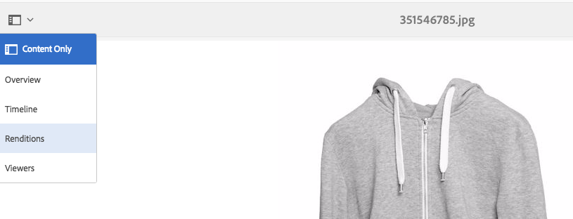
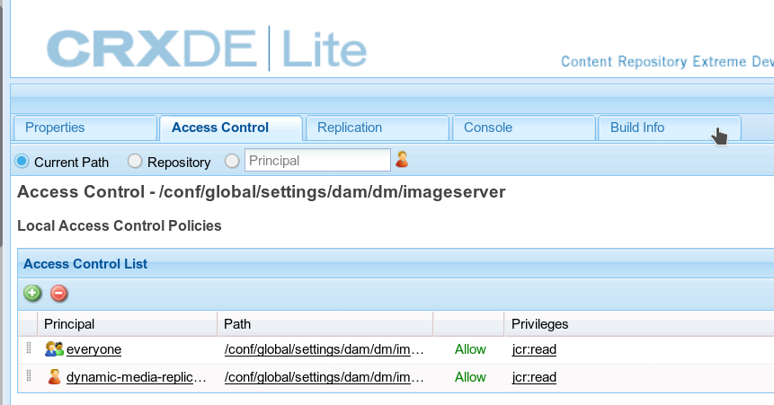

# Configuração do Dynamic Media - Modo híbrido {#configuring-dynamic-media-hybrid-mode}

Dynamic Media - Híbrido precisa ser ativado e configurado para uso. Dependendo do seu caso de uso, o Dynamic Media tem várias [configurações suportadas](#supported-dynamic-media-configurations).

>[!NOTE]
>
>Se você pretende configurar e executar o Dynamic Media no modo de execução Scene7, consulte [Configuração do Dynamic Media - Modo Scene7](config-dms7.md).
>
>Se você pretende configurar e executar o Dynamic Media no modo de execução híbrido, siga as instruções nesta página.

Saiba mais sobre como trabalhar com [vídeo](video.md) no Dynamic Media.

Se você usar o Adobe Experience Manager configurado para ambientes diferentes, como um para desenvolvimento, um para preparo e um para produção ao vivo, será necessário configurar o Dynamic Media Cloud Services para cada um desses ambientes.

Se tiver problemas com a configuração do Dynamic Media, um local importante para procurar são os arquivos de log específicos da mídia dinâmica. Eles são instalados automaticamente quando você ativa a mídia dinâmica:

* `s7access.log`
* `ImageServing.log`

Eles estão documentados em [Monitoramento e manutenção da instância de AEM](/help/sites-deploying/monitoring-and-maintaining.md).

A publicação e o delivery híbridos são um recurso principal da adição do Dynamic Media ao Adobe Experience Manager. A publicação híbrida permite fornecer ativos do Dynamic Media, como imagens, conjuntos e vídeo, da nuvem em vez dos nós de publicação do AEM.

Outros conteúdos, como visualizadores do Dynamic Media, páginas do Site e conteúdo estático, continuarão a ser veiculados a partir dos nós de publicação de AEM.

Se você for um cliente do Dynamic Media, será necessário usar o delivery híbrido como o mecanismo de delivery para todo o conteúdo do Dynamic Media.

## Arquitetura de publicação híbrida para vídeos {#hybrid-publishing-architecture-for-videos}


## Arquitetura de publicação híbrida para imagens {#hybrid-publishing-architecture-for-images}


## Configurações compatíveis do Dynamic Media {#supported-dynamic-media-configurations}

As tarefas de configuração que seguem fazem referência aos seguintes termos:

| **Termo** | **Dynamic Media ativado** | **Descrição** |
|---|---|---|
| AEM nó do autor | Marca de seleção branca em um círculo verde | O nó de criação que você implantou no local ou pelo Managed Services. |
| AEM nó de publicação | &quot;X&quot; branco em um quadrado vermelho. | O nó de publicação implantado no local ou pelo Managed Services. |
| Nó de publicação do Serviço de imagem | Marca de seleção branca em um círculo verde. | O nó de publicação executado nos data centers gerenciados pelo Adobe. Refere-se ao URL do serviço de imagem. |

Você pode optar por implementar o Dynamic Media somente para geração de imagens, somente para vídeo ou para geração de imagens e vídeo. Para determinar as etapas para configurar o Dynamic Media para seu cenário específico, consulte a tabela a seguir.

<table> 
 <tbody> 
  <tr> 
   <td><strong>Cenário</strong></td> 
   <td><strong>Como funciona</strong></td> 
   <td><strong>Etapas de configuração</strong></td> 
  </tr> 
  <tr> 
   <td>Fornecer SOMENTE imagens na produção</td> 
   <td>As imagens são fornecidas por meio de servidores em data centers globais da Adobe e, em seguida, armazenadas em cache por uma CDN para proporcionar desempenho escalável e alcance global.</td> 
   <td> 
    <ol> 
     <li>No nó AEM <strong>author</strong>, <a href="#enabling-dynamic-media">ative dynamic media</a>.</li> 
     <li>Configure a geração de imagens em <a href="#configuring-dynamic-media-cloud-services">Dynamic Media Cloud Services</a>.</li> 
     <li><a href="#configuring-image-replication">Configure a replicação de imagem</a>.</li> 
     <li><a href="#replicating-catalog-settings">Replicar configurações do catálogo</a>.</li> 
     <li><a href="#replicating-viewer-presets">Replicar predefinições do visualizador</a>.</li> 
     <li><a href="#using-default-asset-filters-for-replication">Use filtros de ativos padrão para replicação</a>.</li> 
     <li><a href="#configuring-dynamic-media-image-server-settings">Definir as configurações</a> do Dynamic Media Image Server.</li> 
     <li><a href="#delivering-assets">Entregar ativos</a>.</li> 
    </ol> </td> 
  </tr> 
  <tr> 
   <td>Fornecer SOMENTE imagens em pré-produção (Dev, QE, Stage e assim por diante).</td> 
   <td>As imagens são entregues por meio do nó de publicação de AEM. Nesse cenário, como o tráfego é mínimo, não há necessidade de fornecer imagens ao data center do Adobe. Um benefício adicional é que isso permite a pré-visualização segura do conteúdo antes do lançamento da produção</td> 
   <td> 
    <ol> 
     <li>No nó AEM <strong>author</strong>, <a href="#enabling-dynamic-media">ative dynamic media</a>.</li> 
     <li>No AEM nó <strong>publish</strong>, <a href="#enabling-dynamic-media">habilite o dynamic media</a>.</li> 
     <li><a href="#replicating-viewer-presets">Replicar predefinições do visualizador</a>.</li> 
     <li>Configure o filtro de ativo <a href="#setting-up-asset-filters-for-imaging-in-non-production-deployments">para imagens não relacionadas à produção</a>.</li> 
     <li><a href="#configuring-dynamic-media-image-server-settings">Defina as configurações do Dynamic Media Image Server.</a></li> 
     <li><a href="#delivering-assets">Entregar ativos.</a></li> 
    </ol> </td> 
  </tr> 
  <tr> 
   <td>Fornecer SOMENTE vídeo em qualquer ambiente (Produção, Desenvolvimento, QE, Preparo e assim por diante)</td> 
   <td>Os vídeos são fornecidos e armazenados em cache por uma CDN para proporcionar desempenho escalável e alcance global. A imagem do pôster de vídeo (miniatura do vídeo que é exibida antes do início da reprodução) será entregue pela instância de publicação do AEM.</td> 
   <td> 
    <ol> 
     <li>No nó AEM <strong>author</strong>, <a href="#enabling-dynamic-media">ative dynamic media</a>.</li> 
     <li>No nó AEM <strong>publish</strong>, <a href="#enabling-dynamic-media">enable dynamic media</a> (a instância de publicação serve a imagem do poster de vídeo e fornece metadados para a reprodução do vídeo).</li> 
     <li>Configure o vídeo em <a href="#configuring-dynamic-media-cloud-services">Dynamic Media Cloud Services.</a></li> 
     <li><a href="#replicating-viewer-presets">Replicar predefinições do visualizador</a>.</li> 
     <li>Configure o filtro de ativo <a href="#setting-up-asset-filters-for-video-only-deployments">somente para vídeo</a>.</li> 
     <li><a href="#delivering-assets">Entregar ativos.</a></li> 
    </ol> </td> 
  </tr> 
  <tr> 
   <td>Fornecer imagens e vídeo em produção</td> 
   <td><p>Os vídeos são fornecidos e armazenados em cache por uma CDN para proporcionar desempenho escalável e alcance global. Imagens e imagens de pôster de vídeo são entregues por meio de servidores em data centers mundiais da Adobe e armazenadas em cache por um CDN para proporcionar desempenho escalável e alcance global.</p> <p>Consulte as seções anteriores para configurar imagens ou vídeos na pré-produção. </p> </td> 
   <td> 
    <ol> 
     <li>No nó AEM <strong>author</strong>, <a href="#enabling-dynamic-media">ative dynamic media</a>.</li> 
     <li>Configure o vídeo em <a href="#configuring-dynamic-media-cloud-services">Dynamic Media Cloud Services.</a></li> 
     <li>Configurar imagens em <a href="#configuring-dynamic-media-cloud-services">Dynamic Media Cloud Services.</a></li> 
     <li><a href="#configuring-image-replication">Configure a replicação de imagem</a>.</li> 
     <li><a href="#replicating-catalog-settings">Replicar configurações do catálogo</a>.</li> 
     <li><a href="#replicating-viewer-presets">Replicar predefinições do visualizador</a>.</li> 
     <li><a href="#using-default-asset-filters-for-replication">Use filtros de ativos padrão para replicação.</a></li> 
     <li><a href="#configuring-dynamic-media-image-server-settings">Defina as configurações do Dynamic Media Image Server.</a></li> 
     <li><a href="#delivering-assets">Entregar ativos.</a></li> 
    </ol> </td> 
  </tr> 
 </tbody> 
</table>

## Ativar o Dynamic Media {#enabling-dynamic-media}

[As ](https://www.adobe.com/solutions/web-experience-management/dynamic-media.html) mídias dinâmicas são desativadas por padrão. Para aproveitar os recursos do Dynamic Media, é necessário ativar a mídia dinâmica usando o modo de execução **[!UICONTROL dynamicmedia]** como você faria, por exemplo, com o modo de execução **[!UICONTROL publish]**. Antes de habilitar, verifique os [requisitos técnicos](/help/sites-deploying/technical-requirements.md#requirements-for-aem-dynamic-media-add-on).

>[!NOTE]
>
>Habilitar a mídia dinâmica por meio do modo de execução substitui a funcionalidade em AEM 6.1 e AEM 6.0, onde você ativou a mídia dinâmica ao definir o sinalizador **[!UICONTROL dynamicMediaEnabled]** como **[!UICONTROL true]**. Esse sinalizador não tem funcionalidade no AEM 6.2 e posterior. Além disso, não é necessário reiniciar o início rápido para ativar a mídia dinâmica.

Ao ativar o Dynamic Media, os recursos de mídia dinâmica estarão disponíveis na interface do usuário e cada ativo de imagem carregado recebe uma representação `cqdam.pyramid.tiff` que é usada para entrega rápida de representações de imagem dinâmica. Esses PTIFFs têm vantagens significativas, incluindo (1) a capacidade de gerenciar apenas uma única imagem principal e gerar representações infinitas dinamicamente sem qualquer armazenamento adicional e (2) a capacidade de usar visualização interativa, como zoom, panorâmica, rotação e assim por diante.

Se quiser usar o Dynamic Media Classic no AEM, não ative o Dynamic Media, a menos que esteja usando um [cenário específico](/help/sites-administering/scene7.md#aem-scene-integration-versus-dynamic-media). O Dynamic Media é desativado a menos que você ative o Dynamic Media por meio do modo de execução.

Para habilitar a mídia dinâmica, você deve habilitar o modo de execução da mídia dinâmica a partir da linha de comando ou do nome do arquivo de início rápido.

**Para ativar a mídia** dinâmica:

1. Na linha de comando, ao iniciar o início rápido, faça o seguinte:

   * Adicione **[!UICONTROL -r dynamicmedia]** ao final da linha de comando ao iniciar o arquivo jar.

   ```shell
   java -Xmx4096m -Doak.queryLimitInMemory=500000 -Doak.queryLimitReads=500000 -jar cq-quickstart-6.4.0.jar -r dynamicmedia
   ```

   Se você estiver publicando no s7delivery, também precisará incluir os seguintes argumentos trustStore:

   ```shell
   -Djavax.net.ssl.trustStore=<absoluteFilePath>/customerTrustStoreFileName>
   
    -Djavax.net.ssl.trustStorePassword=<passwordForTrustStoreFile>
   ```

1. Solicite `http://localhost:4502/is/image` e verifique se o Servidor de imagem está em execução.

   >[!NOTE]
   >
   >Para solucionar problemas com o Dynamic Media, consulte os seguintes logs no diretório **[!UICONTROL crx-quickstart/logs/]**:
   >
   >* ImageServer-&lt;PortId>-&lt;yyyy>&lt;mm>&lt;dd>.log - O log ImageServer fornece estatísticas e informações analíticas usadas para analisar o comportamento do processo interno do ImageServer.

      Exemplo de um nome de arquivo de log do Servidor de Imagens: `ImageServer-57346-2019-07-25.log`
   * s7access-&lt;yyyy>&lt;mm>&lt;dd>.log - O log s7access registra cada solicitação feita ao Dynamic Media por meio de `/is/image` e `/is/content`.
   Esses logs são usados somente quando o Dynamic Media está ativado. Eles não estão incluídos no pacote **Download Full** gerado a partir da página **[!UICONTROL system/console/status-Bundlelist]**; ao chamar o Suporte ao cliente em caso de problema com a Dynamic Media, anexe esses dois registros ao problema.

### Se você instalou AEM em uma porta ou um caminho de contexto diferente ... {#if-you-installed-aem-to-a-different-port-or-context-path}

Se estiver implantando [AEM em um servidor de aplicativos](/help/sites-deploying/application-server-install.md) e tiver o Dynamic Media ativado, será necessário configurar o domínio **self** no externalizador. Caso contrário, a geração de miniaturas de ativos não funcionará corretamente para ativos de mídia dinâmica.

Além disso, se você executar o início rápido em uma porta ou caminho de contexto diferente, também precisará alterar o domínio **self**.

Quando o Dynamic Media é ativado, as representações de miniatura estáticas para ativos de imagem são geradas usando o Dynamic Media. Para que a geração de miniaturas funcione corretamente para a mídia dinâmica, AEM deve executar uma solicitação de URL para si mesmo e deve saber o número da porta e o caminho do contexto.

No AEM:

* O domínio **self** no [externalizer](/help/sites-developing/externalizer.md) é usado para recuperar o número da porta e o caminho do contexto.
* Se nenhum domínio **self** estiver configurado, o número da porta e o caminho do contexto serão recuperados do serviço HTTP Jetty.

Em uma implantação AEM do QuickStart WAR, o número da porta e o caminho do contexto não podem ser derivados, portanto, você deve configurar um domínio **self**. Consulte a [documentação do externalizador](/help/sites-developing/externalizer.md) sobre como configurar o domínio **self**.

>[!NOTE]
Em uma implantação independente [AEM do Quickstart](/help/sites-deploying/deploy.md), um domínio **self** geralmente não precisa ser configurado, pois o número da porta e o caminho do contexto podem ser configurados automaticamente. No entanto, se todas as interfaces de rede estiverem desativadas, será necessário configurar o domínio **self**.

## Desabilitação do Dynamic Media {#disabling-dynamic-media}

A mídia dinâmica não está habilitada por padrão. No entanto, se a mídia dinâmica foi ativada anteriormente, convém desativá-la posteriormente.

Para desativar a mídia dinâmica depois de habilitá-la, remova o sinalizador de modo de execução **[!UICONTROL -r dynamicmedia]**.

**Para desabilitar o Dynamic Media após ele ter sido ativado**:

1. Na linha de comando, ao iniciar o início rápido, você pode fazer o seguinte:

   * Não adicione `-r dynamicmedia` à linha de comando ao iniciar o arquivo JAR.

   ```shell
   java -Xmx4096m -Doak.queryLimitInMemory=500000 -Doak.queryLimitReads=500000 -jar cq-quickstart-6.4.0.jar
   ```

1. Solicite `http://localhost:4502/is/image`. Você receberá uma mensagem informando que o Dynamic Media está desativado.

   >[!NOTE]
   Depois que o modo de execução Dynamic Media é desativado, a etapa do fluxo de trabalho que gera a representação `qdam.pyramid.tiff` é ignorada automaticamente. Isso também desativa o suporte de representação dinâmica e outros recursos do Dynamic Media.
   Observe também que, quando o modo de execução Dynamic Media é desativado após a configuração do servidor de AEM, todos os ativos que foram carregados nesse modo de execução agora são inválidos.

## (Opcional) Migração de predefinições e configurações do Dynamic Media de 6.3 para 6.4, tempo de inatividade zero {#optional-migrating-dynamic-media-presets-and-configurations-from-to-zero-downtime}

Se você estiver atualizando AEM Dynamic Media de 6.3 para 6.4 - o que agora inclui a capacidade de zero implantações de tempo de inatividade (também conhecidas como &quot;Opt-in&quot;) - é necessário executar o seguinte comando curl para migrar todas as predefinições e configurações de `/etc` para `/conf` no CRXDE Lite.

**Observação**: Se você executar a instância do AEM no modo de compatibilidade, ou seja, você terá o pacote de compatibilidade instalado, não precisará executar esses comandos.

Para migrar suas predefinições e configurações personalizadas de `/etc` para `/conf`, execute o seguinte comando curl do Linux:

`curl -u admin:admin http://localhost:4502/libs/settings/dam/dm/presets.migratedmcontent.json`

Para todas as atualizações, com ou sem o pacote de compatibilidade, você pode copiar as predefinições do visualizador prontas para uso executando o seguinte comando:

`curl -u admin:admin http://localhost:4502/libs/settings/dam/dm/presets/viewer.pushviewerpresets`

## Configuração da replicação de imagem {#configuring-image-replication}

A entrega de imagens da Dynamic Media funciona através da publicação de ativos de imagem, incluindo miniaturas de vídeo, do AEM Author e da replicação para o serviço de replicação sob demanda do Adobe (o URL do serviço de replicação). Os ativos são então entregues por meio do serviço de entrega de imagem sob demanda (o URL do Serviço de Imagem).

Você deve fazer o seguinte:

1. [Configurar autenticação](#setting-up-authentication).
1. [Configure o agente](#configuring-the-replication-agent) de replicação.

O Agente de replicação publica ativos do Dynamic Media, como imagens, metadados de vídeo e configurações para o Serviço de imagem hospedado no Adobe. O Agente de Replicação não está habilitado por padrão.

Após configurar o agente de replicação, é necessário [validar e testar se ele foi configurado com êxito](#validating-the-replication-agent-for-dynamic-media). Esta seção descreve esses procedimentos.

>[!NOTE]
O limite de memória padrão para a criação de PTIFF é de 3 GB em todos os workflows. Por exemplo, você pode processar uma imagem que requer 3 GB de memória enquanto outros fluxos de trabalho são pausados, ou pode processar 10 imagens em paralelo que exigem 300 MB de memória cada.
O limite de memória é configurável e deve se ajustar à disponibilidade de recursos do sistema e ao tipo de conteúdo de imagem que está sendo processado. Se você tiver muitos ativos muito grandes e tiver memória suficiente no sistema, poderá aumentar esse limite para garantir que as imagens sejam processadas em paralelo.
Uma imagem que requer mais do que o limite máximo de memória será rejeitada.
Para alterar o limite de memória para a criação de PTIFF, navegue até **[!UICONTROL Tools > Operations > Web Console > Adobe CQ Scene7 PTiffManager]** e altere o valor `maxMemory`.

### Configuração da autenticação {#setting-up-authentication}

Você precisa configurar a autenticação de replicação no autor para replicar imagens no serviço de entrega de imagens da Dynamic Media. Faça isso obtendo um KeyStore e salvando-o no usuário **[!UICONTROL dynamic-media-replication]** e configurando-o. O administrador da empresa deve ter recebido um email de boas-vindas com o arquivo KeyStore e as credenciais necessárias durante o processo de provisionamento. Caso não tenha recebido essa mensagem, entre em contato com o Atendimento ao cliente.

**Para configurar a autenticação**:

1. Entre em contato com o Atendimento ao cliente para obter o arquivo KeyStore e a senha, se ainda não tiver essa senha. Isso faz parte do provisionamento e associará as chaves à sua conta.
1. Em AEM, toque no logotipo do AEM para acessar o console de navegação global e toque em **[!UICONTROL Ferramentas > Segurança > Usuários]**.
1. Na página Gerenciamento de usuários , navegue até o usuário **[!UICONTROL dynamic-media-replication]** e toque para abrir.

   

1. Na página Editar configurações do usuário para replicação dinâmica de mídia, toque na guia **[!UICONTROL Armazenamento de chaves]** e toque em **[!UICONTROL Criar armazenamento de chaves]**.

   

1. Digite uma senha e confirme a senha na caixa de diálogo **[!UICONTROL Definir senha de acesso do KeyStore]**.

   >[!NOTE]
   Lembre-se da senha inserida. Você precisará inseri-lo novamente quando configurar o **[!UICONTROL Agente de Replicação]** mais tarde.

   

1. Na página **[!UICONTROL Editar configurações do usuário para dynamic-media-replication]** , expanda a área **[!UICONTROL Adicionar chave privada do arquivo KeyStore]** e adicione o seguinte (consulte as imagens a seguir):

   * No campo **[!UICONTROL New Alias]**, insira o nome de um alias que será usado posteriormente na configuração de replicação; por exemplo, **replication**.
   * Toque em **[!UICONTROL Arquivo KeyStore]**. Navegue até o arquivo KeyStore fornecido a você pelo Adobe, selecione-o e toque em **[!UICONTROL Abrir]**.
   * No campo **[!UICONTROL KeyStore File Password]**, digite a senha do arquivo KeyStore. Esta é _not_ a senha do KeyStore que você criou na etapa 5, mas é o Adobe de senha do Arquivo KeyStore que fornece no email de boas-vindas enviado a você durante o provisionamento. Entre em contato com o Atendimento ao cliente do Adobe se você não tiver recebido uma senha do arquivo KeyStore.
   * No campo **[!UICONTROL Private Key Password]**, digite a senha da chave privada (pode ser a mesma senha de chave privada fornecida na etapa anterior). O Adobe fornece a senha da chave privada no email de boas-vindas enviado a você durante o provisionamento. Entre em contato com o Atendimento ao cliente do Adobe se não tiver recebido uma senha de chave privada.
   * No campo **[!UICONTROL Private Key Alias]**, insira o alias da chave privada. Por exemplo, `companyname-alias`. O Adobe fornece o alias da chave privada no email de boas-vindas enviado a você durante o provisionamento. Entre em contato com o Atendimento ao cliente do Adobe se não tiver recebido um alias de chave privada.

   

1. Toque em **[!UICONTROL Salvar e fechar]** para salvar as alterações neste usuário.

   Em seguida, você precisa [configurar o agente de replicação.](#configuring-the-replication-agent)

### Configuração do Agente de replicação {#configuring-the-replication-agent}

1. Em AEM, toque no logotipo do AEM para acessar o console de navegação global e toque em **[!UICONTROL Tools > Deployment > Replication > Agents on author]**.
1. Na página Agentes no autor, toque em **[!UICONTROL Replicação de imagem híbrida do Dynamic Media (s7delivery)]**.
1. Toque em **[!UICONTROL Editar]**.
1. Toque na guia **[!UICONTROL Settings]** e digite o seguinte:

   * **[!UICONTROL Ativado]**  - Marque essa caixa de seleção para ativar o agente de replicação.
   * **[!UICONTROL Região]**  - Defina para a região apropriada: América do Norte, Europa ou Ásia
   * **[!UICONTROL ID do locatário]**  - esse valor é o nome da sua empresa/locatário que está publicando no Serviço de replicação. Esse valor é a ID do locatário que o Adobe fornece no email de boas-vindas enviado a você durante o provisionamento. Entre em contato com o Atendimento ao cliente do Adobe se não tiver recebido essa mensagem.
   * **[!UICONTROL Alias do Armazenamento de Chaves]**  - Esse valor é igual ao valor** Novo Alias** definido ao gerar a chave em  [Configurar Autenticação](#setting-up-authentication); por exemplo,  `replication`. (Consulte a etapa 7 em [Configuração da autenticação](#setting-up-authentication).)
   * **[!UICONTROL Senha do Armazenamento de Chaves]**  - Esta é a senha do KeyStore criada quando você tocou em  **[!UICONTROL Criar KeyStore]**. O Adobe não fornece essa senha. Consulte a etapa 5 de [Configuração da autenticação](#setting-up-authentication).

   A imagem a seguir mostra o agente de replicação com dados de amostra:

   

1. Toque em **[!UICONTROL OK]**.

### Validando o Agente de Replicação para Dynamic Media {#validating-the-replication-agent-for-dynamic-media}

Para validar o agente de replicação para mídia dinâmica, faça o seguinte:

Toque em **[!UICONTROL Testar conexão]**. O exemplo de saída é o seguinte:

```shell
11.03.2016 10:57:55 - Transferring content for ReplicationAction{type=TEST, path[0]='/content/dam', time=1457722675402, userId='admin', revision='null'}
11.03.2016 10:57:55 - * Auth User: replication-receiver
11.03.2016 10:57:55 - * HTTP Version: 1.1
11.03.2016 10:57:55 - * Using OAuth 2.0 Authorization Grants
11.03.2016 10:57:55 - * OAuth 2.0 User: dynamic-media-replication
11.03.2016 10:57:55 - * OAuth 2.0 Token: '*****' initialized
11.03.2016 10:57:55 - Publishing: POST[https://replicate-na.assetsadobe.com:8580/is-publish/publish-receiver?Cmd=Test&RootId=xfpuu-6613]
11.03.2016 10:57:55 - Publish response: OK[]
11.03.2016 10:57:55 - Transfer succeeded in 141 ms for ReplicationAction{type=TEST, path[0]='/content/dam', time=1457722675402, userId='admin', revision='null'}
-------------------------------------------------------------------------------------------------------------------------------
Replication test succeeded
```

>[!NOTE]
Você também pode verificar seguindo um destes procedimentos:
* Verifique os logs de replicação para garantir que o ativo seja replicado.
* Publique uma imagem. Toque na imagem e selecione **[!UICONTROL Visualizadores]** no menu suspenso. Selecione uma predefinição do visualizador, toque em **[!UICONTROL URL]** e copie e cole o URL no navegador para verificar se você pode ver a imagem.


### Solução de problemas de autenticação {#troubleshooting-authentication}

Ao configurar a autenticação, você pode encontrar alguns problemas com as soluções disponíveis. Antes de verificar isso, certifique-se de configurar a replicação.

#### Problema: Código de status HTTP 401 com mensagem - Autorização necessária {#problem-http-status-code-with-message-authorization-required}

Esse problema pode ser causado por uma falha na configuração do KeyStore para `dynamic-media-replication` usuário.

```shell
Replication test to s7delivery:https://s7bern.macromedia.com:8580/is-publish/
17.06.2016 18:54:43 - Transferring content for ReplicationAction{type=TEST, path[0]='/content/dam', time=1466214883309, userId='admin', revision='null'}
17.06.2016 18:54:43 - * Auth User: replication-receiver
17.06.2016 18:54:43 - * HTTP Version: 1.1
17.06.2016 18:54:43 - * Using OAuth 2.0 Authorization Grants
17.06.2016 18:54:43 - * OAuth 2.0 User: dynamic-media-replication
17.06.2016 18:54:43 - No OAuth token available. OAuth not initialized
17.06.2016 18:54:43 - * Using Client Auth SSL alias - replication-alias *
17.06.2016 18:54:43 - Publishing: POST[https://<localhost>:8580/is-publish//publish-receiver?Cmd=Test&RootId=brough]
17.06.2016 18:54:43 - Transfer failed for ReplicationAction{type=TEST, path[0]='/content/dam', time=1466214883309, userId='admin', revision='null'}. java.io.IOException: Failed to execute request
'https://<localhost>:8580/is-publish//publish-receiver?Cmd=Test&RootId=brough':
 Server returned status code 401 with message: Authorization required.
17.06.2016 18:54:43 - Error while replicating: com.day.cq.replication.ReplicationException: Transfer failed for ReplicationAction{type=TEST, path[0]='/content/dam', time=1466214883309,
 userId='admin', revision='null'}. java.io.IOException: Failed to execute request
'https://<localhost>:8580/is-publish//publish-receiver?Cmd=Test&RootId=brough':
 Server returned status code 401 with message: Authorization required.
```

**Solução**: Verifique se o  `KeyStore` é salvo em  **[!UICONTROL dynamic-media-]** replicationuser e se é fornecido com a senha correta.

#### Problema: Não foi possível descriptografar a chave - Não foi possível descriptografar dados {#problem-could-not-decrypt-key-could-not-decrypt-data}

```xml
Replication test to s7delivery:https://<localhost>:8580/is-publish/
17.06.2016 19:00:16 - Transferring content for ReplicationAction{type=TEST, path[0]='/content/dam', time=1466215216662, userId='admin', revision='null'}
17.06.2016 19:00:16 - * Auth User: replication-receiver
17.06.2016 19:00:16 - * HTTP Version: 1.1
17.06.2016 19:00:16 - * Using OAuth 2.0 Authorization Grants
17.06.2016 19:00:16 - * OAuth 2.0 User: dynamic-media-replication
17.06.2016 19:00:16 - No OAuth token available. OAuth not initialized
17.06.2016 19:00:16 - * Using Client Auth SSL alias - replication-alias *
17.06.2016 19:00:16 - Transfer failed for ReplicationAction{type=TEST, path[0]='/content/dam', time=1466215216662, userId='admin', revision='null'}. java.lang.SecurityException: java.security.UnrecoverableKeyException: Could not decrypt key: Could not decrypt data.
```

**Solução**: Verifique a senha. A senha salva no agente de replicação não é a mesma senha usada para criar keystore.

#### Problema: InvalidAlgorithmParameterException {#problem-invalidalgorithmparameterexception}

Esse problema é causado por um erro de configuração na instância do autor do AEM. O processo java no Autor não está recebendo o `javax.net.ssl.trustStore` correto. Você vê este erro no log de replicação:

```shell
14.04.2016 09:37:43 - Transfer failed for ReplicationAction{type=TEST, path[0]='/content/dam', time=1460651862089, userId='admin', revision='null'}. java.io.IOException: Failed to execute request 'https://<localhost>:8580/is-publish/publish-receiver?Cmd=Test&RootId=rbrough-osx2': java.lang.RuntimeException: Unexpected error: java.security.InvalidAlgorithmParameterException: the trustAnchors parameter must be non-empty
14.04.2016 09:37:43 - Error while replicating: com.day.cq.replication.ReplicationException: Transfer failed for ReplicationAction{type=TEST, path[0]='/content/dam', time=1460651862089, userId='admin', revision='null'}. java.io.IOException: Failed to execute request 'https://<localhost>:8580/is-publish/publish-receiver?Cmd=Test&RootId=rbrough-osx2': java.lang.RuntimeException: Unexpected error: java.security.InvalidAlgorithmParameterException: the trustAnchors parameter must be non-empty
```

Ou o log de erros:

```shell
07.25.2019 12:00:59.893 *ERROR* [sling-threadpool-db2763bb-bc50-4bb5-bb64-10a09f432712-(apache-sling-job-thread-pool)-90-com_day_cq_replication_job_s7delivery(com/day/cq/replication/job/s7delivery)] com.day.cq.replication.Agent.s7delivery.queue Error during processing of replication.
 
java.io.IOException: Failed to execute request 'https://replicate-na.assetsadobe.com:8580/is-publish/publish-receiver?Cmd=Test&RootId=rbrough-osx': java.lang.RuntimeException: Unexpected error: java.security.InvalidAlgorithmParameterException: the trustAnchors parameter must be non-empty
        at com.scene7.is.catalog.service.publish.atomic.PublishingServiceHttp.executePost(PublishingServiceHttp.scala:195)
```

**Solução**: Certifique-se de que o processo java no autor do AEM tenha a propriedade do sistema  **-Djavax.net.ssl.trustStore=** definida como um truststore válido.

#### Problema: O KeyStore não está configurado ou não foi inicializado {#problem-keystore-is-either-not-set-up-or-it-is-not-initialized}

Esse problema pode ser causado por um hotfix ou um pacote de recursos que substitui o nó **[!UICONTROL dynamic-media-user]** ou **[!UICONTROL keystore]**.

Exemplo de log de replicação:

```shell
Replication test to s7delivery:https://replicate-na.assetsadobe.com/is-publish
02.08.2016 14:37:44 - Transferring content for ReplicationAction{type=TEST, path[0]='/content/dam', time=1470173864834, userId='admin', revision='null'}
02.08.2016 14:37:44 - * Auth User: replication-receiver
02.08.2016 14:37:44 - * HTTP Version: 1.1
02.08.2016 14:37:44 - * Using OAuth 2.0 Authorization Grants
02.08.2016 14:37:44 - * OAuth 2.0 User: dynamic-media-replication
02.08.2016 14:37:44 - Transfer failed for ReplicationAction{type=TEST, path[0]='/content/dam', time=1470173864834, userId='admin', revision='null'}. com.adobe.granite.keystore.KeyStoreNotInitialisedException: Uninitialised key store for user dynamic-media-replication
```

**Solução**:

1. Navegue até a página **[!UICONTROL Gerenciamento de Usuário]**:

   `localhost:4502/libs/granite/security/content/useradmin.html`
1. Na página **[!UICONTROL Gerenciamento de usuários]** , navegue até o usuário **[!UICONTROL dynamic-media-replication]** e toque para abrir.
1. Toque na guia **[!UICONTROL KeyStore]**. Se o botão **[!UICONTROL Create KeyStore]** for exibido, será necessário refazer as etapas em [Setting up Authentication](#setting-up-authentication) previous.
1. Se tiver que refazer a configuração **[!UICONTROL KeyStore]**, talvez seja necessário [Configurar o Agente de Replicação](config-dynamic.md#configuring-the-replication-agent) novamente, também.

   Reconfigure o s7delivery Replication Agent.

   `localhost:4502/etc/replication/agents.author/s7delivery.html`

1. Toque em **[!UICONTROL Testar conexão]** para verificar se a configuração é válida.

#### Problema: O Agente de Publicação está usando SSL em vez de OAuth {#problem-publish-agent-is-using-ssl-instead-of-oauth}

Esse problema pode ser causado por um hotfix ou pacote de recursos que não instalou corretamente ou sobrescreveu as configurações.

Exemplo de log de replicação:

```shell
01.08.2016 18:42:59 - Transferring content for ReplicationAction{type=TEST, path[0]='/content/dam', time=1470073379634, userId='admin', revision='null'}
01.08.2016 18:42:59 - * Auth User: replication-receiver
01.08.2016 18:42:59 - * HTTP Version: 1.1
01.08.2016 18:42:59 - * Using Client Auth SSL alias - replication-receiver *
01.08.2016 18:42:59 - Publishing: POST[https://replicate-eu.assetsadobe2.com:443/is-publish/publish-receiver?Cmd=Test&RootId=altayerstaging]
01.08.2016 18:42:59 - Transfer failed for ReplicationAction{type=TEST, path[0]='/content/dam', time=1470073379634, userId='admin', revision='null'}. java.io.IOException: Failed to execute request 'https://replicate-eu.assetsadobe2.com:443/is-publish/publish-receiver?Cmd=Test&RootId=rbroughstaging': Server returned status code 401 with message: Authorization required.
01.08.2016 18:42:59 - Error while replicating: com.day.cq.replication.ReplicationException: Transfer failed for ReplicationAction{type=TEST, path[0]='/content/dam', time=1470073379634, userId='admin', revision='null'}. java.io.IOException: Failed to execute request 'https://replicate-eu.assetsadobe2.com:443/is-publish/publish-receiver?Cmd=Test&RootId=rbroughstaging': Server returned status code 401 with message: Authorization required.
```

**Solução:**

1. No AEM, toque em **[!UICONTROL Ferramentas > Geral > CRXDE Lite]**.

   `localhost:4502/crx/de/index.jsp`

1. Navegue até o nó **[!UICONTROL s7delivery Replication Agent]**.

   `localhost:4502/crx/de/index.jsp#/etc/replication/agents.author/s7delivery/jcr:content`

1. Adicione essa configuração ao agente de replicação (Booliano com valor definido como **[!UICONTROL True]**):

   `enableOauth=true`

1. Próximo ao canto superior esquerdo da página, toque em **[!UICONTROL Salvar tudo]**.

### Testar sua configuração {#testing-your-configuration}

O Adobe recomenda que você execute um teste completo da configuração.

Certifique-se de que você já fez o seguinte antes de iniciar este teste:

* Predefinições de imagem adicionadas.
* Configure **Dynamic Media Configuration (Pre 6.3)** em **[!UICONTROL Cloud Services]**. O URL do Serviço de Imagem é necessário para este teste

Para testar sua configuração:

1. Faça upload de um ativo de imagem. (Em Ativos, toque em **[!UICONTROL Criar > Arquivos]** e selecione o arquivo.)
1. Aguarde a conclusão do fluxo de trabalho.
1. Publique o ativo da imagem. (Selecione o ativo e toque em **[!UICONTROL Publicação rápida]**.)
1. Navegue até as representações dessa imagem, abrindo a imagem e tocando em **[!UICONTROL Representações]**.

   

1. Selecione qualquer representação dinâmica.
1. Toque em **[!UICONTROL URL]** para obter o URL para esse ativo.
1. Navegue até o URL selecionado e verifique se a imagem se comporta como esperado.

Outra maneira de testar se seus ativos foram entregues é anexar req=exists ao seu URL.

## Configuração do Dynamic Media Cloud Services {#configuring-dynamic-media-cloud-services}

O serviço da Dynamic Media Cloud oferece suporte para serviços em nuvem, como publicação híbrida e entrega de imagens e vídeo, análise de vídeo, codificação de vídeo, entre outras coisas.

Como parte da configuração, você precisa inserir uma ID de registro, URL do serviço de vídeo, URL do serviço de imagem, URL do serviço de replicação e configurar a autenticação. Você deveria ter recebido todas essas informações como parte do processo de provisionamento da conta. Caso não tenha recebido essas informações, entre em contato com o administrador da Adobe Experience Manager ou com o Suporte técnico do Adobe para obter as informações.

>[!NOTE]
Antes de configurar o Dynamic Media Cloud Services, certifique-se de configurar sua instância de publicação. Você também deve ter a replicação configurada antes de configurar o Dynamic Media Cloud Services.

**Para configurar os serviços** em nuvem do dynamic media:

1. Em AEM, toque no logotipo do AEM para acessar o console de navegação global e toque em **[!UICONTROL Ferramentas > Cloud Services > Configuração do Dynamic Media (Pré-6.3)]**.
1. Na página **[!UICONTROL Navegador de configuração do Dynamic Media]**, no painel esquerdo, selecione **[!UICONTROL global]** e toque em **[!UICONTROL Criar]**.
1. Na caixa de diálogo **[!UICONTROL Criar configuração do Dynamic Media]**, no campo **[!UICONTROL Título]**, digite um título.
1. Se você estiver configurando o Dynamic Media para vídeo,

   * No campo **[!UICONTROL ID de registro]**, digite a ID de registro.
   * No campo **[!UICONTROL Video Service URL]**, insira o URL do serviço de vídeo do Dynamic Media Gateway.

1. Se você estiver configurando o Dynamic Media para geração de imagens, no campo **[!UICONTROL Image Service URL]**, digite o URL do serviço de imagem para o Dynamic Media Gateway.
1. Toque em **[!UICONTROL Salvar]** para retornar à página Navegador de configuração do Dynamic Media.
1. Toque no logotipo do AEM para acessar o console de navegação global.

## Configuração do relatório de vídeo {#configuring-video-reporting}

Você pode configurar relatórios de vídeo em várias instalações de AEM usando o Dynamic Media - Modo híbrido.

**Quando usar:** no momento em que você configura a configuração do  **[!UICONTROL Dynamic Media (Pré 6.3)]**, vários recursos são iniciados, incluindo o relatório de vídeo. A configuração cria um conjunto de relatórios em uma empresa regional do Analytics. Se você configurar vários nós de Autor, criará um conjunto de relatórios separado para cada um. Como resultado, os dados de relatório são inconsistentes entre as instalações. Além disso, se cada nó do Autor fizer referência ao mesmo servidor de Publicação híbrido, a última instalação do Autor alterará o conjunto de relatórios de destino para todos os relatórios de vídeo. Esse problema sobrecarrega o sistema do Analytics com muitos conjuntos de relatórios.

**Introdução:** configure os relatórios de vídeo concluindo as três tarefas a seguir.

1. Crie um pacote predefinido [!DNL Video Analytics] após configurar **[!UICONTROL Configuração do Dynamic Media (Pré 6.3)]** no primeiro nó Autor. Essa tarefa inicial é importante porque permite que uma nova configuração continue usando o mesmo conjunto de relatórios.
1. Instale o pacote predefinido [!DNL Video Analytics] para qualquer ***novo*** nó do autor ***antes de*** configurar a Configuração do Dynamic Media (Pré 6.3).

1. Verifique e depure a instalação do pacote.

### Criação de um pacote predefinido [!DNL Video Analytics] após configurar o primeiro nó Autor {#creating-a-video-analytics-preset-package-after-configuring-the-first-author-node}

Quando terminar esta tarefa, você terá um arquivo de pacote que contém as predefinições [!DNL Video Analytics]. Essas predefinições contêm um conjunto de relatórios, o servidor de rastreamento, o namespace de rastreamento e a ID da organização do Marketing Cloud, se disponível.

1. Se ainda não tiver feito isso, configure **[!UICONTROL Configuração do Dynamic Media (Pré 6.3)]**.
1. (Opcional) Exiba e copie a **[!UICONTROL ID do conjunto de relatórios]** (você deve ter acesso ao JCR). Embora não seja necessário ter a **[!UICONTROL ID do conjunto de relatórios]**, facilita a validação.
1. Crie um pacote usando **[!UICONTROL Gerenciador de Pacotes]**.
1. Edite o pacote para incluir um filtro.

   No AEM: `/conf/global/settings/dam/dm/presets/analytics/jcr:content/userdata`

1. Crie o pacote.
1. Baixe ou compartilhe o pacote predefinido [!DNL Video Analytics] para que ele possa ser compartilhado com os novos nós Autor subsequentes.

### Instalar o pacote predefinido [!DNL Video Analytics] antes de configurar os nós do Autor adicionais {#installing-the-video-analytics-preset-package-before-you-configure-additional-author-nodes}

Certifique-se de concluir esta tarefa _antes de_ configurar **[!UICONTROL Configuração do Dynamic Media (Pré 6.3)]**. Se isso não for feito, haverá a criação de outro conjunto de relatórios não utilizado. Além disso, mesmo que os relatórios de vídeo continuem a funcionar corretamente, a coleta de dados não é otimizada.

Certifique-se de que o pacote predefinido [!DNL Video Analytics] do primeiro nó Autor esteja acessível no novo nó Autor .

1. Carregue o pacote predefinido [!DNL Video Analytics] que você criou anteriormente para **[!UICONTROL Gerenciador de Pacotes]**.
1. Instale o pacote predefinido [!DNL Video Analytics].
1. Configurar **[!UICONTROL Configuração do Dynamic Media (Pré 6.3)]**.

### Verificação e depuração da instalação do pacote {#verifying-and-debugging-the-package-installation}

1. Siga qualquer um destes procedimentos para verificar e, se necessário, depurar a instalação do pacote:

   * **Verifique a  [!DNL Video Analytics] predefinição por meio do**
JCRTpara verificar a  [!DNL Video Analytics] predefinição por meio do JCR, você deve ter acesso ao  **[!UICONTROL CRXDE Lite]**.

      AEM - Em **[!UICONTROL CRXDE Lite]**, navegue até `/conf/global/settings/dam/dm/presets/analytics/jcr:content/userdata  `

      Isso é `http://localhost:4502/crx/de/index.jsp#/conf/global/settings/dam/dm/presets/analytics/jcr%3Acontent/userdata`

      Se você não tiver acesso a **[!UICONTROL CRXDE Lite]** no nó Autor, poderá verificar a predefinição por meio do servidor Publicar .

   * **Verifique a  [!DNL Video Analytics] predefinição através do servidor de imagens**

      Você pode validar a predefinição [!DNL Video Analytics] diretamente fazendo uma solicitação do Servidor de imagem `req=userdata`.

      Por exemplo, para ver a predefinição [!DNL Video Analytics] no nó Autor, você pode fazer a seguinte solicitação:

      `http://localhost:4502/is/image/conf/global/settings/dam/dm/presets/analytics?req=userdata`

      Para validar a predefinição nos servidores de Publicação, você pode fazer uma solicitação direta semelhante ao servidor de Publicação. As respostas são as mesmas nos nós Autor e Publicação . A resposta é semelhante ao seguinte:

      ```
      marketingCloudOrgId=0FC4E86B573F99CC7F000101
       reportSuite=aemaem6397618-2018-05-23
       trackingNamespace=aemvideodal
       trackingServer=aemvideodal.d2.sc.omtrdc.net
      ```

   * **Verifique a  [!DNL Video Analytics] predefinição através da ferramenta Relatório de vídeo em AEM**

      Toque em **[!UICONTROL Ferramentas > Ativos > Relatório de vídeo]** `http://localhost:4502/mnt/overlay/dam/gui/content/s7dam/videoreports/videoreport.html`

      Caso veja a seguinte mensagem de erro, o conjunto de relatórios está disponível, mas não está preenchido. Esse erro está correto — e é desejado — em uma nova instalação antes que o sistema colete quaisquer dados.

      
   Para gerar dados de relatório, faça upload e publique um vídeo. Use **[!UICONTROL Copiar URL]** e execute o vídeo pelo menos uma vez.

   Esteja ciente de que pode levar até 12 horas até que os dados de relatório sejam preenchidos a partir do uso do Visualizador de vídeo.

   Se houver um erro e o conjunto de relatórios não estiver definido corretamente, o alerta a seguir será exibido.

   

   Esse erro também será exibido se o Relatório de vídeo for executado antes que você configure os serviços de **[!UICONTROL Configuração do Dynamic Media (Pré 6.3)]**.

### Resolução de problemas na configuração de relatório de vídeo {#troubleshooting-the-video-reporting-configuration}

* Durante a instalação, às vezes, as conexões com o servidor da API do Analytics expiram. A instalação repete a conexão 20 vezes, mas ainda falha. Quando essa situação ocorre, o arquivo de log registra vários erros. Pesquisar `SiteCatalystReportService`.
* Não instalar o pacote predefinido [!DNL Video Analytics] primeiro pode causar a criação de um novo conjunto de relatórios.
* Ao atualizar do AEM 6.3 para o AEM 6.4 ou AEM 6.4.1, em seguida, configurar o **[!UICONTROL Configuração do Dynamic Media (Pré 6.3)]**, o ainda cria um conjunto de relatórios. Esse problema é conhecido e está programado para ser corrigido no AEM 6.4.2.

### Sobre a predefinição [!DNL Video Analytics] {#about-the-video-analytics-preset}

A predefinição [!DNL Video Analytics], às vezes conhecida simplesmente como predefinição de análise, é armazenada ao lado das predefinições do Visualizador no Dynamic Media. Basicamente, é o mesmo que uma predefinição do Visualizador, mas com informações usadas para configurar os relatórios do AppMeasurement e do Video Heartbeat.

As propriedades da predefinição são as seguintes:

* **[!UICONTROL reportSuite]**
* **[!UICONTROL trackingServer]**
* **[!UICONTROL trackingNamespace]**
* **[!UICONTROL marketingCloudOrgId]**  (não presente nas versões mais antigas do AEM)

AEM 6.4 e versões mais recentes salvam essa predefinição em `/conf/global/settings/dam/dm/presets/analytics/jcr:content/userdata`

## Replicando configurações do catálogo {#replicating-catalog-settings}

Você deve publicar suas próprias configurações de catálogo padrão como parte do processo de configuração por meio do JCR. Para replicar configurações de catálogo:

1. Em uma janela Terminal, execute o seguinte:

   `curl -u admin:admin localhost:4502/libs/settings/dam/dm/presets/viewer.pushviewerpresets`

1. Em AEM, navegue até o seguinte local em **[!UICONTROL CRXDE Lite]** (requer privilégios de administrador):

   `https://<server>:<port>/crx/de/index.jsp#/conf/global/settings/dam/dm/imageserver/`

1. Toque na guia **[!UICONTROL Replication]** .
1. Toque em **[!UICONTROL Replicar]**.

## Replicando predefinições do visualizador {#replicating-viewer-presets}

Para fornecer um ativo com uma predefinição do visualizador, você deve replicar/publicar a predefinição do visualizador. (Todas as predefinições do visualizador devem ser ativadas _e_ replicadas para obter o URL ou código incorporado de um ativo.) Consulte [Predefinições do visualizador de publicação](managing-viewer-presets.md#publishing-viewer-presets) para obter mais informações.

>[!NOTE]
Por padrão, o sistema mostra uma variedade de representações ao selecionar **[!UICONTROL Representações]** e uma variedade de predefinições do visualizador ao selecionar **[!UICONTROL Visualizadores]** na exibição detalhada do ativo. Você pode aumentar ou diminuir o número visto. Consulte [Aumentar o número de predefinições de imagens que exibem](/help/assets/managing-image-presets.md#increasing-or-decreasing-the-number-of-image-presets-that-display) ou [Aumentar o número de predefinições do visualizador que exibem](/help/assets/managing-viewer-presets.md#increasing-the-number-of-viewer-presets-that-display).

## Filtrar ativos para replicação {#filtering-assets-for-replication}

Em implantações que não são da Dynamic Media, você replica _todos_ ativos (imagens e vídeo) do ambiente de criação do AEM para o nó de publicação do AEM. Esse workflow é necessário porque os servidores de publicação de AEM também entregam os ativos.

No entanto, em implantações do Dynamic Media, como os ativos são fornecidos por meio da nuvem, não há necessidade de replicar esses mesmos ativos para AEM nós de publicação. Esse workflow de &quot;publicação híbrida&quot; evita custos de armazenamento extras e tempos de processamento mais longos para replicar ativos. Outros conteúdos, como visualizadores do Dynamic Media, páginas do Site e conteúdo estático, continuam a ser veiculados a partir dos nós de publicação do AEM.

Além de replicar os ativos, os seguintes não ativos também são replicados:

* Configuração do Dynamic Media Delivery: `/conf/global/settings/dam/dm/imageserver/configuration/jcr:content/settings`
* Predefinições de imagem: `/conf/global/settings/dam/dm/presets/macros`
* Predefinições do visualizador: `/conf/global/settings/dam/dm/presets/viewer`

Os filtros fornecem uma maneira de _excluir_ ativos de serem replicados para o nó de publicação de AEM.

### Usar filtros de ativos padrão para replicação {#using-default-asset-filters-for-replication}

Se você estiver usando o Dynamic Media para 1) geração de imagens na produção _ou_ 2) geração de imagens e vídeo, poderá usar os filtros padrão que fornecemos como estão. Os seguintes filtros estão ativos por padrão:

<table> 
 <tbody> 
  <tr> 
   <td> </td> 
   <td><strong>Filtro</strong></td> 
   <td><strong>Mimetype</strong></td> 
   <td><strong>Representações</strong></td> 
  </tr> 
  <tr> 
   <td>Entrega de imagem do Dynamic Media</td> 
   <td><p>filter-images</p> <p>conjuntos de filtros</p> <p> </p> </td> 
   <td><p>Começa com <strong>image/</strong></p> <p>Contém <strong>application/</strong> e termina com <strong>set</strong>.</p> </td> 
   <td>As "imagens-filtro" prontas para uso (aplica-se a ativos de imagens individuais, incluindo imagens interativas) e "conjuntos de filtros" (aplica-se a Conjuntos de rotação, Conjuntos de imagens, Conjuntos de mídia mista e Conjuntos de carrossel): 
    <ul> 
     <li>Inclua imagens PTIFF e metadados para replicação (Qualquer representação que comece com <strong>cqdam</strong>).</li> 
     <li>Excluir da replicação a imagem original e as representações de imagem estática.</li> 
    </ul> </td> 
  </tr> 
  <tr> 
   <td>Entrega de vídeo do Dynamic Media</td> 
   <td>filter-video</td> 
   <td>Começa com <strong>video/</strong></td> 
   <td>O "filter-video" pronto para uso: 
    <ul> 
     <li>Inclua representações de vídeo proxy, miniatura de vídeo/imagem de pôster, metadados (tanto em representações de vídeo pai quanto de vídeo) para replicação (Qualquer representação que comece com <strong>cqdam</strong>).</li> 
     <li>Exclua da replicação do vídeo original e das representações estáticas de miniatura.<br /> <br /> <strong>Observação:</strong> as representações de vídeo proxy não contêm binários, mas são apenas propriedades de nós. Portanto, não há impacto no tamanho do repositório do editor.</li> 
    </ul> </td> 
  </tr> 
  <tr> 
   <td>Integração com o Dynamic Media Classic</td> 
   <td><p>filter-images</p> <p>conjuntos de filtros</p> <p>filter-video</p> </td> 
   <td><p>Começa com <strong>image/</strong></p> <p>Contém <strong>application/</strong> e termina com <strong>set</strong>.</p> <p>Começa com <strong>video/</strong></p> </td> 
   <td><p>Você configura o URI de transporte para apontar para o servidor de publicação de AEM em vez do URL do Adobe Dynamic Media Cloud Replication Service. Configurar esse filtro permitirá que o Dynamic Media Classic forneça ativos em vez da instância de publicação de AEM.</p> <p>Os "filter-images" prontos para uso, "filter-sets" e "filter-video" irão:</p> 
    <ul> 
     <li>Inclua imagem PTIFF, representações de vídeo proxy e metadados para replicação. No entanto, como eles não existem no JCR-para aqueles que executam o AEM - a integração do Dynamic Media Classic-ela não faz nada de maneira eficaz.</li> 
     <li>Exclua da replicação a imagem original, as representações de imagem estática, o vídeo original e as representações de miniatura estáticas. Em vez disso, o Dynamic Media Classic fornecerá ativos de imagem e vídeo.</li> 
    </ul> </td> 
  </tr> 
 </tbody> 
</table>

>[!NOTE]
Os filtros se aplicam aos tipos MIME e não podem ser específicos do caminho.

### Configuração dos filtros de ativos para implantações somente de vídeo {#setting-up-asset-filters-for-video-only-deployments}

Se estiver usando o Dynamic Media somente para vídeo, siga estas etapas para configurar filtros de ativos para replicação:

1. Em AEM, toque no logotipo do AEM para acessar o console de navegação global e toque em **[!UICONTROL Tools > Deployment > Replication > Agents on author]**.
1. Na página Agentes no autor, toque em **[!UICONTROL Agente padrão (publicar)]**.
1. Toque em **[!UICONTROL Editar]**.
1. Na caixa de diálogo **[!UICONTROL Configurações do Agente]**, na guia [!UICONTROL Configurações], marque **[!UICONTROL Ativado]** para ativar o agente.
1. Toque em **[!UICONTROL OK]**.
1. No AEM, toque em **[!UICONTROL Ferramentas > Geral > CRXDE Lite]**.
1. Na árvore da pasta esquerda, navegue até `/etc/replication/agents.author/dynamic_media_replication/jcr:content/damRenditionFilters`
1. Localize [!UICONTROL filter-video], clique com o botão direito do mouse e selecione **[!UICONTROL Copiar]**.
1. Na árvore da pasta esquerda, navegue até `/etc/replication/agents.author/publish`
1. Localize [!UICONTROL jcr:content], clique com o botão direito do mouse e selecione **[!UICONTROL Colar]**.

Isso configura a instância de publicação de AEM para fornecer a imagem de pôster de vídeo, bem como os metadados de vídeo necessários para a reprodução, enquanto o próprio vídeo é entregue pelo serviço de nuvem da Dynamic Media. O filtro também excluirá da replicação o vídeo original e as representações de miniatura estáticas, que não são necessárias na instância de publicação.

### Configuração de filtros de ativos para imagens em implantações não relacionadas à produção {#setting-up-asset-filters-for-imaging-in-non-production-deployments}

Se você estiver usando o Dynamic Media para geração de imagens em implantações que não são de produção, siga estas etapas para configurar filtros de ativos para replicação:

1. Em AEM, toque no logotipo do AEM para acessar o console de navegação global e toque em **[!UICONTROL Tools > Deployment > Replication > Agents on author]**.
1. Na página Agentes no autor, toque em **[!UICONTROL Agente padrão (publicar)]**.
1. Toque em **[!UICONTROL Editar]**.
1. Na caixa de diálogo **[!UICONTROL Configurações do Agente]**, na guia **[!UICONTROL Configurações]**, marque **[!UICONTROL Ativado]** para ativar o agente.
1. Toque em **[!UICONTROL OK]**.
1. No AEM, toque em **[!UICONTROL Ferramentas > Geral > CRXDE Lite]**.
1. Na árvore da pasta esquerda, navegue até `/etc/replication/agents.author/dynamic_media_replication/jcr:content/damRenditionFilters`

   

1. Localize **[!UICONTROL filter-images]**, clique com o botão direito do mouse e selecione **[!UICONTROL Copy]**.
1. Na árvore da pasta esquerda, navegue até `/etc/replication/agents.author/publish`
1. Localize **[!UICONTROL jcr:content]**, clique com o botão direito do mouse e selecione **[!UICONTROL Create > Create Node]**. Insira o nome `damRenditionFilters` do tipo `nt:unstructured`.
1. Localize [!UICONTROL `damRenditionFilters`], clique com o botão direito do mouse e selecione **[!UICONTROL Colar]**.

Isso configura a instância de publicação de AEM para entregar as imagens ao seu ambiente de não produção. O filtro também excluirá da replicação a imagem original e as representações estáticas, que não são necessárias na instância de publicação.

>[!NOTE]
Se houver muitos filtros diferentes em um autor, cada agente precisará de um usuário diferente atribuído a ele. O código granite impõe o modelo de um filtro por usuário. Sempre tenha um usuário diferente para cada configuração de filtro.
Se você estiver usando mais de um filtro em um servidor, por exemplo, um filtro para replicação para publicação e um segundo filtro para s7delivery, será necessário garantir que esses dois filtros tenham um **userId** diferente atribuído a eles no nó **[!UICONTROL jcr:content]**. Veja a imagem a seguir:


### Personalização de filtros de ativos para replicação {#customizing-asset-filters-for-replication}

Como opção, personalize filtros de ativos para replicação:

1. Em AEM, toque no logotipo do AEM para acessar o console de navegação global e toque em **[!UICONTROL Tools > General > CRXDE Lite]**.
1. Na árvore da pasta esquerda, navegue até `/etc/replication/agents.author/dynamic_media_replication/jcr:content/damRenditionFilters` para revisar os filtros.

   

1. Para definir o Tipo MIME para o filtro, você pode localizar o Tipo MIME da seguinte maneira:

   No painel à esquerda, expanda **[!UICONTROL content > dam > &lt;`locate_your_asset` > jcr:content > metadata]** e, na tabela, localize `dc:format`.

   O gráfico a seguir é um exemplo do caminho de um ativo para `dc:format`.

   

   Observe que `dc:format` para o ativo `Fiji Red.jpg` é `image/jpeg`.

   Para que esse filtro se aplique a todas as imagens, independentemente do formato, defina o valor como `image/*`, onde `*` é uma expressão regular aplicada a todas as imagens de qualquer formato.

   Para que o filtro seja aplicado somente às imagens do tipo JPEG, insira um valor `image/jpeg`.

1. Defina quais representações deseja incluir ou excluir da replicação.

   Os caracteres que você pode usar para filtrar para replicação incluem:

<table> 
 <tbody> 
  <tr> 
   <td><strong>Caractere a ser usado</strong></td> 
   <td><strong>Como ele filtra ativos para replicação</strong></td> 
  </tr> 
  <tr> 
   <td>*</td> 
   <td>Caracteres válidos<br /> </td> 
  </tr> 
  <tr> 
   <td>+</td> 
   <td>Inclui ativos para replicação.</td> 
  </tr> 
  <tr> 
   <td>-</td> 
   <td>Exclui ativos da replicação.</td> 
  </tr> 
 </tbody> 
</table>

Vá até `content/dam/<locate_your_asset>/jcr:content/renditions`.

O gráfico a seguir é um exemplo das representações de um ativo.


Usando o exemplo acima, se você quiser apenas replicar o PTIFF (Pyramid TIFF), digite `+cqdam,*`, que inclui todas as representações que começam com `cqdam`. No exemplo, essa representação é `cqdam.pyramid.tiff`.

Se você quiser replicar apenas o original, digite `+original`.

## Definição das configurações do Dynamic Media Image Server {#configuring-dynamic-media-image-server-settings}

A configuração do Dynamic Media Image Server envolve a edição do pacote Adobe CQ Scene7 ImageServer e do pacote Adobe CQ Scene7 PlatformServer.

>[!NOTE]
O Dynamic Media funciona [pronto para uso depois de ser ativado](#enabling-dynamic-media). No entanto, opcionalmente, você pode optar por ajustar a instalação configurando o Dynamic Media Image Server para atender a determinadas especificações ou requisitos.

**Pré-requisito**:  __ Antes de configurar o Dynamic Media Image Server, verifique se sua VM do Windows inclui uma instalação das Microsoft Visual C++ Bibliotecas. As bibliotecas são necessárias para executar o Dynamic Media Image Server. Você pode [baixar o Pacote Redistribuível do Microsoft Visual C++ 2010 (x64) aqui](https://www.microsoft.com/en-us/download/details.aspx?id=14632).

**Para definir as configurações** do Servidor de imagem do Dynamic Media:

1. No canto superior esquerdo do AEM, toque em **[!UICONTROL Adobe Experience Manager]** para acessar o console de navegação global e, em seguida, toque em **[!UICONTROL Ferramentas > Operações > Console da Web]**.
1. Na página **[!UICONTROL Adobe Experience Manager Web Console Configuration]**, toque em **[!UICONTROL OSGi > Configuration]** para listar todos os pacotes que estão sendo executados no AEM.

   Os Servidores de entrega da Dynamic Media podem ser encontrados com os seguintes nomes na lista:

   * **[!UICONTROL Adobe CQ Scene7 ImageServer]**
   * **[!UICONTROL Adobe CQ Scene7 PlatformServer]**

1. Na lista de pacotes, à direita de **[!UICONTROL Adobe CQ Scene7 ImageServer]**, toque no ícone **[!UICONTROL Edit]**.
1. Na caixa de diálogo **[!UICONTROL Adobe CQ Scene7 ImageServer]**, defina os seguintes valores de configuração:

   >[!NOTE]
   Na maioria dos casos, não há necessidade de alterar os valores padrão. No entanto, se você alterar os valores padrão, deverá reiniciar o pacote para que as alterações tenham efeito.

<table> 
 <tbody> 
  <tr> 
   <td><strong>Propriedade</strong></td> 
   <td><strong>Valor padrão</strong></td> 
   <td><strong>Descrição</strong></td> 
  </tr> 
  <tr> 
   <td>TcpPort.name</td> 
   <td><code><em>empty</em></code></td> 
   <td>Número da porta a ser usado para comunicação com o processo ImageServer. Por padrão, a porta livre é detectada automaticamente.</td> 
  </tr> 
  <tr> 
   <td>AllowRemoteAccess.name</td> 
   <td><code><em>empty</em></code></td> 
   <td><p>Permitir ou não permitir acesso remoto ao processo do ImageServer. Se falso, o servidor de imagem escuta apenas no host local.</p> <p>As configurações padrão do externalizador que apontam para o host local precisam especificar o domínio real ou o endereço IP da instância específica da VM. O motivo para isso é porque o host local pode estar apontando para o sistema principal da VM.</p> <p>Os domínios ou endereços IP da VM podem precisar de uma entrada de arquivo de host para que ela possa resolver a si mesma.</p> </td> 
  </tr> 
  <tr> 
   <td>MaxRenderRgnPixels</td> 
   <td>16 MPixels</td> 
   <td>Tamanho máximo em megapixels renderizados.</td> 
  </tr> 
  <tr> 
   <td>MaxMessageSize</td> 
   <td>16 MBytes</td> 
   <td>Tamanho máximo da mensagem em megabytes que é entregue.</td> 
  </tr> 
  <tr> 
   <td>RandomAccessUrlTimeout</td> 
   <td>20</td> 
   <td>Valor de tempo limite por quanto tempo, em segundos, o ImageServer aguardará o JCR responder a uma solicitação de bloco variada.</td> 
  </tr> 
  <tr> 
   <td>WorkerThreads</td> 
   <td>10</td> 
   <td>Número de threads de trabalho.</td> 
  </tr> 
 </tbody> 
</table>

1. Toque em **[!UICONTROL Salvar]**.
1. Na lista de pacotes, à direita de **[!UICONTROL Adobe CQ Scene7 PlatformServer]**, toque no ícone **[!UICONTROL Edit]**.
1. Na caixa de diálogo **[!UICONTROL Adobe CQ Scene7 PlatformServer]**, defina as seguintes opções de valor padrão:

   >[!NOTE]
   O Dynamic Media Image Server usa seu próprio cache de disco para armazenar em cache as respostas. O cache HTTP AEM e o Dispacher não podem ser usados para armazenar em cache as respostas do Dynamic Media Image Server.

   | **Propriedade** | **Valor padrão** | **Descrição** |
   |---|---|---|
   | **[!UICONTROL Cache ativado]** | Marcado | Se o cache de resposta está ativado ou não. |
   | **[!UICONTROL Raízes de cache]** | cache | Um ou mais caminhos para as pastas do cache de resposta. Os caminhos relativos são resolvidos em relação à pasta interna do pacote s7imaging. |
   | **[!UICONTROL Tamanho máx. do cache]** | 20000000 | Tamanho máximo do cache de resposta em bytes. |
   | **[!UICONTROL Máximo de inscrições em cache]** | 100000 | Número máximo de entradas permitidas no cache. |

### Configurações de Manifesto padrão {#default-manifest-settings}

O manifesto padrão permite configurar os padrões usados para gerar as respostas de Delivery do Dynamic Media. Você pode ajustar a qualidade (qualidade JPEG, resolução, modo de reamostragem), armazenar em cache (expiração) e impedir a renderização de imagens muito grandes (defaultpix, defaultthumbpix, maxpix).

O local da configuração de manifesto padrão é obtido do valor padrão **[!UICONTROL Catalog root]** do pacote **[!UICONTROL Adobe CQ Scene7 PlatformServer]**. Por padrão, esse valor está localizado no seguinte caminho em **[!UICONTROL Tools > General > CRXDE Lite]**:

`/conf/global/settings/dam/dm/imageserver/`


Você pode alterar os valores das propriedades, conforme descrito na tabela abaixo, inserindo novos valores.

Quando terminar de fazer alterações no manifesto padrão, no canto superior esquerdo da página, toque em **[!UICONTROL Salvar tudo]**.

Certifique-se de tocar na guia **[!UICONTROL Controle de acesso]** (à direita da guia **[!UICONTROL Propriedades]**) e definir os privilégios de controle de acesso como `jcr:read` para todos e usuários de replicação de mídia dinâmica.



Tabela de configurações de Manifesto e seus valores padrão:

<table> 
 <tbody> 
  <tr> 
   <td><strong>Propriedade</strong></td> 
   <td><strong>Valor padrão</strong></td> 
   <td><strong>Descrição</strong></td> 
  </tr> 
  <tr> 
   <td>bkgcolor</td> 
   <td>FFFFFF</td> 
   <td><p>Cor de plano de fundo padrão. Valor RGB usado para preencher qualquer área de uma imagem de resposta que não contenha dados de imagem reais.</p> <p>Consulte também <a href="https://experienceleague.adobe.com/docs/dynamic-media-developer-resources/image-serving-api/image-serving-api/attributes/r-bkgcolor.html">BkgColor</a> na API de disponibilização de imagens.</p> </td> 
  </tr> 
  <tr> 
   <td>defaultpix</td> 
   <td>300.300</td> 
   <td><p>Tamanho de exibição padrão. O servidor restringe as imagens de resposta a não serem maiores que essa largura e altura, se a solicitação não especificar o tamanho da exibição explicitamente usando wid=, hei= ou scl=.</p> <p>Especificado como dois números inteiros, 0 ou maior, separados por vírgula. Largura e altura em pixels. Qualquer um dos valores pode ser definido como 0 para mantê-los livres. Não se aplica a solicitações aninhadas/incorporadas.</p> <p>Consulte também <a href="https://experienceleague.adobe.com/docs/dynamic-media-developer-resources/image-serving-api/image-serving-api/attributes/r-defaultpix.html">DefaultPix</a> na API de disponibilização de imagens.</p> <p>No entanto, normalmente, você está usando uma predefinição do visualizador ou uma predefinição de imagem para entregar o ativo. O padrão pix se aplica somente a um ativo que não está usando uma predefinição do visualizador ou uma predefinição de imagem.</p> </td> 
  </tr> 
  <tr> 
   <td>defaultthumbpix</td> 
   <td>100 100</td> 
   <td><p>Tamanho padrão da miniatura. Usado em vez do atributo::DefaultPix para solicitações de miniatura (req=tmb).</p> <p>O servidor restringe as imagens de resposta a não serem maiores que essa largura e altura, se uma solicitação de miniatura (req=tmb) não especificar o tamanho explicitamente, não especificar o tamanho da exibição explicitamente usando wid=, hei= ou scl=.</p> <p>Especificado como dois números inteiros, 0 ou maior, separados por vírgula. Largura e altura em pixels. Qualquer um dos valores pode ser definido como 0 para mantê-los livres. </p> <p>Não se aplica a solicitações aninhadas/incorporadas.</p> <p>Consulte também <a href="https://experienceleague.adobe.com/docs/dynamic-media-developer-resources/image-serving-api/image-serving-api/attributes/r-defaultthumbpix.html">DefaultThumbPix</a> na API de disponibilização de imagens. </p> </td> 
  </tr> 
  <tr> 
   <td>expiração</td> 
   <td>36000000</td> 
   <td><p>Tempo de vida padrão do cache do cliente. Fornece um intervalo de expiração padrão no caso de um registro de catálogo específico não conter um valor de catálogo válido::Expiration .</p> <p>Número real, 0 ou superior. Número de milissegundos até a expiração desde que os dados de resposta foram gerados. Defina como 0 para sempre expirar a imagem de resposta imediatamente, o que efetivamente desativa o armazenamento em cache do cliente. Por padrão, esse valor é definido como 10 horas, o que significa que, se uma nova imagem for publicada, levará 10 horas para a imagem antiga deixar o cache do usuário. Entre em contato com o Atendimento ao cliente se precisar limpar o cache antes.</p> <p>Consulte também <a href="https://experienceleague.adobe.com/docs/dynamic-media-developer-resources/image-serving-api/image-serving-api/attributes/r-expiration.html">Expiration</a> na API de disponibilização de imagens.</p> </td> 
  </tr> 
  <tr> 
   <td>jpegquality</td> 
   <td>80º</td> 
   <td><p>Atributos de codificação JPEG padrão. Especifica os atributos padrão para imagens de resposta JPEG.</p> <p>Número inteiro e sinalizador, separados por vírgula. O primeiro valor está no intervalo 1.100 e define a qualidade. O segundo valor pode ser 0 para o comportamento normal ou 1 para desativar a amostragem regressiva de cromaticidade RGB normalmente usada por codificadores JPEG.</p> <p>Consulte também <a href="https://experienceleague.adobe.com/docs/dynamic-media-developer-resources/image-serving-api/image-serving-api/attributes/r-jpegquality.html">JpegQuality</a> na API de disponibilização de imagens.</p> </td> 
  </tr> 
  <tr> 
   <td>maxpix</td> 
   <td>2000 2000</td> 
   <td><p>Limite de tamanho da imagem de resposta. Largura e altura máximas da imagem de resposta que são retornadas ao cliente.</p> <p>O servidor retornará um erro se uma solicitação causar uma imagem de resposta cuja largura ou altura é maior que o atributo::MaxPix.</p> <p>Consulte também <a href="https://experienceleague.adobe.com/docs/dynamic-media-developer-resources/image-serving-api/image-serving-api/attributes/r-maxpix.html">MaxPix</a> na API de disponibilização de imagens.</p> </td> 
  </tr> 
  <tr> 
   <td>resmode</td> 
   <td>SHARP2</td> 
   <td><p>Modo de reamostragem padrão. Especifica a reamostragem e os atributos de interpolação padrão a serem usados para dimensionar dados de imagem.</p> <p>Usado quando resMode= não é especificado em uma solicitação.</p> <p>Os valores permitidos incluem BILIN, BICUB ou SHARP2.</p> <p>Enum. Defina para 2 para bilin, 3 para bicub ou 4 para o modo de interpolação de nitidez2. Use o nítido2 para obter melhores resultados.</p> <p>Consulte também <a href="https://experienceleague.adobe.com/docs/dynamic-media-developer-resources/image-serving-api/image-serving-api/attributes/r-is-cat-resmode.html">ResMode</a> na API de disponibilização de imagens.</p> </td> 
  </tr> 
  <tr> 
   <td>resolução</td> 
   <td>72</td> 
   <td><p>Resolução de objeto padrão. Fornece uma resolução de objeto padrão no caso de um registro de catálogo específico não conter um valor de catálogo válido::Resolution .</p> <p>Número real, maior que 0. Normalmente expresso como pixels por polegada, mas também pode estar em outras unidades, como pixels por metro.</p> <p>Consulte também <a href="https://experienceleague.adobe.com/docs/dynamic-media-developer-resources/image-serving-api/image-serving-api/attributes/r-resolution.html">Resolution</a> na API de disponibilização de imagens.</p> </td> 
  </tr> 
  <tr> 
   <td>thumbnailtime</td> 
   <td>1%,11%,21%,31%,41%,51%,61%,71%,81%,91%</td> 
   <td>Esses valores representam um instantâneo do tempo de reprodução do vídeo e são passados para <a href="https://encoding.com/">encoding.com</a>. Consulte <a href="/help/assets/video.md#about-video-thumbnails">Sobre miniaturas de vídeo</a> para obter mais informações.</td> 
  </tr> 
 </tbody> 
</table>

## Configuração do gerenciamento de cores da Dynamic Media {#configuring-dynamic-media-color-management}

O gerenciamento dinâmico de cores da mídia permite que você corrija os ativos para visualização.

Com a correção de cores, os ativos assimilados mantêm o espaço de cores (RGB, CMYK, Cinza) e o perfil de cores incorporado na representação TIFF da pirâmide gerada. Quando você solicita uma representação dinâmica, a cor da imagem é corrigida no espaço de cores de destino. Você configura o perfil de cor de saída nas configurações de publicação do dynamic media no JCR.

O gerenciamento de cores do Adobe usa perfis ICC, um formato definido pelo International Color Consortium (ICC).

Você pode configurar o gerenciamento dinâmico de cores de mídia e configurar predefinições de imagens usando saída CMYK, RGB ou Cinza. Consulte [Configuração de predefinições de imagem](managing-image-presets.md).

Casos de uso avançados poderiam usar um modificador de configuração manual **[!UICONTROL icc=]** para selecionar explicitamente um perfil de cor de saída:

* **[!UICONTROL icc]**  - Perfil  [de cor de saída.](https://experienceleague.adobe.com/docs/dynamic-media-developer-resources/image-serving-api/image-serving-api/http-protocol-reference/command-reference/r-icc.html)

* **[!UICONTROL iccEmbed]**  -  [Incorporar perfil de cor.](https://experienceleague.adobe.com/docs/dynamic-media-developer-resources/image-serving-api/image-serving-api/http-protocol-reference/command-reference/r-iccembed.html)

>[!NOTE]
O conjunto padrão de perfis de cores do Adobe só estará disponível se você tiver o [Feature Pack 12445 da Distribuição de software](https://experience.adobe.com/#/downloads/content/software-distribution/en/aem.html?package=/content/software-distribution/en/details.html/content/dam/aem/public/adobe/packages/cq630/featurepack/cq-6.3.0-featurepack-12445) instalado. Todos os pacotes de recursos e service packs estão disponíveis em [Distribuição de software](https://experience.adobe.com/#/downloads/content/software-distribution/en/aem.html). O Feature Pack 12445 fornece os perfis de cores do Adobe.

### Instalando pacote de recursos 12445 {#installing-feature-pack}

Você deve instalar o feature pack 12445 para usar os recursos de gerenciamento de cores do dynamic media.

**Para instalar o feature pack 12445**:

1. Navegue até [Distribuição de software](https://experience.adobe.com/#/downloads/content/software-distribution/en/aem.html) e baixe `cq-6.3.0-featurepack-12445`.

   Consulte [Como trabalhar com pacotes](/help/sites-administering/package-manager.md) para obter mais informações sobre como usar pacotes em [!DNL Adobe Experience Manager].

1. Instale o pacote de recursos.

### Configuração dos perfis de cores padrão {#configuring-the-default-color-profiles}

Depois de instalar o pacote de recursos, é necessário configurar os perfis de cores padrão apropriados para ativar a correção de cores ao solicitar dados de imagem RGB ou CMYK.

**Para configurar os perfis** de cores padrão:

1. Em **[!UICONTROL Tools > General > CRXDE Lite]**, navegue até `/conf/global/settings/dam/dm/imageserver/configuration/settings` que contém os Perfis Adobe Color padrão.

   

1. Adicione uma propriedade de correção de cor ao rolar até a parte inferior da guia **[!UICONTROL Propriedades]** e inserir manualmente o nome, o tipo e o valor da propriedade, que estão descritos nas tabelas a seguir. Depois de inserir os valores, toque em **[!UICONTROL Adicionar]** e em **[!UICONTROL Salvar tudo]** para salvar os valores.

   As propriedades de correção de cores são descritas na tabela **[!UICONTROL Propriedades de correções de cores]**. Os valores que você pode atribuir às propriedades de correção de cores estão na tabela **[!UICONTROL Perfil de cores]**.

   Por exemplo, em **[!UICONTROL Nome]**, adicione `iccprofilecmyk`, selecione **[!UICONTROL Tipo]** `String` e adicione `WebCoated` como um **[!UICONTROL Valor]**. Toque em **[!UICONTROL Adicionar]**, em seguida em **[!UICONTROL Salvar tudo]** para salvar os valores.

   

   **Tabela de propriedades da correção de cores**

   <table> 
    <tbody> 
      <tr> 
      <td><strong>Propriedade</strong></td> 
      <td><strong>Tipo</strong></td> 
      <td><strong>Padrão</strong></td> 
      <td><strong>Descrição</strong></td> 
      </tr> 
      <tr> 
      <td><a href="https://experienceleague.adobe.com/docs/dynamic-media-developer-resources/image-serving-api/image-serving-api/attributes/r-iccprofilergb.html">iccprofilergb</a></td> 
      <td>Sequência de caracteres</td> 
      <td>&lt;empty&gt;</td> 
      <td>Nome do perfil de cores RGB padrão.</td> 
      </tr> 
      <tr> 
      <td><a href="https://experienceleague.adobe.com/docs/dynamic-media-developer-resources/image-serving-api/image-serving-api/attributes/r-iccprofilecmyk.html">iccprofilecmyk</a></td> 
      <td>Sequência de caracteres</td> 
      <td>&lt;empty&gt;</td> 
      <td>Nome do perfil de cores CMYK padrão.</td> 
      </tr> 
      <tr> 
      <td><a href="https://experienceleague.adobe.com/docs/dynamic-media-developer-resources/image-serving-api/image-serving-api/attributes/r-iccprofilegray.html">iccprofilegray</a></td> 
      <td>Sequência de caracteres</td> 
      <td>&lt;empty&gt;</td> 
      <td>Nome do perfil de cor cinza padrão.</td> 
      </tr> 
      <tr> 
      <td><a href="https://experienceleague.adobe.com/docs/dynamic-media-developer-resources/image-serving-api/image-serving-api/attributes/r-iccprofilesrcrgb.html">iccprofilesrcrgb</a></td> 
      <td>Sequência de caracteres</td> 
      <td>&lt;empty&gt;</td> 
      <td>Nome do perfil de cores RGB padrão usado para imagens RGB que não têm um perfil de cores incorporado</td> 
      </tr> 
      <tr> 
      <td><a href="https://experienceleague.adobe.com/docs/dynamic-media-developer-resources/image-serving-api/image-serving-api/attributes/r-iccprofilesrccmyk.html">iccprofilesrcmyk</a></td> 
      <td>Sequência de caracteres</td> 
      <td>&lt;empty&gt;</td> 
      <td>Nome do perfil de cores CMYK padrão usado para imagens CMYK que não têm um perfil de cores incorporado.</td> 
      </tr> 
      <tr> 
      <td><a href="https://experienceleague.adobe.com/docs/dynamic-media-developer-resources/image-serving-api/image-serving-api/attributes/r-iccprofilesrcgray.html">iccprofilesrcgray</a></td> 
      <td>Sequência de caracteres</td> 
      <td>&lt;empty&gt;</td> 
      <td>Nome do perfil de cor cinza padrão usado para imagens CMYK que não têm um perfil de cor incorporado.</td> 
      </tr> 
      <tr> 
      <td><a href="https://experienceleague.adobe.com/docs/dynamic-media-developer-resources/image-serving-api/image-serving-api/attributes/r-iccblackpointcompensation.html">icchblackpoint</a></td> 
      <td>Booleano</td> 
      <td>Verdadeiro</td> 
      <td>Especifica se a compensação do ponto preto deve ser feita durante a correção de cores. O Adobe recomenda que isso esteja ativo.</td> 
      </tr> 
      <tr> 
      <td><a href="https://experienceleague.adobe.com/docs/dynamic-media-developer-resources/image-serving-api/image-serving-api/attributes/r-iccdither.html">iccdither</a></td> 
      <td>Booleano</td> 
      <td>Falso</td> 
      <td>Especifica se o pontilhamento deve ser feito durante a correção de cores.</td> 
      </tr> 
      <tr> 
      <td><a href="https://experienceleague.adobe.com/docs/dynamic-media-developer-resources/image-serving-api/image-serving-api/attributes/r-iccrenderintent.html">iccrenderintent</a></td> 
      <td>Sequência de caracteres</td> 
      <td>relativo</td> 
      <td><p>Especifica o propósito de renderização. Os valores aceitáveis são: <strong>perceptivo, relativo, saturação, absoluto. </strong><i></i>O Adobe recomenda  <strong>relativo  </strong><i></i>como padrão.</p> </td> 
      </tr> 
    </tbody> 
    </table>

   >[!NOTE]
   Os nomes de propriedades fazem distinção entre maiúsculas e minúsculas e precisam estar em letras minúsculas.

   **Tabela de perfil de cores**

   Os seguintes perfis de cores estão instalados:

   <table> 
    <tbody> 
      <tr> 
      <th><p>Nome</p> </th> 
      <th><p>Espaço de cor</p> </th> 
      <th><p>Descrição</p> </th> 
      </tr> 
      <tr> 
      <td>AdobeRGB</td> 
      <td>RGB</td> 
      <td>Adobe RGB (1998)</td> 
      </tr> 
      <tr> 
      <td>AppleRGB</td> 
      <td>RGB</td> 
      <td>Apple RGB</td> 
      </tr> 
      <tr> 
      <td>CIERGB</td> 
      <td>RGB</td> 
      <td>CIE RGB</td> 
      </tr> 
      <tr> 
      <td>CoatedFogra27</td> 
      <td>CMYK</td> 
      <td>Revestido FOGRA27 (ISO 12647-2:2004)</td> 
      </tr> 
      <tr> 
      <td>CoatedFogra39</td> 
      <td>CMYK</td> 
      <td>Revestido FOGRA39 (ISO 12647-2:2004)</td> 
      </tr> 
      <tr> 
      <td>ColunaRevestida</td> 
      <td>CMYK</td> 
      <td>GRACoL 2006 revestido (ISO 12647-2:2004)</td> 
      </tr> 
      <tr> 
      <td>ColorMatchRGB</td> 
      <td>RGB</td> 
      <td>ColorMatch RGB</td> 
      </tr> 
      <tr> 
      <td>EuropeISOCoated</td> 
      <td>CMYK</td> 
      <td>Europa ISO Revestido FOGRA27</td> 
      </tr> 
      <tr> 
      <td>EuroscaleCoated</td> 
      <td>CMYK</td> 
      <td>Euroscale Coated v2</td> 
      </tr> 
      <tr> 
      <td>EuroescalaNãoRevestido</td> 
      <td>CMYK</td> 
      <td>Euroscale Não Revestido v2</td> 
      </tr> 
      <tr> 
      <td>JapãoColorCoated</td> 
      <td>CMYK</td> 
      <td>Japão - Cor 2001 Revestida</td> 
      </tr> 
      <tr> 
      <td>JapãoCorJornal</td> 
      <td>CMYK</td> 
      <td>Jornal japonês Color 2002</td> 
      </tr> 
      <tr> 
      <td>JapãoCorNãoRevestida</td> 
      <td>CMYK</td> 
      <td>Japão - Cor 2001 não revestida</td> 
      </tr> 
      <tr> 
      <td>JapãoColorWebCoated</td> 
      <td>CMYK</td> 
      <td>Japão Color 2003 Web Coated</td> 
      </tr> 
      <tr> 
      <td>JapãoWebCoated</td> 
      <td>CMYK</td> 
      <td>Web Coated (Anúncio) para o Japão</td> 
      </tr> 
      <tr> 
      <td>NewsprintSNAP2007</td> 
      <td>CMYK</td> 
      <td>Jornal dos EUA (SNAP 2007)</td> 
      </tr> 
      <tr> 
      <td>NTSC</td> 
      <td>RGB</td> 
      <td>NTSC (1953)</td> 
      </tr> 
      <tr> 
      <td>PAL</td> 
      <td>RGB</td> 
      <td>PAL/SECAM</td> 
      </tr> 
      <tr> 
      <td>ProPhoto</td> 
      <td>RGB</td> 
      <td>ProPhoto RGB</td> 
      </tr> 
      <tr> 
      <td>PS4Default</td> 
      <td>CMYK</td> 
      <td>CMYK padrão do Photoshop 4</td> 
      </tr> 
      <tr> 
      <td>PS5Default</td> 
      <td>CMYK</td> 
      <td>CMYK padrão do Photoshop 5</td> 
      </tr> 
      <tr> 
      <td>CheifadoRevestido</td> 
      <td>CMYK</td> 
      <td>U.S. Sheetfeed Coated v2</td> 
      </tr> 
      <tr> 
      <td>PlacaSemRevestimento</td> 
      <td>CMYK</td> 
      <td>U.S.A., Placa Não Revestida v2</td> 
      </tr> 
      <tr> 
      <td>SMPTE</td> 
      <td>RGB</td> 
      <td>SMPTE-C</td> 
      </tr> 
      <tr> 
      <td>sRGB</td> 
      <td>RGB</td> 
      <td>sRGB IEC61966-2.1</td> 
      </tr> 
      <tr> 
      <td>Fogra29 Não Revestido</td> 
      <td>CMYK</td> 
      <td>FOGRA29 não revestida (ISO 12647-2:2004)</td> 
      </tr> 
      <tr> 
      <td>WebCoated</td> 
      <td>CMYK</td> 
      <td>US Web Coated (SWOP) v2</td> 
      </tr> 
      <tr> 
      <td>WebCoatedFogra28</td> 
      <td>CMYK</td> 
      <td>Web Coated FOGRA28 (ISO 12647-2:2004)</td> 
      </tr> 
      <tr> 
      <td>WebCoatedGrade3</td> 
      <td>CMYK</td> 
      <td>Papel SWOP Revestido da Web 2006 Grau 3</td> 
      </tr> 
      <tr> 
      <td>WebCoatedGrade5</td> 
      <td>CMYK</td> 
      <td>Papel SWOP Revestido da Web 2006 Grau 5</td> 
      </tr> 
      <tr> 
      <td>WebUn-Revelado</td> 
      <td>CMYK</td> 
      <td>U.S. Web Untrated v2</td> 
      </tr> 
      <tr> 
      <td>WideGamutRGB</td> 
      <td>RGB</td> 
      <td>Largura de gama RGB</td> 
      </tr> 
    </tbody> 
    </table>

1. Toque em **[!UICONTROL Salvar tudo]**.

Por exemplo, você pode definir **[!UICONTROL iccprofilergb]** para `sRGB` e **[!UICONTROL iccprofilecmyk]** para `WebCoated`. Isso faria o seguinte:

* Permite a correção de cores para imagens RGB e CMYK.
* Imagens RGB que não têm um perfil de cor são consideradas como estando no espaço de cores `sRGB`.
* Imagens CMYK que não têm um perfil de cor são consideradas como estando no espaço de cores `WebCoated`.
* As representações dinâmicas que retornam a saída RGB, retornam no espaço de cores `sRGB`.
* As representações dinâmicas que retornam saída CMYK, retornam no espaço de cores `WebCoated`.

## Fornecer ativos {#delivering-assets}

Após concluir todas as tarefas acima, os ativos ativados do Dynamic Media são veiculados pelo Serviço de imagem ou vídeo. No AEM, essa capacidade é exibida em um **[!UICONTROL Copiar URL de imagem]**, **[!UICONTROL Copiar URL do visualizador]**, **[!UICONTROL Incorporar código do visualizador]** e no WCM.

Consulte [Delivery de ativos Dynamic Media](delivering-dynamic-media-assets.md).

<table> 
 <tbody> 
  <tr> 
   <td><strong>Quando você...</strong></td> 
   <td><strong>Resultado</strong></td> 
  </tr> 
  <tr> 
   <td>Copiar um URL de imagem</td> 
   <td><p>A caixa de diálogo Copiar URL exibe um URL semelhante ao seguinte (o URL é somente para fins de demonstração):</p> <p><code>https://IMAGESERVICEPUBLISHNODE/is/image/content/dam/path/to/Image.jpg?$preset$</code></p> <p>Onde <code>IMAGESERVICEPUBLISHNODE</code> se refere ao URL do serviço de imagem.</p> <p>Consulte também <a href="/help/assets/delivering-dynamic-media-assets.md">Fornecer ativos Dynamic Media</a>.</p> </td> 
  </tr> 
  <tr> 
   <td>Copiar um URL do visualizador</td> 
   <td><p>A caixa de diálogo Copiar URL exibe um URL semelhante ao seguinte (o URL é somente para fins de demonstração):</p> <p><code>https://PUBLISHNODE/etc/dam/viewers/s7viewers/html5/BasicZoomViewer.html?asset=/content/dam/path/to/Image.jpg&amp;config=/conf/global/settings/dam/dm/presets/viewer/Zoom_dark&amp;serverUrl=https://IMAGESERVICEPUBLISHNODE/is/image/&amp;contentRoot=%2F</code></p> <p>Onde <code>PUBLISHNODE</code> se refere ao nó de publicação de AEM regular e <code>IMAGESERVICEPUBLISHNODE</code> se refere ao URL do Serviço de imagem.</p> <p>Consulte também <a href="/help/assets/delivering-dynamic-media-assets.md">Fornecer ativos Dynamic Media</a>.</p> </td> 
  </tr> 
  <tr> 
   <td>Copiar o código incorporado de um visualizador</td> 
   <td><p>A caixa de diálogo Copiar código incorporado exibe um trecho de código semelhante ao seguinte (a amostra de código é somente para fins de demonstração):</p> <p><code class="code">&lt;style type="text/css"&gt;
       #s7basiczoom_div.s7basiczoomviewer{
       width:100%;
       height:auto;
       }
       &lt;/style&gt;
       &lt;script
       type="text/javascript" src="https://PUBLISHNODE/etc/dam/viewers/s7viewers/html5/js/BasicZoomViewer.js"&gt;&lt;/script&gt;
       &lt;div id="s7basiczoom_div"&gt;&lt;/div&gt;
       &lt;script type="text/javascript"&gt;
       var s7basiczoomviewer = new s7viewers.BasicZoomViewer({
       "containerId" : "s7basiczoom_div",
       "params" : {
       "serverurl" : "https://IMAGESERVICEPUBLISHNODE/is/image/",
       "contenturl" : "https://PUBLISHNODE/",
       "config" : "/conf/global/settings/dam/dm/presets/viewer/Zoom_dark",
       "asset" : "/content/dam/path/to/Image.jpg" }
       }).init();
       &lt;/script&gt;</code></p> <p>Onde <code>PUBLISHNODE</code> se refere ao nó de publicação de AEM regular e <code>IMAGESERVICEPUBLISHNODE</code> se refere ao URL do Serviço de imagem.</p> <p>Consulte também <a href="/help/assets/delivering-dynamic-media-assets.md">Fornecer ativos Dynamic Media</a>.</p> </td> 
  </tr> 
 </tbody> 
</table>

### Dynamic Media WCM e componentes de mídia interativa {#wcm-dynamic-media-and-interactive-media-components}

As páginas WCM que fazem referência aos componentes do Dynamic Media e do Interative Media fazem referência ao serviço de entrega.
