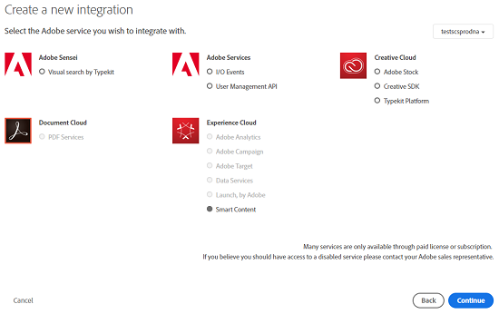

# Configurar a marcação de ativos usando o Serviço de conteúdo inteligente {#configure-asset-tagging-using-the-smart-content-service}

Saiba como configurar a marcação inteligente e a marcação inteligente aprimorada no AEM, usando o Serviço de conteúdo inteligente.

Você pode integrar o Adobe Experience Manager (AEM) ao Serviço de conteúdo inteligente. Use essa configuração para acessar o Serviço de conteúdo inteligente no AEM e marcar automaticamente suas imagens.

O artigo detalha as seguintes tarefas principais necessárias para configurar o Serviço de conteúdo inteligente. No back end, o servidor AEM autentica suas credenciais de serviço com o gateway de E/S da Adobe antes de encaminhar sua solicitação ao Serviço de conteúdo inteligente.

1. Crie uma configuração do Serviço de conteúdo inteligente no AEM para gerar uma chave pública. Obtenha um certificado público para integração OAuth.
1. Crie uma integração em E/S da Adobe e carregue a chave pública gerada.
1. Configure sua instância do AEM usando a chave da API e outras credenciais da E/S da Adobe.
1. Como opção, ative a marcação automática no upload de ativos.

## Pré-requisitos {#prerequisites}

Antes de usar o Serviço de conteúdo inteligente, verifique o seguinte para criar uma integração em E/S da Adobe:

* Uma conta da Adobe ID com privilégios de administrador para a organização.
* O serviço Smart Content Service está habilitado para sua organização.

Para habilitar Tags inteligentes aprimoradas, além do acima, instale também o service pack AEM mais recente.

## Obter certificado público {#obtain-public-certificate}

Um certificado público permite autenticar seu perfil em E/S da Adobe.

1. From the AEM user interface, tap the AEM logo, and go to **[!UICONTROL Tools]** > **[!UICONTROL Cloud Services]** > **[!UICONTROL Legacy Cloud Services]**.

1. Na página Serviços da nuvem, toque/clique em **[!UICONTROL Configurar agora]**, em **[!UICONTROL Tags inteligentes de ativos]**.
1. Na caixa de diálogo **[!UICONTROL Criar configuração]** , especifique um título e um nome para a configuração de Tags inteligentes. Toque/clique em **[!UICONTROL Criar]**.
1. Na caixa de diálogo Serviço **[!UICONTROL de conteúdo inteligente do]** AEM, use os seguintes valores:

   **[!UICONTROL URL do serviço]**: `https://mc.adobe.io/marketingcloud/smartcontent`

   **[!UICONTROL Servidor de autorização]**: `https://ims-na1.adobelogin.com`

   Deixe os outros campos em branco por enquanto (a ser fornecido posteriormente). Tap/click **[!UICONTROL OK]**.

   

   >[!NOTE]
   >
   >O URL fornecido como URL  de serviço não pode ser acessado pelo navegador e gera um erro 404. A configuração funciona bem com o mesmo valor do parâmetro de URL [!UICONTROL do] serviço. Para obter o status geral do serviço de E/S da Adobe e a programação de manutenção, consulte [https://status.adobe.com](https://status.adobe.com).

1. Toque/clique em **[!UICONTROL Baixar certificado público para integração]** OAuth e baixe o arquivo de certificado público `AEM-SmartTags.crt`.

   

## Criar integração de E/S da Adobe {#create-adobe-i-o-integration}

Para usar as APIs do Serviço de conteúdo inteligente, crie uma integração em E/S da Adobe para gerar a chave da API, a ID da conta técnica, a ID da organização e o segredo do cliente.

1. Acesse [https://console.adobe.io](https://console.adobe.io/).
1. Na página **[!UICONTROL Integrações]** , selecione sua organização.
1. Toque/clique em **[!UICONTROL Nova integração]**.
1. Na página **[!UICONTROL Criar uma nova integração]** , selecione **[!UICONTROL Acessar uma API]**. Toque/clique em **[!UICONTROL Continuar]**.
1. Em **[!UICONTROL Experience Cloud]**, selecione **[!UICONTROL Conteúdo inteligente]**. Toque/clique em **[!UICONTROL Continuar]**.

   

1. Na próxima página, selecione **[!UICONTROL Nova integração]**. Toque/clique em **[!UICONTROL Continuar]**.
1. Na página Detalhes **[!UICONTROL da]** integração, especifique um nome para o gateway de integração e adicione uma descrição.
1. Nos certificados **[!UICONTROL de chaves]** públicas, carregue `AEM-SmartTags.crt` o arquivo baixado acima.
1. Tap/click **[!UICONTROL Create Integration]**.
1. Para exibir as informações de integração, toque/clique em **[!UICONTROL Continuar para obter detalhes]** de integração.

   

## Configurar o Serviço de conteúdo inteligente {#configure-smart-content-service}

Para configurar a integração, use os valores dos campos ID da conta técnica, ID da organização, segredo do cliente, servidor de autorização e chave da API da integração de E/S da Adobe. A criação de uma configuração em nuvem de Tags inteligentes permite a autenticação de solicitações de API da instância do AEM.

1. Na interface do usuário do AEM, toque/clique no logotipo do AEM. Navegue até **[!UICONTROL Ferramentas > Serviço em nuvem > Serviços]** em nuvem herdados para abrir o console Serviços em nuvem.
1. Em Tags **[!UICONTROL inteligentes de]** ativos, abra a configuração criada acima. Na página de configurações do serviço, clique em **[!UICONTROL Editar]**.
1. Na caixa de diálogo **[!UICONTROL Serviço de conteúdo inteligente do AEM]**, use os valores pré-preenchidos nos campos **[!UICONTROL URL do serviço]** e **[!UICONTROL Servidor de autorização]**.
1. Nos campos Chave da API, ID da conta técnica, ID da organização e Segredo do cliente, use os valores gerados acima.

## Validar a configuração {#validate-the-configuration}

Depois de concluir a configuração, você pode usar um MBean JMX para validar a configuração. Para validar, siga estas etapas.

1. No AEM, para abrir o console do OSGi, clique em **[!UICONTROL Ferramentas > Operações > Console]** da Web. Clique em **[!UICONTROL Principal > JMX]**.
1. Clique em **[!UICONTROL com.day.cq.dam.similaritysearch.internal.impl]**. Ele abre **[!UICONTROL SemelhançaPesquisar diversas tarefas.]**
1. Clique em **[!UICONTROL validateConfigs()]**. Na caixa de diálogo **[!UICONTROL Validar configurações]** , clique em **[!UICONTROL Chamar]**.

   O resultado da validação é exibido na mesma caixa de diálogo.

## Habilitar marcação inteligente no fluxo de trabalho do Ativo de atualização do DAM (Opcional) {#enable-smart-tagging-in-the-update-asset-workflow-optional}

1. Na interface do usuário do AEM, toque/clique no logotipo do AEM e vá para **[!UICONTROL Ferramentas > Fluxo de trabalho > Modelos]**.
1. Na página **[!UICONTROL Modelos de fluxo de trabalho]**, selecione o modelo de fluxo de trabalho **[!UICONTROL Atualizar ativo do DAM]**.
1. Toque/clique em **[!UICONTROL Editar]** na barra de ferramentas.
1. Expanda o painel lateral para exibir as etapas. Arraste a etapa **[!UICONTROL Ativo de tag inteligente]** disponível na seção Fluxo de trabalho do DAM e coloque-a após a etapa **[!UICONTROL Processar miniaturas]**.

   

1. Abra a etapa no modo de edição. Em **[!UICONTROL Configurações avançadas]**, verifique se a opção **[!UICONTROL Avanço do manipulador]** está selecionada.

   

1. Na guia **[!UICONTROL Argumentos]**, selecione **[!UICONTROL Ignorar erros]** se desejar que o fluxo de trabalho seja concluído mesmo se a etapa de marcação automática falhar.

   

   Para marcar ativos quando eles forem carregados independentemente de a marcação inteligente estar ativada em pastas, selecione **[!UICONTROL Ignorar sinalizador]** de tag inteligente.

   

1. Toque/clique em **[!UICONTROL OK]** para fechar a etapa do processo e salve o fluxo de trabalho.

>[!MORELIKETHIS]
>
>* [Entender tags inteligentes nos ativos AEM](https://helpx.adobe.com/experience-manager/kt/assets/using/smart-tags-feature-video-understand.html)
>* [Usar tags inteligentes com ativos AEM](https://helpx.adobe.com/experience-manager/kt/assets/using/smart-tags-feature-video-use.html)
>* [Usar tags inteligentes aprimoradas com ativos AEM](https://helpx.adobe.com/experience-manager/kt/assets/using/enhanced-smart-tags-feature-video-use.html)
>* [Configurar tags inteligentes aprimoradas nos ativos AEM](https://helpx.adobe.com/experience-manager/kt/assets/using/enhanced-smart-tags-technical-video-setup.html)

