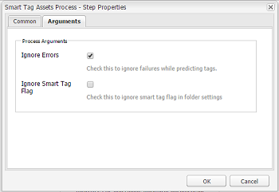

# Configurar a marcação de ativos usando o Serviço de conteúdo inteligente {#configure-asset-tagging-using-the-smart-content-service}

>[!CAUTION]
>
>AEM 6.4 chegou ao fim do suporte estendido e esta documentação não é mais atualizada. Para obter mais detalhes, consulte nossa [períodos de assistência técnica](https://helpx.adobe.com/br/support/programs/eol-matrix.html). Encontre as versões compatíveis [here](https://experienceleague.adobe.com/docs/).

É possível integrar [!DNL Adobe Experience Manager] com o Serviço de conteúdo inteligente usando [!DNL Adobe Developer Console]. Use essa configuração para acessar o Serviço de conteúdo inteligente de dentro de [!DNL Experience Manager].

>[!NOTE]
>
>* Os Serviços de conteúdo inteligente não estão mais disponíveis para novos [!DNL Experience Manager Assets] Clientes locais. Os clientes existentes no local, que já têm esse recurso ativado, podem continuar usando os Serviços de conteúdo inteligente.
>* Os Serviços de conteúdo inteligente estão disponíveis para [!DNL Experience Manager Assets] Clientes Managed Services que já tenham esse recurso ativado.
>* Novo [!DNL Experience Manager Assets] Os clientes do Managed Services podem seguir as instruções mencionadas neste artigo para configurar os Serviços de conteúdo inteligente.

O artigo detalha as seguintes tarefas principais que são necessárias para configurar o Serviço de conteúdo inteligente. No back-end, a variável [!DNL Experience Manager] O servidor autentica suas credenciais de serviço com o [!DNL Adobe Developer Console] gateway antes de encaminhar sua solicitação ao Serviço de conteúdo inteligente.

1. [Criar um serviço de conteúdo inteligente](#obtain-public-certificate) configuração em [!DNL Experience Manager] para gerar uma chave pública. [Obtenha um certificado público](#obtain-public-certificate) para a integração OAuth.

1. [Crie uma integração no Console do desenvolvedor](#create-adobe-i-o-integration) e faça upload da chave pública gerada.

1. [Configurar a implantação](#configure-smart-content-service) usando a chave da API e outras credenciais do [!DNL Adobe Developer Console].

1. [Teste a configuração](#validate-the-configuration).

1. Opcionalmente, [ativar a marcação automática no upload de ativos](#enable-smart-tagging-in-the-update-asset-workflow-optional).

## Pré-requisitos {#prerequisites}

Antes de usar o Serviço de conteúdo inteligente, verifique o seguinte para criar uma integração em [!DNL Adobe Developer Console]:

* Existência de uma Adobe ID com privilégios de administrador para a organização.

* O Serviço de conteúdo inteligente está habilitado para sua organização.

Para ativar as Tags inteligentes aprimoradas, além do acima, instale também as tags mais recentes [Pacote de serviço Experience Manager](https://helpx.adobe.com/br/experience-manager/aem-releases-updates.html).

## Criar configuração do Serviço de conteúdo inteligente para obter o certificado público {#obtain-public-certificate}

Um certificado público permite autenticar seu perfil no [!DNL Adobe Developer Console].

1. No [!DNL Experience Manager] interface do usuário, acesso **[!UICONTROL Ferramentas]** > **[!UICONTROL Cloud Services]** > **[!UICONTROL Cloud Services herdados]**.

1. Na página Cloud Services, clique em **[!UICONTROL Configurar agora]** under **[!UICONTROL Tags inteligentes de ativos]**.

1. No **[!UICONTROL Criar configuração]** , especifique um título e nome para a configuração de Tags inteligentes. Clique em **[!UICONTROL Criar]**.

1. No **[!UICONTROL Serviço de conteúdo inteligente AEM]** use os seguintes valores:

   **[!UICONTROL URL do serviço]**: `https://smartcontent.adobe.io/<region where your Experience Manager author instance is hosted>`

   Por exemplo, `https://smartcontent.adobe.io/apac`. Você pode especificar `na`, `emea`ou, `apac` como as regiões onde a instância do autor de Experience Manager está hospedada.

   >[!NOTE]
   >
   >Se o Experience Manager Managed Service for provisionado antes de 1° de setembro de 2022, use o seguinte URL de serviço:
   >`https://mc.adobe.io/marketingcloud/smartcontent`

   **[!UICONTROL Servidor de autorização]**: `https://ims-na1.adobelogin.com`

   Deixe os outros campos em branco por enquanto (a ser fornecido posteriormente). Clique em **[!UICONTROL OK]**.

   

   *Figura: Caixa de diálogo Serviço de conteúdo inteligente para fornecer URL de serviço de conteúdo*

   >[!NOTE]
   >
   >O URL fornecido como [!UICONTROL URL de serviço] não é acessível por meio do navegador e gera um erro 404. A configuração funciona bem com o mesmo valor da variável [!UICONTROL URL de serviço] parâmetro. Para obter o status geral do serviço e o cronograma de manutenção, consulte [https://status.adobe.com](https://status.adobe.com).

1. Clique em **[!UICONTROL Baixar certificado público para a integração OAuth]** e baixe o arquivo de certificado público `AEM-SmartTags.crt`.

   

   *Figura: Configurações do serviço de marcação inteligente*

### Reconfigure quando um certificado expirar {#certrenew}

Depois que um certificado expira, ele não é mais confiável. Não é possível renovar um certificado expirado. Para adicionar um novo certificado, siga estas etapas.

1. Faça logon na implantação do [!DNL Experience Manager] como administrador. Clique em **[!UICONTROL Ferramentas]** > **[!UICONTROL Segurança]** > **[!UICONTROL Usuários]**.

1. Localize o usuário **[!UICONTROL dam-update-service]** e clique nele. Clique em **[!UICONTROL Armazenamento de chaves]** guia .

1. Exclua o armazenamento de chaves **[!UICONTROL similaritysearch]** existente com o certificado expirado. Clique em **[!UICONTROL Salvar e fechar]**.

   

   *Figura: exclua a entrada `similaritysearch` existente no Armazenamento de chaves para adicionar um novo certificado de segurança.*

1. Navegue até **[!UICONTROL Ferramentas]** > **[!UICONTROL Serviços da nuvem]** > **[!UICONTROL Serviços da nuvem herdados]**. Clique em **[!UICONTROL Tags inteligentes de ativos]** > **[!UICONTROL Mostrar configuração]** > **[!UICONTROL Configurações disponíveis]**. Clique na configuração necessária.

1. Para baixar um certificado público, clique em **[!UICONTROL Baixar certificado público para a integração OAuth]**.

1. Acesso [https://console.adobe.io](https://console.adobe.io) e navegue até os Serviços de conteúdo inteligente existentes no **[!UICONTROL Integrações]** página. Faça upload do novo certificado. Para obter mais informações, consulte as instruções em [Criar integração com o Adobe Developer Console](#create-adobe-i-o-integration).

## Criar integração com o Adobe Developer Console {#create-adobe-i-o-integration}

Para usar APIs do Serviço de conteúdo inteligente, crie uma integração no Console do Adobe Developer para obter [!UICONTROL Chave da API] (gerado em [!UICONTROL ID DO CLIENTE] campo da integração do Adobe Developer Console), [!UICONTROL ID DA CONTA TÉCNICA], [!UICONTROL ID DA ORGANIZAÇÃO]e [!UICONTROL SEGREDO DO CLIENTE] para [!UICONTROL Configurações do serviço de marcação inteligente de ativos] da configuração da nuvem em [!DNL Experience Manager].

1. Acesse [https://console.adobe.io](https://console.adobe.io/) em um navegador. Selecione a conta e verifique se a organização associada tem a função de administrador do sistema.

1. Crie um projeto com o nome que quiser. Clique em **[!UICONTROL Adicionar API]**.

1. No **[!UICONTROL Adicionar uma API]** página, selecione **[!UICONTROL Experience Cloud]** e depois selecione **[!UICONTROL Conteúdo inteligente]**. Clique em **[!UICONTROL Avançar]**.

1. Selecione **[!UICONTROL Fazer upload da sua chave pública]**. Forneça o arquivo de certificado baixado do [!DNL Experience Manager]. Será exibida a mensagem [!UICONTROL Chave(s) pública(s) carregada(s) com êxito]. Clique em **[!UICONTROL Avançar]**.

   A página [!UICONTROL Criar uma nova credencial de conta de serviço (JWT)] exibe a chave pública da conta de serviço recém-configurada.

1. Clique em **[!UICONTROL Avançar]**.

1. Na página **[!UICONTROL Selecionar perfis de produtos]**, selecione **[!UICONTROL Serviços de conteúdo inteligente]**. Clique em **[!UICONTROL Salvar API configurada]**.

   Uma página exibe mais informações sobre a configuração. Mantenha esta página aberta para copiar e adicionar esses valores em [!UICONTROL Configurações do serviço de marcação inteligente de ativos] da configuração da nuvem em [!DNL Experience Manager] para configurar tags inteligentes.

   

   *Figura: Detalhes da integração no Console do Adobe Developer*

## Configurar o Serviço de Conteúdo Inteligente {#configure-smart-content-service}

Para configurar a integração, use os valores de [!UICONTROL ID DA CONTA TÉCNICA], [!UICONTROL ID DA ORGANIZAÇÃO], [!UICONTROL SEGREDO DO CLIENTE]e [!UICONTROL ID DO CLIENTE] da integração com o Adobe Developer Console. A criação de uma configuração de nuvem de Tags inteligentes permite a autenticação de solicitações de API do [!DNL Experience Manager] implantação.

1. Em [!DNL Experience Manager], navegue até **[!UICONTROL Ferramentas > Cloud Service > Cloud Services herdados]** para abrir o [!UICONTROL Cloud Services] console.

1. Em **[!UICONTROL Tags inteligentes de ativos]**, abra a configuração criada acima. Na página de configurações do serviço, clique em **[!UICONTROL Editar]**.

1. Na caixa de diálogo **[!UICONTROL Serviço de conteúdo inteligente do AEM]**, use os valores pré-preenchidos nos campos **[!UICONTROL URL do serviço]** e **[!UICONTROL Servidor de autorização]**.

1. Para os campos [!UICONTROL Chave Da Api], [!UICONTROL ID da conta técnica], [!UICONTROL ID da organização]e [!UICONTROL Segredo do cliente], copie e use os seguintes valores gerados em [Integração com o Adobe Developer Console](#create-adobe-i-o-integration).

   | [!UICONTROL Configurações do serviço de marcação inteligente de ativos] | [!DNL Adobe Developer Console] campos de integração |
   |--- |--- |
   | [!UICONTROL Chave da API] | [!UICONTROL ID DO CLIENTE] |
   | [!UICONTROL ID da conta técnica] | [!UICONTROL ID DA CONTA TÉCNICA] |
   | [!UICONTROL ID da organização] | [!UICONTROL ID DA ORGANIZAÇÃO] |
   | [!UICONTROL Client Secret] | [!UICONTROL SEGREDO DO CLIENTE] |

## Validar a configuração {#validate-the-configuration}

Após concluir a configuração, use um MBean JMX para validar a configuração. Para validar, siga estas etapas.

1. Acesse seu [!DNL Experience Manager] servidor em `https://[aem_server]:[port]`.

1. Ir para **[!UICONTROL Ferramentas > Operações > Console da Web]** para abrir o console OSGi. Clique em **[!UICONTROL Principal > JMX]**.

1. Clique em **[!UICONTROL com.day.cq.dam.similaritysearch.internal.impl]**. Ele abre **[!UICONTROL SemelhançaPesquisar diversas tarefas]**.

1. Clique em **[!UICONTROL validateConfigs()]**. No **[!UICONTROL Validar configurações]** , clique em **[!UICONTROL Invocar]**.

   Os resultados da validação são exibidos na mesma caixa de diálogo.

## Habilitar marcação inteligente no fluxo de trabalho Ativo de atualização DAM (opcional) {#enable-smart-tagging-in-the-update-asset-workflow-optional}

1. Em [!DNL Experience Manager], vá para **[!UICONTROL Ferramentas]** > **[!UICONTROL Fluxo de trabalho]** > **[!UICONTROL Modelos]**.

1. Na página **[!UICONTROL Modelos de fluxo de trabalho]**, selecione o modelo de fluxo de trabalho **[!UICONTROL Ativo de atualização DAM]**.

1. Clique em **[!UICONTROL Editar]** na barra de ferramentas.

1. Expanda o painel lateral para exibir as etapas. Arraste a etapa **[!UICONTROL Ativo de tag inteligente]** disponível na seção Fluxo de trabalho do DAM e coloque-a após a etapa **[!UICONTROL Processar miniaturas]**.

   

   *Figura: etapa para adicionar ativo de tag inteligente após a etapa de miniatura do processo no fluxo de trabalho Ativo de atualização DAM*

1. Abra a etapa no modo de edição. Em **[!UICONTROL Configurações avançadas]**, verifique se a opção **[!UICONTROL Avanço do manipulador]** está selecionada.

   

   *Figura: Configurar o fluxo de trabalho do Ativo de atualização do DAM e adicionar etapa de tag inteligente*

1. Na guia **[!UICONTROL Argumentos]**, selecione **[!UICONTROL Ignorar erros]** se desejar que o fluxo de trabalho seja concluído mesmo se a etapa de marcação automática falhar.

   

   *Figura: Configure o fluxo de trabalho Ativo de atualização do DAM para adicionar a etapa de tag inteligente e selecionar avanço do manipulador*

   Para marcar os ativos quando eles forem carregados independentemente de a marcação inteligente estar ativada nas pastas, selecione **[!UICONTROL Ignorar sinalizador de tag inteligente]**.

   

   *Figura: Configure o fluxo de trabalho Ativo de atualização do DAM para adicionar a etapa de tag inteligente e selecione ignorar sinalizador de tag inteligente*

1. Clique em **[!UICONTROL OK]** para fechar a etapa do processo e salve o fluxo de trabalho.

>[!MORELIKETHIS]
>
>* [Gerenciar tags inteligentes](managing-smart-tags.md)
>* [Visão geral e como treinar tags inteligentes](enhanced-smart-tags.md)
>* [Diretrizes e regras para treinar o Serviço de conteúdo inteligente](smart-tags-training-guidelines.md)

