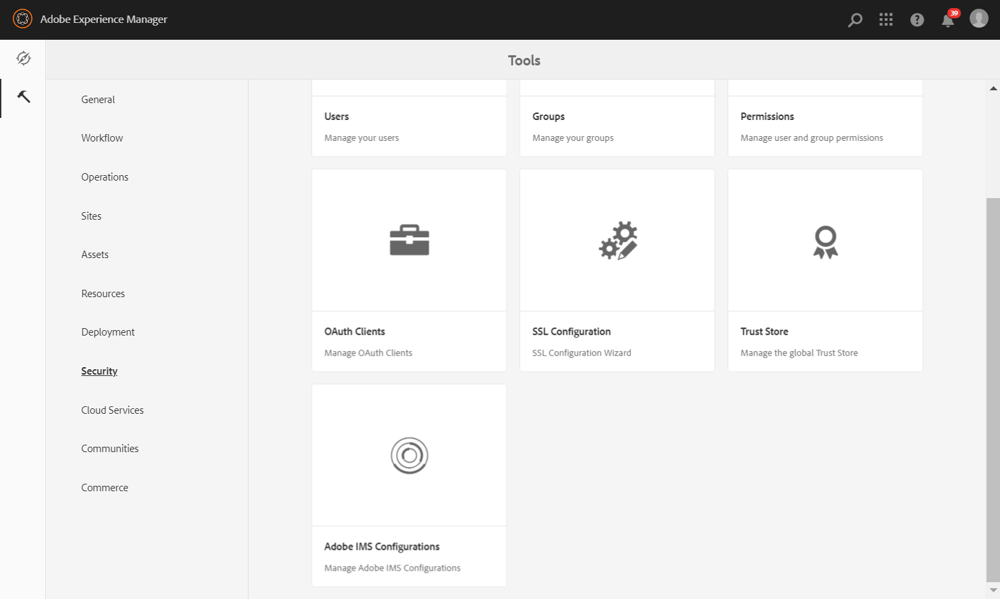
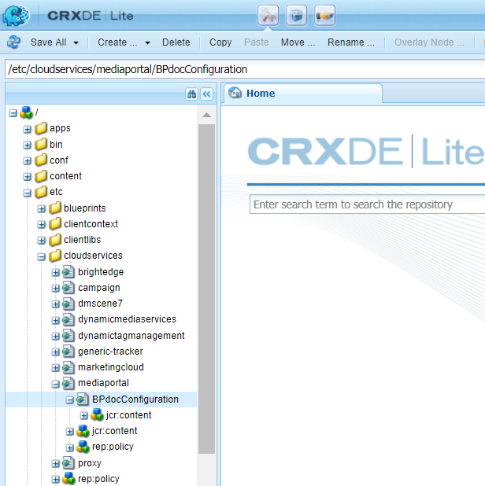

# Configurar o AEM Assets com o Brand Portal {#configure-integration-64}

O Adobe Experience Manager (AEM) Assets é configurado com o Brand Portal por meio do Adobe I/O, que obtém um token IMS para autorização do locatário do Brand Portal.

>[!NOTE]
>
>A configuração do AEM Assets com o Brand Portal via E/S do Adobe é suportada no AEM 6.4.8.0 e superior.
>
>Anteriormente, o Brand Portal estava configurado na interface clássica via Gateway OAuth herdado, que usa a troca de token JWT para obter um Token de acesso IMS para autorização.

>[!TIP]
>
>***Somente para clientes existentes***
>
>É recomendável continuar usando a configuração existente do gateway OAuth. Caso tenha problemas com a configuração herdada do OAuth Gateway, exclua a configuração existente e crie uma nova configuração via E/S do Adobe.

Esta ajuda descreve os dois casos de uso a seguir:

* [Nova configuração](#configure-new-integration-64): Se você for um novo usuário do Brand Portal e quiser configurar sua instância de autor do AEM Assets com o Brand Portal, poderá criar uma nova configuração na E/S do Adobe.
* [Configuração](#upgrade-integration-64)de atualização: Se você for um usuário do Brand Portal com sua instância do autor AEM Assets configurada com o Brand Portal no gateway OAuth herdado, é recomendável excluir as configurações existentes e criar uma nova configuração na E/S do Adobe.

As informações fornecidas baseiam-se no pressuposto de que qualquer pessoa que leia esta Ajuda está familiarizada com as seguintes tecnologias:

* Instalação, configuração e administração de pacotes Adobe Experience Manager e AEM

* Usando sistemas operacionais Linux e Microsoft Windows

## Pré-requisitos {#prerequisites}

Você precisa do seguinte para configurar o AEM Assets com o Brand Portal:

* Uma instância do autor do AEM Assets ativa e em execução com o Service Pack mais recente.
* URL do locatário do Brand Portal.
* Um usuário com privilégios de administrador do sistema na organização IMS do locatário do Brand Portal.

[Baixe e instale o AEM 6.4](#aemquickstart)

[Baixe e instale o AEM Service Pack mais recente](#servicepack)

### Baixe e instale o AEM 6.4 {#aemquickstart}

É recomendável ter AEM 6.4 para configurar uma instância do autor AEM. Se você não tiver AEM funcionando, baixe-o dos seguintes locais:

* Se você já for um cliente AEM, baixe o AEM 6.4 do site [de licenciamento do](http://licensing.adobe.com)Adobe.

* Se você for um parceiro de Adobe, use o Programa [de treinamento de parceiro de](https://adobe.allegiancetech.com/cgi-bin/qwebcorporate.dll?idx=82357Q) Adobe para solicitar AEM 6.4.

Depois de baixar o AEM, para obter instruções sobre como configurar uma instância AEM do autor, consulte [implantação e manutenção](https://helpx.adobe.com/experience-manager/6-4/sites/deploying/using/deploy.html#defaultlocalinstall).

### Baixe e instale AEM Service Pack mais recente {#servicepack}

Para obter instruções detalhadas, consulte

* [Notas de versão do AEM 6.4 Service Pack ](https://helpx.adobe.com/experience-manager/6-4/release-notes/sp-release-notes.html)

**Entre em contato com o Atendimento** ao cliente se não conseguir encontrar o pacote AEM ou o Service Pack mais recente.

## Criar configuração {#configure-new-integration-64}

Execute as seguintes etapas na sequência listada se você estiver configurando o AEM Assets com o Brand Portal pela primeira vez:

1. [Obter certificado público](#public-certificate)
1. [Criar integração do Adobe I/O](#createnewintegration)
1. [Criar configuração de conta IMS](#create-ims-account-configuration)
1. [Configurar o serviço em nuvem](#configure-the-cloud-service)
1. [Testar configuração](#test-integration)

>[!NOTE]
>
>Uma instância do autor da AEM Assets só deve ser configurada com um locatário do Brand Portal.

### Criar configuração IMS {#create-ims-configuration}

A configuração IMS autentica seu locatário do Brand Portal com a instância do autor do AEM Assets.

A configuração IMS inclui duas etapas:

* [Obter certificado público](#public-certificate)
* [Criar configuração de conta IMS](#create-ims-account-configuration)

### Obter certificado público {#public-certificate}

O certificado público permite autenticar seu perfil no Adobe I/O.

1. Faça logon na instância do autor do AEM AssetsURL padrão: http:// localhost:4502/aem/start.html
1. No painel **Ferramentas** , navegue até **[!UICONTROL Segurança]** >> **[!UICONTROL Configurações do Adobe IMS]**.

   

1. A página Configurações do Adobe IMS é aberta.

   Clique em **[!UICONTROL Criar]**.

   Isso o levará à página **[!UICONTROL Configuração técnica de conta do Adobe IMS]**.

1. Por padrão, a guia **Certificado** é aberta.

   Em **Solução da nuvem**, selecione **[!UICONTROL Adobe Brand Portal]**.

1. Marque a caixa de seleção **[!UICONTROL Criar novo certificado]** e especifique um **alias** para o certificado. O alias atua como nome da caixa de diálogo.

1. Clique em **[!UICONTROL Criar certificado]**. Uma caixa de diálogo é exibida. Clique em **[!UICONTROL OK]** para gerar o certificado público.

   

1. Clique em **[!UICONTROL Baixar chave pública]** e salve o arquivo de certificado *AEM-Adobe-IMS.crt* no computador. O arquivo de certificado é usado para [criar a integração do Adobe I/O](#createnewintegration).

   

1. Clique em **[!UICONTROL Avançar]**.

   Na guia **Conta**, crie a conta do Adobe IMS, mas para isso você precisará dos detalhes de integração. Mantenha esta página aberta por enquanto.

   Open a new tab and [Create Adobe I/O integration](#createnewintegration) to get the integration details for IMS Account configurations.

### Criar integração do Adobe I/O {#createnewintegration}

A integração do Adobe I/O gera a chave da API, o segredo do cliente e a carga (JWT), que são necessários para configurar as configurações da conta do IMS.

1. Faça logon no Console do Adobe I/O com privilégios de administrador de sistema na organização IMS do locatário do Brand Portal.

   URL padrão: [https://console.adobe.io/](https://console.adobe.io/)

1. Clique em **[!UICONTROL Criar integração]**.

1. Selecione **[!UICONTROL Acessar uma API]** e clique em **[!UICONTROL Continuar]**.

   

1. Uma nova página de integração é exibida.

   Selecione sua organização na lista suspensa.

   Em **[!UICONTROL Experience Cloud]**, selecione **[!UICONTROL AEM Brand Portal]** e clique em **[!UICONTROL Continuar]**.

   Se a opção Brand Portal estiver desativada para você, verifique se selecionou a organização correta na caixa suspensa acima da opção **[!UICONTROL Serviços da Adobe]**. Se não souber sua organização, entre em contato com o administrador.

   

1. Especifique um nome e uma descrição para a integração. Clique em **[!UICONTROL Selecionar um arquivo do seu computador]** e faça upload do arquivo `AEM-Adobe-IMS.crt` baixado na seção [obter certificados públicos](#public-certificate).

1. Selecione o perfil da organização.

   Ou selecione o **[!UICONTROL Assets Brand Portal]** e clique em **[!UICONTROL Criar integração]**. A integração é criada.

1. Clique em **[!UICONTROL Continuar para obter detalhes de integração]** para visualizar as informações de integração.

   Copie a **[!UICONTROL chave da API]**

   Clique em **[!UICONTROL Recuperar segredo do cliente]** e copie a chave Segredo do cliente.

   

1. Navegue até a guia **[!UICONTROL JWT]** e copie a carga **[!UICONTROL JWT]**.

   As informações da chave da API, da chave Segredo do cliente e da carga JWT serão usadas para criar a configuração da conta do IMS.

### Criar configuração de conta IMS {#create-ims-account-configuration}

Verifique se você executou as seguintes etapas:

* [Obter certificado público](#public-certificate)
* [Criar integração do Adobe I/O](#createnewintegration)

**Etapas para criar a configuração da conta IMS:**

1. Abra a página Configuração IMS, guia **[!UICONTROL Contas]**. Você manteve a página aberta no final da seção, [Obter certificado público](#public-certificate).

1. Especifique um **[!UICONTROL Título]** para a conta IMS.

   No **[!UICONTROL Servidor de autorização]**, insira o URL: [https://ims-na1.adobelogin.com/](https://ims-na1.adobelogin.com/)

   Cole a chave da API, o segredo do cliente e a carga JWT copiados no final da integração [Criar Adobe I/O](#createnewintegration).

   Clique em **[!UICONTROL Criar]**.

   A integração é criada.

   

1. Selecione a configuração IMS e clique em **[!UICONTROL Verificar integridade]**. Uma caixa de diálogo é exibida.

   Clique em **[!UICONTROL Verificar]**. Ao se conectar com êxito, a mensagem *Token recuperado com êxito* é exibida.

   

>[!CAUTION]
>
>Você deve ter apenas uma configuração IMS. Não crie várias configurações IMS.
>
>A configuração IMS deve ser aprovada na verificação de integridade. Se a configuração não for aprovada na verificação de integridade, ela será inválida. Você deve excluí-la e criar uma configuração nova e válida.

### Configurar o serviço em nuvem {#configure-the-cloud-service}

Execute as seguintes etapas para criar a configuração do serviço em nuvem do Brand Portal:

1. Faça logon na sua instância do autor do AEM Assets

   URL padrão: http:// localhost:4502/aem/start.html
1. No painel **Ferramentas** , navegue até **[!UICONTROL Cloud Services > AEM Brand Portal]**.

   A página Configurações do Brand Portal é aberta.

1. Clique em **[!UICONTROL Criar]**.

1. Especifique um **[!UICONTROL Título]** para a configuração.

   Selecione a Configuração IMS criada na etapa e [crie a configuração da conta IMS](#create-ims-account-configuration).

   No **[!UICONTROL URL de serviço]**, insira o URL do locatário do Brand Portal.

   

1. Clique em **[!UICONTROL Salvar e fechar]**. A configuração da nuvem é criada. Sua instância do autor do AEM Assets agora está integrada ao locatário do Brand Portal.

### Testar configuração{#test-integration}

1. Faça logon na sua instância do autor do AEM Assets

   URL padrão: http:// localhost:4502/aem/start.html

1. From **Tools**  panel, navigate to **[!UICONTROL Deployment >> Replication]**.

   

1. A página Replicação é aberta.

   Clique em **[!UICONTROL Agentes no autor]**.

   

1. Quatro agentes de replicação são criados para cada locatário.

   Localize os agentes de replicação do seu locatário do Brand Portal.

   Clique no URL do agente de replicação.

   

   >[!NOTE]
   >
   >Os agentes de replicação trabalham em paralelo e compartilham a distribuição de tarefas igualmente, aumentando assim a velocidade de publicação em quatro vezes a velocidade original. Depois que o serviço de nuvem é configurado, não é necessária uma configuração adicional para habilitar os agentes de replicação que são ativados por padrão para habilitar a publicação paralela de vários ativos.

1. To verify the connection between AEM Assets author and Brand Portal, click **[!UICONTROL Test Connection]**.

   

1. Examine a parte inferior dos resultados do teste para verificar se a replicação foi bem-sucedida.

   

1. Verifique os resultados do teste em todos os quatro agentes de replicação um por um.

   >[!NOTE]
   >
   >Evite desativar qualquer um dos agentes de replicação, pois isso pode causar falha na replicação de alguns ativos.
   >
   >Verifique se todos os quatro agentes de replicação estão configurados para evitar o erro de tempo limite. See [troubleshoot issues in parallel publishing to Brand Portal](https://docs.adobe.com/content/help/en/experience-manager-brand-portal/using/publish/troubleshoot-parallel-publishing.html#connection-timeout).

O Brand Portal foi configurado com êxito com sua instância do autor do AEM Assets. Agora você pode:

* [Publicar ativos do AEM Assets no Brand Portal](../assets/brand-portal-publish-assets.md)
* [Publicar pastas do AEM Assets no Brand Portal](../assets/brand-portal-publish-folder.md)
* [Publicar coleções do AEM Assets no Brand Portal](../assets/brand-portal-publish-collection.md)
* [Configure a Fonte](https://docs.adobe.com/content/help/en/experience-manager-brand-portal/using/asset-sourcing-in-brand-portal/brand-portal-asset-sourcing.html) de ativos, permitindo que os usuários do Brand Portal contribuam e publiquem ativos na AEM Assets.

## Atualizar configuração {#upgrade-integration-64}

Execute as seguintes etapas na sequência listada para atualizar as configurações existentes:
1. [Verificar trabalhos em execução](#verify-jobs)
1. [Excluir configurações existentes](#delete-existing-configuration)
1. [Criar configuração](#configure-new-integration-64)

### Verificar trabalhos em execução {#verify-jobs}

Certifique-se de que nenhum trabalho de publicação esteja em execução na sua instância do autor do AEM Assets antes de fazer qualquer modificação. Para isso, você pode verificar todos os quatro agentes de replicação e garantir que a fila seja ideal/vazia.

1. Faça logon na sua instância do autor do AEM Assets

   URL padrão: http:// localhost:4502/aem/start.html

1. From **Tools**  panel, navigate to **[!UICONTROL Deployment >> Replication]**.

1. A página Replicação é aberta.

   Clique em **[!UICONTROL Agentes no autor]**.

   

1. Localize os agentes de replicação do seu locatário do Brand Portal.

   Certifique-se de que a **Fila esteja inativa** para todos os agentes de replicação; nenhum trabalho de publicação está ativo.

   

### Excluir configurações existentes {#delete-existing-configuration}

Você deve executar a seguinte lista de verificação ao excluir a configuração existente.
* Excluir todos os quatro agentes de replicação
* Excluir serviço em nuvem
* Excluir usuário MAC

Execute as seguintes etapas para excluir a configuração existente:

1. Faça logon na instância do autor do AEM Assets e abra o CRX Lite como administrador.

   URL padrão: http:// localhost:4502/crx/de/index.jsp

1. Navegue até `/etc/replications/agents.author` e exclua todos os quatro agentes de replicação do seu locatário do Brand Portal.

   

1. Navegue até `/etc/cloudservices/mediaportal` e exclua a configuração **do** Cloud Service.

   

1. Navegue até `/home/users/mac` e exclua o usuário **** MAC do seu locatário do Brand Portal.

   

Agora você pode [criar a configuração](#configure-new-integration-64) na sua instância do autor AEM 6.4 em E/S Adobe.

<!--
   Comment Type: draft

   <li> </li>
   -->

<!--
   Comment Type: draft

   <li>Step text</li>
   -->

Depois que a replicação for bem-sucedida, você poderá publicar ativos, pastas e coleções no Brand Portal. Para obter detalhes, consulte:

* [Publicar ativos no Brand Portal](brand-portal-publish-assets.md)
* [Publicar ativos e pastas no Brand Portal](brand-portal-publish-folder.md)
* [Publicar coleções no portal de marcas](brand-portal-publish-collection.md)
