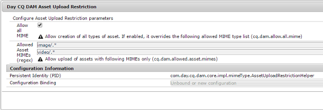

# Configurar restrições de upload de ativos {#configuring-asset-upload-restrictions}

>[!CAUTION]
>
>AEM 6.4 chegou ao fim do suporte estendido e esta documentação não é mais atualizada. Para obter mais detalhes, consulte nossa [períodos de assistência técnica](https://helpx.adobe.com/br/support/programs/eol-matrix.html). Encontre as versões compatíveis [here](https://experienceleague.adobe.com/docs/).

Você pode configurar o Adobe Experience Manager Assets para restringir o tipo de ativos (arquivos) que os usuários podem fazer upload. Esse recurso ajuda a eliminar a possibilidade de usuários fazerem upload de ativos em um formato indesejado ou fazerem upload de arquivos mal-intencionados. O `Day CQ DAM Asset Upload Restriction` permite controlar o tipo de arquivos que os usuários podem fazer upload. Por padrão, [!DNL Experience Manager] Os ativos permitem que os usuários façam upload de ativos de todos os tipos MIME. No entanto, você pode configurar o serviço para restringir usuários a fazerem upload de arquivos apenas de tipos MIME específicos.

1. Para abrir o console da Web do Configuration Manager, acesse `https://[AEM_server]:[port]/system/console/configMgr`.
1. Abra o **[!UICONTROL Restrição de upload de ativo do DAM CQ do dia]** no modo de Edição. Por padrão, a variável **Permitir todos os MIME** está selecionada, permitindo que os usuários façam upload de arquivos de todos os tipos MIME.

   

1. Para impedir que usuários façam upload de arquivos apenas de determinados tipos MIME, desmarque a opção **[!UICONTROL Permitir todos os tipos MIME]** e especifique os tipos MIME permitidos nos campos **[!UICONTROL MIMEs de ativos permitidos (regex)]** usando expressões regulares.

   

1. Clique/toque em **[!UICONTROL Salvar]** para salvar as alterações. Se você especificar cadeias de caracteres MIME para os tipos MIME permitidos, a operação de upload falhará todos os ativos de tipo MIME que não correspondam às cadeias de caracteres MIME configuradas nesses campos.
