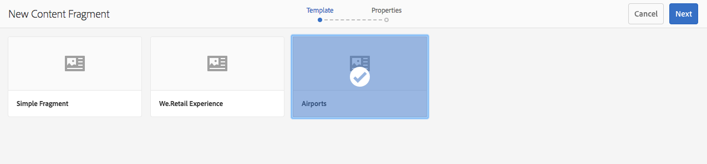

# Gerenciamento dos fragmentos de conteúdo {#managing-content-fragments}

>[!CAUTION]
>
>Algumas funcionalidades do Fragmento de conteúdo exigem a aplicação de [AEM 6.4 Service Pack 2 (6.4.2.0) ou posterior](/help/release-notes/sp-release-notes.md).

Os Fragmentos de conteúdo são armazenados como **[!UICONTROL Ativos]**, portanto, são gerenciados principalmente do console **[!UICONTROL Ativos]**.

>[!NOTE]
>
>Fragmentos de conteúdo são usados com páginas de criação; consulte [Criação de página com fragmentos de conteúdo](/help/sites-authoring/content-fragments.md).

## Criação de fragmentos de conteúdo {#creating-content-fragments}

### Criando um Modelo de Conteúdo {#creating-a-content-model}

[A ](content-fragments-models.md) modelagem de fragmentos de conteúdo deve ser ativada e criada antes da criação de fragmentos de conteúdo com conteúdo estruturado.

>[!NOTE]
>
>Consulte [Desenvolvimento de fragmentos de conteúdo](/help/sites-developing/customizing-content-fragments.md) para obter mais informações sobre modelos; usado para fragmentos de conteúdo simples.

### Criação de um fragmento de conteúdo {#creating-a-content-fragment}

O método de criação de um fragmento de conteúdo é (basicamente) o mesmo para fragmentos simples e estruturados:

1. Navegue até a pasta **[!UICONTROL Ativos]** na qual deseja criar o fragmento.
1. Selecione **[!UICONTROL Criar]** e **[!UICONTROL Fragmento de conteúdo]** para abrir o assistente.
1. A primeira etapa do assistente requer que você especifique a base do novo fragmento.

   * Isso pode ser:

      * [Modelo](/help/sites-developing/content-fragment-templates.md)  - por exemplo, Fragmento  **[!UICONTROL simples]**
      * [Modelo](content-fragments-models.md)  - usado para criar um fragmento que requer conteúdo estruturado; por exemplo, o  **** Airportmodel
   * Todos os modelos e modelos disponíveis são exibidos.

   Após a seleção, use **[!UICONTROL Próximo]** para continuar.

   

1. Na etapa **[!UICONTROL Propriedades]**, especifique:

   * **[!UICONTROL Básico]**

      * **[!UICONTROL Título]**

         O título do fragmento.

         Obrigatório.

      * **[!UICONTROL Descrição]**
      * **[!UICONTROL Tags]**
   * **[!UICONTROL Avançado]**

      * **[!UICONTROL Nome]**

         O nome; será usada para formar o URL.

         Obrigatório; serão derivadas automaticamente do título, mas poderão ser atualizadas.

1. Selecione **[!UICONTROL Criar]** para concluir a ação e, em seguida, **[!UICONTROL Abra]** o fragmento para editar ou retorne ao console com **[!UICONTROL Concluído]**.

## Ações para um fragmento de conteúdo {#actions-for-a-content-fragment}

No console **[!UICONTROL Assets]**, várias ações estão disponíveis para seus fragmentos de conteúdo:

* Na barra de ferramentas; após a seleção do fragmento, todas as ações apropriadas estarão disponíveis.
* Como [ações rápidas](/help/sites-authoring/basic-handling.md#quick-actions); um subconjunto de ações disponível para os cartões de fragmento individuais.

Selecione o fragmento para revelar a barra de ferramentas com as ações aplicáveis:

* **[!UICONTROL Download]**

   * Salve o fragmento como um arquivo ZIP; você pode definir se deseja incluir Elementos, Variações, Metadados.

* **[!UICONTROL Criar]**
* **[!UICONTROL Check-out]**
* **[!UICONTROL Propriedades]**

   * Permite que você visualização e/ou edite os metadados do fragmento.

* **[!UICONTROL Editar]**

   * Permite [abrir o fragmento para editar conteúdo](content-fragments-variations.md) juntamente com seus elementos, variações, conteúdo associado e metadados.

* **[!UICONTROL Gerenciar tags]**
* **[!UICONTROL Para a coleção]**

   * Adicione o fragmento a uma coleção.
   * Isso também pode ser feito quando [associar uma coleção ao fragmento](content-fragments-assoc-content.md#adding-associated-content).

* **[!UICONTROL Copiar/colar]**
* **[!UICONTROL Mover]**
* **[!UICONTROL Publicação rápida]**
* **[!UICONTROL Gerenciar publicação]**
* **[!UICONTROL Excluir]**

>[!NOTE]
>
>Muitas dessas ações são [ações padrão para Assets](managing-assets-touch-ui.md) e/ou [aplicativo desktop](https://helpx.adobe.com/experience-manager/desktop-app/aem-desktop-app.html).

## Abrir o Editor de fragmentos {#opening-the-fragment-editor}

Para abrir o fragmento para edição:

>[!CAUTION]
>
>Para editar um fragmento de conteúdo, você precisa [das permissões apropriadas](/help/sites-developing/customizing-content-fragments.md#asset-permissions). Entre em contato com o administrador do sistema se tiver problemas.

1. Use o console **[!UICONTROL Assets]** para navegar até o local do fragmento do conteúdo.
1. Abra o fragmento para edição ao:

   * Clicar/tocar no fragmento ou link do fragmento (isso depende da visualização do console).
   * Selecionando o fragmento, em seguida, **[!UICONTROL Editar]** na barra de ferramentas.

   O editor de fragmentos abrirá:

   

   >[!NOTE]
   >
   >1. Uma mensagem será exibida quando o fragmento já estiver referenciado em uma página de conteúdo.
      >
      >
   2. O painel lateral pode ser oculto/exibido usando o ícone **[!UICONTROL Alternar painel lateral]**.

1. Navegue pelos três modos usando os ícones no painel lateral:

   * Variações: [Editar o conteúdo](#editing-the-content-of-your-fragment) e [Gerenciar suas variações](#creating-and-managing-variations-within-your-fragment)
   * [Anotações](content-fragments-variations.md#annotating-a-content-fragment)
   * [Conteúdo associado](#associating-content-with-your-fragment)
   * [Metadados](#viewing-and-editing-the-metadata-properties-of-your-fragment)

   

1. Depois de fazer as alterações, use **[!UICONTROL Save]** ou **[!UICONTROL Cancel]** conforme necessário.

   >[!NOTE]
   >
   >Tanto **[!UICONTROL Salvar]** quanto **[!UICONTROL Cancelar]** sairão do editor - consulte [Salvar, cancelar e versões](#save-cancel-and-versions) para obter informações completas sobre como ambas as opções operam para fragmentos de conteúdo.

## Salvar, Cancelar e Versões {#save-cancel-and-versions}

>[!NOTE]
>
>As versões também podem ser [criadas, comparadas e revertidas da Linha do tempo](https://helpx.adobe.com/experience-manager/6-3/assets/using/content-fragments-managing.html#timeline-for-content-fragments).

O editor tem duas opções:

* **[!UICONTROL Salvar]**

   Salva as alterações mais recentes e saia do editor.

   >[!CAUTION]
   >
   >Para editar um fragmento de conteúdo, você precisa [das permissões apropriadas](/help/sites-developing/customizing-content-fragments.md#asset-permissions). Entre em contato com o administrador do sistema se tiver problemas.

   >[!NOTE]
   >
   >É possível permanecer no editor, fazendo uma série de alterações, antes de selecionar **[!UICONTROL Salvar]**.

   >[!CAUTION]
   >
   >Além de simplesmente salvar suas alterações, **[!UICONTROL Salvar]** também atualiza quaisquer referências e garante que o dispatcher seja liberado conforme necessário. Essas mudanças podem levar tempo para serem processadas. Devido a isso, pode haver um impacto no desempenho em um sistema grande/complexo/com carga intensa.
   >
   >
   >Lembre-se disso ao usar **[!UICONTROL Salvar]** e, em seguida, reinserir rapidamente o editor de fragmentos para fazer e salvar outras alterações.

* **[!UICONTROL Cancelar]**

   Sairá do editor sem salvar as alterações mais recentes.

Durante a edição do fragmento do conteúdo, AEM cria automaticamente versões para garantir que o conteúdo anterior possa ser restaurado se você **[!UICONTROL Cancelar]** suas alterações:

1. Quando um fragmento de conteúdo é aberto para edição AEM verifica a existência do token baseado em cookies que indica se existe uma *sessão de edição*:

   1. Se o token for encontrado, o fragmento será considerado parte da sessão de edição existente.
   1. Se o token *não* estiver disponível e o usuário start a edição de conteúdo, uma versão será criada e um token para esta nova sessão de edição será enviado para o cliente, onde será salvo em um cookie.

1. Embora haja uma sessão de edição *ativa*, o conteúdo que está sendo editado é salvo automaticamente a cada 600 segundos (padrão).

   >[!NOTE]
   >
   >O intervalo de salvamento automático é configurável usando o mecanismo `/conf`.
   >
   >Valor padrão, consulte:
   >
   >`/libs/settings/dam/cfm/jcr:content/autoSaveInterval`

1. Se o usuário selecionar **[!UICONTROL Cancelar]** a edição, a versão criada no start da sessão de edição será restaurada e o token será removido para encerrar a sessão de edição.
1. Se o usuário selecionar **[!UICONTROL Salvar]** para as edições, os elementos/variações atualizados serão mantidos e o token será removido para encerrar a sessão de edição.

## Editar o conteúdo do fragmento {#editing-the-content-of-your-fragment}

Depois de abrir o fragmento, use a guia [Variações](content-fragments-variations.md) para criar o conteúdo.

## Criação e gerenciamento de variações no seu fragmento {#creating-and-managing-variations-within-your-fragment}

Depois de criar o conteúdo Principal, você pode criar e gerenciar [Variações](content-fragments-variations.md) desse conteúdo.

## Associar conteúdo ao fragmento {#associating-content-with-your-fragment}

Você também pode [associar conteúdo](content-fragments-assoc-content.md) a um fragmento. Isso fornece uma conexão para que os ativos (ou seja, imagens) possam ser usados (opcionalmente) com o fragmento quando ele for adicionado a uma página de conteúdo.

## Visualização e edição dos metadados (Propriedades) do fragmento {#viewing-and-editing-the-metadata-properties-of-your-fragment}

É possível visualização e editar as propriedades de um fragmento usando a guia [[!UICONTROL Metadados]](content-fragments-metadata.md).

## Linha do tempo para fragmentos de conteúdo {#timeline-for-content-fragments}

Além das opções padrão, [Linha do tempo](managing-assets-touch-ui.md#timeline) fornece informações e ações específicas para fragmentos de conteúdo:

* Informações de visualização sobre versões, comentários e anotações
* Ações para versões

   * **[[!UICONTROL Reverter para esta versão]](#reverting-to-a-version)**  (selecione um fragmento existente e, em seguida, uma versão específica)
   * **[[!UICONTROL Comparar com Atual]](#comparing-fragment-versions)**  (selecione um fragmento existente e, em seguida, uma versão específica)
   * Adicionar um **[!UICONTROL Rótulo]** e/ou **[!UICONTROL Comentário]** (selecione um fragmento existente e, em seguida, uma versão específica)
   * **[!UICONTROL Salvar como versão]**  (selecione um fragmento existente e, em seguida, a seta para cima na parte inferior da Linha do tempo)

* Ações para anotações

   * **[!UICONTROL Excluir]**

>[!NOTE]
>
>Os comentários são:
>
>* Funcionalidade padrão para todos os ativos
>* Feito na Linha do tempo
>* Relacionado ao ativo de fragmento

>
>
As anotações (para Fragmentos de conteúdo) são:
>
>* Inserido no editor de fragmentos
>* Específico para um segmento selecionado de texto dentro do fragmento

Por exemplo:

## Comparação de versões de fragmento {#comparing-fragment-versions}

A ação **[!UICONTROL Comparar com Atual]** está disponível na [[!UICONTROL Linha do tempo]](https://helpx.adobe.com/experience-manager/6-3/assets/using/content-fragments-managing.html#timeline-for-content-fragments) depois de ter selecionado uma versão específica.

Isso abrirá:

* a versão **[!UICONTROL Atual]** (mais recente) (esquerda)

* a versão selecionada **v&lt;*x.y*>** (direita)

Elas serão mostradas lado a lado, onde:

* Quaisquer diferenças são destacadas

   * Texto excluído - vermelho
   * Texto inserido - verde
   * Texto substituído - azul

* O ícone de tela cheia permite que você abra qualquer versão por conta própria; em seguida, alterne de volta para a visualização paralela
* Você pode **[!UICONTROL Reverter]** para a versão específica
* **[!UICONTROL O]** Dono retornará ao console

>[!NOTE]
>
>Não é possível editar o conteúdo do fragmento ao comparar fragmentos.

## Reverter para uma versão {#reverting-to-a-version}

É possível reverter para uma versão específica do fragmento:

* Diretamente da [[!UICONTROL Linha do tempo]](content-fragments-managing.md#timeline-for-content-fragments).

   Selecione a versão necessária e a ação **[!UICONTROL Reverter para esta versão]**.

* Enquanto [compara uma versão à versão atual](content-fragments-managing.md#comparing-fragment-versions) você pode **[!UICONTROL Reverter]** para a versão selecionada.

## Publicar e fazer referência a um fragmento {#publishing-and-referencing-a-fragment}

>[!CAUTION]
>
>Se o fragmento for baseado em um modelo, verifique se o modelo [foi publicado](content-fragments-models.md#publishing-a-content-fragment-model).
>
>Se você publicar um fragmento de conteúdo para o qual o modelo ainda não foi publicado, uma lista de seleção indicará isso e o modelo será publicado com o fragmento.

Fragmentos de conteúdo devem ser publicados para uso no ambiente de publicação. Podem ser publicados:

* Após a criação; no console **[!UICONTROL Assets]**.
* Quando você [publica uma página que usa o fragmento](/help/sites-authoring/content-fragments.md#publishing); o fragmento será listado nas referências de página.

>[!CAUTION]
>
>Depois que um fragmento é publicado e/ou referenciado, AEM exibirá um aviso quando um autor abrir o fragmento para edição novamente. Isso serve para avisar que as alterações no fragmento também afetarão as páginas referenciadas.

## Excluindo um fragmento {#deleting-a-fragment}

Para excluir um fragmento:

1. No console **[!UICONTROL Assets]**, navegue até o local do fragmento de conteúdo.
1. Selecione o fragmento.

   >[!NOTE]
   >
   >A ação **[!UICONTROL Delete]** não está disponível como uma ação rápida.

1. Selecione **[!UICONTROL Excluir]** na barra de ferramentas.
1. Confirme a ação **[!UICONTROL Delete]**.

   >[!CAUTION]
   >
   >Se o fragmento já estiver referenciado em uma página, você verá uma mensagem de aviso e será solicitado a confirmar se deseja continuar com uma **[!UICONTROL Exclusão forçada]**. O fragmento, junto com seu componente do fragmento de conteúdo, será excluído de qualquer página de conteúdo.

