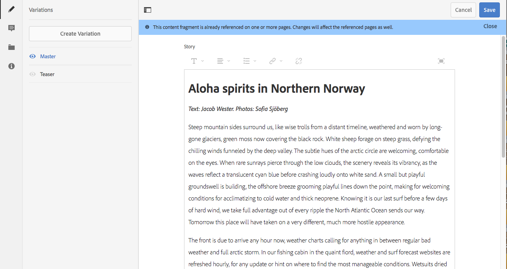

# Gerenciamento dos fragmentos de conteúdo {#managing-content-fragments}

>[!CAUTION]
>
>Algumas funcionalidades do Fragmento de conteúdo exigem a aplicação de [AEM 6.4 Service Pack 2 (6.4.2.0) ou posterior](/help/release-notes/sp-release-notes.md).

Fragmentos de conteúdo são armazenados como **[!UICONTROL Ativos]**, portanto, são gerenciadas principalmente na variável **[!UICONTROL Ativos]** console.

>[!NOTE]
>
>Fragmentos de conteúdo são usados com páginas de criação; see [Criação de página com fragmentos de conteúdo](/help/sites-authoring/content-fragments.md).

## Criação de fragmentos de conteúdo {#creating-content-fragments}

### Criação de um modelo de conteúdo {#creating-a-content-model}

Os [modelos de fragmento de conteúdo](content-fragments-models.md) podem ser ativados e criados antes da criação de fragmentos de conteúdo com conteúdo estruturado.

>[!NOTE]
>
>Consulte [Desenvolvimento de fragmentos de conteúdo](/help/sites-developing/customizing-content-fragments.md) para mais informações sobre modelos; usado para fragmentos de conteúdo simples.

### Criação de um fragmento de conteúdo {#creating-a-content-fragment}

O método de criação de um fragmento de conteúdo é (basicamente) o mesmo para fragmentos simples e estruturados:

1. Navegue até a pasta **[!UICONTROL Ativos]** na qual deseja criar o fragmento.
1. Selecione **[!UICONTROL Criar]** e **[!UICONTROL Fragmento de conteúdo]** para abrir o assistente.
1. A primeira etapa do assistente requer que você especifique a base do novo fragmento.

   * Isso pode ser:

      * [Modelo](/help/sites-developing/content-fragment-templates.md) - por exemplo **[!UICONTROL Fragmento simples]**
      * [Modelo](content-fragments-models.md) - usado para criar um fragmento que requer conteúdo estruturado; por exemplo, a variável **Aeroporto** modelo
   * Todos os modelos e modelos disponíveis são exibidos.

   Após a seleção, use **[!UICONTROL Próximo]** para continuar.

   

1. Na etapa **[!UICONTROL Propriedades]**, especifique:

   * **[!UICONTROL Básico]**

      * **[!UICONTROL Título]**

         O título do fragmento.

         Obrigatório.

      * **[!UICONTROL Descrição]**
      * **[!UICONTROL Tags]**
   * **[!UICONTROL Avançado]**

      * **[!UICONTROL Nome]**

         O nome; será usada para formar o URL.

         Obrigatório; serão derivadas automaticamente do título, mas podem ser atualizadas.

1. Selecione **[!UICONTROL Criar]** para concluir a ação e, em seguida, **[!UICONTROL Abra]** o fragmento para editar ou retorne ao console com **[!UICONTROL Concluído]**.

## Ações para um fragmento de conteúdo {#actions-for-a-content-fragment}

No **[!UICONTROL Ativos]** no console, uma variedade de ações está disponível para seus fragmentos de conteúdo:

* Na barra de ferramentas; após a seleção do fragmento, todas as ações apropriadas estarão disponíveis.
* As [ações rápidas](/help/sites-authoring/basic-handling.md#quick-actions); um subconjunto de ações disponível para os cartões de fragmento individuais.

Selecione o fragmento para exibir a barra de ferramentas com as ações aplicáveis:

* **[!UICONTROL Download]**

   * Salve o fragmento como um arquivo ZIP; você pode definir se deseja incluir Elementos, Variações, Metadados.

* **[!UICONTROL Criar]**
* **[!UICONTROL Check-out]**
* **[!UICONTROL Propriedades]**

   * Permite exibir e/ou editar os metadados do fragmento.

* **[!UICONTROL Editar]**

   * Permite que você [abrir o fragmento para edição de conteúdo](content-fragments-variations.md) juntamente com seus elementos, variações, conteúdo associado e metadados.

* **[!UICONTROL Gerenciar tags]**
* **[!UICONTROL Para a coleção]**

   * Adicione o fragmento a uma coleção.
   * Isso também pode ser feito quando [associação de uma coleção ao fragmento](content-fragments-assoc-content.md#adding-associated-content).

* **[!UICONTROL Copiar/Colar]**
* **[!UICONTROL Mover]**
* **[!UICONTROL Publicação rápida]**
* **[!UICONTROL Gerenciar publicação]**
* **[!UICONTROL Excluir]**

>[!NOTE]
>
>Muitos deles são [ações padrão do Assets](managing-assets-touch-ui.md) e/ou a [aplicativo de desktop](https://experienceleague.adobe.com/docs/experience-manager-desktop-app/using/using.html?lang=pt-BR).

## Abrir o editor de fragmentos {#opening-the-fragment-editor}

Para abrir o fragmento para edição:

>[!CAUTION]
>
>Para editar um fragmento de conteúdo, você precisa [das permissões apropriadas](/help/sites-developing/customizing-content-fragments.md#asset-permissions). Entre em contato com o administrador do sistema em caso de problemas.

1. Use o **[!UICONTROL Ativos]** para navegar até o local do fragmento de conteúdo.
1. Abra o fragmento para edição, por:

   * Clicar/tocar no link do fragmento ou fragmento (depende da exibição do console).
   * Selecionar o fragmento e **[!UICONTROL Editar]** na barra de ferramentas.

   O editor de fragmentos será aberto:

   

   >[!NOTE]
   >
   >1. Uma mensagem será exibida quando o fragmento já tiver sido referenciado em uma página de conteúdo.
   >
   >2. O painel lateral pode ser oculto/exibido usando o ícone **[!UICONTROL Ativar painel lateral]**.

1. Navegue pelos três modos usando os ícones no painel lateral:

   * Variações: [Edição de conteúdo](#editing-the-content-of-your-fragment) e [Gerenciamento de variações](#creating-and-managing-variations-within-your-fragment)
   * [Anotações](content-fragments-variations.md#annotating-a-content-fragment)
   * [Conteúdo associado](#associating-content-with-your-fragment)
   * [Metadados](#viewing-and-editing-the-metadata-properties-of-your-fragment)

   

1. Depois de fazer alterações, use **[!UICONTROL Salvar]** ou **[!UICONTROL Cancelar]** conforme necessário.

   >[!NOTE]
   >
   >Tanto **[!UICONTROL Salvar]** quanto **[!UICONTROL Cancelar]** sairão do editor - consulte [Salvar, cancelar e versões](#save-cancel-and-versions) para obter informações completas sobre como ambas as opções operam para fragmentos de conteúdo.

## Salvar, cancelar e versões {#save-cancel-and-versions}

>[!NOTE]
>
>As versões também podem ser [criadas, comparadas e revertidas a partir da linha de tempo](https://helpx.adobe.com/experience-manager/6-3/assets/using/content-fragments-managing.html#timeline-for-content-fragments).

O editor tem duas opções:

* **[!UICONTROL Salvar]**

   Salva as alterações mais recentes e saia do editor.

   >[!CAUTION]
   >
   >Para editar um fragmento de conteúdo, você precisa [das permissões apropriadas](/help/sites-developing/customizing-content-fragments.md#asset-permissions). Entre em contato com o administrador do sistema em caso de problemas.

   >[!NOTE]
   >
   >É possível permanecer no editor, fazendo uma série de alterações, antes de selecionar **[!UICONTROL Salvar]**.

   >[!CAUTION]
   >
   >Além de simplesmente salvar as alterações, **[!UICONTROL Salvar]** O também atualiza quaisquer referências e garante que o dispatcher seja liberado conforme necessário. Essas alterações podem levar tempo para serem processadas. Devido a isso, pode haver um impacto no desempenho de um sistema grande/complexo/com bastante conteúdo.
   >
   >
   >Lembre-se disso ao usar **[!UICONTROL Salvar]** e, em seguida, insira novamente rapidamente o editor de fragmentos para fazer e salvar mais alterações.

* **[!UICONTROL Cancelar]**

   Sairá do editor sem salvar as alterações mais recentes.

Ao editar o fragmento de conteúdo, o AEM cria automaticamente versões para garantir que o conteúdo anterior possa ser restaurado se você **[!UICONTROL Cancelar]** suas alterações:

1. Quando um fragmento de conteúdo é aberto para edição, o AEM verifica a existência do token baseado em cookie que indica se uma *sessão de edição* existe:

   1. Se o token for encontrado, o fragmento será considerado parte da sessão de edição existente.
   1. Se o token *não* estiver disponível e o usuário iniciar a edição do conteúdo, uma versão será criada e um token para essa nova sessão de edição será enviado ao cliente e salvo em um cookie.

1. Enquanto houver uma seção de edição *ativa*, o conteúdo que está sendo editado será salvo automaticamente a cada 600 segundos (padrão).

   >[!NOTE]
   >
   >O intervalo de salvamento automático pode ser configurado usando o mecanismo `/conf`.
   >
   >Valor padrão, consulte:
   >
   >`/libs/settings/dam/cfm/jcr:content/autoSaveInterval`

1. Se o usuário selecionar **[!UICONTROL Cancelar]** Em seguida, a edição, a versão criada no início da sessão de edição será restaurada e o token será removido para encerrar a sessão de edição.
1. Se o usuário escolher **[!UICONTROL Salvar]** as edições, os elementos/variações atualizados serão mantidos e o token será removido para encerrar a sessão de edição.

## Edição do conteúdo do fragmento {#editing-the-content-of-your-fragment}

Após abrir o fragmento, é possível usar a guia [Variações](content-fragments-variations.md) para criar o conteúdo.

## Criação e gerenciamento de variações dentro do fragmento {#creating-and-managing-variations-within-your-fragment}

Depois de criar o conteúdo Principal, é possível criar e gerenciar [Variações](content-fragments-variations.md) desse conteúdo.

## Associar conteúdo ao fragmento {#associating-content-with-your-fragment}

Você também pode [associar conteúdo](content-fragments-assoc-content.md) a um fragmento. Isso fornece uma conexão para que os ativos (por exemplo, imagens) possam ser usados (opcionalmente) com o fragmento quando ele é adicionado a uma página de conteúdo.

## Visualização e edição dos metadados (propriedades) do fragmento {#viewing-and-editing-the-metadata-properties-of-your-fragment}

É possível visualizar e editar as propriedades de um fragmento usando a guia [[!UICONTROL Metadados]](content-fragments-metadata.md).

## Linha de tempo dos fragmentos de conteúdo {#timeline-for-content-fragments}

Além das opções padrão, a [Linha de tempo](managing-assets-touch-ui.md#timeline) fornece informações e ações específicas para fragmentos de conteúdo:

* Visualizar informações sobre versões, comentários e anotações
* Ações para versões

   * **[[!UICONTROL Reverter para esta versão]](#reverting-to-a-version)** (selecione um fragmento existente e, em seguida, uma versão específica)
   * **[[!UICONTROL Comparar com atual]](#comparing-fragment-versions)** (selecione um fragmento existente e, em seguida, uma versão específica)
   * Adicionar um **[!UICONTROL Rótulo]** e/ou **[!UICONTROL Comentário]** (selecione um fragmento existente e, em seguida, uma versão específica)
   * **[!UICONTROL Salvar como versão]** (selecione um fragmento existente e, em seguida, a seta para cima na parte inferior da Linha de tempo)

* Ações para anotações

   * **[!UICONTROL Excluir]**

>[!NOTE]
>
>Os comentários são:
>
>* Uma funcionalidade padrão para todos os ativos
>* Feitos na Linha de tempo
>* Relacionados ao ativo de fragmento
>
>As anotações (para fragmentos de conteúdo) são:
>
>* Inseridas no editor de fragmentos
>* Específicas de um segmento de texto selecionado no fragmento

Por exemplo:

## Comparação de versões do fragmento {#comparing-fragment-versions}

A ação **[!UICONTROL Comparar com atual]** fica disponível na [[!UICONTROL Linha de tempo] após selecionar uma versão específica.](https://helpx.adobe.com/experience-manager/6-3/assets/using/content-fragments-managing.html#timeline-for-content-fragments)

Isso abrirá:

* a versão (à esquerda) **[!UICONTROL Atual]** (mais recente)

* a versão selecionada **v&lt;*x.y*>** (à direita)

Elas serão mostradas lado a lado, onde:

* Quaisquer diferenças serão destacadas

   * Texto excluído — vermelho
   * Texto inserido — verde
   * Texto substituído — azul

* O ícone de tela cheia permite abrir uma versão por conta própria e, em seguida, voltar para a visualização paralela
* É possível **[!UICONTROL Reverter]** para a versão específica
* **[!UICONTROL Concluído]** retornará ao console

>[!NOTE]
>
>Não é possível editar o conteúdo do fragmento ao comparar fragmentos.

## Reverter para uma versão  {#reverting-to-a-version}

Você pode reverter para uma versão específica do fragmento:

* Diretamente da [[!UICONTROL Linha de tempo]](content-fragments-managing.md#timeline-for-content-fragments).

   Selecione a versão necessária e, em seguida, a ação **[!UICONTROL Reverter para esta versão]**.

* Ao [comparar uma versão com a versão atual](content-fragments-managing.md#comparing-fragment-versions), é possível **[!UICONTROL Reverter]** para a versão selecionada.

## Publicar e referenciar um fragmento {#publishing-and-referencing-a-fragment}

>[!CAUTION]
>
>Se o fragmento for baseado em um modelo, é preciso certificar-se de que o [modelo foi publicado](content-fragments-models.md#publishing-a-content-fragment-model).
>
>Se você publicar um fragmento de conteúdo cujo modelo ainda não foi publicado, uma lista de seleção indicará isso e o modelo será publicado junto com o fragmento.

Fragmentos de conteúdo devem ser publicados para uso no ambiente de publicação. Eles podem ser publicados:

* Após a criação; do **[!UICONTROL Ativos]** console.
* Quando você [publicar uma página que use o fragmento](/help/sites-authoring/content-fragments.md#publishing); o fragmento será listado nas referências da página.

>[!CAUTION]
>
>Depois que um fragmento tiver sido publicado e/ou referenciado, o AEM exibirá um aviso quando um autor abrir o fragmento para edição novamente. Isso serve para avisar que as alterações no fragmento também afetarão as páginas referenciadas.

## Excluir um fragmento {#deleting-a-fragment}

Para excluir um fragmento:

1. No console de **[!UICONTROL Ativos]**, navegue até o local do fragmento de conteúdo.
1. Selecione o fragmento.

   >[!NOTE]
   >
   >A opção **[!UICONTROL Excluir]** não está disponível como uma ação rápida.

1. Selecione **[!UICONTROL Excluir]** na barra de ferramentas.
1. Confirme a ação **[!UICONTROL Excluir]**.

   >[!CAUTION]
   >
   >Se o fragmento já estiver referenciado em uma página, você verá uma mensagem de aviso e será solicitado a confirmar se deseja continuar com uma **[!UICONTROL Exclusão forçada]**. O fragmento, junto com seu componente do fragmento de conteúdo, será excluído de qualquer página de conteúdo.
