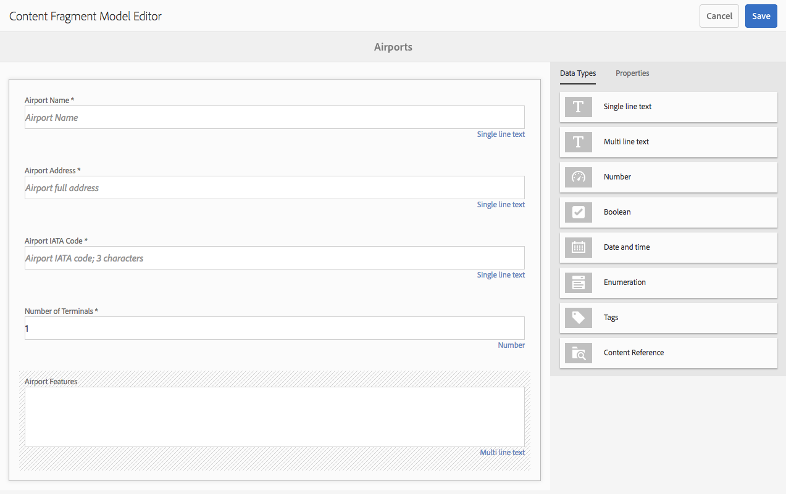

# Modelos de fragmentos do conteúdo {#content-fragment-models}

>[!CAUTION]
>
>Algumas funcionalidades do Fragmento de conteúdo exigem a aplicação do [AEM 6.4 Service Pack 2 (6.4.2.0) ou posterior](../release-notes/sp-release-notes.md).

Os Modelos de fragmento de conteúdo definem a estrutura do conteúdo para seus [fragmentos de conteúdo](content-fragments.md).

## Ativar modelos de fragmento de conteúdo {#enable-content-fragment-models}

>[!CAUTION]
>
>Se você não ativar **[!UICONTROL Modelos de fragmento de conteúdo]**, a opção **[!UICONTROL Criar]** não estará disponível para criar novos modelos.

Para ativar os modelos de fragmento de conteúdo, é necessário:

* Ativar o uso de modelos de fragmento de conteúdo no gerenciador de configuração
* Aplicar a configuração à sua pasta Ativos

### Ativar modelos de fragmentos de conteúdo no Configuration Manager {#enable-content-fragment-models-in-configuration-manager}

Para [criar um novo Modelo de Fragmento de Conteúdo](#creating-a-content-fragment-model) você **deve** primeiro ativá-los usando o Gerenciador de Configuração:

1. Navegue até **[!UICONTROL Ferramentas]**, **[!UICONTROL Gerale]** abra o **[!UICONTROL Navegador de configuração]**.
   * Consulte a [documentação do Navegador de configuração](/help/sites-administering/configurations.md) para obter mais informações.
1. Selecione o local apropriado para seu site.
1. Use **[!UICONTROL Criar]** para abrir a caixa de diálogo, onde você:

   1. Especifique um **[!UICONTROL Título]**.
   1. Selecione **[!UICONTROL Modelos de fragmento de conteúdo]** para ativar seu uso.

   

1. Selecione **[!UICONTROL Create]** para salvar a definição.

### Aplicar a configuração à sua pasta de ativos {#apply-the-configuration-to-your-assets-folder}

Quando a configuração **[!UICONTROL global]** está ativada para modelos de fragmento de conteúdo, quaisquer modelos criados pelos usuários podem ser usados em qualquer pasta do Assets.

Para usar outras configurações (ou seja, excluindo globais) com uma pasta do Assets comparável, é necessário definir a conexão. Isso é feito usando **[!UICONTROL Configuração]** na guia **[!UICONTROL Serviços da nuvem]** das **[!UICONTROL Propriedades da pasta]** da pasta apropriada.

## Criação de um modelo de fragmento de conteúdo {#creating-a-content-fragment-model}

1. Navegue até **[!UICONTROL Ferramentas]**, **[!UICONTROL Ativos]** e abra **[!UICONTROL Modelos de fragmento de conteúdo]**.
1. Navegue até a pasta apropriada para sua [configuração](#enable-content-fragment-models).
1. Use **[!UICONTROL Criar]** para abrir o assistente.

   >[!CAUTION]
   >
   >Se o [uso de modelos de fragmento de conteúdo não tiver sido ativado](#enable-content-fragment-models), a opção **Criar** não estará disponível.

1. Especifique o **[!UICONTROL título do modelo]**. Você também pode adicionar uma **[!UICONTROL Descrição]**, se necessário.

   

1. Use **[!UICONTROL Create]** para salvar o modelo vazio. Uma mensagem indicará o sucesso da ação, você poderá selecionar **[!UICONTROL Abrir]** para editar imediatamente o modelo ou **[!UICONTROL Concluído]** para retornar ao console.

## Definição do modelo de fragmento de conteúdo {#defining-your-content-fragment-model}

O modelo de fragmento de conteúdo define efetivamente a estrutura dos fragmentos de conteúdo resultantes. Usando o editor de modelo, você pode adicionar e configurar os campos obrigatórios:

>[!CAUTION]
>
>A edição de um modelo de fragmento de conteúdo existente pode afetar fragmentos dependentes.

1. Navegue até **[!UICONTROL Ferramentas]**, **[!UICONTROL Ativos]** e abra **[!UICONTROL Modelos de fragmento de conteúdo]**.

1. Navegue até a pasta que contém o modelo de fragmento de conteúdo.
1. Abra o modelo necessário para **[!UICONTROL Editar]**; use a ação rápida ou selecione o modelo e depois a ação na barra de ferramentas.

   Uma vez aberto, o editor de modelo mostra:

   * esquerda: campos já definidos
   * direito: **[!UICONTROL Tipos de dados]** disponíveis para criar campos (e **[!UICONTROL Propriedades]** para uso depois que os campos forem criados)

   >[!NOTE]
   >
   >Quando um campo é **Obrigatório**, o **Rótulo** indicado no painel esquerdo será marcado com um asterisco (**&amp;ast;**).

   

1. **Para adicionar um campo**

   * Arraste um tipo de dados necessário para o local necessário para um campo:

   

   * Depois que um campo é adicionado ao modelo, o painel direito mostrará as **Propriedades** que podem ser definidas para esse tipo de dados específico. Aqui, é possível definir o que é necessário para esse campo. Por exemplo:

   

1. **Para remover um campo**

   Selecione o campo desejado e clique/toque no ícone da lixeira. Você receberá uma solicitação para confirmar a ação.

   

1. Depois de adicionar todos os campos obrigatórios e definir as propriedades, use **[!UICONTROL Save]** para persistir a definição. Por exemplo:

   

## Exclusão de um modelo de fragmento de conteúdo {#deleting-a-content-fragment-model}

>[!CAUTION]
>
>A exclusão de um modelo de fragmento de conteúdo pode afetar fragmentos dependentes.

Para excluir um modelo de fragmento de conteúdo:

1. Navegue até **[!UICONTROL Ferramentas]**, **[!UICONTROL Ativos]** e abra **[!UICONTROL Modelos de fragmento de conteúdo]**.

1. Navegue até a pasta que contém o modelo de fragmento de conteúdo.
1. Selecione o modelo, seguido por **[!UICONTROL Delete]** na barra de ferramentas.

   >[!NOTE]
   >
   >Se o modelo for referenciado, um aviso será dado. Agir adequadamente.

## Publicação de um modelo de fragmento de conteúdo {#publishing-a-content-fragment-model}

Os modelos de fragmento de conteúdo precisam ser publicados quando/antes de qualquer fragmento de conteúdo dependente ser publicado.

Para publicar um modelo de fragmento de conteúdo:

1. Navegue até **[!UICONTROL Ferramentas]**, **[!UICONTROL Ativos]** e abra **[!UICONTROL Modelos de fragmento de conteúdo]**.

1. Navegue até a pasta que contém o modelo de fragmento de conteúdo.
1. Selecione o modelo, seguido por **[!UICONTROL Publish]** na barra de ferramentas.

   >[!NOTE]
   >
   >Se você publicar um fragmento de conteúdo para o qual o modelo ainda não foi publicado, uma lista de seleção indicará isso e o modelo será publicado com o fragmento.
