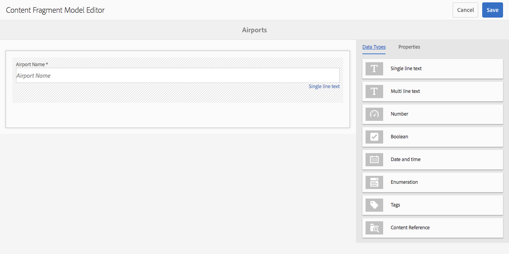

# Modelos de fragmentos do conteúdo {#content-fragment-models}

>[!CAUTION]
>
>Algumas funcionalidades do Fragmento de conteúdo exigem a aplicação do [AEM 6.4 Service Pack 2 (6.4.2.0) ou posterior](../release-notes/sp-release-notes.md).

Modelos de fragmento de conteúdo definem a estrutura do conteúdo para seus fragmentos [de](content-fragments.md)conteúdo.

## Enable Content Fragment Models {#enable-content-fragment-models}

>[!CAUTION]
>
>Se você não ativar os Modelos **[!UICONTROL de fragmento de]** conteúdo, a opção **[!UICONTROL Criar]** não estará disponível para a criação de novos modelos.

Para ativar os modelos de fragmento de conteúdo, é necessário:

* Habilitar o uso de modelos de fragmento de conteúdo no gerenciador de configurações
* Aplicar a configuração à pasta Ativos

### Ativar modelos de fragmento de conteúdo no Configuration Manager {#enable-content-fragment-models-in-configuration-manager}

Para [criar um novo Modelo](#creating-a-content-fragment-model) de fragmento de conteúdo, é **necessário** primeiro ativá-los usando o Configuration Manager:

1. Navegue até **[!UICONTROL Ferramentas]**, **[!UICONTROL Gerale]** abra o **[!UICONTROL Navegador de configuração]**.
1. Selecione o local apropriado para seu site.
1. Use **[!UICONTROL Criar]** para abrir a caixa de diálogo, onde você:

   1. Especifique um **[!UICONTROL Título]**.
   1. Selecione Modelos **[!UICONTROL de fragmento de]** conteúdo para permitir o uso.

   

1. Selecione **[!UICONTROL Criar]** para salvar a definição.

### Aplicar a configuração à pasta Ativos {#apply-the-configuration-to-your-assets-folder}

Quando a configuração **[!UICONTROL global]** estiver ativada para modelos de fragmento de conteúdo, todos os modelos criados pelos usuários poderão ser usados em qualquer pasta Ativos.

Para usar outras configurações (ou seja, excluindo globais) com uma pasta do Assets comparável, é necessário definir a conexão. Isso é feito usando **[!UICONTROL Configuração]** na guia **[!UICONTROL Serviços da nuvem]** das **[!UICONTROL Propriedades da pasta]** da pasta apropriada.

## Criação de um modelo de fragmento de conteúdo {#creating-a-content-fragment-model}

1. Navegue até **[!UICONTROL Ferramentas]**, **[!UICONTROL Ativos]** e abra Modelos **[!UICONTROL de fragmento]** de conteúdo.
1. Navegue até a pasta apropriada para sua [configuração](#enable-content-fragment-models).
1. Use **[!UICONTROL Criar]** para abrir o assistente.

   >[!CAUTION]
   >
   >Se o [uso de modelos de fragmento de conteúdo não tiver sido ativado](#enable-content-fragment-models), a opção **Criar** não estará disponível.

1. Especifique o **[!UICONTROL título do modelo]**. Você também pode adicionar uma **[!UICONTROL Descrição]**, se necessário.

   

1. Use **[!UICONTROL Criar]** para salvar o modelo vazio. Uma mensagem indicará o sucesso da ação, você poderá selecionar **[!UICONTROL Abrir]** para editar imediatamente o modelo ou **[!UICONTROL Concluído]** para retornar ao console.

## Definição do modelo de fragmento do conteúdo {#defining-your-content-fragment-model}

O modelo de fragmento de conteúdo define efetivamente a estrutura dos fragmentos de conteúdo resultantes. Usando o editor de modelo, você pode adicionar e configurar os campos obrigatórios:

>[!CAUTION]
>
>Editar um modelo de fragmento de conteúdo existente pode afetar fragmentos dependentes.

1. Navegue até **[!UICONTROL Ferramentas]**, **[!UICONTROL Ativos]** e abra Modelos **[!UICONTROL de fragmento]** de conteúdo.

1. Navegue até a pasta que contém o modelo de fragmento do conteúdo.
1. Abra o modelo necessário para **[!UICONTROL Editar]**; use a ação rápida ou selecione o modelo e a ação na barra de ferramentas.

   Depois de abrir o editor de modelo, é mostrado:

   * esquerda: campos já definidos
   * direito: **[!UICONTROL Tipos de dados]** disponíveis para criar campos (e **[!UICONTROL Propriedades]** para uso depois que os campos forem criados)

   >[!NOTE]
   >
   >When a field is **Required**, the **Label** indicated in the left pane will be marked with an asterix (**&amp;ast;**).

   

1. **Para adicionar um campo**

   * Arraste um tipo de dados necessário para o local necessário para um campo:

   

   * Depois que um campo for adicionado ao modelo, o painel direito mostrará as **Propriedades** que podem ser definidas para esse tipo de dados específico. Aqui você pode definir o que é necessário para esse campo. Por exemplo:

   

1. **Como remover um campo**

   Selecione o campo desejado e clique/toque no ícone lixeira. Você receberá uma solicitação para confirmar a ação.

   

1. Depois de adicionar todos os campos obrigatórios e definir as propriedades, use **[!UICONTROL Salvar]** para continuar a definição. Por exemplo:

   

## Excluindo um modelo de fragmento de conteúdo {#deleting-a-content-fragment-model}

>[!CAUTION]
>
>A exclusão de um modelo de fragmento de conteúdo pode afetar fragmentos dependentes.

Para excluir um modelo de fragmento de conteúdo:

1. Navegue até **[!UICONTROL Ferramentas]**, **[!UICONTROL Ativos]** e abra Modelos **[!UICONTROL de fragmento]** de conteúdo.

1. Navegue até a pasta que contém o modelo de fragmento do conteúdo.
1. Selecione seu modelo, seguido por **[!UICONTROL Excluir]** na barra de ferramentas.

   >[!NOTE]
   >
   >Se o modelo for referenciado, um aviso será dado. Agir adequadamente.

## Publicar um modelo de fragmento de conteúdo {#publishing-a-content-fragment-model}

Os modelos de fragmento de conteúdo precisam ser publicados quando/antes que qualquer fragmento de conteúdo dependente seja publicado.

Para publicar um modelo de fragmento de conteúdo:

1. Navegue até **[!UICONTROL Ferramentas]**, **[!UICONTROL Ativos]** e abra Modelos **[!UICONTROL de fragmento]** de conteúdo.

1. Navegue até a pasta que contém o modelo de fragmento do conteúdo.
1. Selecione seu modelo, seguido por **[!UICONTROL Publicar]** na barra de ferramentas.

   >[!NOTE]
   >
   >Se você publicar um fragmento de conteúdo para o qual o modelo ainda não foi publicado, uma lista de seleção indicará isso e o modelo será publicado com o fragmento.

