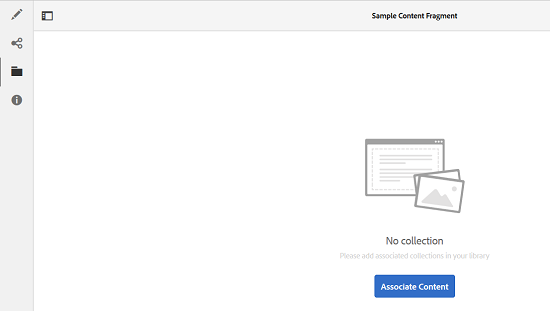
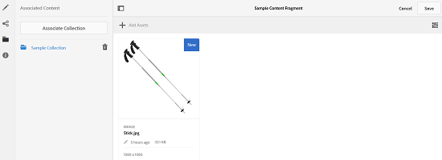

# Criação de projetos de tradução para fragmentos de conteúdo {#creating-translation-projects-for-content-fragments}

Além dos ativos, o Adobe Experience Manager (AEM) Assets suporta fluxos de trabalho de cópia de idioma para [fragmentos de conteúdo](content-fragments.md) (incluindo variações). Nenhuma otimização adicional é necessária para executar fluxos de trabalho de cópia de idioma em fragmentos de conteúdo. Em cada workflow, todo o fragmento de conteúdo é enviado para tradução.

Os tipos de fluxos de trabalho que você pode executar em fragmentos de conteúdo são exatamente semelhantes aos tipos de fluxo de trabalho que você executa para ativos. Além disso, as opções disponíveis em cada tipo de fluxo de trabalho correspondem às opções disponíveis nos tipos de fluxo de trabalho correspondentes para ativos.

Você pode executar os seguintes tipos de fluxos de trabalho de cópia de idioma em fragmentos de conteúdo:

**Criar e traduzir**

Nesse fluxo de trabalho, os fragmentos de conteúdo a serem traduzidos são copiados para a raiz do idioma para o qual você deseja traduzir. Além disso, dependendo das opções escolhidas, um projeto de tradução é criado para os fragmentos de conteúdo no console Projetos . Dependendo das configurações, o projeto de tradução pode ser iniciado manualmente ou pode ser executado automaticamente assim que o projeto de tradução for criado.

**Atualizar cópias de idioma**

Quando o fragmento de conteúdo de origem é atualizado ou modificado, o fragmento de conteúdo específico de local/idioma correspondente requer retradução. O fluxo de trabalho de cópias de idioma de atualização traduz um grupo adicional de fragmentos de conteúdo e o inclui em uma cópia de idioma para uma localidade específica. Nesse caso, os fragmentos de conteúdo traduzidos são adicionados à pasta de destino que já contém fragmentos de conteúdo traduzidos anteriormente.

## Criar e traduzir workflow {#create-and-translate-workflow}

O workflow Criar e traduzir inclui as seguintes opções. As etapas de procedimentos associadas a cada opção são semelhantes àquelas associadas à opção correspondente para ativos.

* Criar apenas estrutura: Para etapas do procedimento, consulte [Criar estrutura somente para ativos](translation-projects.md#create-structure-only).
* Criar um novo projeto de tradução: Para etapas de procedimento, consulte [Criar um novo projeto de tradução para ativos](translation-projects.md#create-a-new-translation-project).
* Adicionar ao projeto de tradução existente: Para etapas de procedimento, consulte [Adicionar ao projeto de tradução existente para ativos](translation-projects.md#add-to-existing-translation-project).

## Fluxo de trabalho de atualização de cópias de idioma {#update-language-copies-workflow}

O fluxo de trabalho Atualizar cópias de idioma inclui as seguintes opções. As etapas de procedimentos associadas a cada opção são semelhantes àquelas associadas à opção correspondente para ativos.

* Criar um novo projeto de tradução: Para etapas de procedimento, consulte [Criar um novo projeto de tradução para ativos](translation-projects.md#create-a-new-translation-project) (fluxo de trabalho de atualização).
* Adicionar ao projeto de tradução existente: Para etapas de procedimento, consulte [Adicionar ao projeto de tradução existente para ativos](translation-projects.md#add-to-existing-translation-project) (fluxo de trabalho de atualização).

Também é possível criar cópias de idioma temporárias para fragmentos, de forma semelhante à forma como você cria cópias temporárias para ativos. Para obter detalhes, consulte [Criação de cópias de idioma temporárias para ativos](translation-projects.md#creating-temporary-language-copies).

## Tradução de fragmentos de mídia mista {#translating-mixed-media-fragments}

AEM permite traduzir fragmentos de conteúdo que incluem vários tipos de ativos de mídia e coleções. Se você traduzir um fragmento de conteúdo que inclui ativos em linha, as cópias traduzidas desses ativos serão armazenadas na raiz do idioma de destino.

Se o fragmento de conteúdo incluir uma coleção, os ativos dentro da coleção serão traduzidos junto com o fragmento de conteúdo. As cópias traduzidas dos ativos são armazenadas na raiz apropriada do idioma de destino em um local que corresponda ao local físico dos ativos de origem na raiz do idioma de origem.

Para traduzir fragmentos de conteúdo que incluem mídia mista, primeiro edite a estrutura de tradução padrão para permitir a tradução de ativos em linha e coleções associadas aos fragmentos de conteúdo.

1. Clique/toque no logotipo do AEM e navegue até **[!UICONTROL Tools > Deployment > Cloud Services]**.
1. Localize **[!UICONTROL Integração de tradução]** em **[!UICONTROL Adobe Marketing Cloud]** e clique/toque em **[!UICONTROL Mostrar configurações]**.

   

1. Na lista de configurações disponíveis, clique/toque em **[!UICONTROL Configuração padrão (Configuração da integração de tradução)]** para abrir a página **[!UICONTROL Configuração padrão]**.

   

1. Clique em **[!UICONTROL Editar]** na barra de ferramentas para exibir a caixa de diálogo **[!UICONTROL Configuração de Tradução]**.

   

1. Navegue até a guia **[!UICONTROL Assets]** e escolha **[!UICONTROL Ativos de mídia em linha e Coleções associadas]** na lista **[!UICONTROL Traduzir ativos de fragmento de conteúdo]**. Clique/toque em **[!UICONTROL OK]** para salvar as alterações.

   

1. Na pasta raiz inglesa , abra um fragmento de conteúdo.

   

1. Clique/toque no ícone **[!UICONTROL Inserir ativo]**.

   

1. Insira um ativo no fragmento de conteúdo.

   

1. Clique/toque no ícone **[!UICONTROL Associar conteúdo]**.

   

1. Clique/toque em **[!UICONTROL Associar conteúdo]**.

   

1. Selecione uma coleção e inclua-a no fragmento de conteúdo. Clique/toque em **[!UICONTROL Salvar]**.

   

1. Selecione o fragmento de conteúdo e clique/toque no ícone **[!UICONTROL GlobalNavigation]**.
1. Selecione **[!UICONTROL Referências]** no menu para exibir o painel **[!UICONTROL Referências]**.

   

1. Clique/toque em **[!UICONTROL Cópias de idioma]** em **[!UICONTROL Cópias]** para exibir as cópias de idioma.

   

1. Clique/toque em **[!UICONTROL Criar e traduzir]** na parte inferior do painel para exibir a caixa de diálogo **[!UICONTROL Criar e traduzir]**.

   

1. Selecione o idioma de destino na lista **[!UICONTROL Idiomas de destino]**.

   

1. Selecione o tipo de projeto de tradução na lista **[!UICONTROL Projeto]**.

   

1. Especifique o título do projeto na caixa **[!UICONTROL Título do projeto]** e clique/toque em **Criar**.

   

1. Navegue até o console **[!UICONTROL Projetos]** e abra a pasta do projeto para o projeto de tradução criado.

   

1. Clique/toque no bloco do projeto para abrir a página de detalhes do projeto.

   

1. No bloco Tarefa de tradução, verifique o número de ativos a serem traduzidos.
1. No bloco **[!UICONTROL Tarefa de Tradução]**, inicie o trabalho de tradução.

   

1. Clique nas reticências na parte inferior do bloco Tarefa de tradução para exibir o status do trabalho de tradução.

   

1. Clique/toque no fragmento de conteúdo para verificar o caminho dos ativos associados traduzidos.

   

1. Revise a cópia de idioma da coleção no console Coleções .

   

   Observe que somente o conteúdo da coleção é traduzido. A coleção em si não é traduzida.

1. Navegue até o caminho do ativo associado convertido. Observe que o ativo traduzido é armazenado na raiz do idioma de destino.

   

1. Navegue até os ativos dentro da coleção que são traduzidos junto com o fragmento de conteúdo. Observe que as cópias traduzidas dos ativos são armazenadas na raiz apropriada do idioma de destino.

   

   >[!NOTE]
   >
   >Os procedimentos para adicionar um fragmento de conteúdo a um projeto existente ou executar fluxos de trabalho de atualização são semelhantes aos procedimentos correspondentes para ativos. Para obter orientação sobre estes procedimentos, consulte os procedimentos descritos para os ativos.
