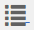
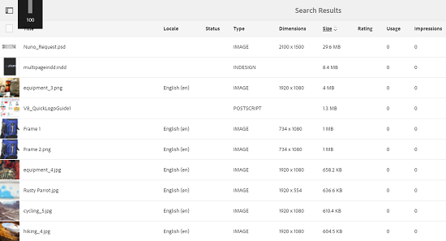

# Classificação aprimorada de ativos em AEM {#enhanced-sorting-of-assets-in-aem}

Saiba como a AEM Assets implanta a classificação do lado do servidor para classificar os ativos da pasta ou um query de pesquisa de uma só vez, em vez de classificá-los em lotes no lado do cliente.

A capacidade de pesquisa dos Ativos Adobe Experience Manager (AEM) é aprimorada para classificar com eficiência um grande número de ativos nas páginas de visualização de lista de pasta e resultados de pesquisa. Também é possível classificar entradas de linha do tempo.

A AEM Assets implanta a classificação do lado do servidor para classificar todo o conjunto de ativos (o que for grande) em uma pasta ou em um query de pesquisa de uma só vez, em vez de classificá-los em lotes no lado do cliente. Dessa forma, os resultados pré-buscados podem ser rapidamente exibidos na interface do usuário, o que torna a operação de classificação mais ágil e brilhante.

## Classificação de ativos na visualização de Lista {#sorting-assets-in-list-view}

A AEM Assets permite que você classifique os ativos de pasta com base nos seguintes campos:

* Localidade
* Status
* Tipo
* Tamanho
* Classificação
* Data de modificação
* Data de publicação
* Uso
* Cliques
* Impressões
* Retirado

1. Navegue até uma pasta que contém um grande número de ativos.
1. Clique/toque no ícone Layout e alterne para a visualização da lista.

   

1. Clique/toque no ícone Classificar ao lado de qualquer cabeçalho de coluna na lista de ativos.

   

   A lista de ativos é classificada com base nos valores de campo.

   

>[!NOTE]
>
>Para classificar os valores nas colunas `Name` ou `Title`, sobreponha `/libs/dam/gui/content/commons/availablecolumns` e altere o valor de `sortable` para `True`.

## Classificação de ativos em resultados de pesquisa {#sorting-assets-in-search-results}

Você pode classificar os resultados da pesquisa com base nos seguintes campos:

* Título
* Status
* Tipo
* Tamanho
* Data de modificação
* Data de publicação

1. Na caixa OmniSearch, procure ativos com base nos critérios desejados.

   

1. Clique/toque no ícone Layout e alterne para a visualização da lista. Se os resultados da pesquisa já forem exibidos na visualização da lista, pule esta etapa.
1. Clique/toque no ícone Classificar ao lado de qualquer cabeçalho de coluna na lista de ativos. A lista de ativos é classificada com base nos valores de campo.

   

## Classificação de ativos na linha do tempo {#sorting-assets-in-timeline}

O AEM Assets permite que você classifique cronologicamente as entradas da linha do tempo, como anotações, versões, workflows e atividades.

1. Na interface do usuário Ativos, selecione um ativo para o qual deseja exibir a linha do tempo.
1. Clique/toque no ícone de Navegação Global e selecione **[!UICONTROL Linha do tempo]**.

   

1. Na linha do tempo, selecione uma entrada da lista. Por exemplo, selecione **[!UICONTROL Comentários]** para exibir a lista de anotações associadas ao ativo.

   

1. Clique/toque no ícone **[!UICONTROL Classificar]** ao lado do rótulo **[!UICONTROL Data]**. Com base na sua seleção, as anotações são listadas na ordem cronológica/reversa em que foram adicionadas ao ativo.

   

