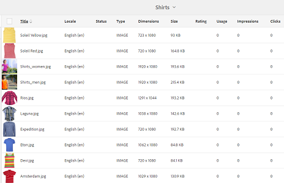
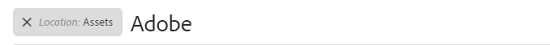

# Classificação aprimorada de ativos em [!DNL Experience Manager] {#enhanced-sorting-of-assets-in-aem}

>[!CAUTION]
>
>AEM 6.4 chegou ao fim do suporte estendido e esta documentação não é mais atualizada. Para obter mais detalhes, consulte nossa [períodos de assistência técnica](https://helpx.adobe.com/br/support/programs/eol-matrix.html). Encontre as versões compatíveis [here](https://experienceleague.adobe.com/docs/).

Saiba como [!DNL Experience Manager] Os ativos implantam a classificação do lado do servidor para classificar os ativos da pasta ou uma consulta de pesquisa de uma só vez, em vez de classificá-los em lotes no lado do cliente.

O recurso de pesquisa do Adobe Experience Manager Assets é aprimorado para classificar com eficiência um grande número de ativos na exibição em lista de pastas e nas páginas de resultados da pesquisa. Também é possível classificar as entradas da linha do tempo.

[!DNL Experience Manager] Os ativos implantam a classificação do lado do servidor para classificar todo o conjunto de ativos (independente do tamanho) em uma pasta ou em um query de pesquisa de uma só vez, em vez de classificá-los em lotes no lado do cliente. Dessa forma, os resultados pré-buscados podem ser rapidamente exibidos na interface do usuário, o que torna a operação de classificação mais responsiva e ampla.

## Classificação de ativos na exibição de Lista {#sorting-assets-in-list-view}

[!DNL Experience Manager] Os ativos permitem classificar os ativos da pasta com base nos seguintes campos:

* Localidade
* Status
* Tipo
* Tamanho
* Avaliação
* Data de modificação
* Data de publicação
* Uso
* Cliques
* Impressões
* Retirado

1. Navegue até uma pasta que contém um grande número de ativos.
1. Clique/toque no ícone Layout e alterne para a exibição em lista.

   

1. Clique/toque no ícone Classificar ao lado de qualquer cabeçalho de coluna na lista de ativos.

   

   A lista de ativos é classificada com base nos valores de campo.

   

>[!NOTE]
>
>Para classificar os valores na variável `Name` ou `Title`colunas, sobreposição `/libs/dam/gui/content/commons/availablecolumns` e alterar o valor de `sortable` para `True`.

## Classificação de ativos em resultados de pesquisa {#sorting-assets-in-search-results}

Você pode classificar os resultados da pesquisa com base nos seguintes campos:

* Título
* Status
* Tipo
* Tamanho
* Data de modificação
* Data de publicação

1. Na caixa OmniSearch , procure por ativos com base nos critérios desejados.

   

1. Clique/toque no ícone Layout e alterne para a exibição em lista. Se os resultados da pesquisa já estiverem exibidos na exibição em lista, pule esta etapa.
1. Clique/toque no ícone Classificar ao lado de qualquer cabeçalho de coluna na lista de ativos. A lista de ativos é classificada com base nos valores de campo.

   

## Classificação de ativos na linha do tempo {#sorting-assets-in-timeline}

[!DNL Assets] permite classificar cronologicamente as entradas da linha do tempo, como anotações, versões, fluxos de trabalho e atividades.

1. Na interface do usuário do Assets, selecione um ativo para o qual deseja exibir a linha do tempo.
1. Clique/toque no ícone Navegação global e selecione **[!UICONTROL Linha do tempo]**.

   

1. Na linha do tempo, selecione uma entrada na lista. Por exemplo, selecione **[!UICONTROL Comentários]** para exibir a lista de anotações associadas ao ativo.

   

1. Clique/toque no **[!UICONTROL Classificar]** ícone ao lado do **[!UICONTROL Data]** rótulo. Com base em sua seleção, as anotações são listadas na ordem cronológica/inversa em que foram adicionadas ao ativo.

   
