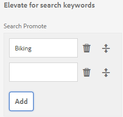

# Pesquisa de texto completo do GQL {#gql-full-text-search}

Explore o recurso de pesquisa de texto completo do GQL no AEM Assets. Use-o para pesquisar ativos com base em metadados específicos, como título, descrição e nome do autor.

O recurso de pesquisa de texto completo do GQL permite que você pesquise ativos com base em metadados específicos, como título, descrição, autor e assim por diante.

Para pesquisar um ativo com base em seus metadados, por exemplo, título, especifique a palavra-chave de metadados seguida de seu valor no painel de pesquisa. O recurso de pesquisa de texto completo do GQL buscará somente os ativos cujos metadados correspondam exatamente ao valor correspondente inserido.

Por exemplo, para pesquisar ativos que tenham o título &quot;Público alvo&quot;, execute estas etapas:

## Pesquisar ativos {#searching-assets}

1. Na barra de ferramentas da interface do usuário do Assets, clique ou toque no ícone **[!UICONTROL Pesquisar]** para exibir a caixa Omnisearch.

   

1. Com o cursor na caixa Omnisearch, pressione Enter.
1. Clique ou toque no ícone GlobalNav para exibir o painel **[!UICONTROL Filtros]** .
1. Na caixa Pesquisa Omni, especifique o valor &quot;Público alvo&quot;. Para limitar sua pesquisa a uma pasta específica, clique ou toque no ícone Procurar no painel Filtros e selecione a pasta. Nesse caso, a correspondência é pesquisada somente dentro da pasta e das subpastas abaixo dela.

   >[!NOTE]
   >
   >Você também pode realizar pesquisa de texto completo na pasta. Nesse caso, você deve especificar um termo de pesquisa de texto completo não vazio.

   

1. Press **[!UICONTROL Enter]**. A interface do usuário do AEM Assets exibe apenas os ativos cujo título corresponde exatamente a &quot;Público alvo&quot;.

O recurso de pesquisa de texto completo do GQL permite pesquisar ativos com base no seguinte:

* query complexo criado pela combinação de uma operação E, os valores especificados para vários campos de metadados (propriedades)
* Vários valores para um único campo de metadados
* Correspondências de subsequência de caracteres

O recurso de pesquisa de texto completo do GQL permite que você pesquise ativos com base nas seguintes propriedades de metadados. Os nomes das propriedades (por exemplo, autor, título e assim por diante) e os valores distinguem maiúsculas de minúsculas.

>[!NOTE]
>
>A pesquisa de texto completo GQL funciona somente para predicados de texto completo.

| Propriedade | Formato de pesquisa (valor da faceta) |
|---|---|
| [!UICONTROL Título] | título:John |
| [!UICONTROL Criador] | criador:John |
| [!UICONTROL Contribuinte] | colaborador:John |
| [!UICONTROL Local] | local:Índia |
| [!UICONTROL Descrição] | descrição:&quot;Imagem de amostra&quot; |
| [!UICONTROL Ferramenta Criador] | criatortool:&quot;Adobe Photoshop 7.0&quot; |
| [!UICONTROL Proprietário de direitos autorais] | copyrights towner: &quot;Adobe Systems&quot; |
| [!UICONTROL Contribuinte] | colaborador:John |
| [!UICONTROL Termos de Uso ] | usageterms:&quot;CopyRights Reserved&quot; |
| [!UICONTROL Criado] | criado:AAAA-MM-DDTHH:MM:SS.000+05:30..AAAA-MM-DDTHH:MM:SS.000+05:30 |
| [!UICONTROL Data de expiração] | expira:AAAA-MM-DDTHH:MM:SS.000+05:30..AAAA-MM-DDTHH:MM:SS.000+05:30 |
| [!UICONTROL Hora] | hora única:AAAA-MM-DDTHH:MM:SS.000+05:30...AAAA-MM-DDTHH:MM:SS.000+05:30 |
| [!UICONTROL Hora de desligar] | oftime:YYYY-MM-DDTHH:MM:SS.000+05:30..AAAA-MM-DDTHH:MM:SS.000+05:30 |
| [!UICONTROL Intervalo de tempo] (expira dateontime,offtime) | campo de faceta: limite inferior...upperbound |
| [!UICONTROL Caminho] | /content/dam/&lt;nome da pasta> |
| [!UICONTROL Título do PDF] | pdftitle: &quot;Adobe Documento&quot; |
| [!UICONTROL Assunto] | assunto: &quot;Formação&quot; |
| [!UICONTROL Tags] | tags:&quot;Localização E Viagem&quot; |
| [!UICONTROL Tipo] | type:&quot;image\png&quot; |
| [!UICONTROL Largura da imagem] | largura:limite inferior..upperbound |
| [!UICONTROL Altura da imagem] | height:limite inferior..upperbound |
| [!UICONTROL Person] | pessoa:John |

Estes são alguns exemplos de formatos de pesquisa para query complexos:

* Para exibir todos os ativos com vários campos de facetas (por exemplo: title=John Doe e ferramenta criadora = Adobe Photoshop):

tiltle: ferramenta criadora do &quot;John Doe&quot; : Adobe&amp;ast;

* Para exibir todos os ativos quando o valor de facetas não for uma única palavra, mas uma sentença (por exemplo: title=Scott Reynolds)

título: &quot;Scott Reynolds&quot;

* Para exibir ativos com vários valores de uma única propriedade (por exemplo: title=Scott Reynolds ou John Doe)

título:&quot;Scott Reynolds&quot; OU &quot;John Doe&quot;

* Para exibir ativos com valores de propriedade começando com uma string específica (por exemplo: título é Scott Reynolds)

título: &quot;Scott&quot;

* Para exibir ativos com valores de propriedade que terminam com uma string específica (por exemplo: título é Scott Reynolds)

título: &quot;Reynolds&quot;

* Para exibir ativos com um valor de propriedade que contenha uma string específica (por exemplo: título = Sala de reuniões de Basileia)

título:&quot;Reunião&quot;;

* Para exibir ativos que contêm uma determinada string e têm um valor de propriedade específico (por exemplo: pesquisar por Adobe de string em ativos com título=João da Silva)

&amp;ast;Adobe;ast;amp;ast; título:&quot;John Doe &quot;OR title:&quot;John Doe&quot; &amp;ast;Adobe&amp;ast;

>[!NOTE]
>
>O caminho, limite, tamanho e ordem das propriedades não podem ser OUed com nenhuma outra propriedade.
>
>A palavra-chave para uma propriedade gerada pelo usuário é seu rótulo de campo no editor de propriedades em minúsculas, com espaços removidos.

>[!NOTE]
>
>Se você gravar um query JCR para pesquisar apenas por subativos, os ativos referenciados correspondentes também serão exibidos junto com os subativos correspondentes.

A pesquisa de texto completo também oferece suporte a operadores como -, ^ e assim por diante. Para pesquisar essas letras como literais de string, coloque a expressão de pesquisa entre aspas duplos. Por exemplo, use &quot;Notebook - Beauty&quot; em vez de Notebook - Beauty.

## Aumentando a pesquisa {#boosting-search}

Você pode melhorar a relevância das palavras-chave de ativos específicos para ajudar a aumentar as pesquisas com base nas palavras-chave. Em outras palavras, as imagens para as quais você promove palavras-chave específicas aparecem na parte superior dos resultados da pesquisa quando você pesquisa com base nessas palavras-chave.

1. Na interface do usuário do Assets, abra a página de propriedades do ativo para o qual você deseja promover uma palavra-chave.
1. Alterne para a guia **[!UICONTROL Avançado]** e clique/toque em **[!UICONTROL Adicionar]** em **[!UICONTROL Elevar para palavras-chave]** de pesquisa.

   

1. Na caixa **[!UICONTROL Pesquisar promoção]** , especifique uma palavra-chave para a qual deseja aumentar a pesquisa da imagem e clique/toque em **[!UICONTROL Adicionar]**. Se necessário, especifique várias palavras-chave da mesma maneira.

   

1. Click/tap **[!UICONTROL Save &amp; Close]**.
1. Procure a palavra-chave usando a caixa Omnisearch. O ativo para o qual você promoveu essa palavra-chave aparece entre os principais resultados da pesquisa.