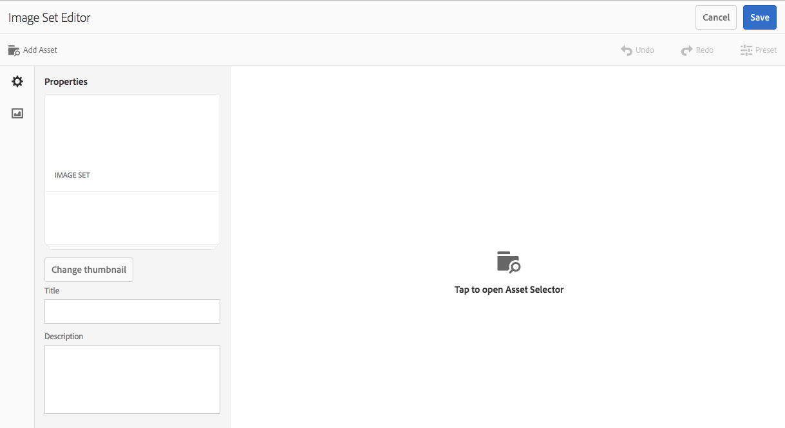

# Conjuntos de imagem {#image-sets}

Os Conjuntos de imagens fornecem aos usuários uma experiência de visualização integrada, na qual eles podem ver visualizações diferentes de um item clicando em uma imagem em miniatura. Os Conjuntos de imagens permitem que você apresente visualizações alternativas de um item e as ferramentas de zoom do visualizador de ofertas para examinar as imagens de perto.

Os Conjuntos de imagens são designados por um banner com a palavra **[!UICONTROL IMAGESET]**. Além disso, se o Conjunto de imagens for publicado, a data de publicação, indicada pelo ícone **[!UICONTROL Mundo]**, estará no banner junto com a última data de modificação, indicada pelo ícone **[!UICONTROL Lápis]**.

No conjunto de imagens, também é possível criar amostras criando um Conjunto de imagens e adicionando miniaturas.

Esse aplicativo é especialmente útil para quando você deseja mostrar um item em uma cor, padrão ou finalização diferente. Para criar um Conjunto de imagens com amostras de cores, você precisa de uma imagem para cada cor, padrão ou acabamento diferente que deseja apresentar aos usuários. Você também precisa de uma cor, padrão ou amostra de fim para cada cor, padrão ou fim.

Por exemplo, suponha que você queira apresentar imagens de maiúsculas com diferentes notas coloridas; as contas são vermelhas, verdes e azuis. Neste caso, você precisa de três tiros do mesmo chapéu. Você precisa de um tiro com um vermelho, um com um verde, e outro com uma conta azul. Você também precisa de uma amostra de cor vermelha, verde e azul. As amostras de cores servem como miniaturas que os usuários clicam no Visualizador do conjunto de amostras para ver a tampa vermelha, com borda verde ou com borda azul.

>[!NOTE]
>
>Para obter informações sobre a interface de usuário do Assets, consulte [Gerenciar ativos com a interface de usuário de toque](managing-assets-touch-ui.md).

## Start rápido: Conjuntos de imagens {#quick-start-image-sets}

Para começar a trabalhar rapidamente:

1. [Carregue suas imagens principais para várias visualizações.](#uploading-assets-in-image-sets)

   Start carregando as imagens para seus Conjuntos de imagens. Como os usuários podem aplicar zoom em imagens no Visualizador do conjunto de imagens, considere o zoom ao escolher as imagens. Verifique se as imagens têm pelo menos 2000 pixels na maior dimensão para obter detalhes ideais de zoom. O Dynamic Media pode renderizar imagens de até 25 megapixels cada. Por exemplo, você pode usar uma imagem de 5000 x 5000 megapixels ou qualquer outra combinação de tamanho até 25 megapixels.

   A AEM Assets oferece suporte a vários formatos de arquivo de imagem, mas são recomendadas imagens TIFF, PNG e EPS sem perdas.

1. [Criar conjuntos de imagens.](#creating-image-sets)

   Em Conjuntos de imagens, os usuários clicam em imagens em miniatura no Visualizador do conjunto de imagens.

   Para criar um Conjunto de imagens em Ativos, toque em **[!UICONTROL Criar > Conjuntos de imagens]**. Em seguida, adicione imagens e toque em **[!UICONTROL Salvar]**.

   Você também pode criar conjuntos de imagens automaticamente por meio de [predefinições de conjuntos de lotes](/help/assets/config-dms7.md#creating-batch-set-presets-to-auto-generate-image-sets-and-spin-sets).

   **Importante** — Os conjuntos de lotes são criados pelo IPS (Image Production System) como parte da ingestão de ativos e estão disponíveis somente no modo Dynamic Media - Scene7.

   Consulte [Preparando ativos do Conjunto de imagens para fazer upload e upload dos arquivos](#uploading-assets-in-image-sets).

   Consulte [Trabalhando com seletores.](working-with-selectors.md)

1. Adicione [predefinições do Visualizador do conjunto de imagens](managing-viewer-presets.md), conforme necessário.

   Os administradores podem criar ou modificar a imagem **[!UICONTROL Definir predefinições do visualizador]**. Para ver o conjunto de imagens com uma predefinição do visualizador, selecione o conjunto de imagens e, no menu suspenso do painel esquerdo, selecione **[!UICONTROL Visualizadores]**.

   Consulte **[!UICONTROL Ferramentas > Ativos > Predefinições do visualizador]** para criar ou editar predefinições do visualizador.

1. (Opcional) [Visualizando conjuntos de imagens](image-sets.md#viewing-image-sets) que foram criados usando predefinições de conjuntos de lotes.
1. [Conjuntos de imagens de pré-visualização.](previewing-assets.md)

   Selecione o Conjunto de imagens e você pode pré-visualização-lo. Toque nos ícones de miniatura para examinar seu Conjunto de imagens no Visualizador selecionado. Você pode escolher visualizadores diferentes no menu **[!UICONTROL Visualizadores]**, disponível no menu suspenso do painel esquerdo.

1. [Publicar conjuntos de imagens.](publishing-dynamicmedia-assets.md)

   A publicação de um conjunto de imagens ativa o URL e a string Incorporada. Além disso, você deve [publicar qualquer predefinição do visualizador personalizado](managing-viewer-presets.md) que tenha criado. As predefinições do visualizador predefinidas já estão publicadas.

1. [Vincule URLs ao seu ](linking-urls-to-yourwebapplication.md) aplicativo da Web ou  [Incorpore o visualizador](embed-code.md) de vídeo ou imagem.

   A AEM Assets cria chamadas de URL para Conjuntos de imagens e as ativa depois que você publica os conjuntos de imagens. Você pode copiar esses URLs ao pré-visualização de ativos. Como alternativa, você pode incorporá-los ao seu site.

   Selecione o Conjunto de imagens e, no menu suspenso do painel à esquerda, selecione **[!UICONTROL Visualizadores]**.

   Consulte [Vincular um conjunto de imagens a uma página da Web](linking-urls-to-yourwebapplication.md) e [Incorporar o visualizador de vídeo ou imagem](embed-code.md).

Para editar Conjuntos de imagens, consulte [editar Conjuntos de imagens.](#editing-image-sets) Além disso, você pode visualização e editar as propriedades [ do Conjunto de ](managing-assets-touch-ui.md#editing-properties)imagens.

Se tiver problemas ao criar conjuntos, consulte Imagens e conjuntos em [Resolução de problemas do Dynamic Media - modo Scene7](troubleshoot-dms7.md#images-and-sets).

## Fazer upload de ativos em conjuntos de imagens {#uploading-assets-in-image-sets}

Start carregando as imagens para seus Conjuntos de imagens. Como os usuários podem aplicar zoom em imagens no Visualizador do conjunto de imagens, considere o zoom ao escolher as imagens. Verifique se as imagens têm pelo menos 2000 pixels na maior dimensão. Os Conjuntos de imagens são compatíveis com vários formatos de arquivo de imagem, mas as imagens TIFF, PNG e EPS são recomendadas sem perdas.

Você pode carregar imagens para Conjuntos de imagens da mesma forma que faria [carregar qualquer outro ativo em Ativos](managing-assets-touch-ui.md#uploading-assets).

### Preparando ativos do Conjunto de imagens para carregar {#preparing-image-set-assets-for-upload}

Antes de criar Conjuntos de imagens, verifique se as imagens têm o tamanho e o formato corretos.

Para criar um Conjunto de imagens de várias visualizações, é necessário que as imagens mostrem um item de diferentes pontos de visualização ou mostrem diferentes aspectos do mesmo item. O objetivo é destacar os recursos importantes de um item para que os visualizadores tenham uma imagem completa de como ele se parece ou faz.

Como os usuários podem aplicar zoom em Conjuntos de imagens, verifique se as imagens têm pelo menos 2000 pixels na maior dimensão. Os ativos oferecem suporte para vários formatos de arquivo de imagem, mas são recomendadas imagens TIFF, PNG e EPS sem perdas.

>[!NOTE]
>
>Além disso, se você estiver usando miniaturas para indicar amostras de produtos, é necessário fazer o seguinte:
>
>Você precisa de vinhetas ou fotos diferentes da mesma imagem mostrando-as em cores, padrões ou finalizações diferentes. Você também precisa de arquivos em miniatura que correspondam às diferentes cores, padrões ou finalizações. Por exemplo, para apresentar miniaturas com um conjunto de imagens mostrando a mesma jaqueta em preto, marrom e verde, é necessário:
>
>* Um tiro preto, marrom e verde da mesma jaqueta.
>* Uma miniatura de cor preta, marrom e verde.

>

## Criando Conjuntos de Imagens {#creating-image-sets}

Você pode criar Conjuntos de imagens pela interface do usuário ou por meio da API. Esta seção descreve como criar Conjuntos de imagens na interface do usuário.

>[!NOTE]
>
>Você também pode criar conjuntos de imagens automaticamente por meio de [predefinições de conjuntos de lotes](/help/assets/config-dms7.md#creating-batch-set-presets-to-auto-generate-image-sets-and-spin-sets).

**Importante:os conjuntos de** lotes são criados pelo IPS (Image Production System) como parte da ingestão de ativos e estão disponíveis somente no modo Dynamic Media - Scene7.

Quando você adiciona ativos ao seu conjunto, eles são adicionados automaticamente em ordem alfanumérica. Você pode reordenar ou classificar manualmente os ativos depois de adicionados.

>[!NOTE]
>
>Não há suporte para conjuntos de imagens para ativos com `,` (vírgula) no nome do arquivo.

**Para criar um conjunto** de imagens:

1. Em **Ativos**, navegue até o local em que deseja criar um conjunto de imagens, toque em **[!UICONTROL Criar]** e selecione **[!UICONTROL Conjunto de imagens]**. Além disso, crie o conjunto de dentro de uma pasta que contenha seus ativos.

   

1. Na página Editor do conjunto de imagens, no campo **[!UICONTROL Título]**, digite um nome para o conjunto de imagens. O nome é exibido no banner ao longo do Conjunto de imagens. Opcionalmente, informe uma descrição.

   

   >[!NOTE]
   >
   >Ao criar o conjunto de imagens, você pode alterar a miniatura do conjunto de imagens ou permitir que o AEM selecione a miniatura automaticamente com base nos ativos no conjunto de imagens. Para selecionar uma miniatura, toque em **[!UICONTROL Alterar miniatura]** e selecione qualquer imagem (você também pode navegar para outras pastas para localizar imagens). Se tiver selecionado uma miniatura e decidir que deseja que o AEM gere uma a partir do conjunto de imagens, selecione **[!UICONTROL Alternar para Miniatura automática]**.

1. Execute um dos procedimentos a seguir:

   * Perto do canto superior esquerdo da página **[!UICONTROL Editor do conjunto de imagens]**, toque em **[!UICONTROL Adicionar ativo]**.
   * Próximo ao meio da página **[!UICONTROL Editor do conjunto de imagens]**, toque em **[!UICONTROL Toque em para abrir o Seletor de ativos]**.

   Toque em para selecionar os ativos que deseja incluir no conjunto de imagens. Os ativos selecionados têm um ícone de marca de seleção sobre eles. Quando terminar, próximo ao canto superior direito da página, toque em **[!UICONTROL Selecionar]**.

   Com o Seletor de ativos, procure por ativos ao digitar uma palavra-chave e tocar em **[!UICONTROL Retornar]**. Aplique filtros para refinar os resultados da pesquisa. Filtre por caminho, coleção, tipo de arquivo e tag. Selecione o filtro e toque no ícone **[!UICONTROL Filtro]**, na barra de ferramentas. Altere a visualização tocando no ícone **[!UICONTROL Visualização]** e selecionando **[!UICONTROL Visualização de coluna]**, **[!UICONTROL Visualização de cartão]** ou **[!UICONTROL Visualização de Lista]**.

   Consulte [Trabalhando com seletores.](working-with-selectors.md)

   

1. Quando você adiciona ativos ao seu conjunto, eles são adicionados automaticamente em ordem alfanumérica. Você pode reordenar ou classificar manualmente os ativos depois de adicioná-los.

   Se necessário, arraste o ícone **[!UICONTROL Reordenar]** de um ativo à direita do nome do arquivo do ativo para reordenar as imagens para cima ou para baixo na lista definida.

   

   Se quiser alterar uma miniatura ou amostra, toque no ícone **[!UICONTROL Miniatura]** ao lado da imagem e navegue até a miniatura ou a amostra desejada. Quando terminar de selecionar todas as imagens, toque em **[!UICONTROL Salvar]**.

1. (Opcional) Execute um dos procedimentos a seguir:

   * Para excluir uma imagem, selecione-a e toque em **[!UICONTROL Excluir ativo]**.
   * Para aplicar uma predefinição, próximo ao canto superior direito da página, toque em **[!UICONTROL Predefinir]** e selecione uma predefinição para aplicar a todos os ativos ao mesmo tempo.

1. Toque em **[!UICONTROL Salvar]**. Seu conjunto de imagens recém-criado é exibido na pasta em que você o criou.

## Visualizando conjuntos de imagens {#viewing-image-sets}

Você pode criar conjuntos de imagens na interface do usuário ou automaticamente usando [predefinições de conjuntos de lotes](/help/assets/config-dms7.md#creating-batch-set-presets-to-auto-generate-image-sets-and-spin-sets).

**Importante** — Os conjuntos de lotes são criados pelos IPS  [Image Production ] Systems, parte da ingestão de ativos, e estão disponíveis somente no modo Dynamic Media - Scene7.)

No entanto, os conjuntos criados usando predefinições de conjuntos de lotes, faça com que *not* apareçam na interface do usuário. Você pode visualização esses conjuntos de três maneiras diferentes. (Esses métodos estão disponíveis mesmo se você tiver criado os conjuntos de imagens na interface do usuário).

* Ao abrir as propriedades de um ativo individual. As propriedades indicam os conjuntos dos quais o ativo selecionado é membro (em **[!UICONTROL Membro dos conjuntos]**). Toque no nome do conjunto para ver o conjunto inteiro.

   

* A partir de uma imagem de membro de qualquer conjunto. Selecione o menu **[!UICONTROL Conjuntos]** para exibir os conjuntos dos quais o ativo é membro.

   

* Na pesquisa, você pode selecionar **[!UICONTROL Filtros]**, expandir **[!UICONTROL Dynamic Media]** e selecionar **[!UICONTROL Conjuntos]**.

   A pesquisa retorna conjuntos correspondentes que foram criados manualmente na interface do usuário ou criados automaticamente por meio de predefinições de conjuntos de lotes. Para conjuntos automatizados, o query de pesquisa é realizado usando critérios de pesquisa &quot;Start com&quot; diferentes de AEM pesquisa que se baseia no uso de critérios de pesquisa &quot;Contém&quot;. Definir o filtro como **[!UICONTROL Conjuntos]** é a única maneira de pesquisar conjuntos automatizados.

   

>[!NOTE]
>
>Você pode visualização conjuntos por meio da interface do usuário, conforme descrito em [Editando conjuntos de imagens](#editing-image-sets).

## Edição de conjuntos de imagens {#editing-image-sets}

É possível executar várias tarefas de edição em Conjuntos de imagens, como:

* Adicione imagens ao conjunto de imagens.
* Reordene as imagens no Conjunto de imagens.
* Excluir ativos no Conjunto de imagens.
* Aplicar predefinições do visualizador.
* Exclua o conjunto de imagens.

**Para editar conjuntos** de imagens:

1. Execute um dos procedimentos a seguir:

   * Passe o cursor do mouse sobre um ativo do Conjunto de imagens e toque em **[!UICONTROL Editar]** (ícone de lápis).
   * Passe o cursor do mouse sobre um ativo do Conjunto de imagens, toque em **[!UICONTROL Selecionar]** (ícone de marca de seleção) e, em seguida, toque em **[!UICONTROL Editar]** na barra de ferramentas.
   * Toque em um ativo do Conjunto de imagens e, em seguida, toque em **[!UICONTROL Editar]** (ícone de lápis) na barra de ferramentas.

1. Para editar as imagens no Conjunto de imagens, execute um dos procedimentos a seguir:

   * Para reorganizar ativos, arraste uma imagem para um novo local (selecione o ícone de reordenação para mover itens).
   * Para classificar itens em ordem crescente ou decrescente, toque no cabeçalho da coluna.
   * Para adicionar um ativo ou atualizar um ativo existente, toque em **[!UICONTROL Adicionar ativo]**. Navegue até um ativo, selecione-o e, em seguida, toque em **[!UICONTROL Selecionar]** próximo ao canto superior direito da página.

   >[!NOTE]
   >Se você excluir a imagem que AEM usa para a miniatura substituindo-a por outra imagem, o ativo original ainda será exibido.

   * Para excluir um ativo, selecione-o e toque em **[!UICONTROL Excluir ativo]**.
   * Para aplicar uma predefinição, próximo ao canto superior direito da página, toque em **[!UICONTROL Predefinir]** e selecione uma predefinição do visualizador.
   * Para adicionar ou alterar uma miniatura, selecione o ícone de miniatura ao lado direito do ativo. Navegue até a nova miniatura ou ativo de amostra, selecione-o e toque em **[!UICONTROL Selecionar]**.
   * Para excluir um conjunto de imagens inteiro, navegue até o conjunto de imagens, selecione-o e toque em **[!UICONTROL Excluir]**.

   >[!NOTE]
   >
   >Edite as imagens em um Conjunto de imagens ao navegar até o conjunto, tocar em **[!UICONTROL Definir membros]** no painel à esquerda e tocar no ícone Lápis em um ativo individual para abrir a janela de edição.****

1. Toque em **[!UICONTROL Salvar]** quando terminar a edição.

## Visualizando conjuntos de imagens {#previewing-image-sets}

Consulte [Visualizar ativos](previewing-assets.md).

## Publicando conjuntos de imagens {#publishing-image-sets}

Consulte [Publicar ativos](publishing-dynamicmedia-assets.md).
