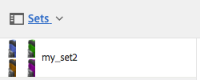

# Conjuntos de imagem {#image-sets}

Os Conjuntos de imagens fornecem aos usuários uma experiência de visualização integrada, onde os usuários podem ver diferentes visualizações de um item clicando em uma imagem em miniatura. Os Conjuntos de imagens permitem que você apresente visualizações alternativas de um item e o visualizador oferece ferramentas de zoom para examinar imagens cuidadosamente.

Os conjuntos de imagens são designados por um banner com a palavra **[!UICONTROL IMAGESET]**. Além disso, se o Conjunto de imagens for publicado, a data de publicação, indicada pelo ícone **[!UICONTROL Mundo]**, estará no banner junto com a última data de modificação, indicada pelo ícone **[!UICONTROL Lápis]**.

No conjunto de imagens, também é possível criar amostras criando um Conjunto de imagens e adicionando miniaturas.

Esse aplicativo é particularmente útil para quando você deseja mostrar um item em uma cor, padrão ou conclusão diferente. Para criar um Conjunto de imagens com amostras de cores, você precisa de uma imagem para cada cor, padrão ou acabamento diferente que deseja apresentar aos usuários. Você também precisa de uma cor, padrão ou amostra de finalização para cada cor, padrão ou finalização.

Por exemplo, suponha que você deseja apresentar imagens de maiúsculas com diferentes notas coloridas; as notas são vermelhas, verdes e azuis. Neste caso, você precisa de três tiros do mesmo boné. Você precisa de um tiro com um vermelho, um com um verde e um com uma nota azul. Você também precisa de uma amostra de cor vermelha, verde e azul. As amostras de cores servem como miniaturas que os usuários clicam no Visualizador de Conjunto de Amostras para ver a tampa vermelha, verde ou azul.

>[!NOTE]
>
>Para obter informações sobre a interface do usuário do Assets, consulte [Gerenciamento de ativos com a interface de toque](managing-assets-touch-ui.md).

Ao criar um Conjunto de imagens, o Adobe recomenda as seguintes práticas recomendadas e aplica os seguintes limites:

| Ativo - Tipo de limite | Prática recomendada | Limite implementado | Alterações no limite de 31 de dezembro de 2022 |
| --- | --- | --- | --- |
| **Conjunto de imagens** - Número de ativos duplicados por conjunto | Sem duplicatas | 100 | 20 |
| **Conjunto de imagens** - Número máximo de imagens por conjunto | 5 a 10 imagens por conjunto | 1000 |

Consulte também [Limitações do Dynamic Media](/help/assets/limitations.md).

## Início rápido: Conjuntos de imagens {#quick-start-image-sets}

Para ativar e executar rapidamente:

1. [Carregue suas imagens principais para várias exibições.](#uploading-assets-in-image-sets)

   Comece carregando as imagens dos seus Conjuntos de imagens. Como os usuários podem ampliar imagens no Visualizador do conjunto de imagens, considere o zoom ao escolher imagens. Certifique-se de que as imagens tenham pelo menos 2000 pixels na maior dimensão para obter detalhes ideais de zoom. O Dynamic Media pode renderizar imagens de até 25 megapixels cada. Por exemplo, você pode usar uma imagem de 5000 x 5000 megapixels ou qualquer outra combinação de tamanho até 25 megapixels.

   O AEM Assets oferece suporte a vários formatos de arquivo de imagem, mas as imagens TIFF, PNG e EPS sem perdas são recomendadas.

1. [Criar conjuntos de imagens.](#creating-image-sets)

   Em Conjuntos de imagens, os usuários clicam em imagens em miniatura no Visualizador do Conjunto de imagens.

   Para criar um Conjunto de imagens no Assets, toque em **[!UICONTROL Criar > Conjuntos de imagens]**. Em seguida, adicione imagens e toque em **[!UICONTROL Salvar]**.

   Você também pode criar conjuntos de imagens automaticamente por meio de [predefinições do conjunto de lotes](/help/assets/config-dms7.md#creating-batch-set-presets-to-auto-generate-image-sets-and-spin-sets).

   **Importante** — Os conjuntos em lotes são criados pelo IPS (Sistema de produção de imagem) como parte da ingestão de ativos e estão disponíveis apenas no modo Dynamic Media - Scene7.

   Consulte [Preparação de ativos do Conjunto de imagens para carregar e carregar seus arquivos](#uploading-assets-in-image-sets).

   Consulte [Trabalhar com seletores.](working-with-selectors.md)

1. Adicionar [Predefinições do visualizador de conjunto de imagens](managing-viewer-presets.md), conforme necessário.

   Os administradores podem criar ou modificar a imagem **[!UICONTROL Definir predefinições do visualizador]**. Para ver seu conjunto de imagens com uma predefinição do visualizador, selecione o conjunto de imagens e, no menu suspenso do painel à esquerda, selecione **[!UICONTROL Visualizadores]**.

   Consulte **[!UICONTROL Ferramentas > Ativos > Predefinições do visualizador]** para criar ou editar predefinições do visualizador.

1. (Opcional) [Visualização de conjuntos de imagens](image-sets.md#viewing-image-sets) que foram criadas usando predefinições de conjunto de lotes.
1. [Visualizar conjuntos de imagens.](previewing-assets.md)

   Selecione o Conjunto de imagens e você pode visualizá-lo. Toque nos ícones de miniatura para examinar seu Conjunto de imagens no Visualizador selecionado. Você pode escolher visualizadores diferentes do **[!UICONTROL Visualizadores]** , disponível no menu suspenso do painel à esquerda.

1. [Publicar conjuntos de imagens.](publishing-dynamicmedia-assets.md)

   A publicação de um conjunto de imagens ativa o URL e a cadeia de caracteres de inserção. Além disso, você deve [publicar qualquer predefinição do visualizador personalizado](managing-viewer-presets.md) que você criou. As predefinições do visualizador prontas para uso já estão publicadas.

1. [Vincular URLs ao seu aplicativo web](linking-urls-to-yourwebapplication.md) ou [Incorporar o visualizador de vídeo ou imagem](embed-code.md).

   O AEM Assets cria chamadas de URL para Conjuntos de imagens e as ativa após publicar os conjuntos de imagens. Você pode copiar esses URLs ao visualizar ativos. Como alternativa, você pode incorporá-los ao seu site.

   Selecione o Conjunto de imagens e, no menu suspenso do painel à esquerda, selecione **[!UICONTROL Visualizadores]**.

   Consulte [Vincular um conjunto de imagens a uma página da Web](linking-urls-to-yourwebapplication.md) e [Incorporar o visualizador de vídeo ou imagem](embed-code.md).

Para editar conjuntos de imagens, consulte [editar conjuntos de imagens.](#editing-image-sets) Além disso, é possível visualizar e editar [Propriedades do conjunto de imagens](managing-assets-touch-ui.md#editing-properties).

Se tiver problemas ao criar conjuntos, consulte Imagens e conjuntos em [Solução de problemas do Dynamic Media - Modo Scene7](troubleshoot-dms7.md#images-and-sets).

## Fazer upload de ativos em conjuntos de imagens {#uploading-assets-in-image-sets}

Comece carregando as imagens dos seus Conjuntos de imagens. Como os usuários podem ampliar imagens no Visualizador do conjunto de imagens, considere o zoom ao escolher imagens. Verifique se as imagens têm pelo menos 2000 pixels na maior dimensão. Os Conjuntos de imagens são compatíveis com vários formatos de arquivo de imagem, mas são recomendadas imagens TIFF, PNG e EPS sem perdas.

Você pode fazer upload de imagens para conjuntos de imagens da mesma maneira que faria [fazer upload de qualquer outro ativo no Assets](managing-assets-touch-ui.md#uploading-assets).

### Preparação de ativos do Conjunto de imagens para upload {#preparing-image-set-assets-for-upload}

Antes de criar Conjuntos de imagens, verifique se as imagens têm o tamanho e o formato corretos.

Para criar um Conjunto de imagens com várias exibições, você precisa de imagens que mostrem um item de diferentes pontos de vista ou que mostrem diferentes aspectos do mesmo item. O objetivo é destacar os recursos importantes de um item para que os visualizadores tenham uma imagem completa de como ele se parece ou faz.

Como os usuários podem ampliar imagens em Conjuntos de imagens, verifique se as imagens têm pelo menos 2000 pixels na maior dimensão. Os ativos são compatíveis com vários formatos de arquivo de imagem, mas as imagens TIFF, PNG e EPS sem perdas são recomendadas.

>[!NOTE]
>
>Além disso, se você estiver usando miniaturas para indicar amostras de produtos, será necessário fazer o seguinte:
>
>Você precisa de vinhetas ou fotos diferentes da mesma imagem mostrando-a em cores, padrões ou finalizações diferentes. Você também precisa de arquivos de miniatura que correspondam às diferentes cores, padrões ou finalizações. Por exemplo, para apresentar miniaturas com um Conjunto de imagens mostrando a mesma jaqueta em preto, marrom e verde, é necessário:
>
>* Um tiro preto, marrom e verde da mesma jaqueta.
>* Miniatura de cor preta, marrom e verde.
>

## Criação de conjuntos de imagens {#creating-image-sets}

Você pode criar Conjuntos de imagens por meio da interface do usuário ou da API. Esta seção descreve como criar Conjuntos de imagens na interface do usuário.

>[!NOTE]
>
>Você também pode criar conjuntos de imagens automaticamente por meio de [predefinições do conjunto de lotes](/help/assets/config-dms7.md#creating-batch-set-presets-to-auto-generate-image-sets-and-spin-sets).

**Importante:** Os conjuntos em lotes são criados pelo IPS (Sistema de produção de imagem) como parte da ingestão de ativos e estão disponíveis apenas no modo Dynamic Media - Scene7.

Ao adicionar ativos ao seu conjunto, eles são automaticamente adicionados em ordem alfanumérica. Você pode reordenar ou classificar ativos manualmente após a adição.

>[!NOTE]
>
>Os conjuntos de imagens não são compatíveis com ativos com `,` (vírgula) no nome do arquivo.

Ao criar um Conjunto de imagens, o Adobe recomenda as seguintes práticas recomendadas e aplica os seguintes limites:

| Ativo - Tipo de limite | Prática recomendada | Limite implementado | Alterações no limite de 31 de dezembro de 2022 |
| --- | --- | --- | --- |
| **Conjunto de imagens** - Número de ativos duplicados por conjunto | Sem duplicatas | 100 | 20º |
| **Conjunto de imagens** - Número máximo de imagens por conjunto | 5 a 10 imagens por conjunto | 1000 |

Consulte também [Limitações do Dynamic Media](/help/assets/limitations.md).

**Para criar um conjunto de imagens**:

1. Em **Ativos**, navegue até o local em que deseja criar um conjunto de imagens, toque em **[!UICONTROL Criar]** e selecione **[!UICONTROL Conjunto de imagens]**. Além disso, crie o conjunto de dentro de uma pasta que contenha seus ativos.

   

1. Na página Editor do conjunto de imagens, no **[!UICONTROL Título]** , insira um nome para o Conjunto de imagens. O nome aparece no banner através do Conjunto de imagens. Opcionalmente, informe uma descrição.

   

   >[!NOTE]
   >
   >Ao criar o conjunto de imagens, você pode alterar a miniatura do conjunto de imagens ou permitir que o AEM selecione a miniatura automaticamente com base nos ativos no conjunto de imagens. Para selecionar uma miniatura, toque em **[!UICONTROL Alterar miniatura]** e selecione qualquer imagem (você também pode navegar para outras pastas para localizar imagens). Se tiver selecionado uma miniatura e decidir que deseja que o AEM gere uma a partir do conjunto de imagens, selecione **[!UICONTROL Alternar para Miniatura automática]**.

1. Siga um destes procedimentos:

   * Próximo ao canto superior esquerdo do **[!UICONTROL Editor de conjunto de imagens]** página, toque em **[!UICONTROL Adicionar ativo]**.
   * Próximo do meio da **[!UICONTROL Editor de conjunto de imagens]** página, toque em **[!UICONTROL Toque para abrir o Seletor de ativos]**.

   Toque para selecionar ativos que deseja incluir no conjunto de imagens. Os ativos selecionados têm um ícone de marca de seleção sobre eles. Quando terminar, próximo ao canto superior direito da página, toque em **[!UICONTROL Selecionar]**.

   Com o Seletor de ativos, procure por ativos ao digitar uma palavra-chave e tocar em **[!UICONTROL Retornar]**. Aplique filtros para refinar os resultados da pesquisa. Filtre por caminho, coleção, tipo de arquivo e tag. Selecione o filtro e toque no ícone **[!UICONTROL Filtro]**, na barra de ferramentas. Altere a exibição ao tocar na guia **[!UICONTROL Exibir]** ícone e seleção **[!UICONTROL Exibição de coluna]**, **[!UICONTROL Exibição de cartão]** ou **[!UICONTROL Exibição de lista]**.

   Consulte [Trabalhar com seletores.](working-with-selectors.md)

   

1. Ao adicionar ativos ao seu conjunto, eles são automaticamente adicionados em ordem alfanumérica. Você pode reordenar ou classificar ativos manualmente depois de adicioná-los.

   Se necessário, arraste o **[!UICONTROL Reordenar]** ícone à direita do nome do arquivo do ativo para reordenar as imagens para cima ou para baixo na lista definida.

   

   Se quiser alterar uma miniatura ou amostra, toque no botão **[!UICONTROL Miniatura]** ícone ao lado da imagem e navegue até a miniatura ou a amostra desejada. Quando terminar de selecionar todas as imagens, toque em **[!UICONTROL Salvar]**.

1. (Opcional) Siga um destes procedimentos:

   * Para excluir uma imagem, selecione-a e toque em **[!UICONTROL Excluir ativo]**.
   * Para aplicar uma predefinição, próximo ao canto superior direito da página, toque em **[!UICONTROL Predefinição]** e, em seguida, selecione uma predefinição para aplicar a todos os ativos ao mesmo tempo.

1. Toque **[!UICONTROL Salvar]**. O Conjunto de imagens recém-criado é exibido na pasta em que você o criou.

## Visualização de conjuntos de imagens {#viewing-image-sets}

Você pode criar conjuntos de imagens na interface do usuário ou automaticamente usando [predefinições do conjunto de lotes](/help/assets/config-dms7.md#creating-batch-set-presets-to-auto-generate-image-sets-and-spin-sets).

**Importante** — Conjuntos de lotes são criados pelo IPS [Sistema de produção de imagens] como parte da assimilação de ativos e estão disponíveis somente no modo Dynamic Media - Scene7 .)

No entanto, os conjuntos criados usando predefinições de conjunto de lotes, *not* forem exibidos na interface do usuário do . Você pode visualizar esses conjuntos de três maneiras diferentes. (Esses métodos estão disponíveis mesmo se você tiver criado os conjuntos de imagens na interface do usuário).

* Ao abrir as propriedades de um ativo individual. As propriedades indicam quais conjuntos o ativo selecionado é um membro de (em **[!UICONTROL Membro dos Conjuntos]**). Toque no nome do conjunto para ver todo o conjunto.

   

* A partir de uma imagem de membro de qualquer conjunto. Selecione o **[!UICONTROL Conjuntos]** para exibir os conjuntos dos quais o ativo é membro.

   

* Na pesquisa, você pode selecionar **[!UICONTROL Filtros]**, em seguida expanda **[!UICONTROL Dynamic Media]** e selecione **[!UICONTROL Conjuntos]**.

   A pesquisa retorna conjuntos correspondentes que foram criados manualmente na interface do usuário ou criados automaticamente por meio de predefinições de conjuntos em lotes. Para conjuntos automatizados, a consulta de pesquisa é realizada usando critérios de pesquisa &quot;Inicia com&quot;, que são diferentes de AEM pesquisa baseada no uso de critérios de pesquisa &quot;Contém&quot;. Definição do filtro como **[!UICONTROL Conjuntos]** é a única maneira de pesquisar conjuntos automatizados.

   

>[!NOTE]
>
>Você pode exibir os conjuntos por meio da interface do usuário, conforme descrito em [Editar conjuntos de imagens](#editing-image-sets).

## Editar conjuntos de imagens {#editing-image-sets}

Você pode executar várias tarefas de edição em Conjuntos de imagens, como as seguintes:

* Adicione imagens ao conjunto de imagens.
* Reordene as imagens no Conjunto de imagens.
* Exclua ativos no Conjunto de imagens.
* Aplicar predefinições do visualizador.
* Exclua o conjunto de imagens.

**Para editar conjuntos de imagens**:

1. Siga um destes procedimentos:

   * Passe o mouse sobre um ativo de Conjunto de imagens, em seguida, toque em **[!UICONTROL Editar]** (ícone de lápis).
   * Passe o mouse sobre um ativo do Conjunto de imagens, toque em **[!UICONTROL Selecionar]** (ícone de marca de seleção) e toque em **[!UICONTROL Editar]** na barra de ferramentas.
   * Toque em um ativo do Conjunto de imagens e toque em **[!UICONTROL Editar]** (ícone de lápis) na barra de ferramentas.

1. Para editar as imagens no Conjunto de imagens, siga um destes procedimentos:

   * Para reorganizar ativos, arraste uma imagem para um novo local (selecione o ícone de reordenação para mover itens).
   * Para classificar itens em ordem crescente ou decrescente, toque no cabeçalho da coluna.
   * Para adicionar um ativo ou atualizar um ativo existente, toque no botão **[!UICONTROL Adicionar ativo]**. Navegue até um ativo, selecione-o e toque em **[!UICONTROL Selecionar]** próximo ao canto superior direito da página.

   >[!NOTE]
   >Se você excluir a imagem que AEM usa para a miniatura ao substituí-la por outra imagem, o ativo original ainda será exibido.

   * Para excluir um ativo, selecione-o e toque em **[!UICONTROL Excluir ativo]**.
   * Para aplicar uma predefinição, próximo ao canto superior direito da página, toque em **[!UICONTROL Predefinição]**, em seguida, selecione uma predefinição do visualizador.
   * Para adicionar ou alterar uma miniatura, selecione o ícone de miniatura ao lado direito do ativo. Navegue até a nova miniatura ou ativo de amostra, selecione-o e toque em **[!UICONTROL Selecionar]**.
   * Para excluir um conjunto de imagens inteiro, navegue até o conjunto de imagens, selecione-o e toque em **[!UICONTROL Excluir]**.

   >[!NOTE]
   >
   >Edite as imagens em um Conjunto de imagens ao navegar até o conjunto, tocar em **[!UICONTROL Definir membros]** no painel à esquerda e tocar no ícone Lápis em um ativo individual para abrir a janela de edição.****

1. Toque **[!UICONTROL Salvar]** quando terminar a edição.

## Visualização de conjuntos de imagens {#previewing-image-sets}

Consulte [Visualização de ativos](previewing-assets.md).

## Publicar conjuntos de imagens {#publishing-image-sets}

Consulte [Publicar ativos](publishing-dynamicmedia-assets.md).
