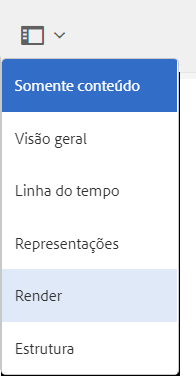

# Integração AEM 3D com o Autodesk Maya {#integrating-aem-d-with-autodesk-maya}

>[!NOTE]
>
>Esta tarefa é opcional e diz respeito apenas ao Windows.

Como opção, você pode integrar AEM 3D com o software Autodesk® Maya® para permitir suporte a arquivos Maya nativos (`.MA` e `.MB`) e renderizar ativos 3D em AEM com qualquer renderizador Maya disponível.

*Essa integração é somente* para Windows.

Ao fazer a integração com o Autodesk Maya, você deve instalar e configurar o Autodesk Maya, adicionar o caminho à pasta executável do Maya, habilitar o Maya para ingestão e renderização e testar a integração.

Consulte Configurações avançadas.

Consulte também [Integração AEM 3D com o AutoDesk 3ds Max](integrating-aem-3d-with-autodesk-3ds-max.md).

**Para integrar AEM 3D com o Autodesk Maya**:

1. Instale o software Autodesk Maya 2016 nos mesmos servidores onde o AEM está hospedado.

   Após a instalação, verifique se você pode abrir e usar o Maya e se não há problemas de licenciamento.

   >[!NOTE]
   >
   >AEM usa somente a ferramenta de renderização de linha de comando Maya (`render.exe`). Uma única licença de rede do Maya permite que até cinco servidores processem ou renderizem conteúdo do Maya simultaneamente.

1. No Maya, ative o plug-in Autodesk FBX®.
1. Instale o plug-in de renderização MentalRay ou outro renderizador desejado.

   Após a instalação, verifique se a MentalRay está disponível no Maya.

1. Adicione o caminho para a pasta executável Maya à variável de ambiente do Windows PATH.

   Por exemplo, no Windows Server 2012, toque em **[!UICONTROL Start]>[!UICONTROL Painel de controle do Campaign]>[!UICONTROL Sistema e segurança]>[!UICONTROL Sistema]> Configurações** avançadas do sistema > Variáveis de Ambiente. Anexar o caminho completo à `Maya2016\bin` pasta à variável `Path`do sistema.

   

1. Para ativar o Maya para ingestão e renderização, abra o **[!UICONTROL CRXDE Lite]** e navegue até `/libs/settings/dam/v3D/assetTypes/maya` e defina a propriedade **[!UICONTROL Ativado]** como `true`.

   

1. Para ativar o formato de arquivo JT (Siemens PLM Open CAD), navegue até `/libs/settings/dam/v3D/assetTypes/jt` e defina a propriedade **[!UICONTROL Enabled (Ativado]** ) como `true`.
1. Em AEM, ative Maya como renderizador. Comece navegando até **[!UICONTROL Ferramentas > Geral > CRXDE Lite]**.
1. Na página **[!UICONTROL CRXDE Lite]** , no painel esquerdo, navegue até o seguinte:

   `/libs/settings/dam/v3D/renderers/maya`

   

1. Defina a propriedade **[!UICONTROL Enabled]** como `true`.

1. Perto do canto superior esquerdo da página de **[!UICONTROL CRXDE Lite]** , toque em **[!UICONTROL Salvar tudo]**.

   O Maya agora está habilitado como renderizador.

## Testando a integração de AEM 3D com o Autodesk Maya {#testing-the-integration-of-aem-d-with-autodesk-maya}

1. Abra o AEM Assets e faça upload dos `.MA` arquivos localizados em `sample-3D-content/models` para a `test3d` pasta.

   Observe que `sample-3D-content.zip` foi baixado anteriormente para validar a funcionalidade básica 3D.

1. Retorne à visualização de **[!UICONTROL cartão]** e observe os banners de mensagem exibidos nos ativos carregados.

   O banner de Formato de conversão é exibido enquanto o Maya está convertendo o `.MA` formato nativo em `.FBX`.

1. Depois que todo o processamento for concluído, abra o ativo `logo-sphere.ma` e selecione o `stage-helipad.ma` estágio.

   A experiência de Pré-visualização é a mesma com `logo_sphere.fbx` e `stage-helipad.fbx`.

1. Near the upper-left corner of the page, tap or click the drop-down list and then select **[!UICONTROL CRender]**.

   

1. Na lista suspensa **[!UICONTROL Renderizador]** , selecione **[!UICONTROL Autodesk Maya]** e toque em Renderização **[!UICONTROL do]** Start.
1. Próximo ao canto superior direito da página, toque ou clique em **[!UICONTROL Fechar]** para retornar à visualização do **[!UICONTROL cartão]** .

   Observe o banner de mensagem no ativo de imagem que está sendo renderizado (`logo-sphere`, a menos que um nome de imagem diferente tenha sido especificado). Uma barra de progresso no banner mostra o progresso da renderização.

   >[!NOTE]
   >
   >A renderização exige muito da CPU e pode levar vários minutos para ser concluída

1. Depois que a renderização for concluída, abra o ativo de imagem renderizado.

   Verifique se a imagem renderizada corresponde razoavelmente à imagem que você estava visualizando no momento em que clicou em **[!UICONTROL Renderizar agora]**.

## Ativação De Formatos Adicionais Suportados Pelo Maya {#enabling-additional-formats-supported-by-maya}

(Opcional) Talvez seja compatível com vários formatos de entrada 3D, qualquer um dos quais pode ser ativado para que AEM reconheça o tipo de arquivo. Quando ativado, AEM envia o arquivo para Maya para convertê-lo em um formato intermediário que pode ser assimilado diretamente pela AEM.

Dependendo do formato, o suporte a recursos pode ser limitado (por exemplo, materiais podem não ser passados) e a qualidade/fidelidade pode ser limitada (por exemplo, faces revertidas). O Adobe suporta apenas o mecanismo geral, mas não qualquer conversão de formato específica.

Consulte Formatos de importação de dados [suportados | Maya](https://knowledge.autodesk.com/support/maya/learn-explore/caas/CloudHelp/cloudhelp/2016/ENU/Maya/files/GUID-69BC066D-D4D8-4B12-900C-CF42E798A5D6-htm.html) para informação sobre os formatos apoiados pelo Maya.

**Para ativar formatos adicionais suportados pelo AEM**:

1. Usando **[!UICONTROL CRXDE Lite]**, navegue até `/libs/settings/dam/v3D/assetTypes`.
1. Faça uma cópia do nó **[!UICONTROL jt]** . Clique com o botão direito do mouse no nó **[!UICONTROL jt]** e selecione **[!UICONTROL Copiar]**, clique com o botão direito do mouse na pasta **[!UICONTROL assetTypes]** e selecione **[!UICONTROL Colar]**. Isso deve produzir um novo nó `/apps/cq-scene7-v3D/config/assetTypes/Copy of jt`.
1. Renomeie o novo nó para atribuí-lo um nome exclusivo que representa o tipo de arquivo a ser adicionado. O sufixo do arquivo pode ser usado ou qualquer outro identificador exclusivo.

1. Defina a propriedade **[!UICONTROL Enabled]** do novo nó como `true`.

1. Defina a propriedade **[!UICONTROL Extension]** da nova observação como o sufixo/extensão do arquivo do formato que está sendo adicionado.
1. Defina a propriedade **[!UICONTROL MimeType]** como um valor apropriado. `application/x-` seguido pelo valor da propriedade **[!UICONTROL Extension]** deve funcionar para a maioria dos tipos de arquivos.
1. Certifique-se de que a propriedade **[!UICONTROL Conversion]** esteja definida como `fbx` e **[!UICONTROL IngestRegime]** como `Maya`.
1. Clique em **[!UICONTROL Salvar tudo]** na parte superior esquerda da página.

A captura de tela a seguir ilustra um formato de arquivo adicionado, usando o COLLADA DAE como exemplo:

