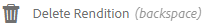
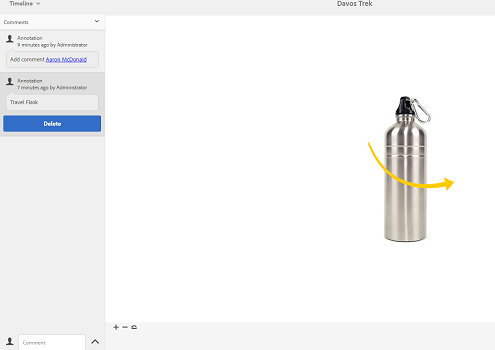

# Organize seus ativos digitais {#managing-assets-with-the-touch-optimized-ui}

Saiba mais sobre várias tarefas de gerenciamento e edição de ativos que você pode realizar usando a interface otimizada para toque de [!DNL Experience Manager] Ativos.

Este artigo descreve como gerenciar e editar ativos usando a interface do usuário otimizada para toque do Adobe Experience Manager Assets. Para obter um conhecimento básico sobre a interface do usuário, consulte [Manuseio básico da interface do usuário de toque](/help/sites-authoring/basic-handling.md). Para gerenciar Fragmentos de conteúdo, consulte [Gerenciamento de fragmentos de conteúdo](content-fragments-managing.md) ativos.

## Criar pastas {#create-folders}

Ao organizar uma coleção de ativos, por exemplo, todos `Nature` , é possível criar pastas para mantê-las juntas. Você pode usar pastas para categorizar e organizar seus ativos. [!DNL Experience Manager] Os ativos não exigem que você organize ativos em pastas para funcionar melhor.

>[!NOTE]
>
>* Compartilhamento de uma pasta de Ativos do tipo `sling:OrderedFolder` não é compatível ao compartilhar com o Marketing Cloud. Se quiser compartilhar uma pasta, não selecione Solicitado ao criar uma pasta.
>* Experience Manager não permite usar `subassets` palavra como o nome de uma pasta. É uma palavra-chave reservada para nós que contém subativos para ativos compostos.

1. Navegue até o local na pasta de ativos digitais onde deseja criar uma nova pasta.
1. No menu, clique em **[!UICONTROL Criar]**. Selecionar **[!UICONTROL Nova pasta]**.
1. No **[!UICONTROL Título]** , forneça um nome de pasta. Por padrão, o DAM usa o título fornecido como o nome da pasta. Depois que a pasta for criada, é possível substituir o padrão e especificar outro nome de pasta.
1. Clique em **[!UICONTROL Criar]**. Sua pasta é exibida na pasta de ativos digitais.

Os seguintes caracteres (lista separada por espaços de) não são suportados:

* o nome do arquivo de ativo não deve conter  `* / : [ \ \ ] | # % { } ? &`
* o nome da pasta de ativos não deve conter  `* / : [ \ \ ] | # % { } ? \" . ^ ; + & \t`

## Fazer upload de ativos {#uploading-assets}

Você pode fazer upload de vários tipos de ativos (incluindo imagens, arquivos de PDF, arquivos RAW e assim por diante) da pasta local ou de uma unidade de rede para o [!DNL Experience Manager] Ativos.

>[!NOTE]
>
>No modo Dynamic Media - Scene7, você só pode fazer upload de ativos com tamanhos de arquivo de 2 GB ou menos.

Você pode optar por fazer upload de ativos para pastas com ou sem um perfil de processamento atribuído a eles.

Para pastas que têm um perfil de processamento atribuído, o nome do perfil aparece na miniatura na exibição de cartão. Na exibição de lista, o nome do perfil aparece na variável **[!UICONTROL Perfil de processamento]** coluna. Consulte [Processando perfis](processing-profiles.md).

Antes de fazer upload de um ativo, verifique se ele está em um [formato compatível](assets-formats.md).

**Para fazer upload de ativos**:

1. Na interface da Web do Assets, navegue até o local onde deseja adicionar ativos digitais.
1. Para fazer upload dos ativos, siga um destes procedimentos:

   * Na barra de ferramentas, toque no botão **[!UICONTROL Criar]** ícone . Em seguida, no menu , toque em **[!UICONTROL Arquivos]**. Você pode renomear o arquivo na caixa de diálogo apresentada, se necessário.
   * Em um navegador compatível com a HTML5, arraste os ativos diretamente na interface. A caixa de diálogo para renomear arquivo não é exibida.

   

   Para selecionar vários arquivos, pressione a tecla Ctrl/Command e selecione os ativos na caixa de diálogo do seletor de arquivos. Em uma iPad, é possível selecionar apenas um arquivo por vez.

   Você pode pausar o upload de ativos grandes (maior que 500 MB) e retomá-lo posteriormente a partir da mesma página. Toque no **[!UICONTROL Pausar]** ao lado da barra de progresso que aparece quando o upload é iniciado.

   

   O tamanho acima do qual um ativo é considerado um ativo grande é configurável. Por exemplo, você pode configurar o sistema para considerar ativos acima de 1000 MB (em vez de 500 MB) como ativos grandes. Nesse caso, a variável **[!UICONTROL Pausar]** na barra de progresso é exibida quando ativos de tamanho superior a 1000 MB são carregados.

   O **[!UICONTROL Pausar]** não aparece se um arquivo com mais de 1000 MB é carregado com um arquivo com menos de 1000 MB. No entanto, se você cancelar o upload de menos de 1000 MB, a variável **[!UICONTROL Pausar]** é exibido.

   Para modificar o limite de tamanho, configure o `chunkUploadMinFileSize` da `fileupload`no repositório CRX.

   Ao clicar no botão **[!UICONTROL Pausar]** ícone, ele alterna para um **[!UICONTROL Reproduzir]** ícone . Para retomar o upload, clique no botão **[!UICONTROL Reproduzir]** ícone .

   

   Para cancelar um upload em andamento, clique no link `X` ao lado da barra de progresso. Ao cancelar a operação de upload, [!DNL Experience Manager] Os ativos excluem a parte parcialmente carregada do ativo.

   A capacidade de retomar o upload é especialmente útil em cenários de baixa largura de banda e falhas de rede, onde o upload de um ativo grande demora muito tempo. Você pode pausar a operação de upload e continuar posteriormente quando a situação melhorar. Ao retomar, o upload começa a partir do ponto em que você o pausou.

   Durante a operação de upload, [!DNL Experience Manager] salva as partes do ativo que estão sendo carregadas como partes de dados no repositório CRX. Quando o upload for concluído, [!DNL Experience Manager] consolida essas partes em um único bloco de dados no repositório.

   Para configurar a tarefa de limpeza para trabalhos de upload de partes não concluídos, acesse `https://[aem_server]:[port]/system/console/configMgr/org.apache.sling.servlets.post.impl.helper.ChunkCleanUpTask`.

   Se você fizer upload de um ativo com o mesmo nome de um ativo já disponível no local em que você está fazendo upload, uma caixa de diálogo de aviso será exibida.

   Você pode optar por substituir um ativo existente, criar outra versão ou manter ambos, renomeando o novo ativo que é carregado. Se você substituir um ativo existente, os metadados do ativo e quaisquer modificações e histórico anteriores (por exemplo, anotações, colheitas e assim por diante) serão excluídos. Se você optar por manter ambos os ativos, o novo ativo será renomeado.

   

   >[!NOTE]
   >
   >Ao selecionar **[!UICONTROL Substituir]** no **[!UICONTROL Conflito de nome]** , a ID do ativo é gerada novamente para o novo ativo. Essa ID é diferente da ID do ativo anterior.
   >
   >If **[!UICONTROL Informações de ativos]** estiver ativada para rastrear impressões/cliques com o Adobe Analytics, essa ID de ativo regenerada invalida os dados capturados para o ativo no Adobe Analytics.

   Se o ativo carregado existir no [!DNL Experience Manager] Ativos, o **[!UICONTROL Duplicidades detectadas]** caixa de diálogo avisa que você está tentando fazer upload de um ativo duplicado. A caixa de diálogo será exibida somente se o valor de soma de verificação SHA 1 do binário do ativo existente corresponder ao valor de soma de verificação do ativo que você carrega. Neste caso, os nomes dos ativos são irrelevantes. Em outras palavras, a caixa de diálogo pode aparecer até mesmo para ativos que têm nomes diferentes se os valores de SHA 1 para seus binários forem os mesmos.

   >[!NOTE]
   >
   >O **[!UICONTROL Duplicidades detectadas]** será exibida somente quando a variável **[!UICONTROL Detecção de duplicatas]** está habilitado. Para ativar o **[!UICONTROL Detecção de duplicatas]** recurso, consulte [Ativar a detecção de duplicatas](duplicate-detection.md).

   

   Toque **[!UICONTROL Manter]** para reter o ativo duplicado em [!DNL Experience Manager] Ativos. Toque  **[!UICONTROL Excluir]** para excluir o ativo duplicado que você carregou.

   [!DNL Experience Manager] Os ativos impedem que você carregue ativos com caracteres proibidos em seus nomes de arquivo. Se você tentar fazer upload de um ativo que inclua os caracteres não permitidos, [!DNL Experience Manager] Os ativos exibem uma mensagem de aviso relacionada à presença de caracteres proibidos no nome do arquivo e interrompem o upload até que você remova esses caracteres ou faça o upload com um nome permitido.

   Para adequar as convenções específicas de nomenclatura de arquivos para sua organização, a **[!UICONTROL Fazer upload de ativos]** A caixa de diálogo permite especificar nomes longos para os arquivos carregados.

   

   No entanto, os seguintes caracteres (lista separada por espaços de) não são suportados:
   * o nome do arquivo de ativo não deve conter  `* / : [ \ \ ] | # % { } ? &`
   * o nome da pasta de ativos não deve conter  `* / : [ \ \ ] | # % { } ? \" . ^ ; + & \t`

   Além disso, a interface Ativos exibe o ativo mais recente que você faz upload ou a pasta que você cria primeiro em todas as exibições (**[!UICONTROL Exibição de cartão]**, **[!UICONTROL Exibição de lista]** e **[!UICONTROL Exibição de coluna]**).

   Geralmente, ao fazer upload de ativos grandes ou vários ativos simultaneamente, os indicadores visuais permitem avaliar o progresso. O **[!UICONTROL Andamento do upload]** caixa de diálogo exibe a contagem de arquivos carregados com êxito e os arquivos que não foram carregados.

   

   Se você cancelar a operação de upload antes que os arquivos sejam carregados, [!DNL Experience Manager] Os ativos param de fazer upload do arquivo atual e atualizam o conteúdo. No entanto, os arquivos que já foram carregados não são excluídos.

### Uploads em série {#serial-uploads}

O upload de vários ativos em massa consome recursos significativos do sistema, o que pode afetar negativamente o desempenho de seu [!DNL Experience Manager] implantação. Os possíveis gargalos podem ser a conexão com a Internet, as operações de leitura e gravação em disco, as limitações do navegador da Web no número de solicitações de POST no upload simultâneo de ativos. A operação de upload em massa pode falhar ou terminar prematuramente. Por outras palavras, [!DNL Experience Manager] os ativos podem perder alguns arquivos ao assimilar um conjunto de arquivos ou completamente não assimilam nenhum arquivo.

Para superar essa situação, [!DNL Experience Manager] Os ativos assimilam um ativo de cada vez (upload em série) durante uma operação de upload em massa, em vez de assimilar todos os ativos simultaneamente.

O upload em série de ativos é ativado por padrão. Para desativar o recurso e permitir o upload simultâneo, sobreponha a variável `fileupload` no CRXDe e defina o valor da variável `parallelUploads` propriedade para `true`.

### Fazer upload de ativos usando FTP {#uploading-assets-using-ftp}

O Dynamic Media permite o upload em lote de ativos por meio do servidor FTP. Se você pretende fazer upload de ativos grandes (>1 GB) ou fazer upload de pastas e subpastas inteiras, você deve usar o FTP. Você pode até mesmo configurar o upload do FTP para ocorrer de forma recorrente e programada.

>[!NOTE]
>
>No modo Dynamic Media - Scene7, você só pode fazer upload de ativos com tamanhos de arquivo de 2 GB ou menos.

>[!NOTE]
>
>Para fazer upload de ativos por meio de FTP no Dynamic Media - Pacote de recursos de instalação no modo Scene7 (FP) 18912 no [!DNL Experience Manager] autor. Entre em contato com o Suporte ao cliente do Adobe para obter acesso ao FP-18912 e concluir a configuração da sua conta FTP. Consulte [Instalando o feature pack 18912 para a migração de ativos em massa](/help/assets/bulk-ingest-migrate.md).
>
>Se você usar o FTP para fazer upload de ativos, as configurações de upload especificadas em [!DNL Experience Manager] são ignoradas. Em vez disso, as regras de processamento de arquivos, conforme definido no Dynamic Media Classic, são usadas.

**Para fazer upload de ativos usando FTP**

1. Usando sua escolha de cliente FTP, faça logon no servidor FTP usando o nome de usuário FTP e a senha recebidos do email de provisionamento. No cliente FTP, faça upload de arquivos ou pastas para o servidor FTP.
1. Abra o [Aplicativo de desktop do Dynamic Media Classic](https://experienceleague.adobe.com/docs/dynamic-media-classic/using/getting-started/signing-out.html#getting-started), em seguida, faça logon em sua conta usando as credenciais recebidas do email de provisionamento.
1. Na Barra de navegação global, toque em **[!UICONTROL Upload]**.
1. No **[!UICONTROL Upload]** , próximo ao canto superior esquerdo, toque no **[!UICONTROL Via FTP]** guia .
1. No lado esquerdo da página, escolha uma pasta FTP da qual fazer upload de arquivos; no lado direito da página, escolha uma pasta de destino.
1. Próximo ao canto inferior direito da página, toque em **[!UICONTROL Opções de trabalho]** e defina as opções desejadas com base nos ativos na pasta selecionada.

   Consulte [Fazer upload de opções de trabalho](#upload-job-options).

   >[!NOTE]
   >
   >Ao fazer upload de ativos por meio de FTP, as opções de trabalho de upload definidas no Dynamic Media Classic têm prioridade sobre os parâmetros de processamento de ativos definidos no AEM.

1. No canto inferior direito do **[!UICONTROL Fazer upload de opções de trabalho]** caixa de diálogo, toque em **[!UICONTROL Salvar]**.
1. No canto inferior direito do **[!UICONTROL Upload]** página, toque em **[!UICONTROL Enviar upload]**.

   Para visualizar o progresso do upload, na Barra de navegação global, toque em **[!UICONTROL Tarefas]**. O **[!UICONTROL Tarefas]** exibe o progresso do upload. Você pode continuar trabalhando no [!DNL Experience Manager] e retorne à página Trabalhos no Dynamic Media Classic a qualquer momento para revisar um trabalho em andamento.

   Para cancelar um trabalho de upload em andamento, toque em **[!UICONTROL Cancelar]** ao lado do **[!UICONTROL Duração]** hora.

#### Fazer upload de opções de trabalho {#upload-job-options}

| Opção de upload | Subopção | Descrição |
|---|---|---|
| Nome da tarefa |  | O nome padrão pré-preenchido no campo de texto inclui a parte do nome inserida pelo usuário e o carimbo de data e hora. Você pode usar o nome padrão ou inserir um nome de sua própria criação para este trabalho de upload.  O trabalho e outros trabalhos de upload e publicação são registrados na página Trabalhos, onde você pode verificar o status dos trabalhos. |
| Publicar após o upload |  | Publica automaticamente os ativos que você carrega. |
| Substituir em qualquer pasta, mesmo nome de ativo base independentemente da extensão |  | Selecione essa opção se desejar que os arquivos carregados substituam arquivos existentes com os mesmos nomes. O nome dessa opção pode ser diferente, dependendo das configurações em **[!UICONTROL Configuração do aplicativo]** > **[!UICONTROL Configurações gerais]** > **[!UICONTROL Fazer upload para o aplicativo]** > **[!UICONTROL Substituir imagens]**. |
| Descomprima arquivos ZIP ou TAR no upload |  |  |
| Opções de trabalho |  | Toque/clique **[!UICONTROL Opções de trabalho]** para abrir o [!UICONTROL Fazer upload de opções de trabalho] e escolha as opções que afetam todo o trabalho de upload. Essas opções são as mesmas para todos os tipos de arquivos. Você pode escolher as opções padrão para fazer upload de arquivos, começando na página Configurações gerais do aplicativo . Para abrir esta página, escolha **[!UICONTROL Configuração]** > **[!UICONTROL Configuração do aplicativo]**. Toque no **[!UICONTROL Opções padrão de upload]** para abrir o [!UICONTROL Fazer upload de opções de trabalho] caixa de diálogo. |
|  | Quando | Selecione One-Time (Uma vez) ou Recurring (Recorrente). Para definir um trabalho recorrente, escolha uma opção Repetir — Diário, Semanal, Mensal ou Personalizado — para especificar quando você deseja que o trabalho de upload do FTP ocorra novamente. Em seguida, especifique as opções de agendamento, conforme necessário. |
|  | Incluir subpastas | Faça upload de todas as subpastas dentro da pasta que deseja carregar. Os nomes da pasta e suas subpastas que você faz upload são inseridos automaticamente em [!DNL Experience Manager] Ativos. |
|  | Opções de corte | Para recortar manualmente das laterais de uma imagem, selecione o menu Recortar e escolha Manual. Em seguida, insira o número de pixels para cortar de qualquer lado ou de cada lado da imagem. A quantidade de imagens cortadas depende da configuração ppi (pixels por polegada) no arquivo de imagem. Por exemplo, se a imagem exibir 150 ppi e você digitar 75 nas caixas de texto Superior, Direito, Inferior e Esquerdo, meia polegada será cortada de cada lado.  Para cortar automaticamente pixels de espaço em branco de uma imagem, abra o menu Cortar, escolha Manual e insira medidas de pixel nos campos Superior, Direita, Inferior e Esquerdo para cortar das laterais. Você também pode escolher Aparar no menu Cortar e escolher estas opções:  **Aparar com base em** <ul><li>**Cor** - Escolha a opção Color . Em seguida, selecione o menu Canto e escolha o canto da imagem com a cor que melhor representa a cor do espaço em branco que deseja recortar.</li><li>**Transparência** - Escolha a opção Transparency .  **Tolerância** - Arraste o controle deslizante para especificar uma tolerância de 0 a 1. Para aparar com base na cor, especifique 0 para cortar pixels somente se eles corresponderem exatamente à cor selecionada no canto da imagem. Os números mais próximos de 1 permitem mais diferenças de cor. Para aparar com base na transparência, especifique 0 para cortar pixels somente se forem transparentes. Os números mais próximos de 1 permitem mais transparência.</li></ul> Observe que essas opções de corte não são destrutivas. |
|  | Opções de perfil de cores | Escolha uma conversão de cores ao criar arquivos otimizados usados para entrega:<ul><li>Preservação de cor padrão: Mantém as cores da imagem de origem sempre que as imagens contêm informações sobre o espaço de cores; não há conversão de cores. Quase todas as imagens atuais têm o perfil de cores apropriado já incorporado. No entanto, se uma imagem de origem CMYK não contiver um perfil de cor incorporado, as cores serão convertidas em espaço de cor sRGB (azul verde padrão). sRGB é o espaço de cores recomendado para exibir imagens nas páginas da Web.</li><li>Manter espaço de cor original: Mantém as cores originais sem qualquer conversão de cores no momento. Para imagens sem um perfil de cor incorporado, qualquer conversão de cor é feita usando os perfis de cor padrão definidos nas configurações de Publicação. Os perfis de cores podem não estar alinhados com a cor nos arquivos criados com essa opção. Portanto, é recomendável usar a opção Preservação de cor padrão.</li><li>Personalizado De > Para  Abre menus para que você possa escolher um espaço de cores Converter de e Converter em . Essa opção avançada substitui qualquer informação de cor incorporada no arquivo de origem. Selecione essa opção quando todas as imagens enviadas contiverem dados de perfil de cores incorretos ou ausentes.</li></ul> |
|  | Opções de edição de imagem | É possível preservar as máscaras de recorte em imagens e escolher um perfil de cor.  Consulte [Configuração das opções de edição de imagem no upload](#setting-image-editing-options-at-upload). |
|  | Opções de postscript | Você pode rasterizar arquivos do PostScript®, recortar arquivos, manter planos de fundo transparentes, escolher uma resolução e escolher um espaço de cores.  Consulte [Definição das opções de upload do PostScript e do Illustrator](#setting-postscript-and-illustrator-upload-options). |
|  | Opções do Photoshop | Você pode criar modelos a partir de arquivos Adobe® Photoshop®, manter camadas, especificar como as camadas são nomeadas, extrair texto e especificar como as imagens são ancoradas em modelos.  Observe que os modelos não são compatíveis com o AEM.  Consulte [Configuração das opções de upload do Photoshop](#setting-photoshop-upload-options). |
|  | Opções de PDF | Você pode rasterizar os arquivos, extrair palavras de pesquisa e links, gerar automaticamente um eCatalog, definir a resolução e escolher um espaço de cores.  Observe que os catálogos eletrônicos não são compatíveis com o AEM.   Consulte [Configuração das opções de upload do PDF ](#setting-pdf-upload-options) **Observação**: O número máximo de páginas para um PDF a ser considerado para extração é de 5000 para novos uploads. Esse limite será alterado para 100 páginas em 31 de dezembro de 2022. Consulte também [Limitações do Dynamic Media](/help/assets/limitations.md). |
|  | Opções do Illustrator | Você pode rasterizar arquivos Adobe Illustrator®, manter planos de fundo transparentes, escolher uma resolução e escolher um espaço de cores.  Consulte [Definição das opções de upload do PostScript e do Illustrator](#setting-postscript-and-illustrator-upload-options). |
|  | Opções de EVideo | Você pode transcodificar um arquivo de vídeo escolhendo uma Predefinição de vídeo.  Consulte [Configuração das opções de upload do eVideo](#setting-evideo-upload-options). |
|  | Predefinições de conjunto de lotes | Para criar um Conjunto de imagens ou Conjunto de rotação a partir dos arquivos carregados, clique na coluna Ativo da predefinição que deseja usar. Você pode selecionar mais de uma predefinição. Você cria as predefinições na página Configuração do aplicativo/Predefinições do conjunto de lotes do Dynamic Media Classic.  Consulte [Configuração das predefinições do conjunto de lotes para gerar automaticamente conjuntos de imagens e conjuntos de rotação](config-dms7.md#creating-batch-set-presets-to-auto-generate-image-sets-and-spin-sets) para saber mais sobre a criação de predefinições de conjuntos de lotes.  Consulte [Definir predefinições do conjunto de lotes no upload](#setting-batch-set-presets-at-upload). |

#### Definir opções de edição de imagem no upload {#setting-image-editing-options-at-upload}

Ao fazer upload de arquivos de imagem, incluindo arquivos AI, EPS e PSD, você pode realizar as seguintes ações de edição na **[!UICONTROL Fazer upload de opções de trabalho]** caixa de diálogo:

* Recorte o espaço em branco da borda das imagens (consulte a descrição na tabela acima).
* Recorte manualmente das laterais das imagens (veja a descrição na tabela acima).
* Escolha um perfil de cor (consulte a descrição da opção na tabela acima).
* Crie uma máscara a partir de um traçado de recorte.
* Afiar imagens com opções de máscara nítidas
* Plano de Fundo de Vazamento

| Opção | Subopção | Descrição |
|---|---|---|
| Criar máscara a partir do caminho de recorte |  | Crie uma máscara para a imagem com base em suas informações de traçado de recorte. Essa opção se aplica a imagens criadas com aplicativos de edição de imagens nas quais um traçado de recorte foi criado. |
| Mascaramento sem nitidez |  | Permite ajustar um efeito de filtro de nitidez na imagem final com resolução reduzida, controlando a intensidade do efeito, o raio do efeito (conforme medido em pixels) e um limite de contraste que é ignorado.  Esse efeito usa as mesmas opções do filtro Tirar nitidez da máscara da Photoshop. Ao contrário do que o nome sugere, Tirar nitidez da máscara é um filtro de nitidez. Em Tirar nitidez da máscara, defina as opções desejadas. As opções de configuração são descritas a seguir: |
|  | Quantidade | Controla a quantidade de contraste que é aplicada aos pixels da borda.  Pense nisso como a intensidade do efeito. A principal diferença entre os valores de quantidade de Tirar nitidez da máscara no Dynamic Media e os valores de quantidade no Adobe Photoshop é que o Photoshop tem um intervalo de quantidade de 1% a 500%. Considerando que, no Dynamic Media, o intervalo de valor é de 0,0 a 5,0. Um valor de 5,0 é o equivalente bruto de 500% no Photoshop; um valor de 0,9 é o equivalente a 90%, e assim por diante. |
|  | Raio | Controla o raio do efeito. O intervalo de valores é de 0 a 250.  O efeito é executado em todos os pixels em uma imagem e irradia de todos os pixels em todas as direções. O raio é medido em pixels. Por exemplo, para obter um efeito de nitidez semelhante para uma imagem de 2000 x 2000 pixels e 500 x 500 pixels, você define um raio de dois pixels na imagem de 2000 x 2000 pixels e um valor de raio de um pixel na imagem de 500 x 500 pixels. Um valor maior é usado para uma imagem que tem mais pixels. |
|  | Limite | O limite é um intervalo de contraste que é ignorado quando o filtro Tirar nitidez da máscara é aplicado. É importante para que nenhum &quot;ruído&quot; seja introduzido em uma imagem quando esse filtro for usado. O intervalo de valores é de 0 a 255, que é o número de etapas de brilho em uma imagem em tons de cinza. 0=preto, 128=50% cinza e 255=branco.  Por exemplo, um valor limite de 12 ignora pequenas variações é o brilho do tom da pele para evitar a adição de ruído, mas ainda adiciona o contraste da borda a áreas contrastantes, como onde as pálpebras tocam a pele.  Por exemplo, se você tiver uma foto do rosto de alguém, a Máscara de nitidez afeta as partes contrastantes da imagem, como onde as pálpebras e a pele se encontram para criar uma área de contraste óbvia e a própria pele lisa. Mesmo a pele mais suave apresenta alterações sutis nos valores de brilho. Se você não usar um valor de limite, o filtro acentuará essas sutis alterações em pixels da pele. Por sua vez, um efeito ruidoso e indesejável é criado enquanto o contraste nas pálpebras aumenta, aumentando a nitidez.  Para evitar esse problema, é introduzido um valor limite que informa ao filtro para ignorar pixels que não alteram o contraste drasticamente, como pele lisa.  No gráfico zipper mostrado anteriormente, observe a textura ao lado dos zippers. O ruído da imagem é exibido porque os valores de limite eram muito baixos para suprimir o ruído. |
|  | Monocromático | Selecione para ativar o brilho (intensidade) da imagem da máscara de nitidez.  Desmarque para desfazer a nitidez de cada componente de cor separadamente. |
| Plano de Fundo de Vazamento |  | Remove automaticamente o plano de fundo de uma imagem quando você a carrega. Essa técnica é útil para chamar a atenção para um objeto específico e destacá-lo a partir de um fundo ocupado. Selecione para ativar ou &quot;ativar&quot; o recurso de Plano de Fundo de Knockout e as seguintes subopções: |
|  | Canto | Obrigatório.  O canto da imagem que é usado para definir a cor do plano de fundo para nocautear.  Você pode escolher entre **Superior Esquerdo**, **Inferior Esquerdo**, **Superior direito** ou **Parte inferior direita**. |
|  | Método de preenchimento | Obrigatório.  Controla a transparência de pixels do local Canto que você definiu.  Você pode escolher entre os seguintes métodos de preenchimento: <ul><li>**Preenchimento do Flood** - torna todos os pixels transparentes que correspondem ao Canto especificado e conectado a ele.</li><li>**Corresponder pixel** - torna todos os pixels correspondentes transparentes, independentemente de sua localização na imagem.</li></ul> |
|  | Tolerância | Opcional.  Controla a quantidade permitida de variação na correspondência de cores de pixels com base na localização Canto que você definiu.  Use um valor de 0,0 para corresponder exatamente às cores dos pixels ou use um valor de 1,0 para permitir a maior variação. |

#### Definir opções de upload do PostScript e do Illustrator {#setting-postscript-and-illustrator-upload-options}

Ao carregar arquivos de imagem PostScript (EPS) ou Illustrator (AI), você pode formatá-los de várias maneiras. Você pode rasterizar os arquivos, manter o plano de fundo transparente, escolher uma resolução e escolher um espaço de cores. As opções para formatação de arquivos PostScript e Illustrator estão disponíveis na caixa de diálogo Upload Job Options em Opções de PostScript e Opções do Illustrator.

| Opção | Subopção | Descrição |
|---|---|---|
| Processando |  | Choose **[!UICONTROL Rasterizar]** para converter gráficos vetoriais no arquivo para o formato de bitmap. |
| Manter plano de fundo transparente na imagem renderizada |  | Mantenha a transparência em segundo plano do arquivo. |
| Resolução |  | Determina a configuração de resolução. Essa configuração determina quantos pixels são exibidos por polegada no arquivo. |
| Espaço de cor |  | Selecione o menu Espaço de cores e escolha entre as seguintes opções de espaço de cores: |
|  | Detectar automaticamente | Mantém o espaço de cores do arquivo. |
|  | Forçar como RGB | Converte para o espaço de cores RGB. |
|  | Forçar como CMYK | Converte para o espaço de cores CMYK. |
|  | Forçar como Escala de Cinza | Converte para o espaço de cores em tons de cinza. |

#### Definir as opções de upload do Photoshop {#setting-photoshop-upload-options}

Os arquivos PSD (Photoshop Document) são usados com mais frequência para criar modelos de imagem. Ao carregar um arquivo do PSD, você pode criar um modelo de imagem automaticamente a partir do arquivo (selecione a opção Criar modelo na tela Upload ).

O Dynamic Media cria várias imagens de um arquivo PSD com camadas se você usar o arquivo para criar um modelo; ele cria uma imagem para cada camada.

Use o **[!UICONTROL Opções de corte]** e **[!UICONTROL Opções de perfil de cores]**, descrito acima, com as opções de upload do Photoshop.

>[!NOTE]
>
>Não há suporte para modelos em AEM.

| Opção | Subopção | Descrição |
|---|---|---|
| Manter camadas |  | Arrasta as camadas na PSD, se houver, para ativos individuais. As camadas de ativo permanecem associadas ao PSD. É possível visualizá-los abrindo o arquivo PSD na exibição de Detalhes e selecionando o painel de camada. |
| Criar modelo |  | Cria um modelo a partir das camadas no arquivo PSD. |
| Extrair texto |  | Extrai o texto para que os usuários possam pesquisar por texto em um Visualizador. |
| Estender camadas ao tamanho do plano de fundo |  | Estende o tamanho das camadas de imagem cortadas até o tamanho da camada de plano de fundo. |
| Nomenclatura de camada |  | As camadas no arquivo PSD são carregadas como imagens separadas. |
|  | Nome da camada | Nomes das imagens após os nomes das camadas no arquivo PSD. Por exemplo, uma camada chamada Tag de preço no arquivo PSD original se torna uma imagem chamada Tag de preço. No entanto, se os nomes de camada no arquivo PSD forem nomes de camada padrão do Photoshop (Plano de fundo, Camada 1, Camada 2 e assim por diante), as imagens serão nomeadas após seus números de camada no arquivo PSD, não seus nomes de camada padrão. |
|  | Photoshop e número de camada | Nomes das imagens depois de seus números de camada no arquivo PSD, ignorando os nomes da camada original. As imagens são nomeadas com o nome do arquivo Photoshop e um número de camada anexado. Por exemplo, a segunda camada de um arquivo chamado Spring Ad.psd é chamada Spring Ad_2 , mesmo que tenha um nome não padrão no Photoshop. |
|  | Photoshop e Nome da Camada | Nomes das imagens após o PSD, seguido do nome da camada ou do número da camada. O número da camada é usado se os nomes da camada no arquivo PSD forem nomes padrão da camada do Photoshop. Por exemplo, uma camada chamada Tag de preço em um arquivo de PSD chamado SpringAd é chamada Tag Ad_Price de primavera. Uma camada com o nome padrão Camada 2 é chamada de Anúncio de primavera_2. |
| Âncora |  | Especifique como as imagens são ancoradas em modelos que são gerados a partir da composição em camadas produzida a partir do arquivo PSD. Por padrão, a âncora é o centro. Uma âncora central permite que imagens de substituição preencham melhor o mesmo espaço, independentemente da proporção da imagem de substituição. Imagens com um aspecto diferente que substituem essa imagem, ao referenciar o modelo e usar substituição de parâmetro, ocupam efetivamente o mesmo espaço. Altere para uma configuração diferente se o aplicativo exigir as imagens de substituição para preencher o espaço alocado no modelo. |

#### Definir as opções de carregamento do PDF {#setting-pdf-upload-options}

Ao fazer upload de um arquivo PDF, você pode formatá-lo de várias maneiras. Você recorta suas páginas, extrai palavras de pesquisa, digita uma resolução de pixels por polegada e escolhe um espaço de cores. Os arquivos PDF geralmente contêm uma margem de aparação, marcas de corte, marcas de registro e outras marcas de impressora. Você pode recortar essas marcas das laterais das páginas ao carregar um arquivo PDF.

O número máximo de páginas para um PDF a ser considerado para extração é de 5000 para novos uploads. Esse limite será alterado para 100 páginas em 31 de dezembro de 2022. Consulte também [Limitações do Dynamic Media](/help/assets/limitations.md).

>[!NOTE]
>
>Os catálogos eletrônicos não são suportados no AEM.

Escolha entre as seguintes opções:

| Opção | Subopção | Descrição |
|---|---|---|
| Processando | Rasterizar | (Padrão) Remove as páginas no arquivo PDF e converte gráficos vetoriais em imagens bitmap. Escolha essa opção para criar um eCatalog. |
| Extrair | Pesquisar palavras | Extrai palavras do arquivo PDF para que o arquivo possa ser pesquisado por palavra-chave em um Visualizador de catálogo eletrônico. |
|  | Links | Extrai links dos arquivos do PDF e os converte em mapas de imagem usados em um visualizador de eCatalog. |
| Gerar catálogo eletrônico automaticamente a partir de PDF de várias páginas |  | Cria automaticamente um eCatalog a partir do arquivo do PDF. O eCatalog é nomeado após o arquivo PDF que você carregou. (Essa opção só estará disponível se você rasterizar o arquivo PDF à medida que fizer upload dele.) |
| Resolução |  | Determina a configuração de resolução. Esta configuração determina quantos pixels são exibidos por polegada no arquivo PDF. O padrão é 150. |
| Espaço de cor |  | Selecione o menu Espaço de cores e escolha um espaço de cores para o arquivo PDF. A maioria dos arquivos PDF tem imagens de cores RGB e CMYK. O espaço de cores do RGB é preferível para visualização online. |
|  | Detectar automaticamente | Mantém o espaço de cores do arquivo PDF. |
|  | Forçar como RGB | Converte para o espaço de cores RGB. |
|  | Forçar como CMYK | Converte para o espaço de cores CMYK. |
|  | Forçar como escala de cinza | Converte para o espaço de cores em tons de cinza. |

#### Definir as opções de upload de eVideo {#setting-evideo-upload-options}

Você pode transcodificar um arquivo de vídeo escolhendo entre várias predefinições de vídeo.

| Opção | Subopção | Descrição |
|---|---|---|
| Vídeo adaptável |  | Uma única predefinição de codificação que funciona com qualquer proporção para criar vídeos para entrega em dispositivos móveis, tablets e desktops. Os vídeos de origem carregados codificados com essa predefinição são definidos com uma altura fixa. No entanto, a largura é dimensionada automaticamente para preservar a proporção do vídeo.  A prática recomendada é usar a codificação Adaptive Video. |
| Predefinições de codificação única | Ordenar predefinições de codificação | Selecione Nome ou Tamanho para classificar as predefinições de codificação listadas em Desktop, Móvel e Tablet por nome ou tamanho de resolução. |
|  | Área de trabalho | Crie um arquivo MP4 para fornecer uma experiência de streaming ou vídeo progressivo a computadores desktop.Selecione uma ou mais proporções com o tamanho da resolução e a taxa de dados de destino desejados. |
|  | Móvel | Crie um arquivo MP4 para entrega em dispositivos móveis iPhone ou Android.Selecione uma ou mais proporções com o tamanho da resolução e a taxa de dados de destino desejados. |
|  | Tablet | Crie um arquivo MP4 para entrega em dispositivos tablet iPad ou Android.Selecione uma ou mais proporções com o tamanho da resolução e a taxa de dados de destino desejados. |

#### Definir predefinições do conjunto de lotes no upload {#setting-batch-set-presets-at-upload}

Se você deseja criar automaticamente um Conjunto de imagens ou um Conjunto de rotação a partir de imagens carregadas, clique no botão **[!UICONTROL Ativo]** para a predefinição que deseja usar. Você pode selecionar mais de uma predefinição.

Consulte [Configuração das predefinições do conjunto de lotes para gerar automaticamente conjuntos de imagens e conjuntos de rotação](config-dms7.md#creating-batch-set-presets-to-auto-generate-image-sets-and-spin-sets) para saber mais sobre a criação de predefinições de conjuntos de lotes.

### Uploads continuados {#streamed-uploads}

Se você fizer upload de vários ativos, as chamadas de I/O para a variável [!DNL Experience Manager] O servidor aumenta drasticamente, o que reduz a eficiência do upload e pode até mesmo fazer com que ele expire. [!DNL Experience Manager] O Assets suporta o upload simplificado de ativos. O upload em fluxo reduz a E/S do disco durante a operação de upload, evitando o armazenamento de ativos em uma pasta temporária no servidor antes de copiá-lo para o repositório. Em vez disso, os dados são transferidos diretamente para o repositório. Dessa forma, o tempo para fazer upload de ativos grandes e a possibilidade de tempos limite são reduzidos. O upload sequenciado é ativado por padrão no [!DNL Experience Manager] Ativos.

O upload de fluxo está desativado para [!DNL Experience Manager] em execução no servidor JEE com a versão servlet-api inferior a 3.1.

### Extrair arquivo ZIP contendo ativos {#extract-zip-archive-containing-assets}

Você pode fazer upload de arquivos ZIP como qualquer outro ativo suportado. As mesmas regras de nome de arquivo se aplicam aos arquivos ZIP. [!DNL Experience Manager] permite extrair um arquivo ZIP para um local DAM.

Selecione um arquivo ZIP de cada vez, clique em **[!UICONTROL Extrair arquivo]** e selecione uma pasta de destino. Selecione uma opção para lidar com conflitos, se houver. Se os ativos no arquivo ZIP já existirem na pasta de destino, você poderá selecionar uma destas opções: ignore a extração, substitua os arquivos existentes, mantenha ambos os ativos renomeando ou crie uma nova versão.

Após a conclusão da extração, [!DNL Experience Manager] O notifica você na área de notificação. Ao [!DNL Experience Manager] extrai o ZIP, você pode voltar ao seu trabalho sem interromper a extração.

Algumas limitações do recurso são:

* Se uma pasta com o mesmo nome existir no destino, os ativos do arquivo ZIP serão extraídos na pasta existente.

* Se você cancelar a extração, os ativos já extraídos não serão excluídos.

* Não é possível selecionar dois arquivos ZIP ao mesmo tempo e extraí-los. Você só pode extrair um arquivo ZIP por vez.

## Visualizar ativos {#previewing-assets}

**Para visualizar ativos**:

1. Na interface do usuário do Assets, navegue até o local do ativo que deseja visualizar.
1. Toque no ativo desejado para abri-lo.

1. No modo de visualização, as opções de zoom estão disponíveis para [tipos de imagem suportados](assets-formats.md#supported-raster-image-formats) (com edição interativa).

   Para ampliar um ativo, toque em **[!UICONTROL +]** (ou toque na lupa do ativo). Para diminuir o zoom, toque em **[!UICONTROL -]**. Ao ampliar, você pode observar cuidadosamente qualquer área da imagem ao fazer o panorama. O **[!UICONTROL Redefinir Zoom]** seta retorna à exibição original.

   

   Toque no **[!UICONTROL Redefinir]** para redefinir a exibição para o tamanho original.

   

>[!MORELIKETHIS]
>
>* [Visualizar ativos do Dynamic Media](/help/assets/previewing-assets.md).
>* [Exibir subativos](managing-linked-subassets.md#viewing-subassets).

## Editar propriedades {#editing-properties}

1. Navegue até o local do ativo cujos metadados você deseja editar.

1. Selecione o ativo e toque em **[!UICONTROL Propriedades]** na barra de ferramentas para exibir as propriedades do ativo. Como alternativa, escolha a **[!UICONTROL Propriedades]** ação rápida no cartão de ativos.

   

1. No **[!UICONTROL Propriedades]** edite as propriedades dos metadados em várias guias. Por exemplo, em **[!UICONTROL Básico]** , edite o título, a descrição e assim por diante.

   O layout da **[!UICONTROL Propriedades]** As propriedades de metadados disponíveis dependem do esquema de metadados subjacente. Para saber como modificar o layout do **[!UICONTROL Propriedades]** página, consulte [Esquemas de metadados](metadata-schemas.md).

1. Para programar uma data/hora específica para a ativação do ativo, use o seletor de datas ao lado do campo **[!UICONTROL No horário]**.

   

1. Para desativar o ativo após uma duração específica, escolha a data e a hora de desativação do seletor de datas ao lado do **[!UICONTROL Hora de desligar]** campo.

   A data de desativação deve ser posterior à data de ativação de um ativo. Depois que a variável [!UICONTROL Hora de desligar], um ativo e suas representações não estão disponíveis por meio da interface da Web do Assets ou por meio da API HTTP.

   

1. No **[!UICONTROL Tags]** selecione uma ou mais tags. Para adicionar uma tag personalizada, digite o nome da tag na caixa e pressione **[!UICONTROL Enter]**. A nova tag é salva em AEM.

   O YouTube requer tags para publicação e um link para o YouTube (se um link adequado puder ser encontrado).
Para criar tags, você precisa de permissão de gravação para `/content/cq:tags/default` no repositório CRX.

1. Para fornecer uma classificação ao ativo, toque no **[!UICONTROL Avançado]** e toque na estrela na posição apropriada para atribuir a classificação desejada.

   

   A pontuação de classificação atribuída ao ativo é exibida em **[!UICONTROL Suas classificações]**. A pontuação de classificação média em que o ativo recebido dos usuários que classificaram o ativo é exibido **[!UICONTROL Classificação]**. Além disso, o detalhamento das pontuações de classificação que contribuem para a pontuação de classificação média é exibido em **[!UICONTROL Detalhamento da classificação]**. Você pode pesquisar ativos com base nas pontuações de classificação média.

1. Para exibir as estatísticas de uso do ativo, toque no **[!UICONTROL Insights]** guia .

   As estatísticas de uso incluem:

   * Número de vezes que o ativo foi visualizado ou baixado.
   * Canais/dispositivos pelos quais o ativo foi usado.
   * Soluções criativas nas quais o ativo foi usado recentemente.

   Para obter mais detalhes, consulte [Insights de ativos](touch-ui-asset-insights.md).

1. Toque **[!UICONTROL Salvar e fechar]**.
1. Navegue até a interface do usuário do Assets. As propriedades de metadados editados, incluindo título, descrição, classificações etc., são exibidas no cartão de ativo na exibição de cartão e em colunas relevantes na exibição de lista.

## Copiar ativos {#copying-assets}

Ao copiar um ativo ou uma pasta, todo o ativo ou a pasta é copiada, juntamente com sua estrutura de conteúdo. Um ativo copiado ou uma pasta é duplicado no local de destino. O ativo no local de origem não é alterado.

Alguns atributos exclusivos a uma cópia específica de um ativo não são transportados. Alguns exemplos:

* ID do ativo, data e hora de criação e versões e histórico da versão. Algumas dessas propriedades são indicadas pelas propriedades `jcr:uuid`, `jcr:created`e `cq:name`.

* O tempo de criação e os caminhos referenciados são exclusivos para cada ativo e sua representação.

As outras propriedades e informações de metadados são retidas. Uma cópia parcial não é criada ao copiar um ativo.

1. Na interface do usuário do Assets, selecione um ou mais ativos e toque em **[!UICONTROL Copiar]** ícone na barra de ferramentas. Como alternativa, escolha a **[!UICONTROL Copiar]** ação rápida do cartão de ativos.

   

   >[!NOTE]
   >
   >Se você usar a variável **[!UICONTROL Copiar]** ação rápida, você só pode copiar um ativo de cada vez.

1. Navegue até o local onde deseja copiar os ativos.

   >[!NOTE]
   >
   >Se você copiar um ativo no mesmo local, [!DNL Experience Manager] gera automaticamente uma variação do nome. Por exemplo, se você copiar um ativo denominado Quadrado, [!DNL Experience Manager] gera automaticamente o título para sua cópia como Quadrado1.

1. Toque no **[!UICONTROL Colar]** ícone de ativo na barra de ferramentas:

   

   Os ativos são copiados para este local.

   >[!NOTE]
   >
   >O **[!UICONTROL Colar]** ícone está disponível na barra de ferramentas até que a operação de colar seja concluída.

## Mover e renomear ativos {#moving-or-renaming-assets}

Ao mover ativos (ou pastas) para outro local, os ativos (ou pastas) não são duplicados de forma diferente ao copiar o ativo. Os ativos (ou as pastas) são colocados no local de destino e são removidos do local de origem. Também é possível renomear o ativo ao movê-lo para o novo local. Se você estiver movendo um ativo publicado para um local diferente, então terá a opção de republicar o ativo. Por padrão, a operação de movimentação em um ativo publicado o desfaz automaticamente. O ativo movido será republicado se o autor selecionar a variável [!UICONTROL Republicar] ao mover o ativo.

Para mover ativos ou pastas:

1. Navegue até o local do ativo que deseja mover.

Para mover ativos ou pastas:

1. Navegue até o local do ativo que deseja mover.

1. Selecione o ativo e clique em **[!UICONTROL Mover]** na barra de ferramentas.
   

1. No [!UICONTROL Mover ativos] assistente, execute um dos seguintes procedimentos:

   * Especifique o nome do ativo após movê-lo. Em seguida, clique em **[!UICONTROL Próximo]** para continuar.

   * Clique em **[!UICONTROL Cancelar]** para interromper o processo.
   >[!NOTE]
   >
   >* Você pode especificar o mesmo nome para o ativo se não houver um ativo com esse nome no novo local. No entanto, você deve usar um nome diferente se mover o ativo para um local onde um ativo com o mesmo nome existe. Se você usar o mesmo nome, o sistema gera automaticamente uma variação do nome. Por exemplo, se o ativo tiver o nome Quadrado, o sistema gera o nome Quadrado1 para a cópia.
   >* Ao renomear, o espaço em branco não é permitido no nome do arquivo.

1. No **[!UICONTROL Selecionar destino]** , siga um destes procedimentos:

   * Navegue até o novo local dos ativos e clique em **[!UICONTROL Próximo]** para continuar.

   * Clique em **[!UICONTROL Voltar]** para retornar ao **[!UICONTROL Renomear]** tela.

1. Se os ativos que estão sendo movidos tiverem páginas, ativos ou coleções de referência, a variável **[!UICONTROL Ajustar referências]** aparece ao lado da guia **[!UICONTROL Selecionar destino]** guia .

   Siga um destes procedimentos em **[!UICONTROL Ajustar referências]** tela:

   * Especifique as referências a serem ajustadas com base nos novos detalhes e clique em **[!UICONTROL Mover]** para continuar.

   * No **[!UICONTROL Ajustar]** selecione/desmarque referências aos ativos.
   * Clique em **[!UICONTROL Voltar]** para retornar ao **[!UICONTROL Selecionar destino]** tela.

   * Clique em **[!UICONTROL Cancelar]** para interromper a operação de movimentação.

   Se você não atualizar referências, elas continuarão apontando para o caminho anterior do ativo. Se você ajustar as referências, elas serão atualizadas para o novo caminho do ativo.

### Mover ativos usando a operação de arrastar {#move-using-drag}

Você pode mover ativos (ou pastas) para uma pasta irmão, arrastando-os para o local de destino, em vez de usar [!UICONTROL Mover] na interface do usuário. No entanto, essa operação é possível somente na exibição de lista.

Mover ativos arrastando-os não abre [!UICONTROL Mover ativo] assistente, portanto, você não tem a opção de renomear os ativos ao mover-se. Além disso, os ativos já publicados são republicados ao movê-los arrastando-os, sem buscar a aprovação do usuário para republicar.

## Gerenciar representações {#managing-renditions}

1. Você pode adicionar ou remover representações de um ativo, exceto o original. Navegue até o local do ativo para o qual deseja adicionar ou remover representações.

1. Toque no ativo para abrir a página de ativo.

   

1. Toque no **[!UICONTROL Navegação global]** e selecione **[!UICONTROL Representações]** na lista.

   

1. No **[!UICONTROL Representações]** , exibir a lista de representações geradas para o ativo.

   

   >[!NOTE]
   >
   >Por padrão, [!DNL Experience Manager] Os ativos não exibem a representação original do ativo no modo de visualização. Se você for um administrador, poderá usar as sobreposições para configurar [!DNL Experience Manager] Ativos para exibir as representações originais no modo de visualização.

1. Selecione uma representação para exibir ou excluir a representação.

   **Excluir uma representação**

   Selecione uma representação do **[!UICONTROL Representações]** e toque no painel **[!UICONTROL Excluir representação]** ícone da [barra de ferramentas](/help/sites-authoring/basic-handling.md). As representações não podem ser excluídas em massa após a conclusão do processamento do ativo. Para ativos individuais, você pode remover as renderizações manualmente da interface do usuário. Para vários ativos, você pode personalizar o Experience Manager para excluir representações específicas ou excluir os ativos e fazer upload novamente dos ativos excluídos.

   

   **Carregar uma nova representação**

   Navegue até a página de detalhes do ativo e toque no **[!UICONTROL Adicionar representação]** na barra de ferramentas para fazer upload de uma nova representação do ativo.

   

   >[!NOTE]
   >
   >Se você selecionar uma representação no painel **[!UICONTROL Representações]**, a barra de ferramentas alterará o contexto e exibirá somente as ações relevantes para a representação. As opções, como **[!UICONTROL Carregar representação]** não é exibido. Para exibir essas opções na barra de ferramentas, navegue até a página de detalhes do ativo.

   Você pode configurar as dimensões para a representação que deseja exibir na página de detalhes de um ativo de imagem ou vídeo. Com base nas dimensões especificadas, [!DNL Experience Manager] Os ativos exibem a representação com as dimensões exatas ou mais próximas.

   Para configurar as dimensões de representação de uma imagem no nível de detalhes do ativo, sobreponha a variável **[!UICONTROL renditionpicker]** nó `libs/dam/gui/content/assets/assetpage/jcr:content/body/content/content/items/assetdetail/items/col1/items/assetview/renditionpicker` e configure o valor da propriedade width . Configure o **[!UICONTROL tamanho (Longo) em KB]** da propriedade no lugar da largura para personalizar a representação na página Detalhes do ativo com base no tamanho da imagem. Para personalização baseada em tamanho, a propriedade **[!UICONTROL preferredOriginal]** atribui preferência ao original se o tamanho da representação correspondente for maior que o original.

   Da mesma forma, é possível personalizar a variável **[!UICONTROL Anotação]** imagem da página ao sobrepor `libs/dam/gui/content/assets/annotate/jcr:content/body/content/content/items/content/renditionpicker`.

   

   Para configurar dimensões de representação para um ativo de vídeo, navegue até o **[!UICONTROL videopicker]** nó no repositório CRX no local `/libs/dam/gui/content/assets/assetpage/jcr:content/body/content/content/items/assetdetail/items/col1/items/assetview/videopicker`, sobreponha o nó e edite a propriedade apropriada.

   >[!NOTE]
   >
   >As anotações de vídeo são suportadas somente em navegadores com formatos de vídeo compatíveis com HTML5. Além disso, dependendo do navegador, diferentes formatos de vídeo são compatíveis.

Para obter informações sobre subativos, consulte [gerenciar subativos](managing-linked-subassets.md).

## Excluir ativos {#deleting-assets}

Para resolver ou remover as referências recebidas de outras páginas, atualize as referências relevantes antes de excluir um ativo.

Além disso, desative o botão forçar exclusão usando uma sobreposição para impedir que os usuários excluam ativos referenciados e deixem links quebrados.

Você precisa de permissões de exclusão no dam/asset para excluir um ativo. Se você só tiver permissões de modificação, poderá editar os metadados do ativo e adicionar anotações ao ativo. No entanto, não é possível excluir o ativo ou seus metadados.

**Para excluir ativos**:

1. Navegue até o local dos ativos que deseja excluir.

1. Selecione o ativo e toque no **[!UICONTROL Excluir]** ícone na barra de ferramentas.

   

1. Na caixa de diálogo de confirmação, toque em:

   * **[!UICONTROL Cancelar]** para interromper a ação
   * **[!UICONTROL Excluir]** para confirmar a ação com base no seguinte:

      * Se o ativo não tiver referências, o ativo será excluído.
      * Se o ativo tiver referências, uma mensagem de erro informará que **[!UICONTROL Um ou mais ativos são referenciados]**. Você pode selecionar **[!UICONTROL Forçar exclusão]** ou **[!UICONTROL Cancelar]**.

   >[!NOTE]
   >
   >Para resolver ou remover as referências recebidas de outras páginas, atualize as referências relevantes antes de excluir um ativo.
   >
   >Além disso, desative o **[!UICONTROL Forçar exclusão]** usando uma sobreposição, para impedir que os usuários excluam ativos referenciados e deixem links quebrados.

## Baixar ativos {#downloading-assets}

Consulte [Baixar ativos do AEM](download-assets-from-aem.md)

## Publicar e desfazer a publicação de ativos {#publish-assets}

Após fazer upload, processar ou editar seus ativos em [!DNL Experience Manager] criar, publique o ativo no servidor de publicação. A publicação torna o ativo disponível publicamente. A ação de desfazer a publicação removeu o ativo do servidor de publicação, mas não do servidor de criação.

Para obter informações específicas de [!DNL Dynamic Media], consulte [publicação [!DNL Dynamic Media] ativos](publishing-dynamicmedia-assets.md).

1. Navegue até o local do ativo ou da pasta de ativos que deseja publicar ou que deseja remover do ambiente de publicação (cancelar a publicação).

1. Selecione o ativo ou a pasta que deseja cancelar a publicação e clique em **[!UICONTROL Gerenciar publicação]**  na barra de ferramentas. Como alternativa, para publicar rapidamente, selecione o **[!UICONTROL Publicação rápida]** na barra de ferramentas. Se a pasta que você deseja publicar incluir uma pasta vazia, a pasta vazia não será publicada.

1. Selecione o **[!UICONTROL Publicar]** ou **[!UICONTROL Cancelar publicação]** conforme necessário.

   
   *Figura: Opções de publicação e cancelamento de publicação e a opção de agendamento.*

1. Selecionar **[!UICONTROL Agora]** para agir no ativo imediatamente ou selecione **[!UICONTROL Mais tarde]** para agendar a ação. Selecione uma data e hora se escolher a variável **[!UICONTROL Mais tarde]** opção. Clique em **[!UICONTROL Avançar]**.

1. Ao publicar, se um ativo fizer referência a outros ativos, suas referências serão listadas no assistente. Somente as referências são exibidas, que não são publicadas ou modificadas desde a última publicação. Escolha as referências que deseja publicar.

1. Ao cancelar a publicação, se um ativo fizer referência a outros ativos, escolha as referências que deseja cancelar a publicação. Clique em **[!UICONTROL Cancelar publicação]**. Na caixa de diálogo de confirmação, clique em **[!UICONTROL Cancelar]** para interromper a ação ou clique em **[!UICONTROL Cancelar publicação]** para confirmar que a publicação dos ativos deve ser cancelada na data especificada.

Entenda as seguintes limitações e dicas relacionadas à publicação ou ao cancelamento da publicação de ativos ou pastas:

* A opção para [!UICONTROL Gerenciar publicação] O está disponível somente para contas de usuário com permissões de replicação.
* Ao cancelar a publicação de um ativo complexo, cancele a publicação somente do ativo. Evite desfazer a publicação das referências, pois elas podem ser referenciadas por outros ativos publicados.
* Pastas vazias não são publicadas.
* Se você publicar um ativo que está sendo processado, somente o conteúdo original será publicado. As representações estão ausentes. Aguarde até que o processamento seja concluído e publique ou publique novamente o ativo quando o processamento for concluído.

## Criar um grupo de usuários fechado {#closed-user-group}

Um CUG (Closed User Group) é usado para limitar o acesso a pastas específicas de ativos publicadas do AEM. Se você criar um CUG para uma pasta, o acesso a ela (incluindo ativos e subpastas de pastas) será restrito somente a membros ou grupos atribuídos. Para acessar a pasta, eles devem fazer logon usando suas credenciais de segurança.

CUG são uma maneira extra de restringir o acesso aos seus ativos. Você também pode configurar uma página de logon para a pasta .

**Para criar um grupo de usuários fechado**:

1. Selecione uma pasta na interface do usuário do Assets e toque no **[!UICONTROL Propriedades]** ícone na barra de ferramentas para exibir a página de propriedades.
1. No **[!UICONTROL Permissões]** , adicionar membros ou grupos em **[!UICONTROL Grupo de usuários fechado]**.

   

1. Para exibir uma tela de logon quando os usuários acessarem a pasta, selecione o **[!UICONTROL Habilitar]** opção. Em seguida, selecione o caminho para uma página de logon no AEM e salve as alterações.

   

   Se você não especificar o caminho para uma página de logon, [!DNL Experience Manager] exibe a página de logon padrão na instância de publicação.

1. Publique a pasta e tente acessá-la da instância de publicação. Uma tela de logon é exibida.
1. Se você for um membro CUG, informe suas credenciais de segurança. A pasta é exibida após [!DNL Experience Manager] autentica você.

## Pesquisar ativos {#searching-assets}

A pesquisa básica é detalhada no [Pesquisar e filtrar](/help/sites-authoring/search.md#search-and-filter) seção. Use o **[!UICONTROL Pesquisar]** painel para pesquisar ativos, tags e metadados. Você pode pesquisar partes de uma string usando o asterisco curinga. Além disso, você pode personalizar a variável **[!UICONTROL Pesquisar]** painel usando [Pesquisar aspectos](search-facets.md).

Para ativos carregados recentemente, seus metadados (incluindo títulos, tags e assim por diante) não estão imediatamente disponíveis na lista de sugestões que aparecem quando você digita na caixa Omnisearch.

Isso ocorre porque [!DNL Experience Manager] Os ativos aguardam até o fim de um período de tempo limite (1 hora por padrão) antes de executar um trabalho em segundo plano para indexar os metadados para todos os ativos recém-carregados/atualizados e adicioná-los à lista de sugestões.

## Usar ações rápidas {#quick-actions}

Os ícones de ação rápida estão disponíveis para um único ativo por vez. Dependendo do seu dispositivo, execute as seguintes ações para exibir os ícones de ação rápida:

* Dispositivos de toque: Toque e segure. Por exemplo, em uma iPad, é possível tocar e segurar um ativo para que as ações rápidas sejam exibidas.
* Dispositivos sem toque: Ponteiro do mouse. Por exemplo, em um dispositivo de desktop, a barra de ação rápida é exibida se você passar o ponteiro do mouse sobre a miniatura do ativo.

### Navegar para selecionar ativos {#navigating-and-selecting-assets}

É possível visualizar, navegar e selecionar ativos com qualquer uma das exibições disponíveis (cartão, coluna, lista) usando a **[!UICONTROL Selecionar]** ícone . **[!UICONTROL Selecionar]** aparece como uma ação rápida na exibição de cartão.

Na exibição de lista, **[!UICONTROL Selecionar]** é exibido quando você passa o mouse sobre a miniatura antes dos nomes dos ativos/pastas na lista.

Semelhante à exibição em lista, **[!UICONTROL Selecionar]** é exibido quando você passa o mouse sobre a miniatura antes dos nomes dos ativos ou da pasta na exibição de coluna.

Para obter mais informações, consulte [Visualização e seleção dos recursos](/help/sites-authoring/basic-handling.md#viewing-and-selecting-resources).

## Editar imagens {#editing-images}

As ferramentas de edição na [!DNL Experience Manager] A interface de ativos permite executar pequenos trabalhos de edição em ativos de imagem. Você pode recortar, girar, virar e executar outros trabalhos de edição em imagens. Também é possível adicionar mapas de imagem a ativos.

A edição de imagens é compatível com arquivos que têm os seguintes formatos:

* BMP
* GIF
* PNG
* JPEG

Para alguns componentes, **[!UICONTROL Tela cheia]** tem opções adicionais disponíveis.

Para editar um arquivo TXT, defina **[!UICONTROL Externalizador de links CQ do dia]** no Configuration Manager.

Também é possível adicionar mapas de imagem usando o editor de imagens. Para obter detalhes, consulte [Adição de mapas de imagem](image-maps.md).

**Para editar imagens**:

1. Siga um destes procedimentos para abrir um ativo no modo de edição:

   * Selecione o ativo e clique no botão **[!UICONTROL Editar]** na barra de ferramentas.
   * Toque **[!UICONTROL Editar]** que é exibida em um ativo na exibição de cartão.
   * Na página do ativo, toque no **[!UICONTROL Editar]** na barra de ferramentas.

   

1. Para recortar a imagem, toque em **[!UICONTROL Cortar]**.

   

1. Selecione a opção desejada na lista. A área de corte aparece na imagem com base na opção escolhida. A opção **[!UICONTROL Mão livre]** permite cortar a imagem sem restrições de proporção.

   

1. Selecione a área a ser recortada e redimensione-a ou reposicione-a na imagem.
1. Use o **[!UICONTROL Concluir]** no canto superior direito para recortar a imagem. Tapping **[!UICONTROL Concluir]** também aciona a regeneração de representações.

   

1. Use o **[!UICONTROL Desfazer]** e **[!UICONTROL Refazer]** ícones na parte superior direita para reverter para a imagem não cortada ou manter a imagem cortada, respectivamente.

   

1. Toque no **[!UICONTROL Girar]** ícone para girar a imagem no sentido horário ou anti-horário.

   

1. Toque no **[!UICONTROL Inverter]** ícone para inverter a imagem na horizontal ou na vertical.

   

1. Toque no **[!UICONTROL Concluir]** para salvar as alterações.

   

## Usar a linha do tempo {#timeline}

O **[!UICONTROL Linha do tempo]** permite exibir vários eventos de um item selecionado, como fluxos de trabalho ativos de um ativo, comentários, anotações, logs de atividades e versões.

No [Console Coleções](managing-collections-touch-ui.md#navigating-the-collections-console), o **[!UICONTROL Mostrar tudo]** list fornece opções para exibir comentários e fluxos de trabalho somente. Além disso, a linha do tempo é exibida somente para coleções de nível superior listadas no console. Ele não é exibido se você navegar dentro de qualquer uma das coleções.

**[!UICONTROL Linha do tempo]** contém vários [opções específicas dos Fragmentos de conteúdo](content-fragments-managing.md#timeline-for-content-fragments); essa funcionalidade exige [[!DNL Experience Manager] 6.4 Service Pack 2 (6.4.2.0)](/help/release-notes/sp-release-notes.md) ou posterior.

**Para usar a Linha do tempo**:

1. Abra a página de ativo de um ativo ou selecione-o na interface do usuário do Assets.
1. Toque no **[!UICONTROL Navegação global]** e escolha **[Linha do tempo]** na lista.

   

1. Na lista que aparece, use **[!UICONTROL Mostrar tudo]** para filtrar os resultados com base em comentários, versões, fluxos de trabalho e atividades.

   

## Adicionar anotações {#annotating}

Anotações são comentários ou notas explicativas adicionadas a imagens ou vídeos. As anotações oferecem aos profissionais de marketing a capacidade de colaborar e deixar comentários sobre ativos.

As anotações de vídeo são suportadas apenas em navegadores com formatos de vídeo compatíveis com HTML5. Formatos de vídeo que [!DNL Experience Manager] Os ativos compatíveis dependem do navegador.

Para Fragmentos De Conteúdo, [as anotações são criadas no editor](content-fragments-variations.md#annotating-a-content-fragment); essa funcionalidade exige [[!DNL Experience Manager] 6.4 Service Pack 2 (6.4.2.0)](/help/release-notes/sp-release-notes.md) ou posterior.

É possível adicionar várias anotações antes de salvá-las.

É possível adicionar anotações a ativos de vídeo. Ao anotar vídeos, o reprodutor pausa para permitir que você anote em um quadro. Para obter detalhes, consulte [gerenciamento de ativos de vídeo](managing-video-assets.md).

Também é possível adicionar anotações a uma coleção. No entanto, se uma coleção contiver coleções secundárias, você poderá adicionar anotações ou comentários somente à coleção principal. O **[!UICONTROL Anotar]** não está disponível para coleções secundárias.

**Para adicionar anotações**:

1. Navegue até o local do ativo ao qual deseja adicionar anotações.
1. Toque no **[!UICONTROL Anotar]** ícone de um dos seguintes:

   * [Ações rápidas](managing-assets-touch-ui.md#quick-actions)
   * Na barra de ferramentas, depois de selecionar o ativo ou navegar até a página de ativos

   

1. Adicione um comentário na caixa **[!UICONTROL Comentário]** na parte inferior da linha do tempo. Como alternativa, marque uma área na imagem e adicione uma anotação no **[!UICONTROL Adicionar anotação]** caixa de diálogo.

   

1. Para notificar um usuário sobre uma anotação, especifique o endereço de email do usuário e adicione o comentário. Por exemplo, para notificar Aaron McDonald sobre uma anotação, digite @aa. As dicas para todos os usuários correspondentes são exibidas em uma lista. Selecione o endereço de e-mail de Aaron na lista para marcá-lo com o comentário. Da mesma forma, é possível marcar mais usuários em qualquer lugar dentro da anotação, antes ou depois dela.

   >[!NOTE]
   >
   >Para um usuário não administrador, as sugestões serão exibidas somente se o usuário tiver permissões de Leitura em `/home` no CRXDE.

   

1. Depois de adicionar a anotação, toque em **[!UICONTROL Adicionar]** para salvá-lo. Uma notificação para a anotação é enviada para Aaron.

   

1. Toque **[!UICONTROL Fechar]** para sair **[!UICONTROL Anotação]** modo.
1. Para exibir a notificação, faça logon no [!DNL Experience Manager] Ativos com credenciais do Aaron MacDonald e toque no **[!UICONTROL Notificações]** para exibir a notificação.

1. Para escolher uma cor diferente para diferenciar os usuários, toque na guia **[!UICONTROL Perfil]** ícone e toque **[!UICONTROL Minhas preferências]**.

   

1. Especifique a cor desejada no **[!UICONTROL Cor da anotação]** e toque em **[!UICONTROL Aceitar]**.

   

### Exibir anotações salvas {#viewing-saved-annotations}

É possível exibir apenas uma anotação por vez.

>[!NOTE]
>
>Se estiver selecionando várias anotações, a anotação mais recente ficará visível na interface do usuário.
>
>A seleção múltipla é suportada apenas para imprimir o ativo anotado como PDF.

1. Para exibir anotações salvas de um ativo, navegue até o local do ativo e abra a página do ativo.

1. Toque no **[!UICONTROL Navegação global]** ícone e toque em **[!UICONTROL Linha do tempo]** na lista.

   

1. Na lista **[!UICONTROL Exibir todos]** na linha do tempo, selecione **[!UICONTROL Comentários]** para filtrar os resultados com base em anotações.

   

1. Toque em um comentário na **[!UICONTROL Linha do tempo]** painel para exibir a anotação correspondente na imagem.

   

1. Toque **[!UICONTROL Excluir]** para remover um comentário específico.

### Imprimir anotações {#printing-annotations}

Se um ativo tiver anotações ou tiver sido sujeito a um fluxo de trabalho de revisão, é possível imprimir o ativo junto com anotações e revisar o status como um arquivo PDF para revisão offline.

Você também pode optar por imprimir somente as anotações ou o status da revisão.

>[!NOTE]
>
>É possível selecionar várias anotações ao imprimir o ativo anotado como PDF.

Anotações lentas podem não ser renderizadas corretamente no arquivo PDF. Para renderização ideal, o Adobe recomenda que você limite as anotações a 50 palavras.

Para imprimir as anotações e o status da revisão, toque no **[!UICONTROL Imprimir]** e siga as instruções no assistente. O **[!UICONTROL Imprimir]** aparece na barra de ferramentas somente quando o ativo tem pelo menos um status de anotação ou revisão atribuído a ele.

1. Na interface do usuário do Assets, abra a página de visualização de um ativo.
1. Siga uma das seguintes opções:

   * Para imprimir todas as anotações e o status da revisão, vá para a etapa 4.
   * Para imprimir anotações específicas e revisar o status, abra o [Linha do tempo](managing-assets-touch-ui.md#timeline) e, em seguida, prossiga para a etapa 3.

1. Para imprimir anotações específicas, selecione as anotações no **[!UICONTROL Linha do tempo]**.

   

   Para imprimir somente o status de revisão, selecione-o no **[!UICONTROL Linha do tempo]**.

   

1. Na barra de ferramentas, toque no botão **[!UICONTROL Imprimir]** ícone .

   

1. No **[!UICONTROL Imprimir]** escolha a posição que deseja que as anotações ou o status da revisão sejam exibidos na PDF. Por exemplo, se você quiser que as anotações ou o status sejam impressos no canto superior direito da página que contém a imagem impressa, use a opção **[!UICONTROL Superior esquerdo]** (padrão).

   

   Você pode escolher outras configurações, dependendo da posição em que deseja que as anotações ou o status apareçam no PDF impresso. Se desejar que as anotações ou o status apareçam em uma página separada do ativo impresso, escolha **[!UICONTROL Próxima página]**.

1. Toque **[!UICONTROL Imprimir]**. Dependendo da opção escolhida na etapa 2, o PDF gerado exibe as anotações ou o status na posição especificada. Por exemplo, se optar por imprimir as anotações e o status da revisão usando a configuração **[!UICONTROL Superior esquerdo]**, o resultado será semelhante ao arquivo PDF mostrado aqui.

   

1. Baixe ou imprima o PDF usando as opções na parte superior direita.

   

   >[!NOTE]
   >
   >Se o ativo tiver subativos, é possível imprimir todos os subativos junto com suas anotações específicas em toda a página.

   Para modificar a aparência do arquivo PDF renderizado, por exemplo, a cor da fonte, o tamanho e o estilo, a cor de fundo dos comentários e status, abra o **[!UICONTROL Configuração do PDF de anotação]** from **[!UICONTROL Gerenciador de configuração]** e modifique as opções desejadas. Por exemplo, para alterar a cor de exibição do status aprovado, modifique o código de cor no campo correspondente. Para obter informações sobre como alterar a cor da fonte das anotações, consulte [Anotar](managing-assets-touch-ui.md#annotating).

   

   Retorne ao arquivo PDF renderizado e atualize-o. O PDF atualizado reflete as alterações feitas.

**Para imprimir anotações em idiomas estrangeiros**: Se um ativo incluir anotações em idiomas estrangeiros (especialmente idiomas não latinos), primeiro você deve configurar o CQ-DAM-Handler-Gibson Font Manager Service no [!DNL Experience Manager] para poder imprimir essas anotações. Ao configurar o CQ-DAM-Handler-Gibson Font Manager Service, forneça o caminho onde as fontes dos idiomas desejados estão localizadas.

1. Abra o **[!UICONTROL CQ-DAM-Handler-Gibson Font Manager Service]** página de configuração do URL [https://&lt;server>:&lt;port>/system/console/configMgr/com.day.cq.dam.handler.gibson.fontmanager.impl.FontManagerServiceImpl](http://localhost:4502/system/console/configMgr/com.day.cq.dam.handler.gibson.fontmanager.impl.FontManagerServiceImpl).
1. Para configurar **[!UICONTROL CQ-DAM-Handler-Gibson Font Manager Service]**, execute um dos seguintes procedimentos:

   * No **[!UICONTROL Fontes do sistema]** , especifique o caminho completo para o diretório de fontes em seu sistema. Por exemplo, se você for um usuário do Mac, poderá especificar o caminho como `/Library/Fonts` no **[!UICONTROL Fontes do sistema]** opção de diretório. [!DNL Experience Manager] busca as fontes desse diretório.
   * Crie um diretório chamado **fontes** dentro do **[!UICONTROL crx-quickstart]** pasta. **[!UICONTROL CQ-DAM-Handler-Gibson Font Manager Service]** busca automaticamente as fontes no local `crx-quickstart/fonts`. Você pode substituir esse caminho padrão de dentro do **[!UICONTROL Fontes de servidor Adobe]** opção de diretório.
   * Crie uma nova pasta para fontes em seu sistema e armazene as fontes desejadas na pasta . Em seguida, especifique o caminho completo para essa pasta na **[!UICONTROL Fontes do cliente]** opção de diretório.

1. Acesse o **[!UICONTROL PDF de anotação]** configuração do URL [https://&lt;server>:&lt;port>/system/console/configMgr/com.day.cq.dam.core.impl.annotation.pdf.AnnotationPdfConfig](http://localhost:4502/system/console/configMgr/com.day.cq.dam.core.impl.annotation.pdf.AnnotationPdfConfig).
1. Configure o **[!UICONTROL PDF de anotação]** com o conjunto correto de tipos de letra/família, como se segue:

   * Incluir a cadeia de caracteres `<font_family_name_of_custom_font, sans-serif>` na opção família de fontes. Por exemplo, se você deseja imprimir anotações no CJK (chinês, japonês e coreano), inclua a string `Arial Unicode MS, Noto Sans, Noto Sans CJK JP, sans-serif` na opção família de fontes. Se quiser imprimir anotações em hindi, baixe a fonte apropriada e configure a família de fontes como Arial Unicode MS, Noto Sans, Noto Sans CJK JP, Noto Sans Devanagari, sans-serif.

1. Reinicie o [!DNL Experience Manager] instância.

Este é um exemplo de como você configura o [!DNL Experience Manager] para imprimir anotações no CJK (chinês, japonês e coreano):

1. Baixe as fontes Google Noto CJK dos links a seguir e armazene-as no diretório de fontes configurado no Serviço do Gerenciador de Fontes.

   * Todas em uma fonte Super CJK: [https://www.google.com/get/noto/help/cjk/](https://www.google.com/get/noto/help/cjk/)
   * Noto Sans (para as línguas europeias): [https://www.google.com/get/noto/](https://www.google.com/get/noto/)
   * Não use fontes para um idioma de sua escolha: [https://www.google.com/get/noto/](https://www.google.com/get/noto/)

1. Configure o arquivo PDF de anotação definindo o parâmetro font-family como `Arial Unicode MS, Noto Sans, Noto Sans CJK JP, sans-serif`. Essa configuração está disponível por padrão e funciona para todos os idiomas europeus e CJK.
1. Se o idioma escolhido for diferente dos idiomas mencionados na etapa 2, anexe uma entrada apropriada (separada por vírgulas) à família de fontes padrão.

## Criar versão de ativo {#asset-versioning}

O controle de versão cria um instantâneo de ativos digitais em um ponto específico do tempo. O controle de versão ajuda a restaurar ativos para um estado anterior posteriormente. Por exemplo, se você deseja desfazer uma alteração feita em um ativo, restaure a versão não editada do ativo.

A seguir estão os cenários em que você cria versões:

* Você modifica uma imagem em um aplicativo diferente e faz upload para [!DNL Experience Manager] Ativos. Uma versão da imagem é criada para que sua imagem original não seja substituída.
* Você edita os metadados de um ativo.
* Você usa [!DNL Experience Manager] aplicativo de desktop para fazer check-out de um ativo existente e salvar as alterações. Uma nova versão é criada sempre que o ativo é salvo.

Você também pode ativar o controle de versão automático por meio de um fluxo de trabalho. Ao criar uma versão para um ativo, os metadados e as representações são salvos junto com a versão. As representações são alternativas renderizadas das mesmas imagens, por exemplo, uma representação PNG de um arquivo JPEG carregado.

A funcionalidade de controle de versão permite fazer o seguinte:

* Crie uma versão de um ativo.
* Exibir a revisão atual de um ativo.
* Restaure o ativo para uma versão anterior.

**Para criar o controle de versão de ativos**:

1. Navegue até o local do ativo para o qual deseja criar uma versão e clique nele para abrir a página de ativos.

1. Clique no botão **[!UICONTROL Navegação global]** e escolha **[!UICONTROL Linha do tempo]** no menu .

   

1. Clique em **[!UICONTROL Ações]** na parte inferior para exibir as ações disponíveis que podem ser executadas no ativo.

1. Clique em **[!UICONTROL Salvar como versão]** para criar uma versão para o ativo.

   

1. Adicione um rótulo, um comentário e, em seguida, clique em **[!UICONTROL Criar]** para criar uma versão. Como alternativa, toque em **[!UICONTROL Cancelar]** para sair da operação.

   

1. Para exibir a nova versão, abra o **[!UICONTROL Mostrar tudo]** na linha do tempo da página de detalhes do ativo ou da [!DNL Assets] e escolha **[!UICONTROL Versões]**.

   

1. Selecione uma versão específica para o ativo visualizar ou permitir que ele apareça na interface do usuário do Assets.

   

   >[!NOTE]
   >
   >Também é possível selecionar o ativo na variável [Exibição de lista](/help/sites-authoring/basic-handling.md#viewing-and-selecting-resources) ou [Exibição de coluna](/help/sites-authoring/basic-handling.md#viewing-and-selecting-resources).

1. Adicione um rótulo e um comentário para a versão para reverter para a versão específica na interface do usuário do Assets.

   

1. Para gerar uma pré-visualização para a versão, clique em **[!UICONTROL Versão de visualização]**.
1. Para exibir essa versão na interface do usuário do Assets, selecione **[!UICONTROL Reverter para esta versão]**.
1. Para comparar duas versões, vá para a página de ativos do ativo e clique na versão que deseja comparar com a versão atual.

   

1. Na linha do tempo, selecione a versão que deseja comparar e arraste o controle deslizante para a esquerda para sobrepor essa versão à versão atual e compare.

   

### Iniciar um fluxo de trabalho em um ativo {#starting-a-workflow-on-an-asset}

Consulte [aplicar um fluxo de trabalho a um [!DNL Experience Manager] ativo](/help/assets/assets-workflow.md#apply-a-workflow-to-an-aem-asset).

## Sobre coleções {#collections}

Uma coleção é um conjunto ordenado de ativos. Use coleções para compartilhar ativos entre usuários.

* Uma coleção pode incluir ativos de locais diferentes, pois eles contêm apenas referências a esses ativos. Cada coleção mantém a integridade referencial dos ativos.
* Você pode compartilhar coleções com vários usuários com diferentes níveis de privilégio, incluindo edição, visualização e assim por diante.

Um usuário pode ter acesso a várias coleções. As coleções são dos seguintes tipos, com base na maneira como coletam ativos:

* Uma coleção com uma **lista de referência estática** de ativos, pastas e outras coleções.

* Uma coleção que usa uma **critérios de pesquisa** e preenche ativos dinamicamente com base nos critérios. Isso é chamado de **Coleção inteligente**.

Consulte [Gerenciar coleções](managing-collections-touch-ui.md) para obter detalhes sobre o gerenciamento de coleções.

>[!NOTE]
>
>Você precisa de direitos de acesso apropriados para sua conta criar ou editar ativos.
