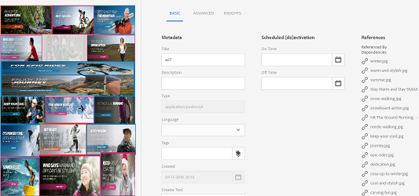

# Gerenciar ativos compostos com subativos {#managing-compound-assets}

Os ativos Adobe Experience Manager (AEM) podem identificar se um arquivo carregado contém referências a ativos que já existem no repositório. Este recurso está disponível somente para formatos de arquivo suportados. Se o ativo carregado contiver referências a ativos AEM, um link bidirecional será criado entre os ativos carregados e referenciados.

Além de eliminar a redundância, a referência a ativos AEM em aplicativos Adobe Creative Cloud aumenta a colaboração e a eficiência dos usuários.

A AEM Assets oferece suporte para referência **bidirecional**. Você pode encontrar ativos referenciados na página de detalhes do ativo do arquivo carregado. Além disso, você pode visualização os arquivos de referência para AEM ativos na página de detalhes do ativo referenciado.

As referências são resolvidas com base no caminho, na ID do documento e na ID da instância dos ativos referenciados.

## Adicionar AEM Assets como referências no Adobe Illustrator {#refai}

Você pode fazer referência a ativos AEM existentes em um arquivo Adobe Illustrator.

1. Usando [AEM aplicativo](https://helpx.adobe.com/experience-manager/desktop-app/aem-desktop-app.html)para desktop, instale o repositório AEM Assets como uma unidade em sua máquina local. Na unidade montada, navegue até o local do ativo que deseja referenciar.
1. Arraste o ativo da unidade montada para o arquivo Illustrator.
1. Salve o arquivo Illustrator na unidade montada ou [carregue](managing-assets-touch-ui.md#uploading-assets) no repositório AEM.
1. Após a conclusão do fluxo de trabalho, vá para a página de detalhes do ativo do ativo. As referências a ativos AEM existentes são listadas em **[!UICONTROL Dependências]** na coluna **[!UICONTROL Referências]** .

   

1. Os ativos referenciados que aparecem em **[!UICONTROL Dependências]** também podem ser referenciados por arquivos diferentes do atual. Para visualização de uma lista de arquivos de referência para um ativo, clique no ativo em **[!UICONTROL Dependências]**.

   

1. Clique no ícone Propriedades **[!UICONTROL da]** Visualização na barra de ferramentas. Na página de propriedades, a lista de arquivos que fazem referência ao ativo atual é exibida na coluna **[!UICONTROL Referências]** da guia **[!UICONTROL Básico]** .

   

## Adicionar ativos AEM como referências no Adobe InDesign {#add-aem-assets-as-references-in-adobe-indesign}

Para fazer referência AEM ativos de dentro de um arquivo de InDesign, arraste AEM ativos para o arquivo de InDesign ou exporte o arquivo de InDesign como um arquivo ZIP.

Os ativos referenciados já existem no AEM Assets. Você pode extrair subativos [configurando o servidor](indesign.md)de InDesigns. Os ativos incorporados em um arquivo de InDesign são extraídos como subativos.

>[!NOTE]
>
>Se o servidor do InDesign for proxy, os arquivos do InDesign terão sua pré-visualização incorporada aos metadados do XMP. Nesse caso, a extração em miniatura não é explicitamente exigida. No entanto, se o servidor do InDesign não for proxy, as miniaturas deverão ser explicitamente extraídas para arquivos do InDesign.

### Criar referências Arrastar AEM ativos {#create-references-by-dragging-aem-assets}

Esse procedimento é semelhante a [Adicionar ativos AEM como referências no Adobe Illustrator](#refai).

### Criar referências a ativos AEM exportando um arquivo ZIP {#create-references-to-aem-assets-by-exporting-a-zip-file}

1. Execute as etapas em [Criação de modelos](/help/sites-developing/workflows-models.md) de fluxo de trabalho para criar um novo fluxo de trabalho.
1. Use o recurso Pacote da Adobe InDesign para exportar o documento.
A Adobe InDesign pode exportar um documento e os ativos vinculados como um pacote. Nesse caso, a pasta exportada contém uma pasta Links que contém subativos no arquivo de InDesign.
1. Crie um arquivo ZIP e carregue-o no repositório AEM.
1. Start do fluxo de trabalho do Unarchiver.
1. Quando o fluxo de trabalho é concluído, as referências na pasta Links são automaticamente mencionadas como subativos. Para visualização de uma lista de ativos referenciados, navegue até a página de detalhes do ativo do InDesign e feche o [Painel](/help/sites-authoring/basic-handling.md#rail-selector).

## Adicionar ativos AEM como referências no Adobe Photoshop {#refps}

1. Usando um cliente WebDav, monte o AEM Assets como uma unidade.
1. Para criar referências a ativos AEM em um arquivo Photoshop, navegue até os ativos correspondentes na unidade montada usando a funcionalidade Colocar vinculado no Photoshop.

   

1. Salve o arquivo Photoshop na unidade montada ou [carregue](managing-assets-touch-ui.md#uploading-assets) no repositório AEM.
1. Após a conclusão do fluxo de trabalho, as referências aos ativos AEM existentes são listadas na página de detalhes do ativo.

   Para visualização dos ativos referenciados, feche o [Painel](/help/sites-authoring/basic-handling.md#rail-selector) na página de detalhes do ativo.

1. Os ativos referenciados também contêm a lista de ativos dos quais são referenciados. Para visualização de uma lista de ativos referenciados, navegue até a página de detalhes do ativo e feche o [painel](/help/sites-authoring/basic-handling.md#rail-selector).

>[!NOTE]
>
>Os ativos em ativos compostos também podem ser referenciados com base na ID do Documento e na ID da instância. Essa funcionalidade está disponível somente nas versões Adobe Illustrator e Adobe Photoshop. Para outros, a referência é feita com base na trajetória relativa dos ativos vinculados no ativo composto principal, conforme feito em versões anteriores do AEM.

## Criar subativos {#generate-subassets}

Para os ativos suportados com formatos de várias páginas — Arquivos PDF, arquivos AI, arquivos Microsoft PowerPoint e Apple Keynote e arquivos Adobe InDesign — AEM pode gerar subativos que correspondem a cada página individual do ativo original. Esses subativos estão vinculados ao ativo *pai* e facilitam a visualização de várias páginas. Para todos os outros fins, os subativos são tratados como ativos normais em AEM.

Por padrão, a geração de conjunto de subconjuntos é desativada. Para ativar a geração de subativos, siga estas etapas:

1. Efetue login no Experience Manager como um administrador. Acesse **[!UICONTROL Ferramentas > Fluxo de trabalho > Modelos]**.
1. Selecione Fluxo de trabalho **[!UICONTROL Atualizar ativo]** DAM e clique em **[!UICONTROL Editar]**.
1. Clique em **[!UICONTROL Alternar painel]** lateral e localize a etapa **[!UICONTROL Criar subativo]** . Adicione a etapa ao fluxo de trabalho. Clique em **[!UICONTROL Sincronizar]**.

Para gerar os subativos, execute um dos procedimentos a seguir:

* Novos ativos: O fluxo de trabalho [!UICONTROL DAM Update Assets] é executado em qualquer novo ativo carregado para AEM. Os subativos são gerados automaticamente para novos ativos de várias páginas.
* Ativos de várias páginas existentes: Execute manualmente o fluxo de trabalho Atualizar ativos [!UICONTROL do] DAM seguindo uma das etapas:

   * Selecione um ativo e clique em [!UICONTROL Linha do tempo] para abrir o painel esquerdo. Como alternativa, use o atalho do teclado `alt + 3`. Clique em Fluxo de trabalho [!UICONTROL do]Start, selecione Ativo [!UICONTROL de atualização]DAM, clique em [!UICONTROL Start]e em [!UICONTROL Prosseguir].
   * Selecione um ativo e clique em [!UICONTROL Criar > Fluxo de trabalho] na barra de ferramentas. Na caixa de diálogo pop-up, selecione Fluxo de trabalho [!UICONTROL DAM Update Asset (Atualizar ativo] DAM), clique em [!UICONTROL Start]e em [!UICONTROL Continue (Continuar]).

Especificamente para documentos do Microsoft Word, execute o fluxo de trabalho de Documentos **[!UICONTROL do]** DAM Parse Word. Ele gera um `cq:Page` componente do conteúdo do documento do Microsoft Word. As imagens extraídas do documento são referenciadas do `cq:Page` componente. Essas imagens são extraídas mesmo se a geração de subativos estiver desativada.

## View subassets {#viewing-subassets}

Os subativos são exibidos somente se os subativos forem gerados e estiverem disponíveis para o ativo multipáginas selecionado. Para visualização dos subativos gerados, abra o ativo de várias páginas. Na área superior esquerda da página, clique no ícone  esquerdo e clique em **[!UICONTROL Subativos]** na lista. Quando você seleciona **[!UICONTROL Subativos]** na lista. Como alternativa, use o atalho do teclado `alt + 5`.

## páginas de Visualização de um arquivo de várias páginas {#view-pages-of-a-multi-page-file}

É possível visualização de um arquivo de várias páginas, como PDF, INDD, PPT, PPTX e AI, usando o recurso Visualizador de páginas do AEM Assets. Abra um ativo de várias páginas e clique em Páginas **[!UICONTROL de]** Visualização no canto superior esquerdo da página. O Visualizador de página que é aberto exibe as páginas do ativo e os controles para navegar e aplicar zoom em cada página.

Para o InDesign, você pode extrair páginas usando o servidor do InDesign. Se as pré-visualizações das páginas forem salvas durante a criação do arquivo de InDesign, o InDesign Server não será necessário para a extração da página.

As seguintes opções estão disponíveis na barra de ferramentas, no painel esquerdo e nos controles do Visualizador de páginas:

* **[!UICONTROL Ações]** da área de trabalho para abrir ou revelar um subativo específico usando AEM aplicativo da área de trabalho. Veja como [configurar as ações](https://docs.adobe.com/content/help/en/experience-manager-desktop-app/using/using.html#desktopactions-v2) da área de trabalho se você estiver usando AEM aplicativo da área de trabalho.

* **[!UICONTROL A opção Propriedades]** abre a página [!UICONTROL Propriedades] do subativo específico.

* **[!UICONTROL A opção Anotar]** permite que você anote o subativo específico. As anotações usadas em subativos separados são coletadas e exibidas juntas quando o ativo pai é aberto para exibição.

* **[!UICONTROL A opção Visão geral]** da página exibe todos os subativos simultaneamente.

* **[!UICONTROL A opção Linha]** do tempo no painel esquerdo depois de clicar no ícone  esquerdo exibe o fluxo de atividade do arquivo.

## Práticas recomendadas e limitação {#best-practice-limitation-tips}

* A geração de subconjuntos pode consumir muitos recursos em qualquer implantação de Experience Manager. Se você estiver gerando subativos quando os ativos complexos forem carregados, adicione a etapa no fluxo de trabalho Atualizar ativo do DAM. Se você estiver gerando subativos sob demanda, crie um fluxo de trabalho separado para gerar subativos. Um fluxo de trabalho dedicado permite que você pule as outras etapas no fluxo de trabalho do DAM Update Asset e salve os recursos tecnológicos.

>[!MORELIKETHIS]
>
>* [Usar o aplicativo Adobe Experience Manager para desktop](https://docs.adobe.com/content/help/en/experience-manager-desktop-app/using/using.html)