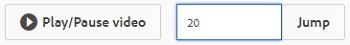
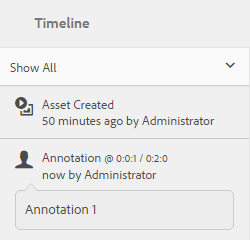

# Gerenciar ativos de vídeo {#managing-video-assets}

Saiba como gerenciar e editar os ativos de vídeo nos Ativos da Adobe Experience Manager. Além disso, se você tiver licença para usar o Dynamic Media, consulte a [documentação do Dynamic Media Video](video.md).

## Fazer upload e visualizar ativos de vídeo {#uploading-and-previewing-video-assets}

[!DNL Experience Manager] Os ativos geram visualizações para ativos de vídeo com a extensão MP4. Se o formato do ativo não for MP4, instale o FFmpeg pack para gerar uma pré-visualização. FFmpeg cria representações de vídeo do tipo OGG e MP4. Você pode visualizar essas representações na interface do usuário do [!DNL Experience Manager] Assets.

1. Na pasta ou nas subpastas Ativos digitais, navegue até o local onde deseja adicionar ativos digitais.
1. Para fazer upload do ativo, clique ou toque em **[!UICONTROL Criar]** na barra de ferramentas e escolha **[!UICONTROL Arquivos]**. Como alternativa, solte-o diretamente na área de ativos. Consulte [Upload de ativos](managing-assets-touch-ui.md#uploading-assets) para obter detalhes sobre a operação de upload.
1. Para visualizar um vídeo na exibição de Cartão, toque no botão **[!UICONTROL Reproduzir]** no ativo de vídeo.

   

   Você pode pausar ou reproduzir vídeo somente na visualização **[!UICONTROL Cartão]**. O botão Reproduzir/Pausar não está disponível na exibição **[!UICONTROL Lista]**.

1. Toque no ícone **[!UICONTROL Editar]** no cartão para visualizar o vídeo na visualização **[!UICONTROL Detalhes]**.

   O vídeo é reproduzido no player de vídeo nativo do navegador. Você pode reproduzir, pausar, controlar o volume e aplicar zoom ao vídeo em tela cheia.

   

## Configuração para fazer upload de ativos com mais de 2 GB {#configuration-to-upload-video-assets-that-are-larger-than-gb}

Por padrão, os [!DNL Experience Manager] Ativos não permitem fazer upload de ativos com mais de 2 GB por causa de um limite de tamanho de arquivo. No entanto, é possível substituir esse limite indo até o CRXDE Lite e criando um nó no diretório `/apps`. O nó deve ter o mesmo nome de nó, estrutura de diretório e propriedades de nó comparáveis da ordem.

Além da configuração [!DNL Experience Manager] do Assets, altere as seguintes configurações para fazer upload de ativos grandes:

* Aumente o tempo de expiração do token. Consulte [!UICONTROL Servlet CSRF do Adobe Granite] no Console da Web em `https://[aem_server]:[port]/system/console/configMgr`. Para obter mais informações, consulte [Proteção CSRF](/help/sites-developing/csrf-protection.md).
* Aumente o `receiveTimeout` na configuração do Dispatcher. Para obter mais informações, consulte [Configuração do Dispatcher do Experience Manager](https://experienceleague.adobe.com/docs/experience-manager-dispatcher/using/configuring/dispatcher-configuration.html#renders-options).

>[!NOTE]
>
>A interface de usuário [!DNL Experience Manager] clássica não tem uma restrição de limite de tamanho de arquivo de dois gigabytes. Além disso, o fluxo de trabalho completo para vídeo grande não é totalmente compatível.

Para configurar um limite de tamanho de arquivo mais alto, execute as seguintes etapas no diretório `/apps`.

1. No AEM, toque em **[!UICONTROL Ferramentas > Geral > CRXDE Lite]**.
1. Na página **[!UICONTROL CRXDE Lite]**, na janela do diretório à esquerda, navegue até `/libs/dam/gui/content/assets/jcr:content/actions/secondary/create/items/fileupload`. Para ver a janela do diretório, toque no ícone `>>`.
1. Na barra de ferramentas, toque em **[!UICONTROL Sobrepor nó]**. Como alternativa, selecione **[!UICONTROL Sobrepor nó]** no menu de contexto.
1. Na caixa de diálogo **[!UICONTROL Sobrepor nó]**, toque em **[!UICONTROL OK]**.

   

1. Atualize o navegador. O nó de sobreposição `/apps/dam/gui/content/assets/jcr:content/actions/secondary/create/items/fileupload` está selecionado.
1. Na guia **[!UICONTROL Properties]**, insira o valor apropriado em bytes para aumentar o limite de tamanho para o tamanho desejado. Por exemplo, insira o valor `32212254720` para aumentar o limite de tamanho para 30 GB.

1. Na barra de ferramentas, toque em **[!UICONTROL Salvar tudo]**.
1. No AEM, toque em **[!UICONTROL Ferramentas > Operações > Console da Web]**.
1. Na página **[!UICONTROL Pacotes do Console da Web do Adobe Experience Manager]**, na coluna **[!UICONTROL Nome]** da tabela, localize e toque em **[!UICONTROL Manipulador de Trabalho do Processo Externo do Fluxo de Trabalho do Adobe Granite]**.
1. Na página **[!UICONTROL Manipulador de Trabalho do Processo Externo do Adobe Granite do Fluxo de Trabalho]**, defina os segundos para os campos **[!UICONTROL Tempo Limite Padrão]** e **[!UICONTROL Tempo Limite Máximo]** para `18000` (cinco horas).
1. Toque em **[!UICONTROL Salvar]**.
1. Em AEM, toque em **[!UICONTROL Ferramentas > Fluxo de trabalho > Modelos]**.
1. Na página **[!UICONTROL Modelos de fluxo de trabalho]**, selecione **[!UICONTROL Codificar vídeo do Dynamic Media]** e toque em **[!UICONTROL Editar]**.
1. Na página **[!UICONTROL Workflow]**, toque duas vezes no componente **[!UICONTROL Dynamic Media Video Service Process]**.
1. Na caixa de diálogo **[!UICONTROL Propriedades da etapa]**, na guia **[!UICONTROL Comum]**, expanda **[!UICONTROL Configurações avançadas]**.
1. No campo **[!UICONTROL Tempo limite]**, especifique um valor `18000` e toque em **[!UICONTROL OK]** para retornar à página de fluxo de trabalho **[!UICONTROL Codificação de vídeo do Dynamic Media]**.
1. Próximo à parte superior da página, abaixo do título da página **[!UICONTROL Codificar Vídeo do Dynamic Media]**, toque em **[!UICONTROL Salvar]**.

## Publicar ativos de vídeo {#publishing-video-assets}

Após a publicação dos ativos de vídeo, eles ficam disponíveis para inclusão em uma página da Web por meio de um URL ou incorporação em uma página da Web. Consulte [Publicar ativos](publishing-dynamicmedia-assets.md).

## Anotar ativos de vídeo {#annotating-video-assets}

1. No console Assets, toque no ícone **[!UICONTROL Edit]** no cartão de ativos para exibir a página de detalhes do ativo.
1. Toque no ícone **[!UICONTROL Visualizar]** para reproduzir o vídeo.
1. Para anotar o vídeo, toque no botão **[!UICONTROL Anotar]**. Uma anotação é adicionada no ponto de tempo (quadro) específico do vídeo.

   Ao anotar, é possível desenhar na tela e incluir um comentário com o desenho. Os comentários são salvos automaticamente no Adobe Experience Manager Assets.

   

   Para sair do assistente de anotação, toque em **[!UICONTROL Fechar]**.

1. Para pular para um ponto específico no vídeo, especifique o tempo em segundos no campo de texto e clique em **[!UICONTROL Jump]**. Por exemplo, para ignorar os primeiros 20 segundos de vídeo, digite `20` no campo de texto.

   

1. Clique em uma anotação para exibi-la na linha do tempo. Toque em **[!UICONTROL Excluir]** para remover a anotação da linha do tempo.

   
