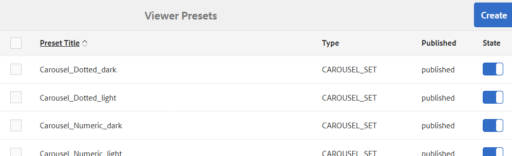

# Managing Dynamic Media viewer presets {#managing-viewer-presets}

Uma predefinição do visualizador de Dynamic Media é uma coleção de configurações que determinam como os usuários visualizações ativos de mídia avançada em suas telas de computadores e dispositivos móveis. Se você for um administrador, poderá criar Predefinições do visualizador. As configurações estão disponíveis para uma matriz de opções de configuração do visualizador. Por exemplo, você pode alterar o tamanho de exibição ou o comportamento de zoom do visualizador.

Para obter instruções sobre como criar e personalizar suas próprias predefinições do visualizador HTML5, consulte o SDK *do visualizador HTML5 da* Adobe Scene7. O SDK está disponível no servidor de publicação IS incorporado ao próprio SDK. Cada versão da biblioteca tem sua própria documentação do SDK incluída.

Caminho: `<scene7_domain>/s7sdk/<library_version>/docs/jsdocs/index.html`.\
Por exemplo, 3.5 SDK: [https://s7d1.scene7.com/s7sdk/3.5/docs/jsdoc/index.html](https://s7d1.scene7.com/s7sdk/3.5/docs/jsdoc/index.html)

Consulte também o Guia [de referência para visualizadores de](https://docs.adobe.com/content/help/en/dynamic-media-developer-resources/library/home.html)Adobe.

Esta seção descreve como criar, editar e gerenciar predefinições do visualizador. Você pode aplicar uma predefinição do visualizador a um ativo sempre que o pré-visualização. See [Applying Viewer Presets](viewer-presets.md).

>[!NOTE]
>
>Observe que a edição de predefinições ** predefinidas e predefinidas do visualizador não é um cenário compatível. Se você tentar editar uma predefinição de visualizador predefinida, será solicitado que você salve a predefinição do visualizador usando um novo nome.

## Acessibilidade do teclado para visualizadores {#keyboard-accessibility-for-viewers}

Todos os visualizadores prontos para uso suportam a acessibilidade do teclado.

Consulte também [Acessibilidade e navegação](https://docs.adobe.com/content/help/en/dynamic-media-developer-resources/library/c-keyboard-accessibility.html)do teclado.

## Managing Dynamic Media viewer presets {#managing-presets}

You can add, edit, delete, publish, unpublish, and preview viewer presets in AEM by tapping **[!UICONTROL Tools > Assets > Viewer Presets]**.

>[!NOTE]
>
>Por padrão, o sistema mostra 15 predefinições do visualizador quando você seleciona Visualizadores na visualização detalhada de um ativo. Você pode aumentar esse limite. Consulte [Aumentar o número de predefinições do visualizador exibidas](#increasing-the-number-of-viewer-presets-that-display).

## Suporte do visualizador para páginas da Web responsivas projetadas {#viewer-support-for-responsive-designed-web-pages}

Páginas da Web diferentes têm necessidades diferentes. Por exemplo, às vezes você deseja uma página da Web que forneça um link que abra o Visualizador HTML5 em uma janela separada do navegador. Em outros casos, pode ser necessário incorporar o Visualizador HTML5 diretamente na página de hospedagem. No último caso, a página da Web pode ter um layout estático. Ou pode ser *responsivo* e exibido de forma diferente em dispositivos diferentes ou para tamanhos diferentes de janelas do navegador. Para acomodar essas necessidades, todos os visualizadores HTML5 predefinidos e prontos para uso que acompanham o Dynamic Media suportam páginas da Web estáticas e páginas da Web responsivas projetadas.

Consulte Biblioteca [de imagens](https://docs.adobe.com/content/help/en/dynamic-media-developer-resources/image-serving-api/image-serving-api/responsive-static-image-library/c-about-responsive-static-image-library.html) responsivas na Ajuda *da API de* disponibilização de imagens para obter mais informações sobre como incorporar visualizadores responsivos às suas páginas da Web.

>[!NOTE]
>
>Observe que você deve publicar todos os visualizadores prontos para uso antes de usá-los pela primeira vez.\
>See [Publishing Viewer Presets.](#publishing-viewer-presets)

## Compatibilidade do sistema predefinido do visualizador  {#viewer-preset-system-compatibility}

Todas as predefinições de visualizador prontas para uso que acompanham o Dynamic Media são totalmente compatíveis com os seguintes sistemas:

* Desktops
* Apple iPhone
* Apple iPad
* Android Smartphone
* Tablet Android
* Para vídeo, é fornecido suporte adicional para reprodução MP4 para o [Blackberry](https://developer.blackberry.com/devzone/develop/supported_media/bb_media_support_at_a_glance.html#kba1328730952678) e o [Windows Phone 8](https://msdn.microsoft.com/library/windows/apps/ff462087%28v=vs.105%29.aspx).

### Tipos de mídia avançada para predefinições do visualizador {#rich-media-types-for-viewer-presets}

Os administradores podem adicionar e personalizar os seguintes tipos de mídia avançada ao criar novas predefinições do visualizador.

| Tipos de mídia avançada | Descrição |
|:---|:---|
| **Conjunto do Carousel** | Pontos de acesso, mapas de imagem ou ambos são adicionados a uma série de duas ou mais imagens. Um cliente pode deslocar as imagens para a esquerda ou para a direita e, em seguida, clicar em um ponto de acesso em uma imagem para obter detalhes adicionais ou para comprar diretamente da categoria, da casa ou das landings page de um site. |
| **Flyout Zoom** | Exibe uma segunda imagem da área com zoom ao lado da imagem original. Não há controles para usar - os usuários movem a seleção para a área que desejam visualização. |
|  | Ao determinar o uso total da largura de banda para esse visualizador, considere que a imagem principal e a imagem flyout são servidas no visualizador. O tamanho da imagem principal (Largura e Altura do palco) e o Fator de zoom determinam o tamanho da imagem de flyout. Para impedir que o tamanho do arquivo de menu suspenso se torne muito grande, equilibre estes dois valores: se você tiver um tamanho de imagem principal grande, abaixe o valor do Fator de zoom. (A Largura do Flyout e a Altura do Flyout determinam o tamanho da janela do flyout, mas não o tamanho da imagem do flyout fornecida para o visualizador.) |
|  | Por exemplo, se o tamanho da sua imagem principal for 350 por 350 pixels, com um Fator de zoom de 3, a imagem de flyout resultante será de 1050 por 1050 pixels. Se o tamanho da imagem principal for 300 por 300 pixels, com um Fator de zoom de 4, a imagem de flyout será de 1200 por 1200 pixels. Dependendo da configuração de qualidade JPEG (as configurações recomendadas estão entre 80 e 90), é possível diminuir o tamanho do arquivo significativamente. Os fatores de zoom recomendados são de 2,5 a 4, dependendo do tamanho da imagem principal. |
| **Zoom em linha** | Exibe uma imagem da área com zoom no visualizador original. Não há controles para usar. Ou seja, os usuários movem a seleção para a área que desejam visualização. |
| **Definição de imagem** | No visualizador Conjunto de imagens, os usuários podem ver visualizações ou variações de cor diferentes de um item clicando em uma imagem em miniatura. Este visualizador também oferta ferramentas de zoom para examinar imagens com atenção. |
| **Imagem interativa** | Os hotspots são adicionados a partes de uma imagem em que um cliente pode clicar para obter detalhes adicionais ou para comprar diretamente da categoria, da casa ou do landing page de um site. |
| **Vídeo interativo** | As miniaturas são adicionadas aos segmentos da linha do tempo em um vídeo em que um cliente pode clicar para obter detalhes adicionais ou para comprar diretamente da categoria, da página inicial ou das landings page de um site. |
| **Mix de mídia** | Exibe tipos diferentes de mídia em um visualizador. Você pode incluir conjuntos de rotação, conjunto de imagens, imagens e vídeos. |
| **Imagem panorâmica** | Os visualizadores de Imagem panorâmica e PanorâmicaVR renderizam imagens panorâmicas esféricas para mergulhar os usuários em uma experiência de visualização de 360° de uma sala, propriedade, local ou paisagem. |
|  | Para que uma imagem carregada seja qualificada como um panorama esférico, ela deve ter um ou ambos os seguintes: <ul><li>Uma proporção largura/altura de 2:1.</li><li>Marcado com as palavras-chave equirectangular ou esférico e panorama, ou esférico e panorâmico. Consulte [Uso de tags](../sites-authoring/tags.md).</li></ul> |
|  | Tanto a proporção quanto os critérios de palavra-chave se aplicam aos ativos panorâmicos para a página de detalhes do ativo e o componente WCM &quot;Mídia panorâmica&quot;. |
|  | Importante: Este visualizador só está disponível no modo Dynamic Media - Scene7. |
| **Grupo de rotação** | Fornece várias visualizações de uma imagem para que os usuários possam girar o objeto para examinar os diferentes lados e ângulos. |
| **Vídeo** | Reproduz vídeo usando streaming de taxa de bits progressiva ou adaptável. O streaming adaptável de taxa de bits executa automaticamente a detecção de dispositivos e largura de banda para fornecer o vídeo de qualidade correta no formato correto. |
| **Zoom vertical** | O visualizador de zoom vertical permite maximizar uma experiência de visualização de imagem de produto para fornecer aos usuários a melhor representação de um produto. A localização vertical das amostras faz o seguinte: <ul><li>Certifique-se de que as amostras estejam acima da dobra. Com amostras horizontais, dependendo do tamanho da tela da área de trabalho do ’ do usuário, as amostras não ficavam visíveis até que o usuário rolasse para baixo na página. Ao colocar as amostras verticalmente no visualizador, ele garante que elas fiquem visíveis, independentemente do tamanho da tela do usuário.</li><li>Maximiza o tamanho da imagem principal. Com amostras horizontais, é necessário reservar espaço na página para garantir que elas estejam visíveis. Esse posicionamento diminuiu o tamanho da imagem principal. No entanto, com um layout de amostra vertical, não é necessário alocar esse espaço. Assim, você pode maximizar o tamanho da imagem principal.</li></ul> |
| **Zoom** | Permite que os usuários aumentem o zoom na área clicando nela. Os usuários podem clicar em controles para aumentar o zoom, diminuir o zoom e redefinir a imagem para seu tamanho padrão. |

## Lista das predefinições do visualizador predefinidas {#list-of-out-of-the-box-viewer-presets}

A tabela a seguir identifica todas as predefinições predefinidas e predefinidas do visualizador que vêm com o Dynamic Media.

Consulte também Demos [ao](https://landing.adobe.com/en/na/dynamic-media/ctir-2755/live-demos.html)vivo.

Para obter informações sobre o navegador da Web e as versões do sistema operacional compatíveis para visualizadores, consulte as Notas de versão dos visualizadores.

Consulte as notas *de versão* dos visualizadores no sumário do Guia [de referência dos](https://docs.adobe.com/content/help/en/dynamic-media-developer-resources/library/home.html)visualizadores.

>[!NOTE]
>
>Todas as predefinições do visualizador predefinidas no Dynamic Media já estão ativadas (ativadas), mas é necessário publicá-las.\
>See [Publishing Viewer Presets](#publishing-viewer-presets).
>
>Todas as novas predefinições do visualizador que você criar e adicionar devem ser ativadas ** e publicadas.\
>Consulte [Ativando ou Desativando predefinições](#activating-or-deactivating-viewer-presets) do visualizador e predefinições [do visualizador de](#publishing-viewer-presets)publicação.

| Título predefinido do visualizador | Tipo | Nome do arquivo CSS |
|:---|:---|:---|
| Carrossel_Dotted_black | Carousel_Set | html5_carouselviewer_doted_black.css |
| Carrossel_Dotted_light | Carousel_Set | html5_carouselviewer_doted_light.css |
| Carousel_Numeric_black | Carousel_Set | html5_carouselviewer_numeric_black.css |
| Carousel_Numeric_light | Carousel_Set | html5_carouselviewer_numeric_light.css |
| Flyout | Flyout_Zoom | html5_flyoutviewer.css |
| ImageSet_black | Definição de imagem | html5_zoomviewer_black.css |
| ImageSet_light | Definição de imagem | html5_zoomviewer_light.css |
| InlineMixedMedia_black | Mixed_Media | html5_inlinemixedmediaviewer_black.css |
| InlineMixedMedia_light | Mixed_Media | html5_inlinemixedmediaviewer_light.css |
| ZoomEmLinha | Flyout_Zoom | html5_inlinezoomviewer.css |
| MixedMedia_black | Mixed_Media | html5_mixedmediaviewer_black.css |
| MixedMedia_light | Mixed_Media | html5_mixedmediaviewer_light.css |
| PanorâmicaImage | Panorâmico_Imagem | html5_panoramicimage.css |
| PanorâmicaImageVR | Panorâmico_Imagem | html5_panoramicimage.css |
| Shoppable_Banner | Interative_Image | html5_interativeimage.css |
| Comprável_Vídeo_escuro | Interative_Video | html5_interativevideoviewer_black.css |
| Shoppable_Video_light | Interative_Video | html5_interativevideovewer_light.css |
| SpinSet_black | Spin_Set | html5_spinviewer_black.css |
| SpinSet_light | Spin_Set | html5_spinviewer_light.css |
| Vídeo (inclui suporte para legendas ocultas) | Vídeo | html5_videoviewer.css |
| Video_social (inclui suporte para legendagem fechada e mídia social) | Vídeo | html5_videoviewersocial.css |
| Zoom_escuro | Zoom | html5_basiczoomviewer_black.css |
| Zoom_light | Zoom | html5_basiczoomviewer_light.css |
| ZoomVertical_escuro | Vertical_Zoom | html5_zoomverticalviewer_black.css |
| ZoomVertical_light | Vertical_Zoom | html5_zoomverticalviewer_light.css |

### Matriz de gestos de visualizadores móveis compatíveis {#supported-mobile-viewers-gestures-matrix}

A tabela a seguir identifica os gestos do visualizador móvel compatíveis com dispositivos iOS, Android 2.x e Android 3.x.

| Gesto | Flyout Zoom | Zoom | Rotação |
|---|---|---|---|
| **Arrastar** | Panfletos | Panfletos | Panfletos |
| **Tocar** | Mostra a janela do flyout | Mostra ou oculta a interface do usuário | Mostra ou oculta a interface do usuário |
| **Duplo-toque** | Não se aplica | Amplia ou redefine | Amplia ou redefine |
| **Pinch open** | Não se aplica | Aumenta o zoom (somente iOS e Android 3x) | Aumenta o zoom (somente iOS e Android 3x) |
| **Aperte para fechar** | Não se aplica | Diminui o zoom (somente iOS e Android 3x) | Diminui o zoom (somente iOS e Android 3x) |
| **Deslizar** | Barra de amostras de rolagem | Rolar imagens | Gira |
| **Flick** | Barra de amostras de rolagem | Rolar imagens | Gira |

## Aumentar o número de predefinições do visualizador de Mídia dinâmica que são exibidas {#increasing-the-number-of-viewer-presets-that-display}

AEM mostra uma grande variedade de predefinições do visualizador ao exibir ativos de Visualização **[!UICONTROL Detalhada > Visualizadores]**. Você pode aumentar ou diminuir o número de visualizadores exibidos.

**Para aumentar o número de predefinições do visualizador de Dynamic Media exibidas**:

1. Navegue até **[!UICONTROL CRXDE Lite]** ([http://localhost:4502/crx/de](http://localhost:4502/crx/de)).
1. Navegue até o nó de listagem predefinido do visualizador em `/libs/dam/gui/coral/content/commons/sidepanels/viewerpresets/viewerpresetslist`

   

1. Na propriedade **[!UICONTROL limit]**, altere o **[!UICONTROL Value]**, que é definido como 15 por padrão, para o número desejado.
1. Navegue até a fonte de dados predefinida do visualizador em `/libs/dam/gui/coral/content/commons/sidepanels/viewerpresets/viewerpresetslist/datasource`

   

1. Na propriedade **[!UICONTROL limit]** , altere o número para o número desejado, por exemplo, `{empty requestPathInfo.selectors[1] ? "20" : requestPathInfo.selectors[1]}`
1. Toque em **[!UICONTROL Salvar tudo]**.

## Criação de uma nova predefinição do visualizador do Dynamic Media {#creating-a-new-viewer-preset}

A criação de predefinições do visualizador permite que você aplique várias configurações à visualização e interaja com ativos. No entanto, não é necessário criar novas predefinições do visualizador. Se preferir, você pode usar as predefinições padrão e predefinidas do visualizador que já vêm com o AEM Assets.

Se você optar por criar uma nova predefinição do visualizador, depois de salvá-la, o estado do visualizador será ativado automaticamente (definido como **Ligado**) na página Predefinições **[!UICONTROL do]** visualizador. Esse estado significa que está visível no componente Mídia **** dinâmica e no componente Mídia **** interativa e sempre que você pré-visualização uma imagem ou vídeo.

Algumas predefinições do visualizador têm configurações exclusivas que podem afetar o uso e o comportamento geral do visualizador. Dependendo da predefinição do visualizador que você estiver criando, talvez você queira estar ciente dessas considerações especiais.

Consulte Considerações [especiais para criar uma predefinição](#special-considerations-for-creating-an-interactive-viewer-preset)do Visualizador interativo.

Consulte Considerações [especiais para criar uma predefinição](#special-considerations-for-creating-a-carousel-banner-viewer-preset)do Visualizador de banner do carrossel.

**Para criar uma nova predefinição** do visualizador de Dynamic Media:

1. In the upper-left corner of AEM, tap the AEM logo, then in the left rail, tap **[!UICONTROL Tools > Assets > Viewer Presets]**.

   

1. Na página Predefinições **[!UICONTROL do]** visualizador, na barra de ferramentas, toque em **[!UICONTROL Criar]**.
1. In the **[!UICONTROL New Viewer Preset]** dialog box, in the **[!UICONTROL Preset Name]** field, enter the name of the new preset. Choose a name carefully--they are not editable after you tap **[!UICONTROL Create]**.

   Quando você salvar a predefinição posteriormente nessas etapas, o nome será exibido na página Predefinições do visualizador sob o cabeçalho da coluna Título **** predefinido.

1. No menu suspenso Tipo **[!UICONTROL de mídia]** avançada, selecione o tipo de predefinição do visualizador que deseja criar e, no canto superior direito da página, toque em **[!UICONTROL Criar]**.

   Consulte Tipos de mídia [avançada para predefinições](#rich-media-types-for-viewer-presets)do visualizador.

1. On the **Edit Viewer Preset** page, tap the **[!UICONTROL Appearance]** tab.
1. Faça uma das seguintes opções:

   * In the **[!UICONTROL Selected Type]** pull-down menu, select a component whose visual design you want to customize. Como alternativa, você pode tocar em qualquer elemento visual no visualizador para selecioná-lo para configuração.

      O editor visual permite que você veja qual o efeito que determinada propriedade tem em um estilo. Basta definir ou ajustar qualquer propriedade para ver instantaneamente o efeito que ela tem no visualizador usando a amostra à esquerda do editor.

      As propriedades de estilização de CSS para cada tipo de predefinição do visualizador são descritas no tópico da Ajuda &quot;Personalizando *&lt;nome_do_visualizador>* &quot; no Guia [de Referência](https://docs.adobe.com/content/help/en/dynamic-media-developer-resources/library/home.html)dos Visualizadores.

      Por exemplo, se você estiver criando uma predefinição do visualizador do tipo `Mixed_Media`, consulte [Personalizar o visualizador](https://docs.adobe.com/content/help/en/dynamic-media-developer-resources/library/viewers-aem-assets-dmc/mixed-media/customing-mixed-media/c-html5-mixedmedia-viewer-customizingviewer.html) de mídia mista para obter uma lista e uma descrição de cada propriedade.

   * Se você tiver definido as configurações de estilo em um arquivo CSS separado, é possível fazer upload do arquivo CSS para o AEM Assets. Tap **[!UICONTROL Import CSS]** below the **[!UICONTROL Selected Type]** pull-down menu (you may need to scroll the visual editor up to see it) to find the uploaded CSS file and associate it with the viewer preset.

      Ao importar um arquivo CSS, o editor visual verifica se o CSS usa os marcadores do visualizador corretos. Por exemplo, se você estiver criando um visualizador de zoom, todas as regras de CSS que importar deverão ser definidas usando seu nome de classe do visualizador `.s7mixedmediaviewer` definido em um elemento do visualizador pai.

      É possível importar CSS arbitrário e feito à mão, desde que ele defina corretamente os marcadores CSS para um determinado visualizador. (Os marcadores de CSS são descritos em qualquer tópico da Ajuda &quot;Personalizando *&lt;nome do visualizador>* &quot; no Guia [de referência](https://docs.adobe.com/content/help/en/dynamic-media-developer-resources/library/home.html)dos visualizadores. Por exemplo, se você quiser ler sobre marcadores CSS para o Visualizador de zoom, consulte [Personalização do Visualizador](https://docs.adobe.com/content/help/en/dynamic-media-developer-resources/library/viewers-aem-assets-dmc/zoom/customizing-zoom/c-html5-20-zoom-viewer-customizingviewer.html)de zoom.) É possível, no entanto, que o editor visual não entenda alguns valores de CSS. Nesses casos, o editor visual tenta substituir os erros para que o CSS ainda funcione.
   >[!NOTE]
   >
   >Se preferir editar o CSS diretamente em sua forma bruta, toque em **[!UICONTROL Mostrar/Ocultar CSS]** abaixo do menu suspenso Tipo selecionado (talvez seja necessário rolar o editor visual para cima para vê-lo).****
   >
   >Como o editor visual, quando você altera uma propriedade diretamente no CSS, pode ver instantaneamente qual efeito ela tem na amostra do visualizador. E essa mesma propriedade é automaticamente atualizada ao mesmo tempo no editor visual. Dessa forma, você pode usar o editor CSS bruto, o editor visual ou ambos alternadamente.

   >[!NOTE]
   >
   >Para arte-final de botão, escolha a imagem 2x e carregue a arte-final de alta resolução. Ao trabalhar com imagens interativas e banners que podem ser comprados, você também pode selecionar entre uma variedade de botões predefinidos de ponto de acesso.

1. (Optional) Near the top of the **[!UICONTROL Edit Viewer Preset]** page, tap **[!UICONTROL Desktop]**, **[!UICONTROL Tablet]**, or **[!UICONTROL Phone]** to uniquely define visual styles for different device and screen types.
1. On the **[!UICONTROL Edit Viewer Preset]** page, tap the **Behavior** tab. Como alternativa, toque ou clique em qualquer elemento visual no visualizador para selecioná-lo para configuração.
1. No menu suspenso **[!UICONTROL Tipo selecionado]**, selecione um componente cujos comportamentos você deseja alterar.

   Muitos componentes no editor visual têm uma descrição detalhada associada. Essas descrições aparecem em caixas azuis quando você expande um componente para revelar seus parâmetros associados.

   Alguns tipos de Visualizador têm componentes que permitem especificar comandos do Servidor de imagens em um campo de texto **Comando IS**. Para obter uma lista de comandos que podem ser usados, consulte a [Referência da API de disponibilização de imagens](https://docs.adobe.com/content/help/en/dynamic-media-developer-resources/image-serving-api/image-serving-api/c-is-home.html).

   >[!NOTE]
   >
   >**Se você estiver usando um dispositivo de toque, como um telefone ou tablet...**
   >
   >Depois de digitar um valor no campo de texto, toque em outro lugar na interface do usuário para enviar a alteração e fechar o teclado virtual. Se você tocar em **[!UICONTROL Enter]**, nenhuma ação ocorrerá.

1. Near the upper-right corner of the page, tap **[!UICONTROL Save]**.
1. Publique sua nova predefinição de visualizador. Você deve publicar a predefinição antes de usá-la em seu site.

   See [Publishing Viewer Presets](#publishing-viewer-presets).

## Considerações especiais para a criação de uma predefinição de Visualizador interativo {#special-considerations-for-creating-an-interactive-viewer-preset}

**Sobre modos de exibição para miniaturas de imagens no painel**

When you create or edit an Interactive Video viewer preset, you have the choice of which **[!UICONTROL Display Mode]** setting to use when you select `InteractiveSwatches` from the **[!UICONTROL Selected Component]** pull-down menu under the **[!UICONTROL Behavior]** tab. O modo de exibição escolhido afeta como e quando as miniaturas aparecem enquanto o vídeo está sendo reproduzido. You can choose either a `segment`display mode (default) or a `continuous`display mode.

| Modo de exibição | Descrição |
|---|---|
| [!UICONTROL Segmento] | [!UICONTROL O segmento] é o modo de exibição padrão para as predefinições prontas para o visualizador de vídeo interativo Shoppable_Video_light e Shoppable_Video_black e qualquer predefinição do visualizador de vídeo interativo que você mesmo criar. |
|  | Nesse modo, quando há menos miniaturas atribuídas a um segmento de vídeo do que o número de pontos visíveis no painel de exibição, as miniaturas do subsegmento seguinte ou anterior não são puxadas para preencher nenhum ponto vazio no painel. Ou seja, preserva a exibição de amostras que foram atribuídas ao segmento de vídeo específico. |
| [!UICONTROL Contínuo] | No modo de exibição [!UICONTROL Contínua] , se o número de miniaturas em um segmento for menor que o número visível no painel, o visualizador incluirá automaticamente a exibição de miniaturas do próximo segmento ou do anterior, nos casos em que a última miniatura for exibida. |

**Sobre o comportamento de rolagem automática no Visualizador de vídeo interativo**

O comportamento de rolagem automática das miniaturas no Visualizador de vídeo interativo funciona independentemente do modo de exibição escolhido.

When you create or edit an interactive video viewer preset, you access **[!UICONTROL Auto Scroll]** from the **[!UICONTROL Behavior]** tab. Na guia Comportamento, no menu suspenso **[!UICONTROL Componentes selecionados]**, toque em **[!UICONTROL InteractiveSwatches]**. The **[!UICONTROL Auto Scroll]** check box is listed below the IS Command text field.

Se desativar a opção **[!UICONTROL Rolagem automática]** (desmarcar a caixa de seleção) na predefinição do visualizador, durante a reprodução do vídeo pelo usuário, o painel exibirá apenas a primeira imagem em miniatura em toda a duração do vídeo. Entretanto, um usuário pode rolar manualmente pelas miniaturas usando os ícones de seta para cima e para baixo, se desejar.

Ao ativar (selecionar) a **[!UICONTROL Rolagem automática]** na predefinição do visualizador as imagens em miniatura atribuídas a um segmento de vídeo são roladas para exibição no início de um segmento durante a reprodução do vídeo. Entretanto, há instâncias em que determinadas miniaturas em um segmento são exibidas com duas vezes mais comprimento no início ou no final delas. Esse comportamento ocorre porque a quantidade de miniaturas em um segmento é maior que o número visível no painel e não é divisível uniformemente.

Para ilustrar, suponha que você tenha um segmento de vídeo de 30 segundos. E há um total de nove miniaturas para serem exibidas durante 30 segundos. Seu navegador é dimensionado de forma que haja quatro posições de miniatura visíveis no painel de exibição. O segmento de tempo do vídeo de 30 segundos é dividido em três subsegmentos. A tabela a seguir mostra o detalhamento de quais miniaturas são exibidas para um determinado subsegmento de tempo:

| **Subsegmento de vídeo** | **Tempo de subsegmento em segundos** | **Miniaturas que estão visíveis no painel** |
|---|---|---|
| 1 | 0-10 | 1, 2, 3, 4 |
| 2 | 10-20 | 4, 5, 6, 7 |
| 3 | 20-30 | 6, 7, 8, 9 |

O subsegmento 3 do vídeo não se estende além das miniaturas atribuídas a ele. Observe também que as miniaturas 4, 6 e 7 são visíveis no painel duas vezes mais longas que as outras miniaturas.

A lógica usada pelo visualizador para quantas miniaturas são exibidas no painel com base no número de posições disponíveis é a seguinte:

* Número de subsegmentos = arredondar até o próximo subsegmento (número de miniaturas / número de slots visíveis no painel de miniaturas, com base no tamanho da janela do navegador).

   Usando o exemplo na tabela acima, 9 miniaturas / 4 slots = 2,25; a lógica do visualizador arredonda até três subsegmentos.

* Número de miniaturas = arredondar para a próxima miniatura (número de miniaturas / número de subsegmentos de vídeo).

   Usando o exemplo na tabela acima, 9 miniaturas / 3 subsegmentos de vídeo = 3 miniaturas.

* Duração do subsegmento = duração total do vídeo / número de subsegmentos do vídeo.

   Usando o exemplo na tabela acima, 30 segundos / 3 subsegmentos de vídeo = 10 segundos de exibição de cada subsegmento de vídeo.

### Considerações especiais para a criação de uma predefinição do visualizador de banner do carrossel {#special-considerations-for-creating-a-carousel-banner-viewer-preset}

Ao criar predefinições do visualizador de banner do carrossel, a alteração do estilo dos pontos de acesso pode ser acessada da seguinte maneira:

|  | **Descrição** | **Ações** |
|---|---|---|
| **Ícone de ponto de acesso** | Alterar o ícone usado para o ponto de acesso | Para alterar a imagem do ícone do ponto de acesso, na guia **[!UICONTROL Aparência]** , em Componente **** selecionado, toque em **[!UICONTROL ImageMapEffect]**. Em **[!UICONTROL Ícone]**, selecione **[!UICONTROL Plano de fundo]** e, no campo **[!UICONTROL Imagem]**, navegue até a imagem de plano de fundo desejada. |

## Ativar ou desativar predefinições do visualizador de Mídia dinâmica {#activating-or-deactivating-viewer-presets}

As predefinições do visualizador que estão disponíveis na interface do usuário dependem de quais estão ativas no modo Autor. Por padrão, uma predefinição do visualizador é *Ativado* depois que você a cria. Se você alternar a predefinição para desativada, ela não será exibida no modo Autor. Se a predefinição for publicada. será sempre publicada independentemente de ser ativada ou desativada. Você pode desativar as predefinições do visualizador se a lista se tornar muito fraca ou se não quiser que uma predefinição do visualizador seja disponibilizada para uso.

**Para ativar ou desativar as predefinições** do visualizador do Dynamic Media:

1. In the upper-left corner of AEM, tap the AEM logo, then in the left rail, tap **[!UICONTROL Tools > Assets > Viewer Presets]**.
1. Na página Predefinição **[!UICONTROL do]** visualizador, no cabeçalho da coluna **[!UICONTROL Estado]** , toque na alternância para ativar ou desativar uma predefinição do visualizador.

   As predefinições do visualizador ativadas têm a alternância exibida à direita, dentro de uma caixa azul; as predefinições do visualizador desativado exibem a alternância à esquerda, dentro de uma caixa cinza-clara.

## Publishing Dynamic Media viewer presets {#publishing-viewer-presets}

Ativar (ou ativar **) o estado de uma predefinição do visualizador significa que ela está visível no componente Mídia dinâmica, no componente Mídia interativa e sempre que você visualização um ativo.

Entretanto, para fornecer um ativo com uma predefinição do visualizador, a predefinição do visualizador também deve ser publicada. All viewer presets must be activated *and* published to obtain URL or embed code for an asset. Ative e publique todas as predefinições do visualizador prontas para uso que acompanham o Dynamic Media. As predefinições do visualizador personalizado criadas e adicionadas são ativadas automaticamente, mas também devem ser publicadas.

Consulte [Ativando ou Desativando predefinições](#activating-or-deactivating-viewer-presets)do visualizador.

Consulte também [Visualizar ativos](previewing-assets.md).

**Para publicar predefinições** do visualizador de Dynamic Media:

1. In the upper-left corner of AEM, tap the AEM logo, then in the left rail, tap **[!UICONTROL Tools > Assets > Viewer Presets]**.
1. Selecione uma ou mais predefinições do visualizador que deseja publicar.
1. Na barra de ferramentas, toque no ícone **[!UICONTROL Publicar]** .

## Sorting Dynamic Media viewer presets {#sorting-viewer-presets}

**Para classificar predefinições** do visualizador de Dynamic Media:

1. No canto superior esquerdo do AEM, toque no logotipo do AEM e, no painel à esquerda, toque em **Ferramentas** (ícone de martelo) **[!UICONTROL > Ativos > Predefinições do visualizador]**.
1. Clique em **[!UICONTROL Título da predefinição]**, **[!UICONTROL Tipo]**, **[!UICONTROL Publicado]** ou **[!UICONTROL Estado]** para classificar pelo cabeçalho da coluna. Por exemplo, clique em **[!UICONTROL Tipo]** para classificar os tipos de predefinição do visualizador em ordem alfabética ou não.

## Editing Dynamic Media viewer presets {#editing-viewer-presets}

Observe que a edição de predefinições ** predefinidas e predefinidas do visualizador não é um cenário compatível. Se você editar uma predefinição de visualizador predefinida, será solicitado que ela seja salva com um novo nome.

**Para editar predefinições** do visualizador de Dynamic Media:

1. In the upper-left corner of AEM, tap the AEM logo, then in the left rail, tap **[!UICONTROL Tools > Assets > Viewer Presets]**.
1. Selecione uma predefinição marcando a caixa à esquerda do título predefinido do visualizador.
1. Na barra de ferramentas, toque em **[!UICONTROL Editar]**.
1. Na página **[!UICONTROL Editar predefinição]** do visualizador, faça as alterações que deseja para a predefinição do visualizador.
1. Faça uma das seguintes opções:

   * Toque em **[!UICONTROL Salvar]** para salvar as alterações e retornar à página **[!UICONTROL Visualizar predefinição]** .
   * Toque em **[!UICONTROL Cancelar]** para anular quaisquer alterações feitas e retornar à página **[!UICONTROL Visualizador predefinido]** .

## Excluindo predefinições personalizadas do visualizador do Dynamic Media {#deleting-custom-viewer-presets}

É possível excluir as predefinições do visualizador que você criou e adicionou ao Dynamic Media.

**Para excluir predefinições** personalizadas do visualizador do Dynamic Media:

1. In the upper-left corner of AEM, tap the AEM logo, then in the left rail, tap **[!UICONTROL Tools > Assets > Viewer Presets]**.
1. Na página Predefinições **[!UICONTROL do]** visualizador, marque um Título **** predefinido e toque no ícone **[!UICONTROL Lixeira]** .
1. Toque em **[!UICONTROL Excluir]**.

## Aplicar uma predefinição do visualizador de Mídia dinâmica a um ativo {#applying-a-viewer-preset-to-an-asset}

Se já tiver publicado o ativo e o visualizador selecionado, os botões **[!UICONTROL URL]** e **[!UICONTROL Incorporar]** aparecerão depois de selecionar uma predefinição do visualizador.

**Para aplicar uma predefinição do visualizador de Dynamic Media a um ativo**:

1. Abra o ativo e, próximo ao canto superior esquerdo da página, toque no menu suspenso e selecione **[!UICONTROL Visualizadores]**.

   >[!NOTE]
   >
   >Se já tiver publicado o ativo e o visualizador selecionado, os botões **[!UICONTROL URL]** e **[!UICONTROL Incorporar]** aparecerão depois de selecionar uma predefinição do visualizador.

1. Selecione uma predefinição do visualizador no painel esquerdo para aplicá-la ao ativo.

   Você pode [copiar o URL para compartilhar](linking-urls-to-yourwebapplication.md) com outros usuários.

## Fornecer ativos com predefinições do visualizador de Dynamic Media {#delivering-assets-with-viewer-presets}

Para obter os URLs das predefinições do visualizador, consulte [Vincular URLs à sua Aplicação web](linking-urls-to-yourwebapplication.md). Consulte também [Incorporação do visualizador de vídeo em uma página](embed-code.md)da Web.

Se você estiver usando AEM como seu WCM, poderá adicionar ativos usando as predefinições do visualizador diretamente na página. See [Adding Dynamic Media Assets to Pages](adding-dynamic-media-assets-to-pages.md).
