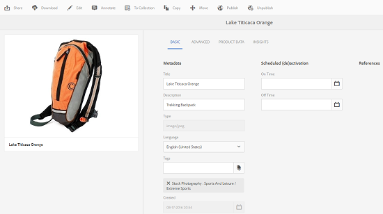

# Como editar ou adicionar metadados {#how-to-edit-or-add-metadata}

>[!CAUTION]
>
>AEM 6.4 chegou ao fim do suporte estendido e esta documentação não é mais atualizada. Para obter mais detalhes, consulte nossa [períodos de assistência técnica](https://helpx.adobe.com/br/support/programs/eol-matrix.html). Encontre as versões compatíveis [here](https://experienceleague.adobe.com/docs/).

Os metadados são informações adicionais sobre o ativo que pode ser pesquisado. Ele é automaticamente extraído quando você carrega uma imagem. É possível editar os metadados existentes ou adicionar novas propriedades de metadados a campos existentes (por exemplo, quando um campo de metadados está em branco).

Porque as empresas precisam de vocabulários de metadados controlados e confiáveis, [!DNL Experience Manager] Os ativos não permitem a adição ad hoc de novas propriedades de metadados. Embora os autores não possam adicionar novos campos de metadados para ativos, os desenvolvedores podem. Consulte [Criação de nova propriedade de metadados para ativos](meta-edit.md#editing-metadata-schema).

## Editar metadados para um ativo {#editing-metadata-for-an-asset}

Para editar metadados:

1. Siga uma das seguintes opções:

   * Na interface do usuário do Assets, selecione o ativo e clique/toque no **[!UICONTROL Propriedades da exibição]** ícone na barra de ferramentas.
   * Na miniatura do ativo, selecione o **[!UICONTROL Propriedades da exibição]** ação rápida.
   * Na página do ativo, clique/toque no link **[!UICONTROL Propriedades da exibição]** ícone  na barra de ferramentas.

   A página de ativo exibe todos os metadados do ativo. Esses metadados eram extraídos automaticamente quando foram carregados (assimilados) no [!DNL Experience Manager] Ativos.

   

1. Faça edições nos metadados em várias guias, conforme necessário, e quando concluído, clique/toque em **[!UICONTROL Salvar]** na barra de ferramentas para salvar as alterações. Clique/toque em **[!UICONTROL Fechar]** para retornar à interface da Web do Assets.

   >[!NOTE]
   >
   >Se um campo de texto estiver vazio, não há nenhum conjunto de metadados existente. Você pode inserir um valor no campo e salvá-lo para adicionar essa propriedade de metadados.

Quaisquer alterações nos metadados de um ativo são gravadas de volta no binário original como parte de seus dados de XMP. Isso é feito por meio AEM fluxo de trabalho de write-back de metadados. Alterações feitas nas propriedades existentes (como `dc:title`) são propriedades substituídas e recém-criadas (incluindo propriedades personalizadas como `cq:tags`) são adicionadas juntamente com o schema .

XMP gravação é suportada e ativada para as plataformas e os formatos de arquivo descritos em [Requisitos técnicos.](/help/sites-deploying/technical-requirements.md)

## Editar esquema de metadados {#editing-metadata-schema}

Para obter detalhes sobre como editar esquema de metadados, consulte [Edição de formulários de esquema de metadados](metadata-schemas.md#editing-metadata-schema-forms).

## Registro de um namespace personalizado em [!DNL Experience Manager] {#registering-a-custom-namespace-within-aem}

Você pode adicionar seus próprios namespaces no AEM. Assim como há namespaces predefinidos, como cq, jcr e sling, você pode ter um namespace para os metadados do repositório e o processamento xml.

1. Vá para a página de administração do tipo de nó `https://[AEM_server]:[port]/crx/explorer/nodetypes/index.jsp`.
1. Clique ou toque em **[!UICONTROL Namespaces]** na parte superior da página. A página de administração do namespace é exibida em uma janela.

1. Para adicionar um namespace, clique ou toque em **[!UICONTROL Novo]** na parte inferior.
1. Especifique um namespace personalizado na convenção de namespace XML (especifique a id no formato de um URI e um prefixo associado para a id) e clique ou toque em **[!UICONTROL Salvar]**.

## Dicas e limitações {#best-practices-limitations}

* As atualizações de metadados por meio da interface sensível ao toque alteram as propriedades dos metadados no `dc` namespace. Qualquer atualização feita por meio da API HTTP altera as propriedades dos metadados no `jcr` namespace. Consulte [como atualizar metadados usando a API HTTP](/help/assets/mac-api-assets.md#update-asset-metadata).

>[!MORELIKETHIS]
>
>* [Sobre metadados e sua necessidade no Assets](metadata.md)

