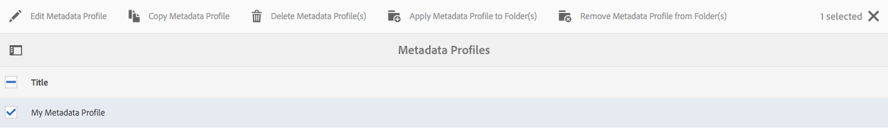

# Perfis de metadados {#metadata-profiles}

Um perfil de metadados permite aplicar metadados padrão a ativos em uma pasta. Crie um Perfil de Metadados e aplique-o a uma pasta. Qualquer ativo carregado posteriormente para a pasta herda os metadados padrão configurados no Perfil Metadados.

## Adicionar um perfil de metadados {#adding-a-metadata-profile}

1. Toque ou clique no logotipo AEM e navegue até **[!UICONTROL Ferramentas > Ativos > Perfis de metadados]** e, em seguida, toque em **[!UICONTROL Criar]**.
1. Digite um título para o Perfil Metadados, por exemplo Metadados de amostra, e clique em **[!UICONTROL Enviar]**. O **[!UICONTROL Editar formulário]** para o Perfil Metadados é exibido.

   

1. Clique em um componente e configure suas propriedades na guia **[!UICONTROL Configurações]**. Por exemplo, clique no componente **[!UICONTROL Description]** e edite suas propriedades.

   

   Edite as seguintes propriedades para o componente **[!UICONTROL Description]**:

   * **[!UICONTROL Rótulo]** do campo: O nome de exibição da propriedade de metadados. É apenas para a referência do usuário.
   * **[!UICONTROL Mapear para propriedade]**: O valor dessa propriedade fornece o caminho/nome relativo para o nó do ativo no qual ele é salvo no repositório. O valor deve sempre ser start com `./` porque indica que o caminho está sob o nó do ativo.

   

   O valor especificado para **[!UICONTROL Mapa para propriedade]** é armazenado como uma propriedade no nó de metadados do ativo. Por exemplo, se você especificar . `/jcr:content/metadata/dc:desc` como o nome do  **[!UICONTROL Mapa para a propriedade]**, a AEM Assets armazena o valor  `dc:desc` no nó de metadados do ativo.

   * **[!UICONTROL Valor]** padrão: Use essa propriedade para adicionar um valor padrão para o componente de metadados. Por exemplo, se você especificar &quot;Minha descrição&quot;, esse valor será atribuído à propriedade `dc:desc` no nó de metadados do ativo.

   

   >[!NOTE]
   >
   >Adicionando um valor padrão a uma nova propriedade de metadados (que ainda não existe no . `/jcr:content/metadata` (node) não exibe a propriedade e seu valor no  **** Perfil do ativo por padrão. Para visualização da nova propriedade na página [!UICONTROL Propriedades] do ativo, modifique o formulário de schema correspondente.

1. (Opcional) Adicione mais componentes à guia **[!UICONTROL Editar formulário]** da guia **[!UICONTROL Criar formulário]** e configure suas propriedades na guia **[!UICONTROL Configurações]**. As seguintes propriedades estão disponíveis na guia **[!UICONTROL Criar formulário]**:

| Componente | Propriedades |
|---|---|
| [!UICONTROL Título da seção] | Rótulo do campo,   Descrição |
| [!UICONTROL Texto em linha única] | Rótulo do campo,   Mapear para propriedade,   Valor padrão |
| [!UICONTROL Texto multivalor] | Rótulo do campo,   Mapear para propriedade,   Valor padrão |
| [!UICONTROL Número] | Rótulo do campo,   Mapear para propriedade,   Valor padrão |
| [!UICONTROL Data] | Rótulo do campo,   Mapear para propriedade,   Valor padrão |
| [!UICONTROL Tags padrão] | Rótulo do campo,   Mapear para propriedade,   Valor padrão,   Descrição |

1. Clique em **[!UICONTROL Concluído]**. O perfil de metadados é adicionado à lista de perfis na página **[!UICONTROL Perfis de metadados]**.

   

## Copiar um perfil de metadados {#copying-a-metadata-profile}

1. Na página **[!UICONTROL Perfis de metadados]**, selecione um perfil para fazer uma cópia dele.

   

1. Clique em **[!UICONTROL Copiar]** na barra de ferramentas.
1. Na caixa de diálogo **[!UICONTROL Copiar Perfil de metadados]**, digite um título para a nova cópia do perfil.
1. Clique em **[!UICONTROL Copiar]**. Uma cópia do perfil é exibida na lista dos perfis na página **[!UICONTROL Perfis de metadados]**.

   

## Excluir um perfil de metadados {#deleting-a-metadata-profile}

1. Na página **[!UICONTROL Perfis de metadados]**, selecione um perfil a ser excluído.

   

1. Clique em **[!UICONTROL Excluir Perfis de metadados]** na barra de ferramentas.
1. Na caixa de diálogo, clique em **[!UICONTROL Excluir]** para confirmar a operação de exclusão. O perfil de metadados é excluído da lista.

## Aplicar um perfil de metadados às pastas {#applying-a-metadata-profile-to-folders}

Quando você atribui um perfil de metadados a uma pasta, qualquer subpasta herda automaticamente o perfil da pasta pai. Isso significa que você pode atribuir apenas um perfil de metadados a uma pasta. Dessa forma, considere cuidadosamente a estrutura de pastas de onde você carrega, armazena, usa e arquiva ativos.

Se você atribuiu um perfil de metadados diferente a uma pasta, o novo perfil substituirá o perfil anterior. Os ativos de pasta existentes anteriormente permanecem inalterados. O novo perfil é aplicado aos ativos adicionados posteriormente à pasta.

As pastas que têm um perfil atribuído a ele são indicadas na interface do usuário pelo nome do perfil que aparece no nome do cartão.

Você pode aplicar perfis de metadados a pastas específicas ou globalmente a todos os ativos.

### Aplicar perfis de metadados a pastas específicas {#applying-metadata-profiles-to-specific-folders}

Aplique um perfil de metadados a uma pasta no menu **[!UICONTROL Ferramentas]** ou, se estiver na pasta, em **[!UICONTROL Propriedades]**. Esta seção descreve como aplicar perfis de metadados a pastas de ambas as maneiras.

As pastas que têm um perfil já atribuído a elas são indicadas ao exibir do nome do perfil logo abaixo do nome da pasta.

#### Aplicar perfis de metadados a pastas da interface de usuário do Perfil {#applying-metadata-profiles-to-folders-from-profiles-user-interface}

1. Toque no logotipo AEM e navegue até **[!UICONTROL Ferramentas > Ativos > Perfis de metadados]**.
1. Selecione o perfil de metadados que deseja aplicar a uma pasta ou várias pastas.

   

1. Toque em **[!UICONTROL Aplicar Perfil de Metadados à(s) pasta(s)]** e selecione a pasta ou várias pastas que deseja usar para receber os ativos carregados recentemente e toque em **[!UICONTROL Concluído]**. As pastas que têm um perfil já atribuído a elas são indicadas ao exibir do nome do perfil logo abaixo do nome da pasta.

#### Aplicar perfis de metadados a pastas de Propriedades {#applying-metadata-profiles-to-folders-from-properties}

1. No painel esquerdo, toque em **[!UICONTROL Assets]** e navegue até a pasta à qual deseja aplicar um perfil de metadados.
1. Na pasta, toque na marca de seleção para selecioná-la e, em seguida, toque em **[!UICONTROL Propriedades]**.

1. Selecione a guia **[!UICONTROL Perfis de metadados]** e selecione o perfil no menu suspenso e clique em **[!UICONTROL Salvar]**.

   

   As pastas que têm um perfil já atribuído a elas são indicadas ao exibir do nome do perfil logo abaixo do nome da pasta.

### Aplicar um perfil de metadados globalmente {#applying-a-metadata-profile-globally}

Além de aplicar um perfil a uma pasta, também é possível aplicar um globalmente para que qualquer conteúdo carregado AEM ativos em qualquer pasta tenha o perfil selecionado aplicado. Para aplicar um perfil de metadados globalmente, siga estas etapas:

1. Faça uma das seguintes opções:

   * Navegue até `https://[aem_server]:[port]/mnt/overlay/dam/gui/content/assets/foldersharewizard.html/content/dam` e aplique o perfil apropriado e toque ou clique em **[!UICONTROL Salvar]**.

      

   * Navegue até CRXDE Lite até o seguinte nó: `/content/dam/jcr:content`. Adicione a propriedade `metadataProfile:/etc/dam/metadata/dynamicmedia/<name_of_metadata_profile>` e toque em **[!UICONTROL Salvar tudo]**.

      

## Remover um perfil de metadados das pastas {#removing-a-metadata-profile-from-folders}

Quando você remove um perfil de metadados de uma pasta, qualquer subpasta herda automaticamente a remoção do perfil da pasta pai. No entanto, qualquer processamento de arquivos que tenha ocorrido dentro das pastas permanece intacto.

Remova um perfil de metadados a uma pasta do menu **[!UICONTROL Ferramentas]** ou, se estiver na pasta, nas **[!UICONTROL Propriedades]**. Esta seção descreve como remover perfis de metadados de pastas de ambas as maneiras.

### Remover perfis de metadados de pastas por meio da interface de usuário do Perfil {#removing-metadata-profiles-from-folders-via-profiles-user-interface}

Para remover um perfil de metadados de pastas por meio da interface do usuário do Perfil, siga estas etapas:

1. Toque no logotipo AEM e navegue até **[!UICONTROL Ferramentas > Ativos > Perfis de metadados]**.
1. Selecione o perfil de metadados que deseja remover de uma pasta ou de várias pastas.
1. Toque em **[!UICONTROL Remover Perfil de Metadados da(s) pasta(s)]** e selecione a pasta ou várias pastas que deseja usar para remover um perfil, em seguida, toque em **[!UICONTROL Concluído]**.

   Você pode confirmar que o perfil de metadados não é mais aplicado a uma pasta porque o nome não aparece mais abaixo do nome da pasta.

### Remova perfis de metadados de pastas por meio de Propriedades {#removing-metadata-profiles-from-folders-via-properties}

1. Toque no logotipo AEM e navegue **[!UICONTROL Assets]** até a pasta da qual você deseja remover um perfil de metadados.
1. Na pasta, toque na marca de seleção para selecioná-la e, em seguida, toque em **[!UICONTROL Propriedades]**.
1. Selecione a guia **[!UICONTROL Perfis de metadados]** e selecione **[!UICONTROL Nenhum]** no menu suspenso. Toque em **[!UICONTROL Salvar]**.

As pastas que têm um perfil já atribuído a elas são indicadas ao exibir do nome do perfil logo abaixo do nome da pasta.
