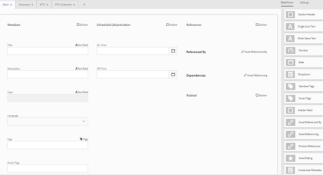

# Esquemas de metadados {#metadata-schemas}

Nos ativos Adobe Experience Manager (AEM), um esquema de metadados define o layout da página de propriedades e as propriedades de metadados exibidas para ativos que usam o esquema específico. As propriedades de metadados incluem título, descrição, tipos MIME, tags e assim por diante.

Você pode usar o editor de Formulários de esquema de metadados para modificar esquemas existentes ou adicionar esquemas de metadados personalizados.

1. Para exibir a página de propriedades de um ativo, clique ou toque em **[!UICONTROL Exibir propriedades]** de ações **** rápidas no bloco de ativo na exibição Cartão.

   

   Como alternativa, selecione um ativo e clique ou toque no ícone **[!UICONTROL Propriedades]** na barra de ferramentas.

   

1. Edite as propriedades de metadados editáveis nas várias guias.

   

   Para modificar o tipo MIME de um ativo, use um formulário de esquema de metadados personalizado ou modifique um formulário existente. Consulte [Edição de formulários](metadata-schemas.md#editing-metadata-schema-forms) de esquema de metadados para obter mais informações. Se você modificar o esquema de metadados de um determinado tipo MIME, o layout da página de propriedades para ativos com o tipo MIME atual e todos os subtipos de ativos serão modificados. Por exemplo, modificar um `jpeg` esquema em `default/image` modifica somente o layout de metadados (propriedades de ativos) para ativos com tipo MIME `IMAGE/JPEG`. No entanto, se você editar o esquema padrão, suas alterações modificarão o layout de metadados de todos os tipos de ativos.

1. Para exibir uma lista de formulários/modelos, clique no logotipo do AEM e navegue até **[!UICONTROL Ferramentas > Ativos > Esquemas de metadados]**.

   

   O AEM fornece os seguintes modelos prontos para uso:

   * **padrão**: O formulário de esquema de metadados base para ativos.
   Os seguintes formulários filho herdam as propriedades do formulário padrão:

   
i. **imagem**: Formulário de esquema para ativos com o tipo MIME `image`, por exemplo, `image/jpeg`, `image/png`etc.

   O formulário &quot;image&quot; tem os seguintes modelos de formulário filho:

   a. **jpeg**: Formulário de esquema para ativos com subtipo jpeg.

   b. **TIFF**: Formulário de esquema para os ativos com subtipo TIFF.

   ii. **aplicação**: Formulário de esquema para ativos com aplicativo do tipo MIME, por exemplo `application/pdf`, `application/zip`etc.

   a. **pdf**: Formulário de esquema para ativos com subtipo PDF.

   iii. **vídeo**: Formulário de esquema para ativos com vídeo tipo MIME, como `video/avi`, `video/mp4` etc.

   * **coleção**: Formulário de esquema para coleções
   * **** contentfragment: Formulário de esquema para fragmentos de conteúdo
   * **formulários**: Este formulário de esquema está relacionado aos formulários do [Adobe Experience Manager](/help/forms/home.md)

>[!NOTE]
>
>Para exibir os formulários filhos de um formulário de esquema, clique/toque no nome do formulário de esquema.

## Adicionar um formulário de esquema de metadados {#adding-a-metadata-schema-form}

1. Para adicionar um modelo personalizado à lista, clique em **[!UICONTROL Criar]** na barra de ferramentas.

   >[!NOTE]
   >
   >Os modelos desabilitados exibem um ícone de cadeado antes deles. Se você personalizar qualquer um dos modelos, o ícone de cadeado antes do modelo desaparecerá.

1. Na caixa de diálogo, digite o título do formulário de esquema e clique em **[!UICONTROL Criar]** para concluir o processo de criação do formulário.

   

## Editar formulários de esquema de metadados {#editing-metadata-schema-forms}

É possível editar um formulário de esquema de metadados recém-adicionado ou existente. O formulário de esquema de metadados inclui o seguinte:

* Guias
* Itens de formulário em guias.

Você pode mapear/configurar esses itens de formulário em um campo dentro de um nó de metadados no repositório CRX.

É possível adicionar novas guias ou itens de formulário ao formulário de esquema de metadados. As guias e os itens de formulário derivados do pai estão no estado bloqueado. Não é possível alterá-los no nível da criança.

1. In the **[!UICONTROL Schema Forms]** page, select the check box before a form and then click **[!UICONTROL Edit]** on the toolbar.

   

1. Na página **[!UICONTROL Editor de esquema de metadados]**, personalize a página de propriedades do ativo arrastando um ou mais componentes da lista de tipos de componentes na guia **[!UICONTROL Criar formulário]** para a guia **[!UICONTROL Básico]**.

   

1. Para configurar um componente, selecione-o e modifique suas propriedades na guia **[!UICONTROL Configurações]** .

### Componentes na guia Criar formulário {#components-within-the-build-form-tab}

A guia **[!UICONTROL Criar formulário]** lista os itens de formulário usados no formulário de esquema. A guia **[!UICONTROL Configurações]** fornece os atributos de cada item selecionado na guia **[!UICONTROL Criar formulário]** . A tabela a seguir lista os itens de formulário disponíveis na guia **[!UICONTROL Criar formulário]** :

| Nome do componente | Descrição |
|---|---|
| [!UICONTROL Título da seção] | Adicione um cabeçalho de seção para obter uma lista de componentes comuns. |
| [!UICONTROL Texto em linha única] | Adicione uma única propriedade de texto de linha. É armazenado como uma string. |
| [!UICONTROL Texto multivalor] | Adicione uma propriedade de texto de vários valores. Ele é armazenado como uma matriz de string. |
| [!UICONTROL Número] | Adicione um componente de número. |
| [!UICONTROL Data] | Adicione um componente de data. |
| [!UICONTROL Lista suspensa] | Adicione uma lista suspensa. |
| [!UICONTROL Tags padrão] | Adicionar uma tag. |
| [!UICONTROL Tags inteligentes] | Adicione para aumentar os recursos de pesquisa adicionando automaticamente tags de metadados. |
| [!UICONTROL Campo oculto] | Adicionar um campo oculto. Ele é enviado como um parâmetro POST quando o ativo é salvo. |
| [!UICONTROL Ativo referenciado por] | Adicione este componente para exibir a lista de ativos referenciados pelo ativo. |
| [!UICONTROL Fazer referência ao ativo] | Adicionar para exibir uma lista de ativos que fazem referência ao ativo. |
| [!UICONTROL Referências de produtos] | Adicionar para mostrar a lista de produtos vinculados ao ativo. |
| [!UICONTROL Classificação do ativo] | Adicionar para exibir opções para classificar o ativo. |
| [!UICONTROL Metadados do contexto] | Adicionar para controlar a exibição de outras guias de metadados na página de propriedades dos ativos. |

### Editar o componente de metadados {#editing-the-metadata-component}

Para editar as propriedades de um componente de metadados no formulário, clique no componente e edite todas ou um subconjunto das seguintes propriedades na guia **[!UICONTROL Configurações]** .

**Rótulo** do campo: O nome da propriedade de metadados exibida na página de propriedades do ativo.

**Mapear para propriedade**: Essa propriedade especifica o caminho/nome relativo para o nó do ativo no qual ele é salvo no repositório CRX. Começa com `./` porque indica que o caminho está sob o nó do ativo.

Estes são os valores válidos para esta propriedade:

* `./jcr:content/metadata/dc:title`: armazena o valor no nó de metadados do ativo como a propriedade `dc:title`.

* `./jcr:created`: Exibe a propriedade JCR no nó do ativo. Se você configurar essas propriedades nas propriedades de exibição, recomendamos marcá-las como Desativar edição, pois elas estão protegidas. Otherwise, the error [!UICONTROL Asset(s) failed to modify] results when you save the asset&#39;s properties.

Para garantir que o componente seja exibido corretamente no formulário de esquema de metadados, o caminho da propriedade não deve incluir espaços.

**Espaço reservado**: Use essa propriedade para especificar o texto relevante do espaço reservado para a propriedade metadata.

**Obrigatório**: Use essa propriedade para marcar uma propriedade de metadados como obrigatória na página de propriedades.

**Desativar edição**: Use essa propriedade para tornar uma propriedade de metadados não editável na página de propriedades.

**Mostrar campo vazio em somente** leitura: Marque essa propriedade para exibir uma propriedade de metadados na página de propriedades, mesmo que ela não tenha valor. Por padrão, quando uma propriedade de metadados não tem valor, ela não é listada na página de propriedades.

**Mostrar lista ordenada**: Use essa propriedade para exibir uma lista ordenada de opções

**Opções**: Use essa propriedade para especificar opções em uma lista

**Descrição** : Use essa propriedade para adicionar uma breve descrição para o componente de metadados.

**Classe**: Classe de objeto à qual a propriedade está associada.

**Ícone** Excluir Clique neste ícone para excluir um componente do formulário de esquema.

>[!NOTE]
>
>O componente Campo oculto não inclui esses atributos. Em vez disso, inclui propriedades, como Nome dos atributos, Valor, Rótulo do campo e Descrição. Os valores do componente Campo oculto são enviados como um parâmetro POST sempre que o ativo é salvo. Ele não é salvo como metadados do ativo.

Se você selecionar a opção **[!UICONTROL Obrigatório]**, poderá pesquisar por ativos sem metadados obrigatórios. No painel **[!UICONTROL Filtros]**, expanda o predicado **[!UICONTROL Validação de metadados]** e selecione a opção **[!UICONTROL Inválido]**. Os resultados de pesquisa exibem ativos que não têm metadados obrigatórios configurados por meio do formulário de esquema.

Se você adicionar o componente Metadados contextuais a qualquer guia de qualquer formulário de esquema, o componente aparecerá como uma lista na página de propriedades dos ativos aos quais o esquema específico é aplicado. A lista inclui todas as outras guias, exceto a guia à qual você aplicou o componente Metadados contextuais. Atualmente, esse recurso fornece funcionalidade básica para controlar a exibição de metadados com base no contexto.

Para incluir qualquer guia na página de propriedades, além da guia na qual o componente Metadados contextuais é aplicado, selecione a guia na lista. A guia é adicionada à página de propriedades.

### Especificar propriedades no arquivo JSON {#specifying-properties-in-json-file}

Em vez de especificar propriedades para as opções na guia **[!UICONTROL Configurações]**, defina as opções em um arquivo JSON especificando pares de valores chave correspondentes. Especifique o caminho do arquivo JSON no campo **[!UICONTROL Caminho JSON]**.

### Adicionar ou excluir uma guia no formulário de esquema {#adding-deleting-a-tab-in-the-schema-form}

O editor de esquema permite adicionar ou excluir uma guia. O formulário de esquema padrão inclui as guias **[!UICONTROL Básico]**, **[!UICONTROL Avançado]**, **[!UICONTROL IPTC]** e **[!UICONTROL Extensão IPTC]**, por padrão.

Clique em `+` para adicionar uma nova guia em um formulário de esquema. Por padrão, a nova guia tem o nome `Unnamed-1`. É possível modificar o nome na guia **[!UICONTROL Configurações]** . Clique `X` para excluir uma guia.

## Excluir formulários de esquema de metadados {#deleting-metadata-schema-forms}

O AEM permite que você exclua apenas formulários de esquema personalizados. Isso não permite excluir os formulários/modelos de esquema padrão. No entanto, é possível excluir quaisquer alterações personalizadas nesses formulários.

Para excluir um formulário, selecione-o e clique no ícone **[!UICONTROL Excluir]** .

>[!NOTE]
>
>Depois de excluir alterações personalizadas em um formulário padrão, o ícone de cadeado reaparece na interface do Esquema de metadados para indicar que o formulário reverteu para seu estado padrão.

>[!NOTE]
>
>Não é possível excluir os formulários de esquema de metadados prontos nos ativos AEM.

## Formulários de esquema para tipos MIME {#schema-forms-for-mime-types}

O AEM Assets fornece formulários padrão para vários tipos MIME prontos para uso. No entanto, você pode adicionar formulários personalizados para ativos de vários tipos MIME.

### Adicionar novos formulários para tipos MIME {#adding-new-forms-for-mime-types}

Crie um novo formulário no tipo de formulário apropriado. For example, to add a new template for the `image/png` subtype, create the form under the `image` forms. O título do formulário de esquema é o nome do subtipo. Nesse caso, o título é `png`.

### Usar um modelo de esquema existente para vários tipos MIME {#using-an-existing-schema-template-for-various-mime-types}

Você pode usar um modelo existente para um tipo MIME diferente. Por exemplo, use o `image/jpeg` formulário para ativos do tipo MIME `image/png`.

Nesse caso, crie um novo nó `/etc/dam/metadataeditor/mimetypemappings` no repositório CRX. Especifique um nome para o nó e defina as seguintes propriedades:

| Nome | Descrição | Tipo | Valor |
|---|---|---|---|
| `exposedmimetype` |  Nome do formulário existente a ser mapeado | `String` | `image/jpeg` |
| `mimetypes` | Lista de tipos MIME que usam o formulário definido no `exposedmimetype` atributo | `String` | `image/png` |

O AEM Assets mapeia os seguintes tipos MIME e formulários de esquema:

| Formulário de esquema | Tipos MIME |
|---|---|
| image/jpeg | image/pjpeg |
| image/tiff | image/x-tiff |
| application/pdf | application/postscript |
| application/x-ImageSet | Multipart/Related; type=application/x-ImageSet |
| application/x-SpinSet | Multipart/Related; type=application/x-SpinSet |
| application/x-MixedMediaSet | Multipart/Related; type=application/x-MixedMediaSet |
| video/quicktime | video/x-quicktime |
| video/mpeg4 | video/mp4 |
| vídeo/avi | video/avi, video/msvideo, video/x-msvideo |
| video/wmv | video/x-ms-wmv |
| video/flv | video/x-flv |

## Conceder acesso aos esquemas de metadados {#granting-access-to-metadata-schemas}

O recurso de esquema de metadados está disponível somente para administradores. No entanto, os administradores podem fornecer acesso a usuários que não sejam administradores, fornecendo permissões para **[!UICONTROL Criar]**, **[!UICONTROL Modificar]** e **[!UICONTROL Excluir]** na `/conf` pasta.

## Aplicar metadados específicos da pasta {#applying-folder-specific-metadata}

Os ativos AEM permitem definir uma variante de um esquema de metadados e aplicá-la a uma pasta específica.

Por exemplo, você pode definir uma variante do esquema de metadados padrão e aplicá-la a uma pasta. Quando você aplica o esquema modificado, ele substitui o esquema de metadados padrão original aplicado aos ativos dentro da pasta.

Somente os ativos carregados na pasta à qual este esquema é aplicado estarão em conformidade com os metadados modificados definidos no esquema de metadados da variante.

Os ativos em outras pastas onde o esquema original é aplicado continuam em conformidade com os metadados definidos no esquema original.

A herança de metadados por ativos baseia-se no esquema aplicado à pasta de primeiro nível na hierarquia. Em outras palavras, se uma pasta não contiver subpastas, os ativos dentro dela herdarão os metadados do esquema aplicado à pasta.

Se a pasta tiver uma subpasta, os ativos dentro da subpasta herdarão os metadados do esquema aplicado no nível da subpasta se um esquema diferente for aplicado no nível da subpasta. No entanto, se nenhum esquema ou o mesmo esquema for aplicado no nível da subpasta, os ativos da subpasta herdarão os metadados do esquema aplicado no nível da pasta pai.

1. Clique no logotipo do AEM e navegue até **[!UICONTROL Ferramentas > Ativos > Esquemas de metadados]**. A página **[!UICONTROL Formulários de esquema de metadados]** é exibida.
1. Marque a caixa de seleção antes de um formulário, por exemplo, o formulário de metadados padrão, clique ou toque no ícone **[!UICONTROL Copiar]** e salve-o como um formulário personalizado. Especifique um nome personalizado para o formulário, por exemplo `my_default`. Como alternativa, é possível criar um formulário personalizado.

   

1. Na página Formulários **[!UICONTROL de esquema de]** metadados, selecione o `my_default` formulário e clique em **[!UICONTROL Editar]**.

1. Na página Editor **[!UICONTROL de esquema de]** metadados, adicione um campo de texto ao formulário de esquema. Por exemplo, adicione um campo com o rótulo **[!UICONTROL Categoria]**.

   

1. Clique em **[!UICONTROL Salvar]**. O formulário modificado é listado na página Formulários **[!UICONTROL de esquema de]** metadados.
1. Clique/toque em **[!UICONTROL Aplicar às pastas]** na barra de ferramentas para aplicar os metadados personalizados a uma pasta.

   

1. Selecione a pasta na qual aplicar o esquema modificado e clique/toque em **[!UICONTROL Aplicar]**.

   

1. Se a pasta tiver o outro esquema de metadados aplicado, será exibida uma mensagem avisando que você está prestes a substituir o esquema de metadados existente. Clique em **[!UICONTROL Substituir]**.
1. Clique em **[!UICONTROL OK]** para fechar a mensagem de sucesso.
1. Navegue até a pasta na qual você aplicou o esquema de metadados modificado.

## Definir metadados obrigatórios {#defining-mandatory-metadata}

Você pode definir campos obrigatórios em nível de pasta, que é imposto aos ativos que são carregados na pasta. Se você carregar ativos com metadados ausentes para os campos obrigatórios definidos anteriormente, uma indicação visual para metadados ausentes será exibida nos ativos na exibição de Cartão.

>[!NOTE]
>
>Um campo de metadados pode ser definido como obrigatório com base no valor de outro campo. Na exibição Cartões, o AEM não exibe a mensagem de aviso sobre metadados ausentes para esses campos de metadados obrigatórios.

1. Clique no logotipo do AEM e navegue até **[!UICONTROL Ferramentas > Ativos > Esquemas de metadados]**. A página **[!UICONTROL Formulários de esquema de metadados]** é exibida.
1. Salve o formulário de metadados padrão como um formulário personalizado. Por exemplo, salve como `my_default`.

   

1. Edite o formulário personalizado. Adicione um campo obrigatório. Por exemplo, adicione um campo **Categoria** e torne o campo obrigatório.

   

1. Clique em **[!UICONTROL Salvar]**. O formulário modificado é listado na página Formulários **[!UICONTROL de esquema de]** metadados. Para aplicar os metadados personalizados a uma pasta, selecione o formulário e clique/toque em **[!UICONTROL Aplicar às pastas]** na barra de ferramentas.

1. Navegue até a pasta e carregue alguns ativos com metadados ausentes para o campo obrigatório adicionado ao formulário personalizado. A exibição Cartão dos ativos exibe uma mensagem para os metadados ausentes do campo obrigatório.

   

1. (Opcional) Acesso `http://[server]:[port]/system/console/components/`. Configure e ative `com.day.cq.dam.core.impl.MissingMetadataNotificationJob` o componente que está desativado por padrão. Defina uma frequência na qual o AEM verifica a validade dos metadados nos ativos.
Essa configuração adiciona uma propriedade `hasValidMetadata` a jcr:content of assets. Usando essa propriedade, o AEM pode filtrar os resultados em uma pesquisa.

>[!NOTE]
>
>Se um ativo for adicionado após a verificação programada, o ativo não será sinalizado `hasValidMetadata` até a próxima verificação programada. Os ativos não aparecem nos resultados de pesquisa intermediária.

>[!Cautorização]
>
>As verificações de validação de metadados exigem muitos recursos e podem afetar o desempenho do sistema. Agendar as verificações em conformidade. Se a implantação do AEM tiver problemas de desempenho, tente desativar esse trabalho.
