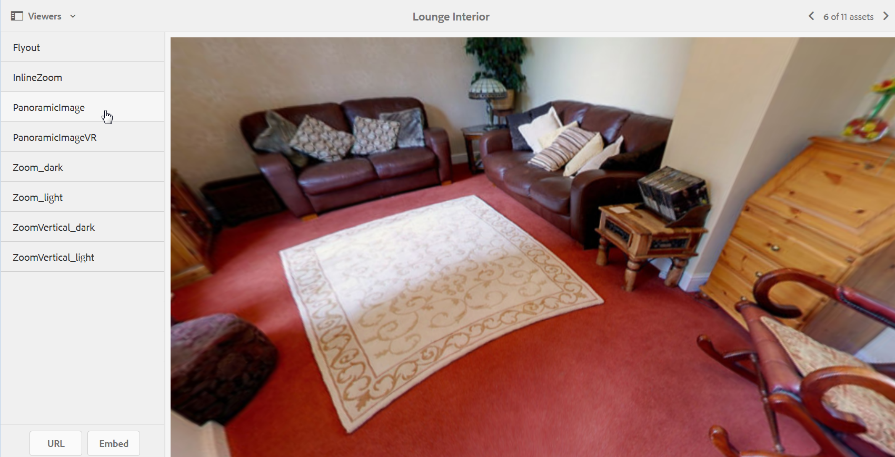

# Imagens panorâmicas {#panoramic-images}

Esta seção descreve como trabalhar com o visualizador Imagem panorâmica para renderizar imagens panorâmicas esféricas para uma experiência de visualização de 360° imersiva de uma sala, propriedade, local ou paisagem.

See also [Managing Viewer Presets](managing-viewer-presets.md).

## Fazer upload de ativos para uso com o Visualizador de imagem panorâmica {#uploading-assets-for-use-with-the-panoramic-image-viewer}

Para um ativo carregado se qualificar como uma imagem de panorama esférica que você pretende usar com o visualizador de Imagem panorâmica, o ativo deve ter um ou ambos os seguintes itens:

* Uma proporção largura/altura de 2.

   Você pode substituir a configuração padrão de proporção de 2 no **[!UICONTROL CRXDE Lite]** no seguinte:

   `/conf/global/settings/cloudconfigs/dmscene7/jcr:content`

* Marcado com as palavras-chave `equirectangular`, ou `spherical`e `panorama`, ou `spherical` e `panoramic`. Consulte [Uso de tags](/help/sites-authoring/tags.md).

Tanto a proporção quanto os critérios de palavra-chave se aplicam aos ativos panorâmicos da página de detalhes do ativo e o componente **[!UICONTROL Panorâmica Media]** 

Para fazer upload de ativos para uso com o visualizador de Imagem panorâmica, consulte [Fazer upload de ativos](managing-assets-touch-ui.md#uploading-assets).

## Configuração do Dynamic Media Classic {#configuring-dynamic-media-classic-scene}

Para que o visualizador de Imagem panorâmica funcione corretamente no AEM, é necessário sincronizar as predefinições do visualizador de Imagem panorâmica com os metadados específicos do Dynamic Media Classic e do Dynamic Media Classic para que as predefinições do visualizador sejam atualizadas no JCR. Para fazer isso, configure o Dynamic Media Classic da seguinte maneira:

1. [Efetue logon em sua instância do Dynamic Media Classic](https://www.adobe.com/marketing-cloud/experience-manager/scene7-login.html) para cada conta de empresa.

1. Perto do canto superior direito da página, clique em **[!UICONTROL Configuração > Configuração do aplicativo > Configuração de publicação > Servidor]** de imagem.
1. Na página Publicação **[!UICONTROL do Servidor de]** imagens, no menu suspenso **[!UICONTROL Publicar contexto]** próximo à parte superior, selecione Serviço de **[!UICONTROL imagens]**.

1. Na mesma página de Publicação **[!UICONTROL do Servidor de]** imagens, localize o cabeçalho Atributos **[!UICONTROL de]** solicitação.
1. No cabeçalho **[!UICONTROL Solicitar atributos]** , localize o Limite **[!UICONTROL de tamanho de imagem de]** resposta. Em seguida, nos campos **[!UICONTROL Largura]** e **[!UICONTROL Altura]** associados, aumente o tamanho máximo permitido da imagem para imagens panorâmicas.

   O Dynamic Media Classic tem um limite de 25.000.000 pixels. O tamanho máximo permitido para imagens com uma proporção de 2:1 é 7000 x 3500. No entanto, para telas típicas de desktop, 4096 x 2048 pixels são suficientes.

   >[!NOTE]
   >
   >Somente as imagens que se encaixam no tamanho máximo permitido de imagem são suportadas. As solicitações de imagens acima do limite de tamanho resultarão em uma resposta 403.

1. No cabeçalho **[Solicitar atributos]** , faça o seguinte:

   * Defina **[!UICONTROL Request Obfuscation Mode (Modo]** de ofuscação de solicitação) como **[!UICONTROL Disabled (Desativado]**).
   * Defina **[!UICONTROL Request Locking Mode (Modo]** de bloqueio de solicitação) como **[!UICONTROL Disabled (Desativado]**).

   Essas configurações são necessárias para o uso do componente **[!UICONTROL Mídia]** panorâmica no AEM.

1. Na parte inferior da página Publicação **[!UICONTROL do servidor de]** imagens, no lado esquerdo, toque em **[!UICONTROL Salvar]**.

1. No canto inferior direito, toque em **[!UICONTROL Fechar]**.

### Solução de problemas do componente de mídia panorâmica {#troubleshooting-the-panoramic-media-wcm-component}

Se você soltou uma imagem no componente **[!UICONTROL Mídia]** panorâmica em seu WCM e o espaço reservado do componente desabou, talvez você queira solucionar o seguinte problema:

* Se você encontrar um erro 403 Proibido, ele pode ter sido causado pelo tamanho da imagem solicitada ser muito grande. Revise as configurações de Limite *de tamanho de imagem de* resposta em [Configuração do Dynamic Media Classic (Scene7)](#configuring-dynamic-media-classic-scene).

* Para um erro *de bloqueio* inválido no ativo ou de *análise exibido na página, marque* Solicitar modo **[!UICONTROL de ofuscação e]** Solicitar modo **** de bloqueio para garantir que eles estejam desativados.
* Para um erro de tela contaminada, configure um Caminho de arquivo de definição de conjunto de **[!UICONTROL regras e Invalide o CTN]** para as solicitações anteriores do ativo de imagem.
* Se a qualidade da imagem ficar muito baixa após uma solicitação de imagem com dimensionamento acima do limite suportado, verifique se a configuração Atributos de codificação **[!UICONTROL JPEG > Qualidade]** não está vazia. Uma configuração típica para o campo **[!UICONTROL Qualidade]** é `95`. Você pode encontrar a configuração na página Publicação **[!UICONTROL do Servidor de]** imagens. Para acessar a página, consulte [Configuração do Dynamic Media Classic](#configuring-dynamic-media-classic-scene).

## Visualização de imagens panorâmicas {#previewing-panoramic-images}

Consulte [Visualizar ativos](previewing-assets.md).

## Publicação de imagens panorâmicas {#publishing-panoramic-images}

Consulte [Publicação de ativos](publishing-dynamicmedia-assets.md).
