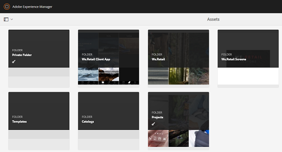

# Compartilhamento de pasta particular {#private-folder-sharing}

Você pode criar uma pasta privada na interface do usuário do Adobe Experience Manager (AEM) Assets que está disponível exclusivamente para você. Você pode compartilhar essa pasta privada com outros usuários e atribuir vários privilégios a eles. Com base no nível de privilégio atribuído, os usuários podem executar várias tarefas na pasta, por exemplo, visualização de ativos na pasta ou editar os ativos.

1. No console Ativos, toque/clique em **[!UICONTROL Criar]** na barra de ferramentas e escolha **[!UICONTROL Pasta]** no menu.

   

1. Na caixa de diálogo **[!UICONTROL Adicionar pasta]** , digite um título e nome (opcional) para a pasta e selecione **[!UICONTROL Privado]**.

   

1. Toque/clique em **[!UICONTROL Criar]**. Uma pasta particular é criada na interface do usuário.

   

1. Para compartilhar a pasta com outros usuários e atribuir privilégios a eles, selecione a pasta e clique/toque no ícone **[!UICONTROL Propriedades]** na barra de ferramentas.

   

   >[!NOTE]
   >
   >A pasta não estará visível para nenhum outro usuário até que você a compartilhe.

1. In the Folder Prperties page, select a user from the **[!UICONTROL Add User]** list, assign a role to the user on your private folder, and click **[!UICONTROL Add]**.

   

   >[!NOTE]
   >
   >Você pode atribuir várias funções, como Editor, Proprietário ou Visualizador ao usuário com quem você compartilha a pasta. Se você atribuir uma função Proprietário ao usuário, este terá privilégios de Editores na pasta. Além disso, o usuário pode compartilhar a pasta com outras pessoas. Se você atribuir uma função de Editor, o usuário poderá editar os ativos em sua pasta particular. Se você atribuir uma função de Visualizador, o usuário poderá apenas visualização os ativos em sua pasta particular.

1. Clique em **[!UICONTROL Salvar]**. Dependendo da função atribuída, o usuário recebe um conjunto de privilégios em sua pasta particular quando ele faz logon no AEM Assets.
1. Clique em **[!UICONTROL Ok]** para fechar a mensagem de confirmação.
1. O usuário com quem você compartilha a pasta recebe uma notificação de compartilhamento. Faça logon na AEM Assets com as credenciais do usuário para visualização da notificação.

   

1. Toque/clique no ícone Notificação para abrir a lista de notificações.

   

1. Clique/toque na entrada da pasta privada compartilhada pelo administrador para abrir a pasta.

>[!NOTE]
>
>Para poder criar uma pasta privada, você precisa de permissões de Ler e Editar ACL na pasta pai na qual deseja criar uma pasta privada. Se você não for um administrador, essas permissões não serão ativadas para você por padrão em */content/dam*. Nesse caso, primeiro obtenha essas permissões para sua ID/grupo de usuários antes de tentar criar pastas privadas ou configurações de pastas de visualização.

