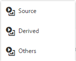

# Ativos relacionados {#related-assets}

>[!CAUTION]
>
>AEM 6.4 chegou ao fim do suporte estendido e esta documentação não é mais atualizada. Para obter mais detalhes, consulte nossa [períodos de assistência técnica](https://helpx.adobe.com/br/support/programs/eol-matrix.html). Encontre as versões compatíveis [here](https://experienceleague.adobe.com/docs/).

O Adobe Experience Manager Assets permite relacionar ativos manualmente com base nas necessidades de sua organização usando o recurso Ativos relacionados . Por exemplo, você pode relacionar um arquivo de licença com um ativo ou uma imagem/vídeo em um tópico semelhante. Você pode relacionar ativos que compartilham determinados atributos comuns. Também é possível usar o recurso para criar relacionamentos de origem/derivados entre ativos. Por exemplo, se você tiver um arquivo PDF gerado a partir de um arquivo INDD, poderá relacionar o arquivo PDF ao seu arquivo INDD de origem.

Dessa forma, você tem a flexibilidade de compartilhar um arquivo de baixa resolução (por exemplo, PDF/JPG) para fornecedores/agências e disponibilizar o arquivo de alta resolução (por exemplo, INDD) somente mediante solicitação.

## Ativos relacionados {#relating-assets}

1. Na interface do Assets, abra a página de propriedades de um ativo que deseja relacionar.

   

   Como alternativa, selecione o ativo na exibição em lista.

   

   Você também pode selecionar o ativo de uma coleção.

   

1. Para relacionar outro ativo com o ativo selecionado, clique/toque na guia **[!UICONTROL Relacionar]** ícone na barra de ferramentas.

   

1. Siga uma das seguintes opções:

   * Para relacionar o arquivo de origem do ativo, selecione **[!UICONTROL Origem]** na lista.
   * Para relacionar um arquivo derivado, selecione **[!UICONTROL Derivado]** na lista.
   * Para criar um relacionamento bidirecional entre os ativos, selecione **[!UICONTROL Outros]** na lista.

   

1. No **[!UICONTROL Selecionar ativo]** , navegue até o local do ativo que deseja relacionar e selecione-o.

   

1. Clique/toque no **[!UICONTROL Confirmar]** ícone .
1. Clicar/tocar **[!UICONTROL OK]** para fechar a caixa de diálogo. Dependendo da escolha do relacionamento na etapa 3, o ativo relacionado é listado em uma categoria apropriada na **[!UICONTROL Relacionado]** seção. Por exemplo, se o ativo relacionado for o arquivo de origem do ativo atual, ele será listado em **[!UICONTROL Origem]**.

   

1. Para cancelar a relação de um ativo, clique/toque na guia **[!UICONTROL Não relacionado]** ícone na barra de ferramentas.

   

1. Selecione o(s) ativo(s) que deseja desrelacionar do **[!UICONTROL Remover Relações]** e clicar/tocar **[!UICONTROL Não relacionado]**.

   

1. Clicar/tocar **[!UICONTROL OK]** para fechar a caixa de diálogo. Os ativos para os quais você removeu relações são excluídos da lista de ativos relacionados na **[!UICONTROL Relacionado]** seção.

## Tradução de ativos relacionados {#translating-related-assets}

Criar relacionamentos de origem/derivados entre ativos usando o recurso Ativos relacionados também é útil em fluxos de trabalho de tradução. Ao executar um fluxo de trabalho de tradução em um ativo derivado, [!DNL Experience Manager] Os ativos buscam automaticamente qualquer ativo que o arquivo de origem faça referência e o inclui para tradução. Dessa forma, o ativo referenciado pelo ativo de origem é convertido junto com a fonte e os ativos derivados. Por exemplo, considere um cenário em que a cópia em inglês inclua um ativo derivado e o arquivo de origem, como mostrado.

Se o arquivo de origem estiver relacionado a outro ativo, [!DNL Experience Manager] Os ativos buscam o ativo referenciado e o incluem para tradução.

1. Traduza os ativos na pasta de origem para um idioma de destino seguindo as etapas em [Criar um novo projeto de tradução](translation-projects.md#create-a-new-translation-project). Por exemplo, nesse caso, traduza os ativos para francês.
1. Na página Projetos , abra a pasta de tradução.

   

1. Clique/toque no bloco do projeto para abrir a página de detalhes.

   

1. Clique/toque nas reticências abaixo do cartão Tarefa de tradução para exibir o status da tradução.

   

1. Selecione o ativo e clique/toque **[!UICONTROL Receita em ativos]** na barra de ferramentas para exibir o status de tradução do ativo.

   

1. Para verificar se os ativos relacionados à origem foram traduzidos, clique/toque no ativo de origem.

   

1. Selecione o ativo que está relacionado à origem e clique/toque em **[!UICONTROL Receita em ativos]**. O ativo relacionado convertido é exibido.

   
