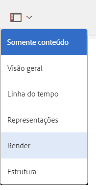

# Renderização de ativos 3D {#rendering-d-assets}

É possível renderizar os ativos 3D que você manipulou e salvou no AEM para criar imagens 2D para usar nas suas páginas de conteúdo da web.

Consulte [Editar o conteúdo da página](/help/sites-authoring/qg-page-authoring.md#editing-your-page-content).

## Considerações de desempenho ao renderizar ativos 3D {#performance-considerations-when-rendering-d-assets}

A renderização de conteúdo 3D consome recursos significativos do servidor, como CPU e memória. Portanto, esse processo costuma ser bastante demorado. Os tempos de renderização variam bastante dependendo de vários fatores, além do tamanho óbvio do modelo e do hardware do servidor:

* **Seleção do renderizador**.

   O renderizador Rapid Refine™ padrão no AEM 3D sacrifica um pouco da qualidade a favor de tempos de renderização mais rápidos. Ainda assim, ele produz resultados de alta qualidade para muitos aplicativos. Os renderizadores fornecidos por aplicativos de terceiros (por exemplo, o V-Ray™ ou o NVIDIA® Mental Ray®, implantados no Autodesk® Maya® ou no Autodesk® 3ds Max®) são amplamente configuráveis, e a relação entre o desempenho e a qualidade é definida no momento em que o palco é projetado.

* **IBL versus iluminação tradicional**.

   Embora este fator seja de menor importância para o renderizador Rapid Refine padrão, os renderizadores de terceiros, como o Mental Ray, são substancialmente mais lentos para renderizar com palcos IBL do que ao usar luzes tradicionais de pontos ou refletor.

O renderizador Rapid Refine normalmente demora vários minutos para renderizar imagens maiores. No entanto, os renderizadores de terceiros costumam demorar muitos minutos, até mesmo horas, quando configurados para proporcionar qualidade máxima.

As tarefas de conversão, processamento e renderização são enfileiradas no servidor conforme necessário para evitar a sobrecarga do servidor. A mensagem “Aguardando renderização...” é mostrada em ativos recém-carregados na Visualização de cartão. Esse status indica que outros trabalhos de processamento ou renderização devem ser concluídos antes que o trabalho de renderização atual possa ser start.

>[!NOTE]
>
>Um ativo 3D sempre é renderizado com os materiais originais, independentemente de quais materiais são mostrados na visualização interativa do AEM 3D. Essa funcionalidade se aplica ao renderizador Rapid Refine integrado e a todos os renderizadores nativos.

**Para renderizar ativos 3D**:

1. Abra um ativo 3D para visualização.

   Consulte [Visualização de ativos 3D](viewing-3d-assets.md).

1. No Adobe Experience Manager, na página **[!UICONTROL Navegação]**, toque em **[!UICONTROL Assets]**.
1. Near the upper-right corner of the page, from the **[!UICONTROL View]** drop-down list, tap **[!UICONTROL Card View]**.
1. Navegue até um objeto 3D que deseja renderizar.
1. Toque no cartão do objeto 3D para abri-lo na página de detalhes do ativo.
1. Perto do canto superior esquerdo da página, toque na lista suspensa e selecione **[!UICONTROL Renderizar]**.

   

1. Near the upper-right corner of the asset details page, tap the **[!UICONTROL Stage Selector]** icon (spotlight), then select a stage name with the background and lighting that you want to apply to the 3D object.

   Consulte [Sobre o uso de palcos no AEM 3D](about-the-use-of-stages-in-aem-3d.md).

   

   **[!UICONTROL Ícone Seletor de palco]**

1. On the **[!UICONTROL Render]** drop-down list on the left side of the asset details page, select a renderer.

   O renderizador **Rapid Refine** padrão está sempre disponível. Se o estágio selecionado for um formato nativo, o renderizador de terceiros correspondente também será disponibilizado na lista para você selecionar.

   Consulte [Sobre o uso de palcos no AEM 3D](about-the-use-of-stages-in-aem-3d.md).

1. Faça o seguinte:

   * In the **[!UICONTROL Width]** and **[!UICONTROL Height]** fields, enter the pixel width and height that you want your image rendered.
   * In the **[!UICONTROL Image Name]** field, enter the name of the rendered image.
   * In the **[!UICONTROL Export Path]** field, enter the path where you want the rendered image stored. Or, tap the **[!UICONTROL Browse]** icon and navigate to a location.
   * (Optional) Select or deselect the **[!UICONTROL Overwrite existing imag]e **check box.

1. Near the upper-right corner of the asset details page, tap the **[!UICONTROL Camera Selector]** icon. Selecione uma exibição de câmera que você queira aplicar à imagem renderizada.

   Barras à esquerda e direita ou barras acima e abaixo são um indicador visual de quais partes da exibição serão renderizadas. Quando a câmera é fornecida pelo palco selecionado, você pode selecionar uma câmera predefinida.

   

   **[!UICONTROL Ícone Seletor de câmera]**

1. Toque em **[!UICONTROL Iniciar renderizador]** para iniciar o processo de renderização.

   Uma mensagem é exibida temporariamente para indicar que a renderização foi iniciada. Para sua conveniência, esta mensagem também inclui um link para a pasta de saída selecionada para que você possa navegar até ela diretamente.

