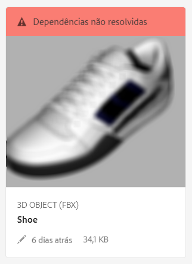
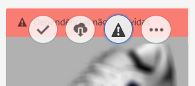

# Resolver dependências de arquivo {#resolving-file-dependencies}

As dependências do arquivo de modelo 3D principal, como os arquivos de mapa de textura, são resolvidas automaticamente sempre que possível. Essa funcionalidade é obtida fazendo o AEM pesquisar nas pastas de Ativos próximas por arquivos com os mesmos nomes encontrados no arquivo 3D. Se uma ou mais dependências não puderem ser resolvidas durante a fase de processamento Criando pré-visualização, o cartão do ativo exibirá a seguinte mensagem de banner vermelho em **[!UICONTROL Visualização de cartão]**:

**Para resolver dependências de arquivo**:

1. Na mensagem do banner **[!UICONTROL Visualização de cartão]**, passe o ponteiro do mouse sobre **[!UICONTROL Dependências não resolvidas]** no cartão e, em seguida, toque no ícone **[!UICONTROL Ponto de exclamação]**.

   

1. Na página **[!UICONTROL Propriedades de metadados]**, toque na guia **[!UICONTROL Dependências]**.

   Os arquivos que AEM não puderam resolver automaticamente estão listados na coluna **[!UICONTROL Caminhos originais]**, em vermelho.

1. Siga um ou mais destes procedimentos:

   * **Procure e selecione as dependências**. (Essa opção pressupõe que você já fez upload dos arquivos de dependência.)

      1. Toque no ícone **[!UICONTROL Navegação de arquivos]** à esquerda do caminho vermelho.
      1. Na página **[!UICONTROL Selecionar conteúdo]**, navegue até o arquivo ausente e toque no cartão do arquivo para selecioná-lo.
      1. No canto superior esquerdo da página **[!UICONTROL Selecionar conteúdo]**, toque em **[!UICONTROL Fechar]** (ícone X) para voltar à página **[!UICONTROL Propriedades da Visualização]**.
   * **Faça upload das dependências**. (Essa opção pressupõe que você ainda não fez upload dos arquivos ausentes.)

      1. Observe os caminhos e nomes de arquivos ausentes.
      1. Próximo do canto superior direito da página de propriedades, toque em **[!UICONTROL Fechar]**.

   Depois que os arquivos forem carregados, volte para a página **[!UICONTROL Propriedades da Visualização > Dependências]**. O ativo recém enviado por upload listado corretamente como um ativo referenciado.

   * **Ignorar as dependências**.

      Se uma dependência ausente não for mais necessária, na coluna **[!UICONTROL Ativo referenciado]**, no campo de texto à esquerda do arquivo ausente, digite `n/a` para que AEM 3D ignore o arquivo.

1. Perto do canto superior direito da página **[!UICONTROL Propriedades da Visualização]**, toque em **[!UICONTROL Salvar]**.
1. Toque em **[!UICONTROL Fechar]****[!UICONTROL para voltar à exibição do cartão]**.

   O ativo é reprocessado automaticamente com as dependências recém resolvidas.

