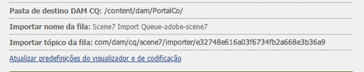
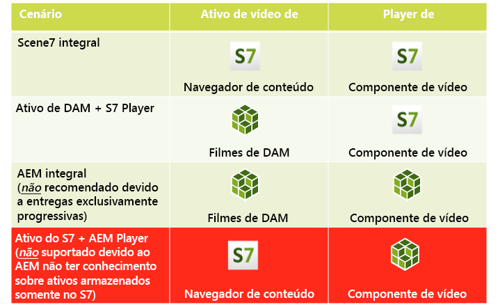
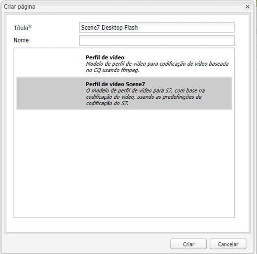
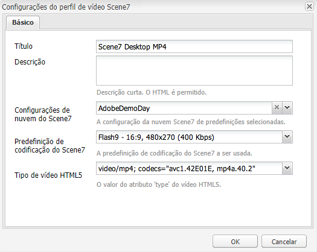

# Vídeo {#video}

Os ativos fornecem gerenciamento centralizado de ativos de vídeo, onde você pode fazer upload de vídeos diretamente para os Ativos, para autocodificação para o Dynamic Media Classic. Você também pode acessar vídeos do Dynamic Media Classic diretamente de Ativos para criação de página.

A integração de vídeo do Dynamic Media Classic estende o alcance do vídeo otimizado para todas as telas (detecção automática de dispositivo e de largura de banda).

O componente **[!UICONTROL Scene7 Video]** executa automaticamente a detecção de dispositivo e de largura de banda para reproduzir o vídeo no formato adequado e com a qualidade certa em desktops, tablets e dispositivos móveis.

Você pode incluir conjuntos de vídeos adaptáveis em vez de somente ativos de vídeo individuais. Um conjunto de vídeos adaptáveis é um contêiner de todas as representações de vídeo necessárias para reproduzir o vídeo com facilidade em várias telas. Um Conjunto de vídeos adaptáveis agrupa versões do mesmo vídeo codificadas em diferentes formatos e taxas de bits. Por exemplo, 400 kbps, 800 kbps e 1000 kbps. Você usa um Conjunto de vídeos adaptáveis, juntamente com o componente de vídeo do S7, para streaming de vídeo adaptável em vários tipos de tela. Por exemplo, dispositivos móveis de desktop, iOS, Android, BlackBerry e Windows.

Consulte a [documentação do Dynamic Media Classic sobre conjuntos de vídeos adaptáveis para obter mais informações](https://experienceleague.adobe.com/docs/experience-manager-cloud-service/assets/dynamicmedia/video-profiles.html#dynamicmedia).

## Sobre o FFMPEG e o Dynamic Media Classic {#about-ffmpeg-and-scene}

O processo de codificação de vídeo padrão se baseia no uso da integração em FFMPEG com perfis de vídeo. Portanto, o fluxo de trabalho de assimilação de DAM pronto para uso contém as duas etapas de fluxo de trabalho baseadas em ffmpeg a seguir:

* Miniaturas de FFMPEG
* Codificação FFMPEG

Habilitar e configurar a integração do Dynamic Media Classic não remove ou desativa automaticamente essas duas etapas do fluxo de trabalho de assimilação do DAM pronto para uso. Se você já usa a codificação de vídeo baseada em FFMPEG no Experience Manager, é provável que tenha o FFMPEG instalado em seus ambientes de criação. Nesse caso, um novo vídeo assimilado usando DAM seria codificado duas vezes: uma vez no codificador FFMPEG e uma vez na integração do Dynamic Media Classic.

Se você tiver a codificação de vídeo baseada em FFMPEG configurada no AEM e FFMPEG instalada, poderá remover os dois fluxos de trabalho de FFMPEG dos fluxos de trabalho de assimilação do DAM.

## Formatos suportados {#supported-formats}

Os seguintes formatos são compatíveis com o componente de vídeo do Scene7:

* F4V H.264
* MP4 H.264

## Como decidir onde fazer upload de seu vídeo {#deciding-where-to-upload-your-video}

Para decidir onde fazer upload de seus ativos de vídeo, considere o seguinte:

* O ativo de vídeo requer um fluxo de trabalho?
* O ativo de vídeo requer controle de versão?

Se a resposta for “sim” para ambas as perguntas, faça upload do vídeo diretamente no Adobe DAM. Se a resposta for &quot;não&quot; para ambas as perguntas, faça upload do vídeo diretamente no Dynamic Media Classic. O fluxo de trabalho de cada cenário é descrito nas próximas seções.

### Se você estiver fazendo upload do vídeo diretamente no Adobe DAM {#if-you-are-uploading-your-video-directly-to-adobe-dam}

Se precisar de um fluxo de trabalho ou controle de versão para seus ativos, carregue primeiro no Adobe DAM. Este é o fluxo de trabalho recomendado:

1. Faça upload do ativo de vídeo no Adobe DAM e codifique e publique automaticamente no Dynamic Media Classic.
1. No Experience Manager, acesse os ativos de vídeo no WCM na guia **[!UICONTROL Filmes]** do Localizador de conteúdo.
1. Crie com o componente **[!UICONTROL Scene7 Video]** ou **[!UICONTROL Foundation Video]**.

### Se estiver fazendo upload do vídeo no Scene7 {#if-you-are-uploading-your-video-to-scene}

Se não precisar de um fluxo de trabalho ou controle de versão para seus ativos, faça upload dos ativos para a Scene7. Este é o fluxo de trabalho recomendado:

1. No Dynamic Media Classic, [configure um upload FTP agendado e uma codificação para o Scene7 (automatizada pelo sistema)](https://experienceleague.adobe.com/docs/dynamic-media-classic/using/upload-publish/uploading-files.html#preparing-your-assets-and-folders-for-uploading).
1. No Experience Manager, acesse os ativos de vídeo no WCM na guia **[!UICONTROL Scene7]** do Localizador de conteúdo.
1. Crie com o componente **[!UICONTROL Scene7 Video]**.

## Configurar a integração de vídeo do Scene7 {#configuring-integration-with-scene-video}

Para configurar predefinições universais:

1. Em **[!UICONTROL Serviços em nuvem]**, navegue até a configuração do **[!UICONTROL Scene7]** e clique em **[!UICONTROL Editar]**.
1. Selecione a guia **[!UICONTROL Vídeo]**.

   

   >[!NOTE]
   >
   >A guia **[!UICONTROL Vídeo]** não será exibida se a página não possuir uma configuração de nuvem.

1. Selecione o perfil de codificação de vídeo adaptável, um perfil de codificação de vídeo pronto para uso ou um perfil de codificação de vídeo personalizado.

   >[!NOTE]
   >
   >Para obter mais informações sobre o que significam as predefinições de vídeo, consulte a [documentação do Dynamic Media Classic](https://experienceleague.adobe.com/docs/dynamic-media-classic/using/setup/application-setup.html#video-presets-for-encoding-video-files).
   >
   >A Adobe recomenda selecionar ambos os conjuntos de vídeos adaptáveis ao configurar as predefinições universais ou selecionar a opção **[!UICONTROL Codificação de vídeo adaptável]**.

1. Os perfis de codificação selecionados são aplicados automaticamente a todos os vídeos enviados por upload para a pasta de destino DAM CQ configurada para essa configuração de nuvem do Scene7. É possível configurar várias configurações de nuvem do Scene7 com diferentes pastas de destino para aplicar diversos perfis de codificação, conforme necessário.

## Atualizar as predefinições de codificação e do visualizador {#updating-viewer-and-encoding-presets}

É necessário atualizar as predefinições de codificação e do visualizador de vídeo no Experience Manager se as predefinições foram atualizadas no Scene7. Nesses casos, navegue até a configuração do Scene7 na configuração da nuvem e clique em **[!UICONTROL Update the viewer and encoding presets]**.

## Fazer upload de seu vídeo principal para o Scene7 a partir do Adobe DAM {#uploading-your-master-video}

1. Navegue até a pasta de destino DAM CQ onde você definiu as configurações de nuvem com os perfis de codificação do Scene7.
1. Clique em **[!UICONTROL Fazer upload]** para fazer upload do vídeo mestre. O upload e a codificação do vídeo são concluídos após a conclusão do fluxo de trabalho do Ativo de atualização do DAM e **[!UICONTROL Publicar no Scene7]** tem uma marca de seleção.

   >[!NOTE]
   >
   >Leva algum tempo para as miniaturas de vídeo serem geradas.

   Arrastar o vídeo principal do DAM para o componente de vídeo acessa *all* as representações de proxy codificadas do Scene7 para entrega.

## Comparação do componente de vídeo de base com o componente de vídeo do Scene7 {#foundation-video-component-versus-scene-video-component}

Ao usar o Experience Manager, você tem acesso ao componente Vídeo disponível no Sites e ao componente de vídeo do Scene7. Esses componentes não são intercambiáveis.

O componente de vídeo do Scene7 funciona somente para vídeos do Scene7. O componente de base funciona com vídeos armazenados do Experience Manager (usando ffmpeg) e vídeos do Scene7.

A matriz a seguir explica quando usar qual componente:

>[!NOTE]
>
>Pronto para uso, o componente de vídeo do S7 usa o perfil de vídeo universal. No entanto, você pode obter o reprodutor de vídeo baseado em HTML5 no Experience Manager. Copie simples o código incorporado do reprodutor de vídeo HTML5 pronto para uso e coloque-o na página Experience Manager.

## Componente Experience Manager Video {#aem-video-component}

Mesmo que o uso do componente de vídeo do Scene7 seja recomendado para visualizar vídeos do Scene7, use os vídeos do Scene7 com o Componente de vídeo de base, por uma questão de integridade.

### Comparação entre Experience Manager Video e Scene7 Video {#aem-video-and-scene-video-comparison}

A tabela a seguir fornece uma comparação de alto nível dos recursos suportados entre o componente de Vídeo de base do Experience Manager e o componente de Vídeo do Scene7:

|  | Vídeo de base do Experience Manager | Vídeo do Scene7 |
|---|---|---|
| Abordagem | Abordagem de HTML5 primeiro. O Flash é usado somente para o fallback não-HTML5. | Flash na maioria dos computadores. O HTML5 é usado para dispositivos móveis e tablets. |
| Entrega | Progressiva | Transmissão adaptável |
| Acompanhamento | Sim | Sim |
| Extensibilidade | Sim | Sim (com [Documentação da API do SDK do Visualizador HTML5](https://s7d1.scene7.com/s7sdk/3.10/docs/jsdoc/index.html)) |
| Vídeo móvel | Sim | Sim |

### Configuração {#setting-up}

#### Criação de perfis de vídeo {#creating-video-profiles}

As várias codificações de vídeo são criadas de acordo com as predefinições de codificação do Scene7 selecionadas na configuração da nuvem do Scene7. Para que o componente Vídeo de base os use, um perfil de vídeo deve ser criado para cada predefinição de codificação do Scene7 selecionada. Esse método permite que o componente de vídeo selecione as representações do DAM de acordo.

>[!NOTE]
>
>Os novos perfis de vídeo e as alterações a eles devem ser ativados para publicação.

1. No Experience Manager, toque em **[!UICONTROL Ferramentas] > [!UICONTROL Console de configuração]**.
1. No **[!UICONTROL Console de Configuração]** navegue até **[!UICONTROL Ferramentas > DAM > Perfis de Vídeo]** na árvore de navegação.
1. Crie um perfil de vídeo do Scene7. No **[!UICONTROL Novo...]**, selecione **[!UICONTROL Criar página]** e selecione o modelo de Perfil de vídeo do Scene7. Forneça um nome para a nova página de perfil de vídeo e clique em **[!UICONTROL Criar]**.

   

1. Edite o novo perfil de vídeo. Selecione primeiro a configuração de nuvem. Em seguida, selecione a mesma predefinição de codificação selecionada na configuração de nuvem.

   

   | Propriedade | Descrição |
   |---|---|
   | Configurações de nuvem do Scene7 | A configuração da nuvem a ser usada para as predefinições de codificação. |
   | Predefinição de codificação do Scene7 | A predefinição de codificação com a qual mapear esse perfil de vídeo. |
   | Tipo de vídeo HTML5 | Essa propriedade permite definir o valor da propriedade type do elemento de fonte de vídeo HTML5. Essa informação não é fornecida pelas predefinições de codificação do S7, mas é necessária para renderizar corretamente os vídeos usando o elemento de vídeo HTML5. Uma lista de formatos comuns é fornecida, mas eles podem ser substituídos por outros formatos. |

   Repita essa etapa para todas as predefinições de codificação selecionadas na configuração de nuvem que você deseja usar no componente de vídeo.

#### Configuração do design {#configuring-design}

O componente **[!UICONTROL Foundation Video]** deve saber quais perfis de vídeo usar para criar a lista de fontes de vídeo. Abra a caixa de diálogo Design dos componentes de vídeo e configure o design dos componentes para usar os novos perfis de vídeo.

>[!NOTE]
>
>Se você usar o componente **[!UICONTROL Foundation Video]** em uma página móvel, repita essas etapas no design da página móvel.

>[!NOTE]
>
>As alterações feitas no design exigem a ativação do design para que possam entrar em vigor na publicação.

1. Abra a caixa de diálogo de design do componente **[!UICONTROL Foundation Video]** e altere para a guia **[!UICONTROL Profiles]**. Em seguida, exclua os perfis prontos e adicione os novos perfis de vídeo do S7. A ordem da lista de perfis na caixa de diálogo design define a ordem do elemento de fontes de vídeo ao renderizar.
1. Para navegadores que não aceitam HTML5, o componente de vídeo permite configurar um fallback de Flash. Abra a caixa de diálogo Design dos componentes de vídeo e altere para a guia **[!UICONTROL Flash]**. Defina as configurações do Flash Player e atribua um perfil de fallback ao Flash Player.

#### Lista de verificação {#checklist}

1. Criar uma configuração da nuvem do S7. Verifique se as predefinições de codificação de vídeo estão definidas e se o importador está em execução.
1. Crie um perfil de vídeo do S7 para cada predefinição de codificação de vídeo selecionada na configuração da nuvem.
1. Os perfis de vídeo devem ser ativados.
1. Configure o design do componente **[!UICONTROL Foundation Video]** na sua página.
1. Ative o design após finalizar as alterações no design.
