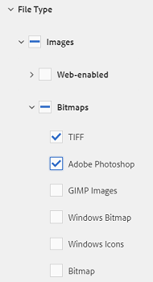
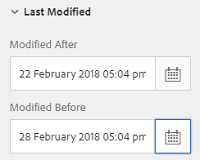
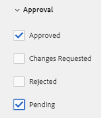

# Pesquisar ativos no AEM {#search-assets-in-aem}

Saiba como localizar os ativos necessários no AEM usando o painel Filtros e como usar os ativos exibidos na pesquisa.

Use o painel Filtros para pesquisar ativos, pastas, tags e metadados. Você pode pesquisar partes de uma string usando o asterisco curinga.

O painel Filtros fornece várias opções para pesquisar ativos e pastas de várias maneiras, em vez de em uma ordem taxonômica genérica.

Você pode pesquisar com base nas seguintes opções (predicados):

* Tipo de arquivo
* Tamanho de arquivo
* Nome do campo
* Última modificação
* Status
* Orientação
* Estilo
* Insights

<!-- TBD keystroke 65 article and port applicable changes here. This content goes. -->

Você pode personalizar o painel Filtros e adicionar/remover predicados de pesquisa usando aspectos [de](search-facets.md)pesquisa. Para exibir o painel Filtros, execute estas etapas:

1. Na interface do usuário do Assets, toque/clique em  na barra de ferramentas para exibir a caixa Omnisearch.
1. Digite o termo de pesquisa e pressione Enter. Como alternativa, basta pressionar Enter sem inserir nenhum termo de pesquisa. Não insira espaços à esquerda; caso contrário, a pesquisa não funcionará.

1. Toque/clique no ícone GlobalNav. O painel Filtros é exibido.

   

   Dependendo do tipo de itens pesquisados, o número de correspondências é indicado na parte superior dos resultados da pesquisa.

   

## Procurar tipos de ficheiros {#search-for-file-types}

O painel Filtros ajuda a adicionar mais granularidade à sua experiência de pesquisa e torna a funcionalidade de pesquisa mais versátil. Você pode detalhar facilmente até o nível de detalhes desejado.

Por exemplo, se você estiver procurando uma imagem, use o predicado Tipo **[!UICONTROL de]** arquivo para escolher se deseja uma imagem bitmap ou uma imagem vetorial.

Você pode restringir ainda mais o escopo da pesquisa especificando o tipo MIME para a imagem.

Da mesma forma, ao pesquisar documentos, você pode especificar o formato, por exemplo, PDF ou MS Word.

## Pesquisar com base no tamanho do arquivo {#search-based-on-file-size}

Use o predicado Tamanho **do** arquivo para pesquisar ativos com base em seu tamanho. Você pode especificar os limites inferior e superior para o intervalo de tamanho para restringir sua pesquisa. Você também pode especificar a unidade de medida, por exemplo, Kilobytes, Megabytes e assim por diante.

## Pesquisar com base em quando os ativos são modificados pela última vez {#search-based-on-when-assets-are-last-modified}

Se você estiver gerenciando ativos do trabalho em andamento ou monitorando um fluxo de trabalho de revisão, poderá pesquisar quando um ativo foi modificado pela última vez com base em carimbos de data e hora precisos. Por exemplo, especifique datas antes ou depois das quais os ativos foram modificados.

Você também pode usar as seguintes opções para alcançar um nível mais alto de granularidade na sua pesquisa:

## Pesquisar com base no status {#search-based-on-status}

Use o predicado **Status** para pesquisar ativos com base em vários tipos de status, como Publicar, Aprovação, Finalização e Expiração.

Por exemplo, ao monitorar a publicação de ativos, você pode usar a opção apropriada para pesquisar quais ativos são publicados.

Ao monitorar o status da revisão de ativos, use a opção apropriada para descobrir quais ativos estão aprovados ou quais ativos estão pendentes de aprovação.

## Pesquisar com base nos dados do Insights {#search-based-on-insights-data}

Use o predicado **Insights** para pesquisar ativos com base em suas estatísticas de uso obtidas de vários aplicativos da Creative. Os dados de uso são agrupados nas seguintes categorias:

* Pontuação de uso
* Impressões
* Cliques
* canais de mídia nos quais os ativos aparecem

