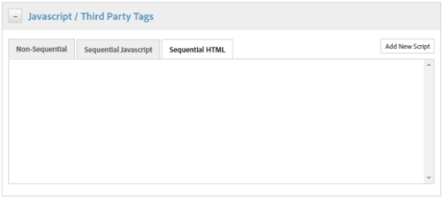

# Ativar insights de ativos por meio do DTM {#enabling-asset-insights-through-dtm}

O Gerenciamento dinâmico de tags do Adobe é uma ferramenta que ativa suas ferramentas de marketing digital. Ele é fornecido gratuitamente aos clientes da Adobe Analytics.

Embora você possa personalizar seu código de rastreamento para permitir que soluções de CMS de terceiros usem o Asset Insights, o Adobe recomenda que você use o DTM para inserir tags do Asset Insights.

Execute estas etapas para ativar os Insights de ativos por meio do DTM:

1. Tap/click the AEM logo, and go to **[!UICONTROL Tools > Assets > Insights Configuration]**.
1. [Configurar AEM instância com o Cloud Service DTM](../sites-administering/dtm.md)

   O token da API deve estar disponível assim que você fizer logon em [https://dtm.adobe.com](https://dtm.adobe.com/) e visitar Configurações **[!UICONTROL da]** conta no ícone Perfil. Essa etapa não é necessária do ponto de vista Asset Insights, pois a integração da AEM Sites com o Asset Insights ainda está em andamento.

1. Faça logon em [https://dtm.adobe.com](https://dtm.adobe.com/)e selecione uma Empresa, conforme apropriado.
1. Criar/abrir uma propriedade da Web existente

   * Selecione a guia Propriedades **[!UICONTROL da]** Web e toque/clique em **[!UICONTROL Adicionar propriedade]**.
   * Atualize os campos conforme apropriado e toque/clique em **[!UICONTROL Criar propriedade]** (consulte a [documentação](https://helpx.adobe.com/experience-manager/using/dtm.html)).

   

1. Na guia **[!UICONTROL Regras]** , selecione Regras **[!UICONTROL de carregamento de]** página no painel de navegação e toque/clique em **[!UICONTROL Criar nova regra]**.

   

1. Expanda **[!UICONTROL Javascript /Tags]** de terceiros. Em seguida, toque/clique em **[!UICONTROL Adicionar novo script]** na guia HTML **** sequencial para abrir a caixa de diálogo Script.

   

1. Tap/click the AEM logo, and go to **[!UICONTROL Tools > Assets]**.
1. Toque/clique em **[!UICONTROL Insights Page Tracker]**, copie o código do rastreador e cole-o na caixa de diálogo Script aberta na etapa 6. Salve as alterações.

   >[!NOTE]
   >
   >* `AppMeasurement.js` foi removido. Ela deve estar disponível por meio da ferramenta Adobe Analytics do DTM.
   >* A chamada para `assetAnalytics.dispatcher.init()` é removida. Espera-se que a função seja chamada assim que a ferramenta Adobe Analytics do DTM terminar o carregamento.
   >* Dependendo de onde o Asset Insights Page Tracker estiver hospedado (por exemplo, AEM, CDN e assim por diante), a origem da fonte do script pode exigir alterações.
   >* Para o rastreador de página hospedado AEM, a fonte deve apontar para uma instância de publicação usando o nome de host da instância do dispatcher.


1. Abra [https://dtm.adobe.com](https://dtm.adobe.com). Clique em Visão geral na propriedade da Web e clique em Adicionar ferramenta ou abra uma ferramenta Adobe Analytics existente. Ao criar a ferramenta, você pode definir Método de configuração como Automático.

   

   Selecione Conjuntos de relatórios de armazenamento temporário/produção, conforme apropriado.

1. Expanda o Gerenciamento **** de biblioteca e certifique-se de que **[!UICONTROL Carregar biblioteca em]** esteja definido como **[!UICONTROL Início]** da página.

   

1. Expanda **[!UICONTROL Personalizar código]** da página e clique ou toque em **[!UICONTROL Abrir editor]**.

   

1. Cole o seguinte código na janela:

   ```java
   var sObj;
   
   if (arguments.length > 0) {
     sObj = arguments[0];
   } else {
     sObj = _satellite.getToolsByType('sc')[0].getS();
   }
   _satellite.notify('in assetAnalytics customInit');
   (function initializeAssetAnalytics() {
     if ((!!window.assetAnalytics) && (!!assetAnalytics.dispatcher)) {
       _satellite.notify('assetAnalytics ready');
       /** NOTE:
           Copy over the call to 'assetAnalytics.dispatcher.init()' from Assets Pagetracker
           Be mindful about changing the AppMeasurement object as retrieved above.
       */
       assetAnalytics.dispatcher.init(
             "",  /** RSID to send tracking-call to */
             "",  /** Tracking Server to send tracking-call to */
             "",  /** Visitor Namespace to send tracking-call to */
             "",  /** listVar to put comma-separated-list of Asset IDs for Asset Impression Events in tracking-call, e.g. 'listVar1' */
             "",  /** eVar to put Asset ID for Asset Click Events in, e.g. 'eVar3' */
             "",  /** event to include in tracking-calls for Asset Impression Events, e.g. 'event8' */
             "",  /** event to include in tracking-calls for Asset Click Events, e.g. 'event7' */
             sObj  /** [OPTIONAL] if the webpage already has an AppMeasurement object, please include the object here. If unspecified, Pagetracker Core shall create its own AppMeasurement object */
             );
       sObj.usePlugins = true;
       sObj.doPlugins = assetAnalytics.core.updateContextData;
       assetAnalytics.core.optimizedAssetInsights();
     }
     else {
       _satellite.notify('assetAnalytics not available. Consider updating the Custom Page Code', 4);
     }
   })();
   ```

   * A regra de carregamento de página no DTM inclui somente o código pagetracker.js. Quaisquer `assetAnalytics` campos são considerados substituições para valores padrão. Elas não são obrigatórias por padrão.
   * O código chama `assetAnalytics.dispatcher.init()` depois de verificar se `_satellite.getToolsByType('sc')[0].getS()` está inicializado e `assetAnalytics,dispatcher.init` está disponível. Portanto, você pode ignorar a adição na etapa 11.
   * Conforme indicado nos comentários no código do Controlador de página do Insights (**[!UICONTROL Ferramentas > Ativos > Controlador]** de página do Insights), quando o Controlador de página não cria um `AppMeasurement` objeto, os três primeiros argumentos (RSID, Servidor de rastreamento e Namespace do Visitante) são irrelevantes. Strings vazias são passadas para realçar isso.

      Os argumentos restantes correspondem ao que está configurado na página Configuração de Insights (**[!UICONTROL Ferramentas > Ativos > Configuração]** de Insights).

   * O objeto AppMeasurement é recuperado consultando todos os mecanismos de SiteCatalyst disponíveis `satelliteLib` . Se várias tags estiverem configuradas, altere o índice do seletor de matriz adequadamente. As entradas no storage são ordenadas de acordo com as ferramentas de SiteCatalyst disponíveis na interface do DTM.

1. Salve e feche a janela Editor de código e salve as alterações na configuração da ferramenta.
1. Na guia **[!UICONTROL Aprovações]** , aprove ambas as aprovações pendentes. A tag do DTM está pronta para ser inserida na sua página da Web. Para obter detalhes sobre como inserir tags do DTM em páginas da Web, consulte [Integração do DTM em modelos](https://blogs.adobe.com/experiencedelivers/experience-management/integrating-dtm-custom-aem6-page-template/)de página personalizados.
