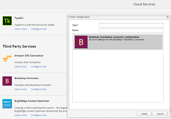

# Aplicação de serviços de nuvem de tradução a pastas {#applying-translation-cloud-services-to-folders}

O Adobe Experience Manager (AEM) permite que você utilize os serviços de tradução em nuvem do provedor de tradução de sua escolha para garantir que os ativos sejam traduzidos de acordo com suas necessidades.

Você pode aplicar o serviço da nuvem de tradução diretamente à sua pasta de ativos para que eles possam ser utilizados durante os fluxos de trabalho de tradução.

## Aplicação dos serviços de tradução {#applying-the-translation-services}

A aplicação de serviços da nuvem de tradução diretamente à sua pasta de ativos elimina a necessidade de configurar os serviços de tradução ao criar ou atualizar fluxos de trabalho de tradução.

1. Na interface do usuário do Assets, selecione a pasta na qual deseja aplicar os serviços de tradução.
1. Na barra de ferramentas, clique/toque no ícone **[!UICONTROL Propriedades]** para exibir a página **[!UICONTROL Propriedades da pasta]**.

   

1. Navegue até a guia **[!UICONTROL Serviços da nuvem]**.
1. Na lista Configurações do Cloud Service, escolha o provedor de tradução desejado. Por exemplo, se você quiser aproveitar os serviços de tradução da Microsoft, escolha **[!UICONTROL Microsoft Translator]**.

   

1. Escolha o conector para o provedor de tradução.

   

1. Na barra de ferramentas, clique/toque em **[!UICONTROL Salvar]** e em **[!UICONTROL OK]** para fechar a caixa de diálogo. O serviço de tradução é aplicado à pasta.

## Aplicação do conector de tradução personalizado {#applying-custom-translation-connector}

Se quiser aplicar um conector personalizado para os serviços de tradução que deseja usar nos fluxos de trabalho de tradução. Para aplicar um conector personalizado, primeiro instale o conector do Gerenciador de pacotes. Em seguida, configure o conector do console Serviços da nuvem. Após configurar o conector, ele estará disponível na lista de conectores na guia Serviços da nuvem descrita em [Aplicar serviços de tradução](transition-cloud-services.md#applying-the-translation-services). Depois de aplicar o conector personalizado e executar os fluxos de trabalho de tradução, o bloco **[!UICONTROL Resumo da tradução]** do projeto de tradução exibe os detalhes do conector nos cabeçalhos **[!UICONTROL Provedor]** e **[!UICONTROL Método]**.

1. Instale o conector do Gerenciador de pacotes.
1. Clique/toque no logotipo do AEM e navegue até **[!UICONTROL Tools > Deployment > Cloud Services]**.
1. Localize o conector instalado em **[!UICONTROL Serviços de terceiros]** na página **[!UICONTROL Serviços da nuvem]**.

   

1. Clique/toque no link **[!UICONTROL Configurar agora]** para abrir a caixa de diálogo **[!UICONTROL Criar configuração]**.

   

1. Especifique um título e nome para o conector e clique/toque em **[!UICONTROL Criar]**. O conector personalizado está disponível na lista de conectores na guia **[!UICONTROL Serviços da nuvem]** descrita na etapa 5 de [Aplicar serviços de tradução](#applying-the-translation-services).
1. Execute qualquer fluxo de trabalho de tradução descrito em [Criar projetos de tradução](translation-projects.md) depois de aplicar o conector personalizado. Verifique os detalhes do conector no bloco **[!UICONTROL Resumo da tradução]** do projeto de tradução no console **[!UICONTROL Projetos]**.

   
