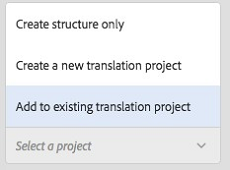
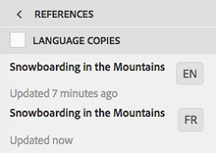
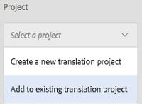

# Criando Projetos de Tradução {#creating-translation-projects}

Para criar uma cópia de idioma, dispare um dos seguintes workflows de cópia de idioma disponíveis no painel Referências na interface do usuário do Assets:

**Criar e traduzir**

Neste fluxo de trabalho, os ativos a serem traduzidos são copiados para a raiz do idioma para o qual você deseja traduzir. Além disso, dependendo das opções escolhidas, um projeto de tradução é criado para os ativos no console Projetos. Dependendo das configurações, o projeto de tradução pode ser iniciado manualmente ou pode ser executado automaticamente assim que o projeto de tradução for criado.

**Atualizar cópias de idioma**

Você executa esse fluxo de trabalho para traduzir um grupo adicional de ativos e incluí-lo em uma cópia de idioma para uma localidade específica. Nesse caso, os ativos convertidos são adicionados à pasta do público alvo que já contém os ativos convertidos anteriormente.

>[!NOTE]
>
>Os binários de ativos são traduzidos somente se o provedor de serviço de tradução suportar a tradução de binários.

>[!NOTE]
>
>Se você iniciar um fluxo de trabalho de tradução para ativos complexos, como PDFs e arquivos de InDesign, seus subativos ou representações (se houver) não serão submetidos para conversão.

## Criar e traduzir fluxo de trabalho {#create-and-translate-workflow}

Use o fluxo de trabalho Criar e traduzir para gerar cópias de idioma para um idioma específico pela primeira vez. O fluxo de trabalho fornece as seguintes opções:

* Criar somente estrutura
* Criar um novo projeto de tradução
* Adicionar ao projeto de tradução existente

### Criar somente estrutura {#create-structure-only}

Use a opção **Somente criar estrutura** para criar uma hierarquia de pasta de destino na raiz do idioma de destino para corresponder à hierarquia da pasta de origem na raiz do idioma de origem. Nesse caso, os ativos de origem são copiados na pasta de destino. No entanto, nenhum projeto de tradução é gerado.

1. Na interface do usuário do Assets, selecione a pasta de origem para a qual deseja criar uma estrutura na raiz do idioma do público alvo.
1. Abra o painel **[!UICONTROL Referências]** e clique/toque em **[!UICONTROL Cópias de idioma]**, em **[!UICONTROL Cópias]**.

   

1. Clique/toque em **[!UICONTROL Criar e traduzir]** na parte inferior.

   

1. Na lista **[!UICONTROL Idiomas do Público alvo]**, selecione o idioma para o qual deseja criar uma estrutura de pastas.

   

1. Na lista **[!UICONTROL Projeto]**, escolha **[!UICONTROL Somente criar estrutura]**.

   

1. Clique/toque em **[!UICONTROL Criar]**. A nova estrutura do idioma do público alvo é listada em **[!UICONTROL Cópias de idioma]**.

   

1. Clique/toque na estrutura da lista e, em seguida, clique/toque em **[!UICONTROL Revelar em Ativos]** para navegar até a estrutura de pastas no idioma do público alvo.

   

### Criar um novo projeto de tradução {#create-a-new-translation-project}

Se você usar essa opção, os ativos a serem traduzidos serão copiados para a raiz do idioma para o qual você deseja traduzir. Dependendo das opções escolhidas, um projeto de tradução é criado para os ativos no console Projetos. Dependendo das configurações, o projeto de tradução pode ser iniciado manualmente ou executado automaticamente assim que o projeto de tradução for criado.

1. Na interface do usuário do Assets, selecione a pasta de origem para a qual deseja criar uma cópia de Idioma.
1. Abra o painel **[!UICONTROL Referências]** e clique/toque em **[!UICONTROL Cópias de idioma]**, em **[!UICONTROL Cópias]**.

   

1. Clique/toque em **[!UICONTROL Criar e traduzir]** na parte inferior.

   

1. Na lista **[!UICONTROL Idiomas de destino]**, selecione os idiomas para os quais deseja criar uma estrutura de pastas.

   

1. Na lista **[!UICONTROL Project]**, selecione **[!UICONTROL Criar um novo projeto de tradução]**.

   

1. No campo **[!UICONTROL Título do projeto]**, informe um título para o projeto.

   

1. Clique/toque em **[!UICONTROL Criar]**. Os ativos da pasta de origem são copiados para as pastas de públicos alvos para as localidades selecionadas na etapa 4.

   

1. Para navegar até a pasta, selecione a cópia de idioma e clique em **[!UICONTROL Revelar em Ativos]**.

   

1. Navegue até o console Projetos. A pasta de tradução é copiada para o console Projetos.

   

1. Abra a pasta para visualização do projeto de tradução.

   

1. Clique/toque no projeto para abrir a página de detalhes.

   

1. Para visualização do status do trabalho de tradução, clique nas reticências na parte inferior do bloco **[!UICONTROL Trabalho de tradução]**.

   

   Para obter mais detalhes sobre status de trabalhos, consulte [Monitorando o Status de um Trabalho de Tradução](/help/sites-administering/tc-manage.md#monitoring-the-status-of-a-translation-job).

1. Navegue até a interface do usuário Ativos e abra a página Propriedades de cada um dos ativos traduzidos para visualização dos metadados traduzidos.

   

   >[!NOTE]
   >
   >Este recurso está disponível para ativos e pastas. Quando um ativo é selecionado em vez de uma pasta, toda a hierarquia de pastas até a raiz do idioma é copiada para criar uma cópia do idioma para o ativo.

### Adicionar ao projeto de tradução existente {#add-to-existing-translation-project}

Se você usar essa opção, o fluxo de trabalho de tradução será executado para os ativos adicionados à pasta de origem após executar um fluxo de trabalho de tradução anterior. Somente os ativos recém-adicionados são copiados para a pasta do público alvo que contém ativos convertidos anteriormente. Nenhum novo projeto de tradução é criado neste caso.

1. Na interface do usuário Ativos, navegue até a pasta de origem que contém ativos não convertidos.
1. Selecione um ativo que deseja traduzir e abra o **[!UICONTROL painel Referência]**. A seção **[!UICONTROL Cópias de idioma]** exibe o número de cópias de tradução atualmente disponíveis.
1. Clique/toque em **[!UICONTROL Cópias de idioma]** em **[!UICONTROL Cópias]**. Uma lista de cópias de tradução disponíveis é exibida.
1. Clique/toque em **[!UICONTROL Criar e traduzir]** na parte inferior.

   

1. Na lista **[!UICONTROL Idiomas de destino]**, selecione os idiomas para os quais deseja criar uma estrutura de pastas.

   

1. Na lista **[!UICONTROL Projeto]**, selecione **[!UICONTROL Adicionar ao projeto de tradução existente]** para executar o fluxo de trabalho de tradução na pasta.

   

   >[!NOTE]
   >
   >Se você escolher a opção **[!UICONTROL Adicionar ao projeto de tradução existente]**, seu projeto de tradução será adicionado a um projeto pré-existente somente se as configurações do projeto corresponderem exatamente às configurações do projeto pré-existente. Caso contrário, um novo projeto será criado.

1. Na lista **[!UICONTROL Projeto de tradução existente]**, selecione um projeto para adicionar o ativo para conversão.

   

1. Clique/toque em **[!UICONTROL Criar]**. Os ativos que serão traduzidos são adicionados à pasta de destino. A pasta atualizada está listada na seção **[!UICONTROL Cópias de idioma]**.

   

1. Navegue até o console Projetos e abra o projeto de tradução existente ao qual você adicionou.
1. Clique/toque na visualização do projeto de tradução na página de detalhes do projeto.

   

1. Clique/toque nas reticências na parte inferior do bloco **Trabalho de tradução** para visualização dos ativos no fluxo de trabalho de tradução. A lista de tarefas de tradução também exibe entradas para metadados e tags de ativos. Essas entradas indicam que metadados e tags de ativos também são traduzidos.

   >[!NOTE]
   >
   >Se você excluir a entrada para tags ou metadados, nenhuma tag ou metadados será traduzida para qualquer um dos ativos.

   >[!NOTE]
   >
   >Se você usar Tradução automática, os binários de ativos não serão traduzidos.

   >[!NOTE]
   >
   >Se o ativo adicionado ao trabalho de tradução incluir subativos, selecione os subativos e remova-os para que a tradução continue sem falhas.

1. Para start da tradução dos ativos, clique/toque na seta no bloco **[!UICONTROL Trabalho de tradução]** e selecione **[!UICONTROL Start]** da lista.

   

   Uma mensagem notifica o início do trabalho de tradução.

   

1. Para visualização do status do trabalho de tradução, clique/toque nas reticências na parte inferior do bloco **[!UICONTROL Trabalho de tradução]**.

   

   Para obter mais detalhes, consulte [Monitorando o Status de um Trabalho de Tradução](/help/sites-administering/tc-manage.md#monitoring-the-status-of-a-translation-job).

1. Após a conclusão da tradução, o status é alterado para Pronto para Revisão. Navegue até a interface do usuário Ativos e abra a página Propriedades de cada um dos ativos traduzidos para visualização dos metadados traduzidos.

## Atualizar cópias de idioma {#update-language-copies}

Execute esse fluxo de trabalho para traduzir qualquer conjunto adicional de ativos e incluí-lo em uma cópia de idioma para uma localidade específica. Nesse caso, os ativos convertidos são adicionados à pasta do público alvo que já contém os ativos convertidos anteriormente. Dependendo da escolha das opções, um projeto de tradução é criado ou um projeto de tradução existente é atualizado para os novos ativos. O fluxo de trabalho de cópias de idioma de atualização inclui as seguintes opções:

* Criar um novo projeto de tradução
* Adicionar ao projeto de tradução existente

### Criar um novo projeto de tradução {#create-a-new-translation-project-1}

Se você usar essa opção, um projeto de tradução será criado para o conjunto de ativos para os quais você deseja atualizar uma cópia de idioma.

1. Na interface do usuário Ativos, selecione a pasta de origem na qual você adicionou um ativo.
1. Abra o painel **[!UICONTROL Referências]** e clique/toque em **[!UICONTROL Cópias de idioma]** em **[!UICONTROL Cópias]** para exibir a lista de cópias de idioma.
1. Marque a caixa de seleção ao lado de **[!UICONTROL Cópias de idioma]** e selecione a pasta de destino correspondente ao local adequado.

   

1. Clique/toque em **[!UICONTROL Atualizar cópias de idioma]** na parte inferior.

   

1. Na lista **[!UICONTROL Project]**, escolha **[!UICONTROL Criar um novo projeto de tradução]**.

   

1. No campo **[!UICONTROL Título do projeto]**, informe um título para o projeto.

   

1. Clique/toque em **[!UICONTROL Iniciar]**.
1. Navegue até o console Projetos. A pasta de tradução é copiada para o console Projetos.

   

1. Abra a pasta para visualização do projeto de tradução.

   

1. Clique/toque no projeto para abrir a página de detalhes.

   

1. Para start da tradução dos ativos, clique na seta no bloco **[!UICONTROL Trabalho de tradução]** e selecione **[!UICONTROL Start]** da lista.

   

   Uma mensagem notifica o início do trabalho de tradução.

   

1. Para visualização do status do trabalho de tradução, clique/toque nas reticências na parte inferior do bloco **[!UICONTROL Trabalho de tradução]**.

   

   Para obter mais detalhes sobre status de trabalhos, consulte [Monitorando o Status de um Trabalho de Tradução](../sites-administering/tc-manage.md#monitoring-the-status-of-a-translation-job).

1. Navegue até a interface do usuário Ativos e abra a página Propriedades de cada um dos ativos traduzidos para visualização dos metadados traduzidos.

### Adicionar ao projeto de tradução existente {#add-to-existing-translation-project-1}

Se você usar essa opção, o conjunto de ativos será adicionado a um projeto de tradução existente para atualizar a cópia de idioma para a localidade escolhida.

1. Na interface do usuário Ativos, selecione a pasta de origem na qual você adicionou uma pasta de ativos.
1. Abra o painel **[!UICONTROL Referências]** e clique/toque em **[!UICONTROL Cópias de idioma]** em **[!UICONTROL Cópias]** para exibir a lista de cópias de idioma.

   

1. Marque a caixa de seleção ao lado de **[!UICONTROL Cópias de idioma]**, que seleciona todas as cópias de idioma. Desmarque as outras cópias, exceto a cópia de idioma (cópias) correspondente às localidades para as quais você deseja traduzir.

   

1. Clique/toque em **[!UICONTROL Atualizar cópias de idioma]** na parte inferior.

   

1. Na lista **[!UICONTROL Project]**, escolha **[!UICONTROL Adicionar ao projeto de tradução existente]**.

   

1. Na lista **[!UICONTROL Projeto de tradução existente]**, selecione um projeto para adicionar o ativo para conversão.

   

1. Clique/toque em **[!UICONTROL Iniciar]**.
1. Consulte as etapas 9 a 14 de [Adicionar ao projeto de tradução existente](translation-projects.md#add-to-existing-translation-project) para concluir o restante do procedimento.

## Criando cópias temporárias de idioma {#creating-temporary-language-copies}

Quando você executa um fluxo de trabalho de tradução para atualizar uma cópia de idioma com versões editadas dos ativos originais, a cópia de idioma existente é preservada até que você aprove os ativos convertidos. A AEM Assets armazena o(s) ativo(s) recém-traduzido(s) em um local temporário e atualiza a cópia de idioma existente após você aprovar explicitamente o(s) ativo(s). Se você rejeitar o(s) ativo(s), a cópia de idioma permanecerá inalterada.

1. Clique/toque na pasta raiz de origem, em **[!UICONTROL Cópias de idioma]**, para as quais você já criou uma cópia de idioma e clique/toque em **[!UICONTROL Revelar no Assets]** para abrir a pasta nos AEM Assets.

   

1. Na interface do usuário do Assets, selecione um ativo que já tenha sido convertido e clique/toque no ícone **[!UICONTROL Editar]** na barra de ferramentas para abrir o ativo no modo de edição.

   

1. Edite o ativo e salve as alterações.
1. Execute as etapas de 2 a 14 do procedimento [Adicionar ao projeto de tradução existente](#add-to-existing-translation-project) para atualizar a cópia de idioma.
1. Clique/toque nas reticências na parte inferior do bloco **[!UICONTROL Trabalho de tradução]**. Na lista de ativos na página **[!UICONTROL Trabalho de tradução]**, é possível visualização claramente o local temporário onde a versão traduzida do ativo é armazenada.

   

1. Marque a caixa de seleção ao lado de **[!UICONTROL Title]**.
1. Na barra de ferramentas, clique/toque em **[!UICONTROL Aceitar tradução]** e em **[!UICONTROL Aceitar]** na caixa de diálogo para substituir o ativo traduzido na pasta de destino pela versão traduzida do ativo editado.

   

   >[!NOTE]
   >
   >Para permitir que o fluxo de trabalho de tradução atualize o(s) ativo(s) de destino, aceite o ativo e os metadados.

   Clique/toque em **[!UICONTROL Rejeitar tradução]** para manter a versão traduzida originalmente do ativo na raiz da localidade do público alvo e rejeitar a versão editada.

   

1. Navegue até o console Ativos e abra a página Propriedades de cada um dos ativos traduzidos para visualização dos metadados traduzidos.

Para obter dicas sobre como traduzir metadados para ativos de forma eficiente, consulte [5 Etapas para traduzir metadados de forma eficiente](https://blogs.adobe.com/experiencedelivers/experience-management/translate_aemassets_metadata/).
