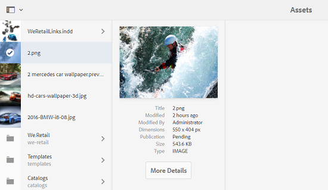

# Melhorias na experiência do usuário em Ativos {#user-experience-enhancements-in-assets}

AEM 6.4 Os ativos incluem várias melhorias de usabilidade que proporcionam uma experiência contínua do usuário e melhoram a produtividade. O aumento na velocidade com que você pode criar/gerenciar seu conteúdo disponível no mercado melhora a velocidade de conteúdo da empresa.

A interface é mais ágil, o que ajuda a gerenciar com eficiência um grande portfólio de ativos. Você pode pesquisar, exibir, classificar e rolar rapidamente por uma longa lista de itens.

Você pode personalizar as várias visualizações - visualizações de cartão, Lista e coluna. Por exemplo, você pode configurar o tamanho das miniaturas que deseja que sejam exibidas na visualização do cartão. Para a visualização de Lista, você pode configurar o nível de detalhes que deseja exibir para os ativos na lista. AEM 6.4 Os ativos incluem uma nova visualização em árvore que permite navegar convenientemente pelo repositório Ativos e localizar seus ativos.

## Carregamento lento {#lazy-loading}

Quando você navega/procura por ativos nos ativos AEM 6.4, até 200 ativos são exibidos de cada vez. Você pode rolar pelos resultados mais rapidamente, o que é especialmente útil ao navegar por uma longa lista de resultados. Como um número significativo de ativos é carregado por vez, a experiência de navegação é suave.

Se você tocar/clicar em um ativo para revisar sua página de detalhes, poderá retornar à página de resultados simplesmente tocando/clicando no botão Voltar na barra de ferramentas.

## Melhorias na visualização da placa {#card-view-improvements}

Dependendo do dispositivo usado e da quantidade de detalhes necessários, é possível redimensionar as miniaturas do ativo na visualização do cartão. Dessa forma, você pode personalizar sua visualização e controlar o número de miniaturas exibidas.

Para redimensionar miniaturas na visualização da placa, execute estas etapas:

1. Toque/clique no ícone Layout na barra de ferramentas e escolha a opção **[!UICONTROL Configurações de Visualização]**.

   

1. Na caixa de diálogo **[!UICONTROL Configurações de Visualização]**, selecione o tamanho de miniatura desejado e toque/clique em **[!UICONTROL Atualizar]**.

   

1. Revise as miniaturas exibidas no tamanho escolhido.

   

O bloco da visualização de cartão agora exibe informações adicionais, como status de publicação.

## Melhorias na visualização de lista {#list-view-improvements}

Na visualização da Lista, a primeira coluna agora exibe os nomes de arquivo dos ativos por padrão. Informações adicionais, como status de publicação e processamento e localidade, também são exibidas.

Você pode optar por configurar a quantidade de detalhes que deseja exibir. Toque/clique no ícone Layout, escolha a opção **[!UICONTROL Configurações de Visualização]** e especifique as colunas que deseja exibir na caixa de diálogo **[!UICONTROL Configurações de Visualização]**.

## Melhorias na visualização de colunas {#column-view-improvements}

Além das visualizações de Cartão e Lista, agora é possível navegar até a página de detalhes de um ativo a partir da visualização Coluna. Selecione um ativo na visualização Coluna e toque/clique em **[!UICONTROL Mais detalhes]** no instantâneo do ativo.

## Visualização de árvore {#tree-view}

AEM 6.4 Os ativos incluem uma visualização em árvore que permite navegar convenientemente na hierarquia de ativos e navegar até o ativo ou pasta desejados.

Para abrir a visualização de árvore, toque/clique no ícone GlobalNav em `Assets UI` e escolha **[!UICONTROL Árvore de conteúdo]** no menu.

Na hierarquia de conteúdo, navegue até o ativo desejado.

## Navegar pelos detalhes do ativo {#navigating-asset-details}

A página de detalhes do ativo agora inclui os botões Anterior e Próximo na barra de ferramentas para que você possa visualização todas as imagens em uma pasta sucessivamente.

Dependendo do seu dispositivo, você também pode arrastar com o dedo ou usar as teclas de seta no teclado para mover-se para frente e para trás entre as imagens.

Dependendo do layout escolhido, você pode abrir a página de detalhes de um ativo das seguintes maneiras:

| **Exibir** | **Como abrir a página de detalhes do ativo** |
|---|---|
| [!UICONTROL Exibição de cartão] | Toque/clique no bloco do ativo. |
| [!UICONTROL Exibição de lista  ] | Toque/clique na entrada de linha do ativo na lista. |
| [!UICONTROL Exibição de coluna] | Toque/clique no botão **[!UICONTROL Mais Detalhes]** no instantâneo do ativo. |

Use os botões Anterior/Próximo para mover-se para frente e para trás entre os ativos.

