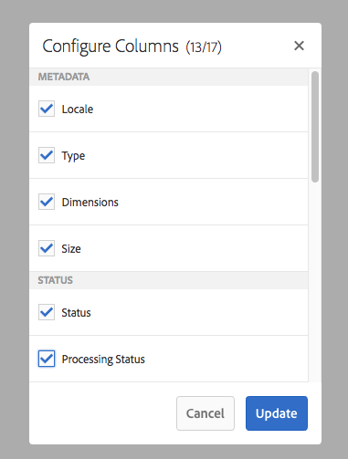
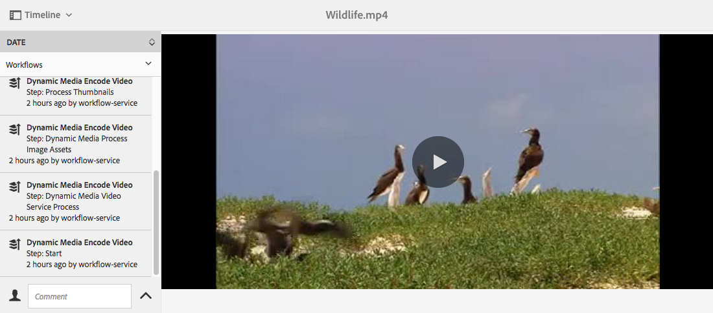

# Vídeo {#video}

Esta seção descreve como trabalhar com vídeo no Dynamic Media.

## Start rápido: Vídeos {#quick-start-videos}

A seguinte descrição passo a passo do fluxo de trabalho foi projetada para ajudá-lo a começar a funcionar rapidamente com conjuntos de vídeo adaptáveis no Dynamic Media. Depois de cada etapa, há referências cruzadas a cabeçalhos de tópicos nos quais você pode encontrar mais informações.

>[!NOTE]
>
>Antes de trabalhar com vídeo no Dynamic Media, verifique se o administrador do AEM já habilitou e configurou os Cloud Services do Dynamic Media.
>
>* Consulte [Configuração de Cloud Services de Mídia Dinâmica em Configuração de Mídia Dinâmica - Modo Híbrido.](/help/assets/config-dynamic.md)
>* Consulte [Configuração do Dynamic Media - Modo](config-dms7.md) Scene7 e [Solução de problemas do Dynamic Media - Modo Scene7](troubleshoot-dms7.md)

>


1. **Carregue seus vídeos** do Dynamic Media fazendo o seguinte:

   * Crie seu próprio perfil de codificação de vídeo. Ou você pode simplesmente usar o perfil predefinido &quot;Codificação de vídeo adaptável&quot; que acompanha o Dynamic Media.

      * [Criação de um perfil](video-profiles.md)de codificação de vídeo.
      * Saiba mais sobre as práticas [recomendadas para codificação](#best-practices-for-encoding-videos)de vídeo.
   * Associe o perfil de processamento de vídeo a uma ou mais pastas onde você carregará seus vídeos principais.

      * [Aplicar um perfil de vídeo a pastas](video-profiles.md#applying-a-video-profile-to-folders).
      * Saiba mais sobre as [Práticas recomendadas para organizar seus ativos digitais para o uso de perfis](organize-assets.md#organize-using-folders)de processamento.
      * Saiba mais sobre como [organizar ativos](organize-assets.md)digitais.
   * Carregue seus vídeos principais nas pastas. É possível carregar arquivos de vídeo com até 15 GB cada. Quando você adiciona vídeos à pasta, eles são codificados de acordo com o perfil de processamento de vídeo atribuído à pasta.

      * [Carregue seus vídeos](managing-video-assets.md#uploading-and-previewing-video-assets).
      * Saiba mais sobre os formatos [de arquivo de entrada](assets-formats.md#supported-multimedia-formats)suportados.
   * Monitore como a codificação [de vídeo está progredindo](#monitoring-video-encoding-and-youtube-publishing-progress) a partir da visualização do ativo ou do fluxo de trabalho.


1. **Gerencie seus vídeos** do Dynamic Media executando um dos procedimentos a seguir:

   * Organizar, navegar e pesquisar ativos de vídeo

      * [Organização de ativos digitais](organize-assets.md)

         Saiba mais sobre as práticas [recomendadas para organizar seus ativos digitais para uso de perfis de processamento](organize-assets.md#organize-using-folders)

      * [Pesquisar ativos](search-video-assets.md) de vídeo ou [Pesquisar ativos](managing-assets-touch-ui.md#searching-assets)
   * Pré-visualização e publicação de ativos de vídeo

      * Visualização o vídeo de origem e as representações codificadas do vídeo, juntamente com as miniaturas associadas:

         [Visualizar vídeos](managing-video-assets.md#uploading-and-previewing-video-assets) ou [Visualizar ativos](previewing-assets.md)

         [Exibição de representações de vídeo](video-renditions.md)

         [Gerenciamento de execuções de vídeo](managing-assets-touch-ui.md#managing-renditions)

      * [Gerenciar predefinições do visualizador](managing-viewer-presets.md)
      * [Publicar ativos](publishing-dynamicmedia-assets.md)
   * Trabalhar com metadados de vídeo

      * Visualização as propriedades de uma execução de vídeo codificado, como taxa de quadros, taxa de bits de áudio e vídeo e codec:

         [Exibir propriedades de representação de vídeo](video-renditions.md)

      * Edite as propriedades do vídeo, como título, descrição e tags, e os campos de metadados personalizados:

         [Editar propriedades de vídeo](managing-assets-touch-ui.md#editing-properties)

      * [Gerenciamento de metadados para ativos digitais](metadata.md)
      * [Esquemas de metadados](metadata-schemas.md)
   * Revisar, aprovar e anotar vídeos

      * [Anotação em vídeos](managing-video-assets.md#annotating-video-assets) ou ativos de [anotação](managing-assets-touch-ui.md#annotating)
      * [Aplicar workflows a ativos](assets-workflow.md) ou [Iniciar um fluxo de trabalho em um ativo](managing-assets-touch-ui.md#starting-a-workflow-on-an-asset)
      * [Revisar ativos da pasta](bulk-approval.md)
      * [Projetos](/help/sites-authoring/projects.md)


1. **Publique seus vídeos** do Dynamic Media executando um dos procedimentos a seguir:

   * Se você estiver usando o Adobe Experience Manager como seu sistema de gestão de conteúdo da Web, poderá adicionar vídeos diretamente às suas páginas da Web.

      * [Adicionar vídeos às suas páginas](adding-dynamic-media-assets-to-pages.md)da Web.
   * Se você estiver usando um sistema de gestão de conteúdo da Web de terceiros, poderá vincular ou incorporar vídeos às suas páginas da Web.

      * Integrar vídeo usando URL:

         [Vincular URLs do ao aplicativo da Web](linking-urls-to-yourwebapplication.md).
      * Integre vídeo usando o código incorporado na página da Web:

         [Incorporação do visualizador de vídeo em uma página](embed-code.md)da Web.
   * [Publicar vídeos no YouTube](#publishing-videos-to-youtube).
   * [Geração de relatórios](#viewing-video-reports)de vídeo.
   * [Adicionar legendas ao vídeo](#adding-captions-to-video).


## Trabalhar com vídeo no Dynamic Media {#working-with-video-in-dynamic-media}

O vídeo no Dynamic Media é uma solução completa que facilita a publicação de vídeo adaptável de alta qualidade para streaming em várias telas, incluindo dispositivos móveis desktop, iOS, Android, Blackberry e Windows. Um Conjunto de vídeos adaptáveis agrupa versões do mesmo vídeo que são codificadas em diferentes taxas de bits e formatos, como 400 kbps, 800 kbps e 1000 kbps. O computador desktop ou dispositivo móvel detecta a largura de banda disponível.

Por exemplo, em um dispositivo móvel iOS, ele detecta uma largura de banda como 3G, 4G ou Wi-Fi. Em seguida, seleciona automaticamente o vídeo codificado direito entre as várias taxas de bits de vídeo no Conjunto de vídeos adaptáveis. O vídeo é transmitido para desktops, dispositivos móveis ou tablets.

Além disso, a qualidade do vídeo é automaticamente alternada se as condições da rede mudarem no desktop ou no dispositivo móvel. Além disso, se um cliente entrar no modo de tela cheia em um desktop, o Conjunto de vídeos adaptáveis responderá usando uma resolução melhor, melhorando assim a experiência de visualização do cliente. O uso de Conjuntos de vídeo adaptáveis oferece a melhor reprodução possível para clientes que reproduzem vídeo de Mídia dinâmica em várias telas e dispositivos.

A lógica que um player de vídeo usa para determinar qual vídeo codificado reproduzir ou selecionar durante a reprodução é baseada no seguinte algoritmo:

1. O player de vídeo carrega o fragmento de vídeo inicial com base na taxa de bits mais próxima ao valor definido para &quot;taxa de bits inicial&quot; no próprio player.
1. O player de vídeo muda com base nas alterações na velocidade da largura de banda, usando os seguintes critérios:

   1. O player escolhe o fluxo de largura de banda mais alta abaixo ou igual à largura de banda estimada.
   1. O player considera apenas 80% da largura de banda disponível. No entanto, se está mudando, é mais conservador em apenas 70% para evitar sobrestimações e imediatamente voltar.

Para obter informações técnicas detalhadas sobre o algoritmo, consulte [https://android.googlesource.com/platform/frameworks/av/+/master/media/libstagefright/httplive/LiveSession.cpp](https://android.googlesource.com/platform/frameworks/av/+/master/media/libstagefright/httplive/LiveSession.cpp)

Para gerenciar um único vídeo e Conjuntos de vídeos adaptáveis, há suporte para o seguinte:

* Carregar vídeo de vários formatos de vídeo e formatos de áudio suportados e codificar vídeo para o formato MP4 H.264 para reprodução em várias telas. Você pode usar predefinições de vídeo adaptáveis predefinidas, predefinições de codificação de vídeo único ou personalizar sua própria codificação para controlar a qualidade e o tamanho do vídeo.

   * Quando um conjunto de vídeo adaptável é gerado, ele inclui vídeos MP4.
   * **Observação**: Vídeos principais/de origem não são adicionados a um Conjunto de vídeos adaptáveis.

* Legendagem de vídeo em todos os visualizadores de vídeo HTML5.
* Organize, navegue e pesquise vídeos com suporte total a metadados para o gerenciamento eficiente dos ativos de vídeo.
* Forneça Conjuntos de vídeo adaptáveis para a Web, desktops e dispositivos móveis, incluindo iPhone, iPad, Android, Blackberry e telefone Windows.

O streaming de vídeo adaptativo é suportado em várias plataformas iOS. Consulte o Guia [de referência para visualizadores de](https://docs.adobe.com/content/help/en/dynamic-media-developer-resources/library/home.html)Adobe.

O Dynamic Media suporta reprodução de vídeo móvel para vídeo MP4 H.264. Você pode encontrar dispositivos Blackberry compatíveis com este formato de vídeo no seguinte endereço: [Formatos de vídeo suportados no Blackberry](https://support.blackberry.com/kb/articleDetail?ArticleNumber=000005482).

Você pode encontrar dispositivos Windows compatíveis com este formato de vídeo no seguinte endereço: [Formatos de vídeo suportados no Windows Phone](https://msdn.microsoft.com/library/windows/apps/ff462087%28v=vs.105%29.aspx)

* Reproduza o vídeo usando as predefinições do visualizador de vídeo do Dynamic Media, incluindo:

   * Visualizadores de vídeo individuais.
   * Visualizadores de mídia mista que combinam conteúdo de vídeo e imagem.

* Configure players de vídeo para atender às suas necessidades de marca.
* Integre vídeo ao seu site, site móvel ou aplicativo móvel com um URL simples ou código incorporado.

Consulte Reprodução [dinâmica de vídeo](https://s7d9.scene7.com/s7/uvideo.jsp?asset=GeoRetail/Mop_AVS&amp;config=GeoRetail/Universal_Video1&amp;stageSize=640,480).

Consulte também [Sobre visualizadores](https://docs.adobe.com/content/help/en/dynamic-media-developer-resources/library/viewers-for-aem-assets-only/c-html5-aem-asset-viewers.html) HTML5 no Guia de referência de visualizadores do Adobe Scene7.

## Melhores práticas: Uso do visualizador de vídeo HTML5 {#best-practice-using-the-html-video-viewer}

As predefinições do visualizador de vídeo HTML5 do Dynamic Media são players de vídeo robustos. Você pode usá-los para evitar muitos problemas comuns associados à reprodução de vídeo HTML5 e problemas associados a dispositivos móveis, como falta de delivery de transmissão adaptável e alcance limitado do navegador do desktop.

No lado de design do player, é possível projetar toda a funcionalidade do player de vídeo usando ferramentas padrão de desenvolvimento da Web. Por exemplo, você pode projetar botões, controles e imagens de fundo de pôster personalizadas usando HTML5 e CSS para ajudá-lo a alcançar seus clientes com uma aparência personalizada.

No lado da reprodução do visualizador, ele detecta automaticamente a capacidade de vídeo do navegador. Em seguida, ele serve o vídeo usando o streaming HLS (streaming de vídeo adaptável). Ou, se esses métodos de delivery não estiverem presentes, então o HTML5 progressivo será usado.

Ao combinar em um único player a capacidade de projetar os componentes de reprodução usando HTML5 e CSS, ter reprodução integrada e usar streaming adaptável e progressivo dependendo da capacidade do navegador, você estende o alcance do conteúdo de mídia avançada para usuários de desktop e móveis e garante uma experiência de vídeo otimizada.

Consulte também [Sobre visualizadores](https://docs.adobe.com/content/help/en/dynamic-media-developer-resources/library/viewers-for-aem-assets-only/c-html5-aem-asset-viewers.html) HTML5 no Guia de referência de visualizadores para Adobe.

### Reprodução de vídeo em computadores desktop e dispositivos móveis usando o visualizador de vídeo HTML5 {#playback-of-video-on-desktop-computers-and-mobile-devices-using-the-html-video-viewer}

Para streaming de vídeo adaptável para desktop e dispositivos móveis, os vídeos usados para switching de taxa de bits são baseados em todos os vídeos MP4 no Conjunto de vídeos adaptáveis.

A reprodução do vídeo ocorre usando o streaming de vídeo HLS (HTTP Live Streaming) ou o download progressivo de vídeo. Em versões anteriores do AEM, como 6.0, 6.1 e 6.2, os vídeos eram transmitidos via HTTP.

No entanto, no AEM 6.3 e em diante, os vídeos agora são transmitidos por HTTPS (ou seja, streaming de vídeo HLS) porque o URL do serviço de gateway de DM sempre usa HTTPS também. Observe que não há impacto do cliente neste comportamento padrão. Ou seja, o streaming de vídeo sempre ocorrerá em HTTPS, a menos que não seja suportado pelo navegador. (consulte a tabela a seguir). Portanto,

* Se você tiver um site HTTPS com streaming de vídeo HTTPS, o streaming está correto.
* Se você tiver um site HTTP com streaming de vídeo HTTPS, o streaming estará correto e não haverá problemas de conteúdo misto no navegador da Web.

HLS (HTTP Live Streaming) é um padrão da Apple para streaming de vídeo adaptável que ajusta automaticamente a reprodução com base na capacidade de largura de banda da rede. Ele também permite que o cliente &quot;procure&quot; qualquer ponto do vídeo sem precisar aguardar o download do restante do vídeo (consulte também HTTP Live Streaming).

O vídeo progressivo é fornecido por meio do download e armazenamento local do vídeo na tela do desktop do usuário ou dispositivo móvel.

A tabela a seguir descreve o dispositivo, o navegador e o método de reprodução de vídeos em computadores desktop e dispositivos móveis usando o Scene7 Video Viewer.

<table> 
 <tbody> 
  <tr> 
   <td><strong>Device</strong></td> 
   <td><strong>Navegador</strong></td> 
   <td><strong>Modo de reprodução de vídeo</strong></td> 
  </tr> 
  <tr> 
   <td>Área de trabalho</td> 
   <td>Internet Explorer 9 e 10</td> 
   <td>Download progressivo.</td> 
  </tr> 
  <tr> 
   <td>Área de trabalho</td> 
   <td>Internet Explorer 11+</td> 
   <td>No Windows 8 e no Windows 10 - Forçar o uso de HTTPS sempre que HLS for solicitado. Limitação conhecida: O HTTP no HLS não funciona nesta combinação<br /> de navegador/sistema operacional <br /> No Windows 7 - Download progressivo. Usa a lógica padrão para selecionar protocolo HTTP versus HTTPS.</td> 
  </tr> 
  <tr> 
   <td>Área de trabalho</td> 
   <td>Firefox 23-44</td> 
   <td>Download progressivo.</td> 
  </tr> 
  <tr> 
   <td>Área de trabalho</td> 
   <td>Firefox 45 ou posterior</td> 
   <td>Transmissão de vídeo HLS.</td> 
  </tr> 
  <tr> 
   <td>Área de trabalho</td> 
   <td>Cromo</td> 
   <td>Transmissão de vídeo HLS.</td> 
  </tr> 
  <tr> 
   <td>Área de trabalho</td> 
   <td>Safari (Mac)</td> 
   <td>Transmissão de vídeo HLS.</td> 
  </tr> 
  <tr> 
   <td>Móvel</td> 
   <td>Chrome (Android 6 ou anterior)</td> 
   <td>Download progressivo.</td> 
  </tr> 
  <tr> 
   <td>Móvel</td> 
   <td>Chrome (Android 7 ou posterior)</td> 
   <td>Transmissão de vídeo HLS.</td> 
  </tr> 
  <tr> 
   <td>Móvel</td> 
   <td>Android (navegador padrão)</td> 
   <td>Download progressivo.</td> 
  </tr> 
  <tr> 
   <td>Móvel</td> 
   <td>Safari (iOS)</td> 
   <td>Transmissão de vídeo HLS.</td> 
  </tr> 
  <tr> 
   <td>Móvel</td> 
   <td>Chrome (iOS)</td> 
   <td>Transmissão de vídeo HLS.</td> 
  </tr> 
  <tr> 
   <td>Móvel</td> 
   <td>Blackberry</td> 
   <td>Transmissão de vídeo HLS.</td> 
  </tr> 
 </tbody> 
</table>

## Arquitetura da solução de vídeo Dynamic Media {#architecture-of-dynamic-media-video-solution}

O gráfico a seguir mostra o fluxo de trabalho de criação geral de vídeos que são carregados e codificados por meio do DMGGateway e disponibilizados para consumo público.


## Arquitetura de publicação híbrida para vídeos {#hybrid-publishing-architecture-for-videos}


## Práticas recomendadas para codificação de vídeos {#best-practices-for-encoding-videos}

O fluxo de trabalho **[!UICONTROL Codificação de vídeo do Dynamic Media]** codifica o vídeo se você tiver ativado a mídia dinâmica e configurado os serviços da nuvem de vídeo. Esse fluxo de trabalho captura o histórico do processo de fluxo de trabalho e as informações de falha. Consulte [Monitorar o progresso da codificação de vídeo e da publicação no YouTube](#monitoring-video-encoding-and-youtube-publishing-progress). If you have enabled Dynamic Media and set up Video Cloud services, the **[!UICONTROL Dynamic Media Encode Video]** workflow automatically takes effect when you upload a video. (If you are not using Dynamic Media, the **[!UICONTROL DAM Update Asset]** workflow takes effect.)

Veja a seguir dicas de práticas recomendadas para a codificação de arquivos de vídeo de origem.

Para obter conselhos sobre a codificação de vídeo, consulte:

* Artigo: *Streaming 101: Os fundamentos... Codecs, largura de banda, taxa de dados e resolução:* [www.adobe.com/go/learn_s7_streaming101_en](https://www.adobe.com/go/learn_s7_streaming101_en).
* Vídeo: *Noções básicas sobre codificação de vídeo:* [www.adobe.com/go/learn_s7_encoding_en](https://www.adobe.com/go/learn_s7_encoding_en).

### Arquivos de vídeo de origem {#source-video-files}

Ao codificar um arquivo de vídeo, use um arquivo de vídeo de origem com a qualidade mais alta possível. Evite usar arquivos de vídeo previamente codificados, pois esses arquivos já estão compactados, e a codificação adicional cria um vídeo de qualidade inferior.

A tabela a seguir descreve o tamanho recomendado, a proporção e a taxa mínima de bits que seus arquivos de vídeo de origem devem ter antes de codificá-los:

| Tamanho | Taxa de proporção | Taxa mínima de bits |
|--- |--- |--- |
| 1024 X 768 | 4:3 | 4500 kbps para a maioria dos vídeos. |
| 1280 X 720 | 16:9 | 3000 - 6000 kbps, dependendo da quantidade de movimento no vídeo. |
| 1920 X 1080 | 16:9 | 6000 - 8000 kbps, dependendo da quantidade de movimento no vídeo. |

### Obtenção dos metadados de um arquivo {#obtaining-a-file-s-metadata}

É possível obter os metadados de um arquivo ao exibir seus metadados usando uma ferramenta de edição de vídeo ou um aplicativo projetado para obter metadados. Veja a seguir as instruções de uso do MediaInfo, um aplicativo de terceiros, para obter os metadados de um arquivo de vídeo:

1. Ir para esta página da Web: [https://mediaarea.net/en/MediaInfo](https://mediaarea.net/en/MediaInfo).
1. Selecione e baixe o instalador da versão da GUI que você está usando e siga as instruções de instalação.
1. Após a instalação, clique com o botão direito do mouse no arquivo de vídeo (somente Windows) e selecione **[!UICONTROL MediaInfo]** ou abra **[!UICONTROL MediaInfo]** e arraste o arquivo de vídeo para o aplicativo. Todos os metadados associados ao arquivo de vídeo, incluindo largura, altura e fps.

### Taxa de proporção {#aspect-ratio}

Ao escolher ou criar uma predefinição de codificação de vídeo para o arquivo de vídeo principal, verifique se a predefinição tem a mesma proporção do arquivo de vídeo principal. A proporção é a proporção entre a largura e a altura do vídeo.

Para determinar a proporção de um arquivo de vídeo, obtenha os metadados do arquivo e observe a largura e a altura do arquivo (consulte Obter os metadados do arquivo acima). Em seguida, use essa fórmula para determinar a proporção:

*largura/altura = proporção*

A tabela a seguir descreve como os resultados da fórmula se traduzem em opções de proporção comuns:

| Resultado da fórmula | Taxa de proporção |
|--- |--- |
| 1.33 | 4:3 |
| 0.75 | 3:4 |
| 1.78 | 16:9 |
| 0.56 | 9:16 |

Por exemplo, um vídeo com largura de 1440 x altura de 1080 tem uma proporção largura/altura de 1440/1080 ou 1,33. Nesse caso, escolha uma predefinição de codificação de vídeo com uma proporção de 4:3 para codificar o arquivo de vídeo.

### Taxa de bits {#bitrate}

A taxa de bits é a quantidade de dados que é codificada para formar um único segundo de reprodução de vídeo. A taxa de bits é medida em kilobits por segundo (Kbps).

Como todos os codecs usam compactação com perdas, a taxa de bits é o fator mais importante na qualidade do vídeo. Com a compactação com perdas, quanto mais você compacta um arquivo de vídeo, mais a qualidade é degradada. Por isso, todas as outras características são iguais (resolução, taxa de quadros e codec), quanto menor a taxa de bits, menor a qualidade do arquivo compactado.

Ao selecionar uma codificação de taxa de bits, você pode escolher dois tipos:

* **Codificação** de taxa de bits constante (CBR) - Durante a codificação de CBR, a taxa de bits ou o número de bits por segundo é mantido a mesma durante todo o processo de codificação. A codificação CBR persiste na taxa de dados definida para sua configuração durante todo o vídeo. Além disso, a codificação CBR não otimiza arquivos de mídia para qualidade, mas economiza espaço no armazenamento.

   Use o CBR se o vídeo contiver um nível de movimento semelhante em todo o vídeo. O CBR é usado com mais frequência para o conteúdo de vídeo de fluxo contínuo. Consulte também [Uso de parâmetros](video-profiles.md#using-custom-added-video-encoding-parameters)de codificação de vídeo personalizados.

* **Codificação** de taxa de bits variável (VBR) - A codificação VBR ajusta a taxa de dados para baixo e para o limite máximo definido, com base nos dados exigidos pelo compressor. Isso significa que, durante um processo de codificação VBR, a taxa de bits do arquivo de mídia aumenta ou diminui dinamicamente, dependendo das necessidades de taxa de bits dos arquivos de mídia.

   O VBR demora mais para codificar, mas produz os resultados mais favoráveis; a qualidade do arquivo de mídia é superior. O VBR é usado com mais frequência para o delivery progressivo http do conteúdo de vídeo.

**Quando você deve usar VBR versus CRB?**
Quando se trata de selecionar VBR versus CBR, é quase sempre recomendável usar VBR para seus arquivos de mídia. O VBR fornece arquivos de maior qualidade a taxas de bits competitivas. Ao usar o VBR, certifique-se de usar com codificação de duas passagens e definir a taxa de bits máxima como 1,5x a taxa de bits de vídeo do público alvo.

Ao escolher uma predefinição de codificação de vídeo, considere a velocidade de conexão do usuário final do público alvo. Escolha uma predefinição com uma taxa de dados que seja 80% dessa velocidade. Por exemplo, se a velocidade de conexão do usuário final do público alvo for de 1000 Kbps, a melhor predefinição será aquela com uma taxa de dados de vídeo de 800 Kbps.

Esta tabela descreve a taxa de dados de velocidades de conexão típicas.

| Velocidade (Kbps) | Tipo de conexão |
|--- |--- |
| 256 | Conexão dial-up. |
| 800 | Conexão móvel típica. Para essa conexão, público alvo uma taxa de dados no intervalo de 400 a um máximo de 800 para experiências 3G. |
| 2000 | Conexão típica de desktop de banda larga. Para esta conexão, público alvo uma taxa de dados no intervalo de 800 a 2000 Kbps, com a maioria dos públicos alvos, em média, de 1200 a 1500 Kbps. |
| 5000 | Conexão típica de banda larga alta. Não é recomendável a codificação nesse intervalo superior, pois o delivery de vídeo nessa velocidade não está disponível para a maioria dos consumidores. |

### Resolução {#resolution}

**A resolução** descreve a altura e a largura de um arquivo de vídeo em pixels. A maioria dos vídeos de origem é armazenada em alta resolução (por exemplo, 1920 x 1080). Para fins de streaming, o vídeo de origem é compactado em uma resolução menor (640 x 480 ou menor).

A resolução e a taxa de dados são dois fatores totalmente ligados que determinam a qualidade do vídeo. Para manter a mesma qualidade de vídeo, quanto maior o número de pixels em um arquivo de vídeo (quanto maior a resolução), maior deve ser a taxa de dados. Por exemplo, considere o número de pixels por quadro em uma resolução 320 x 240 e um arquivo de vídeo de resolução 640 x 480:

| Resolução | Pixels por quadro |
|--- |--- |
| 320 x 240 | 76,800 |
| 640 x 480 | 307,200 |

O arquivo 640 x 480 tem quatro vezes mais pixels por quadro. Para obter a mesma taxa de dados para essas duas resoluções de exemplo, aplique quatro vezes a compactação ao arquivo 640 x 480, o que pode reduzir a qualidade do vídeo. Portanto, uma taxa de dados de vídeo de 250 Kbps produz uma visualização de alta qualidade em uma resolução de 320 x 240, mas não em uma resolução de 640 x 480.

Em geral, quanto maior for a taxa de dados, melhor será a aparência do vídeo e maior será a resolução usada, maior será a taxa de dados necessária para manter a qualidade de exibição (em comparação com resoluções mais baixas).

Como a resolução e a taxa de dados estão vinculadas, você tem duas opções ao codificar o vídeo:

* Escolha uma taxa de dados e, em seguida, codifique na resolução mais alta que tenha boa aparência na taxa de dados escolhida.
* Escolha uma resolução e, em seguida, codifique na taxa de dados necessária para obter vídeo de alta qualidade na resolução escolhida.

Ao escolher (ou criar) uma predefinição de codificação de vídeo para o arquivo de vídeo principal, use esta tabela para público alvo da resolução correta:

| Resolução | Altura (pixels) | Tamanho da tela |
|--- |--- |--- |
| 240p | 240 | Tela pequena |
| 300p | 300 | Tela pequena geralmente para dispositivos móveis |
| 360p | 360 | Tela pequena |
| 480p | 480 | Tela média |
| 720p | 720 | Tela grande |
| 1080p | 1080 | Tela grande de alta definição |

### Fps (Quadros por segundo) {#fps-frames-per-second}

Nos Estados Unidos e no Japão, a maioria dos vídeos é fotografados a 29,97 quadros por segundo (fps); na Europa, a maioria dos vídeos são gravados a 25 qps. O filme é filmado a 24 fps.

Escolha uma predefinição de codificação de vídeo que corresponda à taxa fps do arquivo de vídeo principal. Por exemplo, se o vídeo principal for 25 fps, escolha uma predefinição de codificação com 25 fps. Por padrão, toda codificação personalizada usa o fps do arquivo de vídeo principal. Por isso, não é necessário especificar explicitamente a configuração fps ao criar uma predefinição de codificação de vídeo.

### Dimensões de codificação de vídeo {#video-encoding-dimensions}

Para obter resultados ideais, selecione dimensões de codificação de modo que o vídeo de origem seja um múltiplo completo de todos os vídeos codificados.

Para calcular essa proporção, divida a largura de origem por largura codificada para obter a proporção de largura. Em seguida, divida a altura de origem por altura codificada para obter a proporção de altura.

Se a proporção resultante for um inteiro inteiro, isso significa que o vídeo é dimensionado de forma ideal. Se a proporção resultante não for um inteiro, isso afeta a qualidade do vídeo, deixando artefatos de pixel restantes na tela. Esse efeito é mais visível quando o vídeo tem texto.

Por exemplo, suponha que o vídeo de origem seja 1920 x 1080. Na tabela a seguir, os três vídeos codificados fornecem as configurações de codificação ideais a serem usadas.

<table> 
 <tbody> 
  <tr> 
   <th><p>Tipo de vídeo</p> </th> 
   <th><p>Largura x altura</p> </th> 
   <th><p>Proporção de largura</p> </th> 
   <th><p>Taxa de altura</p> </th> 
  </tr>
  <tr> 
   <td><p>Origem</p> </td> 
   <td><p>1920x1080</p> </td> 
   <td><p>1</p> </td> 
   <td><p>1</p> </td> 
  </tr> 
  <tr> 
   <td><p>Codificado</p> </td> 
   <td><p>960 x 540</p> </td> 
   <td><p>2</p> </td> 
   <td><p>2</p> </td> 
  </tr> 
  <tr> 
   <td><p>Codificado</p> </td> 
   <td><p>640 x 360</p> </td> 
   <td><p>3</p> </td> 
   <td><p>3</p> </td> 
  </tr> 
  <tr> 
   <td><p>Codificado</p> </td> 
   <td><p>480 x 270</p> </td> 
   <td><p>4</p> </td> 
   <td><p>4</p> </td> 
  </tr> 
 </tbody> 
</table>

### Formato de arquivo de vídeo codificado {#encoded-video-file-format}

O Dynamic Media recomenda o uso de predefinições de codificação de vídeo MP4 H.264. Como os arquivos MP4 usam o codec de vídeo H.264, ele fornece vídeo de alta qualidade, mas em um tamanho de arquivo compactado.

## Publicar vídeos no YouTube {#publishing-videos-to-youtube}

Você pode publicar ativos de vídeo no local AEM diretamente em um canal do YouTube criado anteriormente.

Para publicar ativos de vídeo no YouTube, configure o AEM Assets com tags. Você associa essas tags a um canal do YouTube. Se a tag de um ativo de vídeo corresponder à tag de um canal do YouTube, o vídeo será publicado no YouTube. Se o ativo de vídeo não tiver uma tag, ele não será publicado no YouTube.

A publicação no YouTube ignora o sistema de perfil de processamento no AEM e, portanto, o perfil de codificação de vídeo também. Esse desvio ocorre porque o YouTube tem sua própria codificação, de modo que um perfil de processamento de vídeo não é necessário. Na maioria dos casos, no entanto, espera-se que você já tenha feito com que seus ativos de vídeo passem por um perfil de processamento de vídeo. Quando você ignora o perfil de processamento de vídeo e publica diretamente no YouTube, isso significa apenas que o ativo de vídeo AEM Ativo não obtém uma miniatura visível. Isso também significa que se você executar no modo de execução de mídia dinâmica, os vídeos que não estão codificados não funcionarão com nenhum dos tipos de ativos de Mídia dinâmica.

A publicação de ativos de vídeo em servidores do YouTube envolve a conclusão das seguintes tarefas para garantir a autenticação segura e segura de servidor para servidor com o YouTube:

1. [Configuração das configurações da Google Cloud](#configuring-google-cloud-settings)
1. [Criação de um canal do YouTube](#creating-a-youtube-channel)
1. [Adicionar tags para publicação](#adding-tags-for-publishing)
1. [Ativando o agente de Replicação de Publicação do YouTube](#enabling-the-youtube-publish-replication-agent)
1. [Configuração do YouTube no AEM](#setting-up-youtube-in-aem)
1. [(Opcional) Automatizando a configuração das propriedades padrão do YouTube para os vídeos carregados](#optional-automating-the-setting-of-default-youtube-properties-for-your-uploaded-videos)
1. [Publicar vídeos no canal do YouTube](#publishing-videos-to-your-youtube-channel)
1. [(Opcional) Verificação do vídeo publicado no YouTube](video.md#optional-verifying-the-published-video-on-youtube)
1. [Vincular URLs do YouTube à sua Aplicação web](#linking-youtube-urls-to-your-web-application)

Você também pode [cancelar a publicação de vídeos para removê-los do YouTube](#unpublishing-videos-to-remove-them-from-youtube).

### Definição das configurações do Google Cloud {#configuring-google-cloud-settings}

Para publicar no YouTube, você precisa de uma conta do Google. Se você tiver uma conta GMAIL, você já terá uma conta do Google. Se você não tiver uma conta do Google, poderá criar uma facilmente. Você precisa da conta porque precisa de credenciais para publicar ativos de vídeo no YouTube. Se você já tiver uma conta criada, ignore essa tarefa e prossiga para [Criar um canal](#creating-a-youtube-channel)do YouTube.

>[!NOTE]
>
>Os passos a seguir foram precisos no momento desta escrita. No entanto, o Google atualiza periodicamente seus sites sem aviso prévio. Como tal, essas etapas podem ser um pouco diferentes.

**Para definir as configurações** do Google Cloud:

1. Crie uma nova conta do Google.

   [https://accounts.google.com/SignUp?service=mail](https://accounts.google.com/SignUp?service=mail)

   Se você já tiver uma conta do Google, vá para a próxima etapa.

1. Vá para [https://cloud.google.com/](https://cloud.google.com/).
1. Na página Plataforma do Google Cloud, próximo à parte superior, toque em **[!UICONTROL Console]**. Talvez seja necessário **Fazer logon** usando suas credenciais de conta do Google.
1. Na página **[!UICONTROL Painel]** , toque em **[!UICONTROL Criar projeto]**.
1. Na caixa de diálogo **[!UICONTROL Novo projeto]** , insira o nome de um projeto.

   Observe que a ID do projeto se baseia no nome do projeto. Como tal, escolha cuidadosamente o nome do projeto; ele não pode ser alterado após ser criado. Além disso, você precisará digitar a mesma ID de projeto novamente quando configurar o YouTube no Adobe Experience Manager posteriormente. Talvez você queira anotar a ID do projeto.
1. Toque em **[!UICONTROL Criar]**.

1. No **[!UICONTROL Painel]** do seu projeto, no cartão **[!UICONTROL Introdução]** , toque em **[!UICONTROL Ativar APIs e obtenha credenciais como chaves]**.
1. Próximo à parte superior da página do **[!UICONTROL Painel]** , toque em **[!UICONTROL Ativar API]**.
1. Na página **[!UICONTROL Biblioteca]** , em APIs do YouTube, toque em API **[!UICONTROL de dados do]** YouTube.
1. Próximo à parte superior da página da API de dados do **[!UICONTROL YouTube v3]** , toque em **[!UICONTROL Ativar]** para ativá-la.
1. Para usar a API, talvez você precise de credenciais. Se necessário, toque em **[!UICONTROL Criar credenciais]**.
1. Em **[!UICONTROL Onde você irá chamar a API?]** lista suspensa, selecione Servidor **[!UICONTROL Web (por exemplo, node.js, Tomcat)]**.
1. Em **[!UICONTROL Que dados você estará acessando?]** selecione Dados **** do usuário.
1. Toque em **[!UICONTROL Quais credenciais eu preciso?]**.
1. No cabeçalho **[!UICONTROL Create an OAuth 2.0 client ID]** (Criar uma ID de cliente OAuth 2.0), digite um nome exclusivo.
1. No campo de texto sob o cabeçalho origens **[!UICONTROL Javascript]** Autorizado, digite o seguinte caminho, substituindo seu próprio domínio e número de porta no caminho, em seguida, pressione **[!UICONTROL Enter]** para adicionar o caminho à lista:

   `https://<servername.domain>:<port_number>`

   Por exemplo, `https://1a2b3c.mycompany.com:4321`

   **Observação**: O exemplo de caminho acima destina-se apenas a fins de ilustração.

1. No campo de texto sob o cabeçalho URIs **[!UICONTROL de redirecionamento]** autorizados, digite o seguinte, substituindo seu próprio domínio e número de porta no caminho, em seguida, pressione Enter para adicionar o caminho à lista:

   `https://<servername.domain>:<port#>/etc/cloudservices/youtube.youtubecredentialcallback.json`

   Por exemplo, `https://1a2b3c.mycompany.com:4321/etc/cloudservices/youtube.youtubecredentialcallback.json`

   **Observação**: O exemplo de caminho acima destina-se apenas a fins de ilustração.

1. Toque em **[!UICONTROL Criar ID]** de cliente.
1. On the Credentials page, under the **[!UICONTROL Set up the OAuth 2.0 consent screen]** heading, select the Gmail address that you are currently using.
1. No campo de texto sob o cabeçalho Nome do **[!UICONTROL produto mostrado aos usuários]** , digite o que você deseja mostrar na tela de consentimento.

   A tela de consentimento é exibida ao administrador do AEM quando eles são autenticados no YouTube; AEM entrará em contato com o YouTube para obter permissão.

1. Toque em **[!UICONTROL Continuar]**.
1. No cabeçalho **[!UICONTROL Download de credenciais]** , toque em **[!UICONTROL Download]**.
1. Salve o `client_id.json` arquivo.

   Você precisará desse arquivo json baixado ao configurar o YouTube no Adobe Experience Manager mais tarde.

1. Toque em **[!UICONTROL Concluído]**.

   Agora você criará um canal no YouTube.

### Criação de um canal do YouTube {#creating-a-youtube-channel}

A publicação de vídeos no YouTube requer um ou mais canais. Se você já tiver criado um canal do YouTube, poderá ignorar essa tarefa e ir para **Adicionar tags para publicação**.

>[!CAUTION]
>
>Certifique-se de que já configurou um ou mais canais no YouTube &amp;ast;before&amp;ast; adicione canais em Configurações do YouTube no AEM (consulte [Configuração do YouTube no AEM](#setting-up-youtube-in-aem) abaixo). Se você não fizer isso, não receberá nenhum aviso de nenhum canal existente. No entanto, a autenticação do Google ainda ocorre quando você adiciona um canal, mas não há uma opção para escolher qual canal o vídeo é enviado.

**Para criar um canal** do YouTube:

1. Acesse [https://www.youtube.com](https://www.youtube.com/) e faça logon usando suas credenciais de conta do Google.
1. No canto superior direito da página do YouTube, toque na imagem do seu perfil (também pode aparecer como uma letra dentro de um círculo colorido sólido) e, em seguida, toque nas configurações **[!UICONTROL do]** YouTube (ícone de engrenagem redonda).
1. Na página **[!UICONTROL Visão geral]** , no cabeçalho Recursos **** adicionais, toque em **[!UICONTROL Ver todos os meus canais ou criar um novo canal]**.
1. Na página **[!UICONTROL Canais]** , toque em **[!UICONTROL Criar um novo canal]**.
1. Na página Conta **[!UICONTROL da]** marca, no campo Nome **[!UICONTROL da conta da]** marca, digite um nome comercial ou qualquer outro nome de canal que você escolher onde deseja publicar seus ativos de vídeo e, em seguida, toque em **[!UICONTROL Criar]**.

   Lembre-se do nome inserido aqui, pois será necessário inseri-lo novamente ao configurar o YouTube no AEM.

1. (Opcional) Se necessário, adicione mais canais.

   Agora, você adicionará tags para publicação.

### Adicionar tags para publicação {#adding-tags-for-publishing}

Para publicar em seus vídeos no YouTube, AEM associa tags a um ou mais canais do YouTube. Para adicionar tags para publicação, consulte [Administração de tags](/help/sites-administering/tags.md).

Ou, se você pretende usar as tags padrão no AEM, ignore essa tarefa e acesse [Ativando o agente](#enabling-the-youtube-publish-replication-agent)de replicação de Publicação do YouTube.

### Ativar o agente de replicação de publicação do YouTube {#enabling-the-youtube-publish-replication-agent}

1. In the upper-left corner of AEM, tap the AEM logo, then in the left rail, tap **[!UICONTROL Tools > Deployment > Replication > Agents on Author]**.
1. Na página **[!UICONTROL Agentes do autor]** , toque em Publicar no **[!UICONTROL YouTube (youtube)]**.
1. Na barra de ferramentas, à direita de Configurações, toque em **[!UICONTROL Editar]**.
1. Marque a caixa de seleção **[!UICONTROL Ativado]** para ativar o agente de replicação.
1. toque em **[!UICONTROL OK]**.

   Agora você vai configurar o YouTube no AEM.

### Setting up YouTube in AEM {#setting-up-youtube-in-aem}

1. In the upper-left corner of AEM, tap the AEM logo, then in the left rail, tap **[!UICONTROL Tools > Deployment > Cloud Services]**.
1. No cabeçalho Serviços **[!UICONTROL de]** terceiros, em YouTube, toque em **[!UICONTROL Configurar agora]**.
1. Na caixa de diálogo **[!UICONTROL Criar configuração]** , digite um título (obrigatório) e um nome (opcional) nos respectivos campos.
1. Toque em **[!UICONTROL Criar]**.
1. In the **[!UICONTROL YouTube Account Settings]** dialog box, in the **[!UICONTROL Application Name]** field, enter the Google Project ID.

   Você especificou a ID do projeto quando configurou as configurações do Google Cloud anteriormente.

   Deixe a caixa de diálogo Configuração **[!UICONTROL da conta do]** YouTube aberta; você voltará a isso em um momento.

1. Usando um editor de texto simples, abra o arquivo JSON que você baixou e salvou anteriormente na tarefa Configuração das configurações do Google Cloud.
1. Selecione e copie o texto JSON inteiro.
1. Return to the **[!UICONTROL YouTube Account Settings]** dialog box. No campo **[!UICONTROL Configuração JSON]**, cole o texto JSON.
1. Toque em **[!UICONTROL OK]**.

   Agora você irá configurar canais do YouTube no AEM.

1. À direita de **[!UICONTROL Canais disponíveis]**, toque em **[!UICONTROL +]** (ícone de adição).
1. In the **[!UICONTROL YouTube Channel Settings]** dialog box, in the **[!UICONTROL Title]** field, enter the name of the channel that you created in the task **C[!UICONTROL reating a YouTube channel]** earlier.

   Como opção, você pode adicionar uma descrição, se desejar.

1. Toque em **[!UICONTROL OK]**.
1. A autenticação do YouTube/Google é exibida. Se você ainda não estiver conectado à conta do Google Cloud, ignore esta etapa.

   * Digite o nome de usuário e a senha do Google associados à ID do projeto do Google e o texto JSON acima.
   * Dependendo de quantos canais sua conta tiver exibido dois ou mais itens. Selecione um canal. Não selecione o endereço de email.
   * Na próxima página, toque em **[!UICONTROL Aceitar]** para permitir o acesso a este canal.

1. Toque em **[!UICONTROL Permitir]**.

   Agora, você configurará tags para publicação.

1. **Configuração de tags para publicação** - Na página **[!UICONTROL Cloud Services > YouTube]** , toque no ícone **[!UICONTROL Lápis]** para editar a lista de tags que deseja usar.
1. Toque no ícone de lista suspensa (sinal invertido) para exibir a lista das tags disponíveis no AEM.
1. Toque em uma ou mais tags para adicioná-las.

   Para excluir uma tag adicionada, selecione-a e toque em **[!UICONTROL X]**.

1. Quando terminar de adicionar as tags desejadas, toque em **[!UICONTROL OK]**.

   Agora você publica vídeos no seu canal do YouTube.

### (Opcional) Automatizando a configuração das propriedades padrão do YouTube para os vídeos carregados {#optional-automating-the-setting-of-default-youtube-properties-for-your-uploaded-videos}

Você pode automatizar a configuração das propriedades do YouTube no upload dos vídeos. Isso é feito criando um perfil de processamento de metadados no AEM.

Para criar o perfil de processamento de metadados, você primeiro copiará valores dos campos **[!UICONTROL Rótulo do campo]**, **[!UICONTROL Mapear para a propriedade]** e **[!UICONTROL Opções]**, todos encontrados nos Esquemas de metadados do vídeo. Em seguida, você criará seu perfil de processamento de metadados de vídeo do YouTube, adicionando esses valores a ele.

**Como opção, para automatizar a configuração das propriedades padrão do YouTube para os vídeos** carregados:

1. In the upper-left corner of AEM, tap the AEM logo, then in the left rail, tap **[!UICONTROL Tools > Assets > Metadata Schemas]**.
1. Toque em **[!UICONTROL padrão]**. (Não adicione uma marca de seleção à caixa de seleção à esquerda de &quot;padrão&quot;.)
1. On the **[!UICONTROL default]** page, check the box to the left of **[!UICONTROL video]**, then tap **[!UICONTROL Edit]**.
1. Na página Editor **[!UICONTROL de Schemas de]** metadados, toque na guia **[!UICONTROL Avançado]** .
1. Under the YouTube Publishing heading, tap **[!UICONTROL YouTube Category]**. (Não toque na lista suspensa Categoria do YouTube.)
1. No lado direito da página, na guia **[!UICONTROL Configurações]** , faça o seguinte:

   * No campo de texto Rótulo **[!UICONTROL do]** campo, selecione e copie o valor.

      Cole o valor copiado em um editor de texto aberto. Você precisará desse valor posteriormente ao criar seu perfil de processamento de metadados. Deixe o editor de texto aberto.

   * No campo de texto **[!UICONTROL Mapear para propriedade]** , selecione e copie o valor.

      Cole o valor copiado no editor de texto aberto. Você precisará desse valor posteriormente ao criar seu perfil de processamento de metadados. Deixe o editor de texto aberto.

   * Em **[!UICONTROL Opções]**, selecione e copie o valor padrão que deseja usar (como Pessoas e blogs ou Ciência e Tecnologia).

      Cole o valor copiado no editor de texto aberto. Você precisará desse valor posteriormente ao criar seu perfil de processamento de metadados. Deixe o editor de texto aberto.

1. Under the YouTube Publishing heading, tap **[!UICONTROL YouTube Privacy]**. (Não toque na lista suspensa Privacidade do YouTube.)
1. No lado direito da página, na guia **[!UICONTROL Configurações]** , faça o seguinte:

   * No campo de texto Rótulo **[!UICONTROL do]** campo, selecione e copie o valor.

      Cole o valor copiado em um editor de texto aberto. Você precisará desse valor posteriormente ao criar seu perfil de processamento de metadados. Deixe o editor de texto aberto.

   * No campo de texto **[!UICONTROL Mapear para propriedade]** , selecione e copie o valor.

      Cole o valor copiado no editor de texto aberto. Você precisará desse valor posteriormente ao criar seu perfil de processamento de metadados. Deixe o editor de texto aberto.

   * Em **[!UICONTROL Opções]**, selecione e copie o valor padrão que deseja usar. Observe que as Opções estão agrupadas em pares de dois. O campo inferior do par é o valor padrão que você deseja copiar, como público, não listado ou privado.

      Cole o valor copiado no editor de texto aberto. Você precisará desse valor posteriormente ao criar seu perfil de processamento de metadados. Deixe o editor de texto aberto.

1. Perto do canto superior direito da página do Editor **[!UICONTROL de Schemas de]** Metadados, toque em **[!UICONTROL Cancelar]**.
1. In the upper-left corner of AEM, tap the AEM logo, then in the left rail, tap **[!UICONTROL Tools > Assets > Metadata Profiles]**.

1. Na página Perfis **[!UICONTROL de]** metadados, próximo ao canto superior direito da página, toque em **[!UICONTROL Criar]**. In the **[!UICONTROL Add Metadata Profile]** dialog box, in the **[!UICONTROL Profile title]** text field, enter the name `YouTube Video`.
1. Na página Editor **[!UICONTROL de Perfis de]** metadados, toque na guia **[!UICONTROL Avanço]** .
1. Adicione os valores de Publicação do YouTube copiados ao perfil, fazendo o seguinte:

   * No lado direito da página, toque na guia **[!UICONTROL Criar formulário]** .
   * Arraste o componente identificado como Cabeçalho **[!UICONTROL de]** seção para a esquerda e solte-o na área de formulário.
   * Tap **[!UICONTROL Field Label]** to select the component.
   * No lado direito da página, na guia **[!UICONTROL Configurações]** , no campo de texto Rótulo **[!UICONTROL do]** campo, digite `YouTube Publishing`.
   * Tap the **[!UICONTROL Build Form]** tab, then drag the component labeled **[!UICONTROL Single Line Text]** and drop it below the **[!UICONTROL YouTube Publishing]** heading that you just created.
   * Tap **[!UICONTROL Field Label]** to select the component.
   * No lado direito da página, na guia **[!UICONTROL Configurações]** , cole os valores de Publicação **[!UICONTROL do]** YouTube (valor do Rótulo **[!UICONTROL do]** campo e **[!UICONTROL Mapear para valor de propriedade]** ) que você copiou anteriormente, em seus respectivos campos no formulário. Cole o valor **[!UICONTROL Opções]** no campo Valor **** padrão.

1. Adicione os valores de privacidade do YouTube copiados ao perfil, fazendo o seguinte:

   * No lado direito da página, toque na guia **[!UICONTROL Criar formulário]** .
   * Arraste o componente identificado como Cabeçalho **[!UICONTROL de]** seção para a esquerda e solte-o na área de formulário.
   * Tap **[!UICONTROL Field Label]** to select the component.
   * No lado direito da página, na guia Configurações, no campo de texto Rótulo do campo, digite `YouTube Privacy`.
   * Tap the **[!UICONTROL Build Form]** tab, then drag the component labeled **[!UICONTROL Single Line Text]** and drop it below the **[!UICONTROL YouTube Privacy]** heading you just created.
   * Tap **[!UICONTROL Field Label]** to select the component.
   * No lado direito da página, na guia **[!UICONTROL Configurações]** , cole os valores de Publicação **[!UICONTROL do]** YouTube (valor do Rótulo **[!UICONTROL do]** campo e **[!UICONTROL Mapear para valor de propriedade]** ) que você copiou anteriormente, em seus respectivos campos no formulário. Cole o valor **[!UICONTROL Opções]** no campo Valor **** padrão.

1. Near the upper-right corner of the page, tap **[!UICONTROL Save]**.
1. Aplique o perfil de metadados de publicação do YouTube às pastas onde você carregará vídeos. Você precisará ter o Perfil Metadados e o Perfil Vídeo definidos.

   Consulte [Perfis de metadados](metadata-profiles.md) e [Perfis de vídeo](video-profiles.md).

### Publicar vídeos no canal do YouTube {#publishing-videos-to-your-youtube-channel}

Agora você associa as tags adicionadas anteriormente aos ativos de vídeo. Esse processo permite AEM quais ativos publicar em seu canal do YouTube.

Para publicar conteúdo do YouTube, AEM usa o fluxo de trabalho **[!UICONTROL Publicar no YouTube]** , que permite que você monitore o progresso e visualização de quaisquer informações de falha.
Consulte [Monitorar o progresso da codificação de vídeo e da publicação no YouTube](#monitoring-video-encoding-and-youtube-publishing-progress).

**Para publicar vídeos no canal** do YouTube:

1. Em AEM, navegue até um ativo de vídeo que você deseja publicar no seu canal do YouTube.
1. Selecione o ativo de vídeo.

   Independentemente do ativo de vídeo selecionado (como o vídeo de origem original ou uma representação codificada), o vídeo de origem original sempre é carregado.

1. Na barra de ferramentas, toque em **[!UICONTROL Propriedades]**.
1. Na guia **[!UICONTROL Básico]** , no cabeçalho Metadados, toque em **[!UICONTROL Navegar]** à direita do campo **[!UICONTROL Tags]** .
1. Na página **[!UICONTROL Selecionar tags]** , navegue até as tags que deseja usar e selecione uma ou mais tags.
1. No canto superior direito da página, toque no ícone **[!UICONTROL Confirmar]** .
1. In the upper-right corner of the video&#39;s properties page, tap **[!UICONTROL Save]**.
1. Na barra de ferramentas, toque em **[!UICONTROL Publicar > Publicar]**.

   Como opção, você pode verificar o vídeo publicado no seu canal do YouTube.

### (Opcional) Verificação do vídeo publicado no YouTube {#optional-verifying-the-published-video-on-youtube}

Você pode monitorar o progresso da publicação no YouTube (ou desfazer a publicação).

Consulte [Monitorar o progresso da codificação de vídeo e da publicação no YouTube](#monitoring-video-encoding-and-youtube-publishing-progress).

Os tempos de publicação podem variar muito, dependendo de vários fatores que incluem o formato do vídeo principal, o tamanho do arquivo e o tráfego de upload. O processo de publicação pode levar de alguns minutos a várias horas. Além disso, lembre-se de que os formatos de resolução mais alta são renderizados muito mais lentamente. Por exemplo, 720p e 1080p demoram muito mais para aparecer do que 480p.

Após oito horas, se você ainda vir uma mensagem de status **[!UICONTROL Carregado (processando, aguarde)]**, tente remover o vídeo de nosso site e carregá-lo novamente.

### Linking YouTube URLs to your Web Application {#linking-youtube-urls-to-your-web-application}

Você pode obter uma string de URL do YouTube gerada pelo Dynamic Media após publicar o vídeo. Quando você copia o URL do YouTube, ele aterrissa na Área de transferência para que você possa colá-lo conforme necessário nas páginas do seu site ou aplicativo.

O URL do YouTube não estará disponível para cópia até que você tenha publicado o ativo de vídeo no YouTube.

**Para vincular URLs do YouTube ao aplicativo** da Web:

1. Navegue até o ativo de vídeo *publicado* no YouTube cujo URL você deseja copiar e selecione-o.

   Remember that YouTube URLs are only available to copy *after* you have first *published* the video assets to YouTube.

1. Na barra de ferramentas, toque em **[!UICONTROL Propriedades]**.
1. Tap the **[!UICONTROL Advanced]** tab.
1. No cabeçalho Publicação **[!UICONTROL no]** YouTube, na Lista de URL **[!UICONTROL do]** YouTube, selecione e copie o texto do URL para o navegador da Web para pré-visualização do ativo ou para adicionar à página de conteúdo da Web.

### Desfazer publicação de vídeos para removê-los do YouTube {#unpublishing-videos-to-remove-them-from-youtube}

Quando você cancela a publicação de um ativo de vídeo no AEM, o vídeo será removido do YouTube.

>[!CAUTION]
>
>Se você remover um vídeo diretamente do YouTube, AEM desconhece e continua a se comportar como se o vídeo ainda fosse publicado no YouTube. Sempre cancele a publicação de um ativo de vídeo do YouTube por meio de AEM.

Para remover o conteúdo do YouTube, AEM usa o fluxo de trabalho **[!UICONTROL Desfazer a publicação do YouTube]** , que permite que você monitore o progresso e visualização de quaisquer informações de falha.
Consulte [Monitorar o progresso da codificação de vídeo e da publicação no YouTube](#monitoring-video-encoding-and-youtube-publishing-progress).

**Para cancelar a publicação de vídeos para removê-los do YouTube**:

1. In the upper-left corner of AEM, tap the AEM logo, then in the left rail, tap **[!UICONTROL Tools > Assets]**.
1. Navegue até os ativos de vídeo que você deseja cancelar a publicação do seu canal do YouTube.
1. Em um modo de seleção de ativo, selecione um ou mais ativos de vídeo publicados.
1. Na barra de ferramentas, toque em **[!UICONTROL Cancelar publicação > Cancelar publicação]**.

## Monitoring video encoding and YouTube publishing progress {#monitoring-video-encoding-and-youtube-publishing-progress}

Ao carregar um novo vídeo para uma pasta com codificação de vídeo aplicada ou publicar seu vídeo no YouTube, você pode monitorar como sua codificação de vídeo/publicação no YouTube está progredindo (ou falhando) de várias maneiras. O progresso real de publicação do YouTube só está disponível por meio dos logs, mas se ele falhar ou for bem-sucedido, será listado de formas adicionais descritas no procedimento a seguir. Além disso, você pode receber notificações por email quando um fluxo de trabalho de publicação ou codificação de vídeo do YouTube for concluído ou abortado.

### Acompanhamento dos progressos {#monitoring-progress}

Para monitorar o progresso (incluindo a codificação com falha/publicação do YouTube):

1. Progresso da codificação de vídeo de visualização em sua pasta de ativos:

   * Na Visualização **[!UICONTROL de cartão]**, o progresso da codificação de vídeo é exibido no ativo em uma porcentagem. Se houver um erro, essas informações também serão exibidas no ativo.

      

   * In **[!UICONTROL List View]**, video encoding progress displays in the **[!UICONTROL Processing Status]** column. Se houver um erro, essa mensagem será exibida nessa mesma coluna.

      

      Essa coluna não é exibida por padrão. To enable the column, select **[!UICONTROL View Settings]** from the **[!UICONTROL Views]** drop-down menu, and add the **[!UICONTROL Processing Status]** column and tap **[!UICONTROL Update]**.

      

1. Progresso da visualização nos detalhes do ativo. Ao tocar em um ativo, abra o menu suspenso e selecione **[!UICONTROL Linha do tempo]**. Para limitar a atividades de fluxo de trabalho, como codificação ou publicação no YouTube, selecione **[!UICONTROL Workflows]**.

   

   Quaisquer informações do fluxo de trabalho, como codificação, são exibidas na linha do tempo. Para a publicação no YouTube, a linha do tempo do **[!UICONTROL Fluxo de trabalho]** também inclui o nome do canal do YouTube e o URL do vídeo no YouTube. Além disso, você verá notificações de falha na linha do tempo do **[!UICONTROL Fluxo de trabalho]** .

   >[!NOTE]
   >
   >It may take a long time for failure/error messages to finally be recorded due to multiple workflow configurations on **[!UICONTROL retries]**, **[!UICONTROL retry delay]**, and **[!UICONTROL timeout]** from [http://localhost:4502/system/console/configMgr](http://localhost:4502/system/console/configMgr), for example:
   >
   >* Configuração da fila de trabalhos do Apache Sling
   >* Processador de Trabalho de Processo Externo do Fluxo de Trabalho do Adobe Granite
   >* Fila de Tempo Limite do Fluxo de Trabalho Granite

   > 
   >Você pode ajustar as **[!UICONTROL tentativas]**, o **[!UICONTROL atraso de repetição]** e as propriedades de **[!UICONTROL tempo limite]** nessas configurações.

1. For workflows in progress, see **Workflow Instances** available from **[!UICONTROL Tools > Workflow > Instances]**.

   >[!NOTE]
   >
   >Talvez você precise de direitos administrativos para acessar o menu **[!UICONTROL Ferramentas]** .

   

   Selecione a instância e toque em **[!UICONTROL Abrir histórico]**.

   

   Na área Instâncias **[!UICONTROL do]** fluxo de trabalho, também é possível suspender, encerrar ou renomear workflows. Consulte [Administração de workflows](/help/sites-administering/workflows-administering.md) para obter mais informações.

1. For failed jobs, see **Workflow Failures** available from **[!UICONTROL Tools > Workflow > Failures]**. A **[!UICONTROL Falha do fluxo de trabalho]** lista todas as atividades do fluxo de trabalho com falha.

   >[!NOTE]
   >
   >Talvez você precise de direitos administrativos para acessar o menu **[!UICONTROL Ferramentas]** .

   

   >[!NOTE]
   >
   >It may take a long time for the error message to finally be recorded due to multiple workflow configurations on **[!UICONTROL retries]**, **[!UICONTROL retry delay]**, and **[!UICONTROL timeout]** from [http://localhost:4502/system/console/configMgr](http://localhost:4502/system/console/configMgr), for example:
   >
   >* Configuração da fila de trabalhos do Apache Sling
   >* Processador de Trabalho de Processo Externo do Fluxo de Trabalho do Adobe Granite
   >* Fila de Tempo Limite do Fluxo de Trabalho Granite

   >
   >Você pode ajustar as **[!UICONTROL tentativas]**, o **[!UICONTROL atraso de repetição]** e as propriedades de **[!UICONTROL tempo limite]** nessas configurações.

1. For completed workflows, see **[!UICONTROL Workflow Archive]** available from **[!UICONTROL Tools > Workflow > Archive]**. O **[!UICONTROL Arquivo de fluxo de trabalho]** lista todas as atividades de fluxo de trabalho concluídas.

   Talvez você precise de direitos administrativos para acessar o menu **[!UICONTROL Ferramentas]** .

   

1. Você pode receber notificações por email sobre trabalhos de fluxo de trabalho abortados ou com falha. Essas notificações por email podem ser configuradas por um administrador.
See [Configuring email notifications](#configuring-e-mail-notifications).

#### Configuração de notificações por email {#configuring-e-mail-notifications}

Talvez você precise de direitos administrativos para acessar o menu **[!UICONTROL Ferramentas]** .

A forma como você configura a notificação depende se deseja notificações para trabalhos de codificação ou trabalhos de publicação do YouTube:

* Para os trabalhos de codificação, você pode acessar a página de configuração de todas as notificações por e-mail de fluxo de trabalho AEM em **[!UICONTROL Ferramentas > Operações > Console]** da Web e pesquisando o Serviço **[!UICONTROL de Notificação por e-mail de Fluxo de Trabalho]** do Day CQ. Consulte [Configuração de notificação por email em AEM](/help/sites-administering/notification.md). Você pode marcar ou desmarcar as caixas de seleção para **[!UICONTROL Notificar ao cancelar]** ou **[!UICONTROL Notificar ao concluir]** de acordo.

* Para trabalhos de publicação do YouTube, faça o seguinte:

1. Em AEM, selecione **[!UICONTROL Ferramentas > Fluxo de trabalho > Modelos]**.
1. Selecione o fluxo de trabalho **[!UICONTROL Publicar no YouTube]** e toque em **[!UICONTROL Editar]**.
1. Clique com o botão direito do mouse na etapa de fluxo de trabalho Carregar **[!UICONTROL do]** YouTube e toque em **[!UICONTROL Editar]**.
1. Toque na guia **Argumentos** .
1. Você pode marcar ou desmarcar as seguintes caixas de seleção:

   * **[!UICONTROL Início da publicação]**
   * **[!UICONTROL Falha na publicação]**
   * **[!UICONTROL Conclusão]** de publicação, que inclui informações sobre canais e URLs

   Desmarcar uma caixa de seleção significa que você não receberá a notificação por email especificada do fluxo de trabalho de publicação do YouTube.

   >[!NOTE]
   >
   >Esses e-mails são específicos do YouTube e são além das notificações por e-mail de fluxo de trabalho genérico. Como resultado, você pode receber dois conjuntos de notificações por email - a notificação genérica disponível no **Day CQ Workflow Email Notification Service** e uma específica do YouTube, dependendo das configurações.

## Exibição de relatórios de vídeo {#viewing-video-reports}

Os relatórios de vídeo estão disponíveis quando você executa o Dynamic Media - Modo híbrido; os relatórios não estão disponíveis quando você executa o modo Dynamic Media - Scene7.

Os Relatórios de vídeo exibem várias métricas de agregação em um período de tempo especificado para ajudar você a monitorar se os vídeos *publicados *individuais e de agregação estão funcionando como esperado. Os seguintes dados de métricas principais são agregados para todos os vídeos publicados em todo o seu site:

* Vídeos iniciados
* Taxa de Conclusão
* Tempo médio no vídeo
* Tempo total no vídeo
* Vídeos por visita

Uma tabela de todos os vídeos *publicados* também é listada para que você possa rastrear os vídeos mais vistos do seu site com base no total de start de vídeo.

Quando você toca no nome de um vídeo na lista, ele mostra o relatório de retenção de audiência (suspenso) do vídeo na forma de um gráfico de linha. O gráfico exibe o número de visualizações para qualquer momento durante a reprodução do vídeo. Quando o vídeo é reproduzido, a barra vertical é rastreada em sincronização com o indicador de tempo no player. Quedas nos dados do gráfico de linha indicam onde sua audiência cai do desinteresse.

Se o vídeo foi codificado fora do Adobe Experience Manager Dynamic Media, o gráfico de retenção de audiência (suspenso) e os dados de Porcentagem de reprodução na tabela não estão disponíveis.

Consulte também [Configuração de Cloud Services](/help/assets/config-dynamic.md)de Mídia Dinâmica.

>[!NOTE]
>
>Os dados de rastreamento e relatórios são baseados exclusivamente no uso do próprio player de vídeo do Dynamic Media e da predefinição associada do player de vídeo. Dessa forma, não é possível rastrear e relatar vídeos que são reproduzidos por meio de outros players de vídeo.

Por padrão, na primeira vez que você digita Relatórios de vídeo, o relatório exibe os dados de vídeo que começam no primeiro dia do mês atual e terminam com a data do mês atual. No entanto, você pode substituir o intervalo de datas padrão especificando seu próprio intervalo de datas. Na próxima vez que você inserir os Relatórios de vídeo, o intervalo de datas especificado será usado.

Para que os relatórios de vídeo funcionem corretamente, uma ID de conjunto de relatórios é criada automaticamente quando o Dynamic Media Cloud Services é configurado. Ao mesmo tempo, a ID do conjunto de relatórios é encaminhada para o servidor de publicação para que esteja disponível para o recurso Copiar URL quando você pré-visualização ativos. No entanto, isso requer que o servidor de publicação já esteja configurado. Se o servidor de publicação não estiver configurado, você ainda poderá publicar para ver o relatório de vídeo, no entanto, será necessário retornar à Configuração da Dynamic Media Cloud e tocar em **OK**.

**Para visualização de relatórios** de vídeo:

1. In the upper-left corner of AEM, tap the AEM logo, then in the left rail, tap **[!UICONTROL Tools > Assets > Video Reports]**.
1. Na página Relatórios de vídeo, execute um dos procedimentos a seguir:

   * Próximo ao canto superior direito, toque no ícone **[!UICONTROL Atualizar relatório]** de vídeo.

      Você só precisará usar Atualizar se a data final do relatório for o dia atual. Isso garante que você visualize o rastreamento de vídeo que ocorreu desde a última vez que você executou o relatório.

   * Próximo ao canto superior direito, toque no ícone Seletor **[!UICONTROL de data]** .

      Especifique o intervalo de datas de início e término para o qual deseja obter dados de vídeo e toque em **[!UICONTROL Executar relatório]**.
   A caixa de grupo Métricas **** principais identifica várias medidas de agregação para todos os vídeos *publicados* em seu site.

1. Na tabela que lista os vídeos publicados principais, toque no nome de um vídeo para reproduzir o vídeo e também veja o relatório de retenção de audiência (suspenso) do vídeo.

### Exibição de relatórios de vídeo com base em um visualizador de vídeo criado usando o SDK do visualizador do Scene7 HMTL5 {#viewing-video-reports-based-on-a-video-viewer-that-you-created-using-the-scene-hmtl-viewer-sdk}

Se você estiver usando um visualizador de vídeo pronto para uso fornecido pelo Dynamic Media, ou se tiver criado uma predefinição de visualizador personalizado com base em um visualizador de vídeo pronto para uso, nenhuma etapa adicional será necessária para visualização de relatórios de vídeo. Entretanto, se você tiver criado seu próprio visualizador de vídeo com base no SDK do visualizador HTML5 da Scene7, use as seguintes etapas para garantir que o visualizador de vídeo esteja enviando eventos de rastreamento para os Relatórios de vídeo do Dynamic Media.

Use a Referência de visualizadores do Scene7 e o SDK de visualizadores do Scene7 HTML5 para criar seus próprios visualizadores de vídeo.

Consulte Guia [de referência dos visualizadores](https://docs.adobe.com/content/help/en/dynamic-media-developer-resources/library/home.html)Scene7.

Baixe o Scene7 HTML Viewer SDK do Adobe Developer Connection.

Consulte [Adobe Developer Connection](https://help.adobe.com/en_US/scene7/using/WSef8d5860223939e2-43dedf7012b792fc1d5-8000.html).

Para visualização de relatórios de vídeo com base em um visualizador de vídeo criado usando o Scene7 HTML5 Viewer SDK:

1. Navegue até qualquer ativo de vídeo publicado.
1. Próximo ao canto superior esquerdo da página do ativo, na lista suspensa, selecione **[!UICONTROL Visualizadores]**.
1. Selecione qualquer predefinição do visualizador de vídeo e copie o código incorporado.
1. No código incorporado, localize a linha com o seguinte:

   `videoViewer.setParam("config2", "<value>");`

   O `config2` parâmetro ativa o rastreamento em Visualizadores HTML5. Também é uma predefinição específica da empresa que contém as informações de configuração para o Relatórios Vídeo e para configurações do Adobe Analytics específicas do cliente.

   O valor correto do parâmetro config2 é encontrado tanto no **[!UICONTROL Código incorporado]** quanto na função de cópia **[!UICONTROL URL]**. No URL do comando de cópia **[!UICONTROL URL]**, procure pelo parâmetro `&config2=<value>`. O valor é quase sempre `companypreset`, mas em algumas instâncias também pode ser `companypreset-1`, `companypreset-2` e assim por diante.

1. No código do visualizador de vídeo personalizado, adicione AppMeasurementBridge .jsp à página do visualizador executando o seguinte procedimento:

   * Primeiro, determine se você precisa do `&preset` parâmetro.

      Se o `config2` parâmetro for `companypreset`, você *não* precisará `&preset=parameter`.

      Se `config2` houver algo mais, defina o parâmetro predefinido como o `config2` parâmetro. Por exemplo, se `config2=companypreset-2`, adicione `&param2=companypreset-2` ao URL AppMeasurmentBridge.jsp.

   * Em seguida, adicione o script AppMeasurementBridge.jsp:

      `<script language="javascript" type="text/javascript" src="https://s7d1.scene7.com/s7viewers/AppMeasurementBridge.jsp?company=robindallas&preset=companypreset-2"></script>`

1. Crie o componente TrackingManager fazendo o seguinte:

   * Depois de chamar, `s7sdk.Utils.init();` crie uma instância do TrackingManager para rastrear eventos adicionando o seguinte:

      `var trackingManager = new s7sdk.TrackingManager();`

   * Conecte componentes ao TrackingManager fazendo o seguinte:

      No manipulador de `s7sdk.Event.SDK_READY` eventos, anexe o componente que deseja rastrear ao TrackingManager.

      Por exemplo, se o componente for `videoPlayer`, adicione

      `trackingManager.attach(videoPlayer);`

      para anexar o componente ao trackingManager. Para rastrear vários visualizadores em uma página, use vários componentes do gerenciador de rastreamento.

   * Crie o objeto AppMeasurementBridge adicionando o seguinte:

      ```
      var appMeasurementBridge = new AppMeasurementBridge(); appMeasurementBridge.setVideoPlayer(videoPlayer);
      ```

   * Adicione a função de rastreamento adicionando o seguinte:

      ```
      trackingManager.setCallback(appMeasurementBridge.track, 
       appMeasurementBridge);
      ```
   O objeto appMeasurementBridge tem uma função de rastreamento integrada. No entanto, você pode fornecer seu próprio suporte para vários sistemas de rastreamento ou outras funcionalidades.

   Para obter mais informações, consulte *Uso do componente* TrackingManager no Guia *do usuário do SDK do* Scene7 HTML5 Viewer disponível para download no [Adobe Developer Connection](https://help.adobe.com/en_US/scene7/using/WSef8d5860223939e2-43dedf7012b792fc1d5-8000.html).

## Adicionar legendas ao vídeo {#adding-captions-to-video}

Você pode estender o alcance de seus vídeos aos mercados globais adicionando legendas a vídeos únicos ou a Conjuntos de vídeos adaptáveis. Ao adicionar legendas, você evita a necessidade de dublar o áudio ou a necessidade de usar alto-falantes nativos para regravar o áudio para cada idioma diferente. O vídeo é reproduzido no idioma em que foi gravado. As legendas em idioma estrangeiro são exibidas para que pessoas de idiomas diferentes ainda possam entender a parte de áudio.

A legendagem também permite maior acessibilidade ao usar legendagem para pessoas surdas ou com dificuldades auditivas.

>[!NOTE]
>
>O player de vídeo que você usa deve suportar a exibição de legendas.

O Dynamic Media tem a capacidade de converter arquivos de legenda em formato JSON (JavaScript Object Notation). Essa conversão significa que você pode incorporar o texto JSON em uma página da Web como uma transcrição oculta, mas completa, do vídeo. Os mecanismos de pesquisa podem rastrear e indexar o conteúdo para tornar os vídeos mais facilmente detectáveis e fornecer aos clientes detalhes adicionais sobre o conteúdo do vídeo.

Consulte [Servindo conteúdo](https://docs.adobe.com/content/help/en/dynamic-media-developer-resources/image-serving-api/image-serving-api/c-serving-static-nonimage-contents.html) estático (não imagem) na Ajuda *da API de disponibilização de imagens da* Scene7 para obter mais informações sobre como usar a função JSON em um URL.

**Para adicionar legendas ou legendas ao vídeo**:

1. Use um aplicativo ou serviço de terceiros para criar sua legenda/arquivo de legenda.

   Certifique-se de que o arquivo criado siga o padrão WebVTT (Web Video Text Tracks). A extensão de nome de arquivo de legenda é .vtt. Você pode obter mais informações sobre o padrão de legendagem WebVTT.

   Consulte [WebVTT: O formato](https://dev.w3.org/html5/webvtt/)de Rastreamento de texto de vídeo da Web.

   Há ferramentas e serviços gratuitos e premium que podem ser usados para criar arquivos de legenda/legenda fora do Dynamic Media. Por exemplo, para criar um arquivo simples de legenda de vídeo sem estilização, você pode usar a seguinte ferramenta gratuita de criação e edição de legendas online:

   [Criador de legendas WebVTT](https://testdrive-archive.azurewebsites.net/Graphics/CaptionMaker/Default.html)

   Para obter melhores resultados, use a ferramenta no Internet Explorer 9 ou superior, Google Chrome ou Safari.

   In the tool, in the **[!UICONTROL Enter URL of video file]** field, paste the copied URL of your video file and then tap **[!UICONTROL Load]**. Consulte [Obter um URL de um ativo](linking-urls-to-yourwebapplication.md#obtaining-a-url-for-an-asset) para obter o URL para o próprio arquivo de vídeo, o qual você pode colar no campo **[!UICONTROL Inserir URL]** do arquivo de vídeo. O Internet Explorer, o Chrome ou o Safari podem reproduzir nativamente o vídeo.

   Siga as instruções na tela do site para criar e salvar seu arquivo WebVTT. Quando terminar, copie o conteúdo do arquivo de legenda e cole-o em um editor de texto simples e salve-o com uma extensão de nome de arquivo .vtt.

   >[!NOTE]
   >
   >Para obter suporte global para legendas de vídeo em vários idiomas, lembre-se de que o padrão WebVTT requer a criação de arquivos .vtt separados e chamadas para cada idioma que você deseja suportar.

   Geralmente, você deseja nomear o arquivo VTT da legenda com o mesmo nome do arquivo de vídeo e anexá-lo à localidade do idioma, como -EN, ou -FR, ou -DE e assim por diante. Ao fazer isso, ele pode ajudá-lo a automatizar a geração de URLs de vídeo usando seu sistema de gestão de conteúdo da Web existente.

1. Em AEM, carregue seu arquivo de legenda WebVTT no DAM.
1. Navegue até o ativo de vídeo *publicado* que você deseja associar ao arquivo de legenda que você carregou.

   Lembre-se de que os URLs só estão disponíveis para cópia *depois* que você *publicou* os ativos pela primeira vez.

   Consulte [Publicação de ativos.](publishing-dynamicmedia-assets.md)

1. Faça uma das seguintes opções:

   * Para obter uma experiência com o visualizador de vídeo pop-up, toque em **[!UICONTROL URL]**. Na caixa de diálogo URL, selecione e copie o URL para a Área de transferência e depois passe o URL para um editor de texto simples. Anexar o URL copiado do vídeo com a seguinte sintaxe:

      `&caption=<server_path>/is/content/<path_to_caption.vtt_file,1>`

      Observe o `,1` no final do caminho da legenda. Imediatamente após a extensão de nome de arquivo .vtt no caminho, você tem a opção de ativar (ativar) ou desativar (desativar) o botão de legenda na barra do player de vídeo, definindo para `,1` ou `,0`, respectivamente.

   * Para obter uma experiência com o visualizador de vídeo incorporado, toque em **[!UICONTROL Incorporar código]**. Na caixa de diálogo Incorporar código, selecione e copie o código incorporado para a Área de transferência e cole o código em um editor de texto simples. Anexar o código incorporado copiado com a seguinte sintaxe:

      `videoViewer.setParam("caption","<path_to_caption.vtt_file,1>");`

      Observe o `,1` no final do caminho da legenda. Imediatamente após a extensão de nome de arquivo .vtt no caminho, você tem a opção de ativar (ativar) ou desativar (desativar) o botão de legenda na barra do player de vídeo, definindo para `,1` ou `,0`, respectivamente.

## Adicionar marcadores de capítulo ao vídeo {#adding-chapter-markers-to-video}

Você pode facilitar a visualização e navegação de seus vídeos de formulário longos adicionando marcadores de capítulo a vídeos únicos ou a Conjuntos de vídeos adaptáveis. Quando um usuário reproduz o vídeo, ele pode tocar nos marcadores de capítulo na linha do tempo do vídeo (também conhecido como depurador de vídeo) para navegar facilmente até seu ponto de interesse ou imediatamente pular para novo conteúdo, demonstrações, tutoriais e assim por diante.

>[!NOTE]
>
>O player de vídeo usado deve suportar o uso de marcadores de capítulo. Os players de vídeo do Dynamic Media são compatíveis com marcadores de capítulo, mas o uso de players de vídeo de terceiros pode não ser compatível.

Se desejar, você pode criar e marcar seu próprio visualizador de vídeo personalizado com capítulos em vez de usar uma predefinição do visualizador de vídeo. Para obter instruções sobre como criar seu próprio visualizador HTML5 com navegação de capítulo, no guia do Adobe Scene7 Viewer SDK para HTML5, consulte o cabeçalho &quot;Personalizando comportamento usando modificadores&quot; nas classes `s7sdk.video.VideoPlayer` e `s7sdk.video.VideoScrubber`. O Adobe Scene7 Viewer SDK está disponível como download do [Adobe Developer Connection](https://help.adobe.com/en_US/scene7/using/WSef8d5860223939e2-43dedf7012b792fc1d5-8000.html).

Você cria uma lista de capítulo para o seu vídeo da mesma forma que cria legendas. Ou seja, você cria um arquivo WebVTT. Observe, no entanto, que esse arquivo deve ser separado de qualquer arquivo de legenda WebVTT que você também esteja usando; não é possível combinar legendas e capítulos em um arquivo WebVTT.

Você pode usar a seguinte amostra como exemplo do formato usado para criar um arquivo WebVTT com navegação de capítulo:

### Arquivo WebVTT com navegação de capítulo de vídeo {#webvtt-file-with-video-chapter-navigation}

```xml
WEBVTT 
Chapter 1 
00:00.000 --> 01:04.364 
The bicycle store behind it all. 
Chapter 2 
01:04.364 --> 02:00.944 
Creative Cloud. 
Chapter 3 
02:00.944 --> 03:02.937 
Ease of management for a working solution. 
Chapter 4 
03:02.937 --> 03:35.000 
Cost-efficient access to rapidly evolving technology.
```

No exemplo acima, `Chapter 1` é o identificador de sinalização e é opcional. A hora de sinalização de `00:00:000 --> 01:04:364` especifica a hora de start e a hora de término do capítulo, no `00:00:000` formato. Os últimos três dígitos são milissegundos e podem ser deixados como `000`, se preferir. O título do capítulo é `The bicycle store behind it all` a descrição real do conteúdo do capítulo. O identificador de sinalização, a hora de início e o título do capítulo são exibidos em um pop-up no player de vídeo quando um usuário posiciona o ponteiro do mouse sobre um ponto de sinalização visual na linha do tempo do vídeo.

Como você está usando um visualizador de vídeo HTML5, verifique se o arquivo de capítulo criado segue o padrão WebVTT (Web Video Text Tracks). A extensão do nome do arquivo do capítulo é .vtt. Você pode obter mais informações sobre o padrão de legendagem WebVTT.

Consulte [WebVTT: O formato de Rastreamento de texto de vídeo da Web](https://dev.w3.org/html5/webvtt/)

**Para adicionar marcadores de capítulo ao vídeo:**

1. Usando um editor de texto simples fora do AEM, crie seu arquivo de capítulo de vídeo.

   Para obter suporte global para capítulos de vídeo em idiomas diferentes do inglês, esteja ciente de que o padrão WebVTT exige a criação de arquivos .vtt separados e chamadas para cada idioma que você deseja suportar.

1. Salve o `.vtt` arquivo na codificação UTF8 para evitar problemas com renderização de caracteres no texto do título do capítulo.

   Geralmente, você deseja nomear o arquivo VTT do capítulo com o mesmo nome do arquivo de vídeo e anexá-lo aos capítulos. Ao fazer isso, ele pode ajudá-lo a automatizar a geração de URLs de vídeo usando seu sistema de gestão de conteúdo da Web existente.
1. Em AEM, carregue seu arquivo de capítulo WebVTT.

   Consulte [Upload de ativos](managing-assets-touch-ui.md#uploading-assets).

1. Faça uma das seguintes opções:

   <table> 
     <tbody> 
      <tr> 
       <td>Para uma experiência com o visualizador de vídeo pop-up</td> 
       <td> 
       <ol> 
       <li>Navegue até o ativo de <i>vídeo </i>publicado que você deseja associar ao arquivo de capítulo que você carregou. Lembre-se de que os URLs só estão disponíveis para cópia <i>depois</i> que você <i>publicou</i> os ativos pela primeira vez. Consulte <a href="/help/assets/publishing-dynamicmedia-assets.md">Publicação de ativos.</a></li> 
       <li>No menu suspenso, em seguida, toque em <strong>Visualizadores</strong>.</li> 
       <li>No painel esquerdo, toque no nome predefinido do visualizador de vídeo. Uma pré-visualização do vídeo é aberta em uma página separada.</li> 
       <li>No painel esquerdo, na parte inferior, toque em <strong>URL</strong>.</li> 
       <li>Na caixa de diálogo URL, selecione e copie o URL para a Área de transferência e depois passe o URL para um editor de texto simples.</li> 
       <li>Anexe o URL copiado do vídeo com a sintaxe a seguir para associá-lo ao URL copiado ao arquivo do capítulo:<br /> <br /> <code>&amp;navigation=&lt;<i>full_copied_URL_path_to_chapter_file</i>.vtt&gt;</code><br /> </li> 
      </ol> </td> 
      </tr> 
      <tr> 
       <td>Para uma experiência com o visualizador de vídeo incorporado<br /> </td> 
       <td> 
       <ol> 
       <li>Navegue até o ativo de <i>vídeo </i>publicado que você deseja associar ao arquivo de capítulo que você carregou. Lembre-se de que os URLs só estão disponíveis para cópia <i>depois</i> que você <i>publicou</i> os ativos pela primeira vez. Consulte <a href="/help/assets/publishing-dynamicmedia-assets.md">Publicação de ativos.</a></li> 
       <li>No menu suspenso, em seguida, toque em <strong>Visualizadores</strong>.</li> 
       <li>No painel esquerdo, toque no nome predefinido do visualizador de vídeo. Uma pré-visualização do vídeo é aberta em uma página separada.</li> 
       <li>No painel esquerdo, na parte inferior, toque em <strong>Incorporar</strong>.</li> 
       <li>Na caixa de diálogo Incorporar código, selecione e copie o código inteiro para a Área de transferência e cole-o em um editor de texto simples.</li> 
       <li>Anexar o código incorporado do vídeo à sintaxe a seguir para associá-lo ao URL copiado ao arquivo do capítulo:<br /> <br /> <code>videoViewer.setParam("navigation","&lt;<i>full_copied_URL_path_to_chapter_file</i>.vtt&gt;"</code></li> 
      </ol> </td> 
      </tr> 
     </tbody> 
    </table>

## Sobre miniaturas de vídeo {#about-video-thumbnails}

Você pode escolher entre uma das dez imagens em miniatura geradas automaticamente pelo Dynamic Media para adicionar ao vídeo. O player de vídeo exibe a miniatura selecionada quando um ativo de vídeo é usado com o componente Mídia dinâmica no ambiente de criação do AEM Sites, AEM Mobile ou AEM Screens. A miniatura serve como uma imagem estática que melhor representa o conteúdo de todo o vídeo e encoraja os usuários a tocar no botão Reproduzir.

Com base no tempo total do vídeo, o Dynamic Media captura dez imagens (padrão) em miniatura de 1%, 11%, 21%, 31%, 41%, 51%, 61%, 71%, 81% e 91% no vídeo. As dez miniaturas persistem, o que significa que se você decidir escolher uma miniatura diferente posteriormente, não será necessário regenerar a série. Você pré-visualização as dez imagens em miniatura e seleciona a que deseja usar com o vídeo. Se quiser mudar para o padrão, você pode usar o CRXDE Lite para configurar o intervalo de tempo em que as imagens em miniatura são geradas. Por exemplo, se você quiser gerar apenas uma série de quatro imagens em miniatura espaçadas uniformemente a partir do seu vídeo, configure o tempo do intervalo em 24%, 49%, 74% e 99%.

Idealmente, você pode adicionar uma miniatura de vídeo a qualquer momento após carregar o vídeo, mas antes de publicar o vídeo no site.

Se preferir, você pode optar por carregar uma miniatura personalizada para representar seu vídeo em vez de usar uma miniatura gerada pelo Dynamic Media. Por exemplo, você pode criar uma imagem em miniatura personalizada que tenha o título do seu vídeo, uma imagem de abertura atraente ou uma imagem muito específica capturada do seu vídeo. A imagem em miniatura de vídeo personalizada que você carrega deve ter uma resolução máxima de 1280 x 720 pixels (largura mínima de 640 pixels) e não ser maior que 2 MB.

>[!NOTE]
>
>As miniaturas de vídeo personalizadas só estão disponíveis quando você executa o Dynamic Media - Modo híbrido.

### Adicionar uma miniatura de vídeo {#adding-a-video-thumbnail}

1. Navegue até um ativo de vídeo carregado que você deseja adicionar uma miniatura de vídeo.
1. No modo de seleção de ativos, na Visualização **[!UICONTROL da]** Lista ou na Visualização **[!UICONTROL do]** cartão, toque no ativo de vídeo.
1. Na barra de ferramentas, toque no ícone Propriedades **[!UICONTROL da]** Visualização (um círculo com um &quot;i&quot; nela).
1. Na página **[!UICONTROL Propriedades]** do vídeo, toque em **[!UICONTROL Alterar miniatura]**.
1. Na página **[!UICONTROL Alterar miniatura]** , na barra de ferramentas, toque em **[!UICONTROL Selecionar quadro]**.

   O Dynamic Media gera uma série de imagens em miniatura do seu vídeo, com base no intervalo de tempo padrão ou no intervalo de tempo personalizado.

1. Pré-visualização as imagens em miniatura geradas e selecione a que deseja adicionar ao vídeo.
1. Toque em **[!UICONTROL Salvar alteração]**.

   A imagem em miniatura do vídeo é atualizada para usar a miniatura selecionada. Se posteriormente você decidir alterar a imagem em miniatura, poderá voltar para a página **[!UICONTROL Alterar miniatura]** e selecionar uma nova.

   Se você configurou novos intervalos de tempo padrão, ou carregou um novo vídeo para substituir o vídeo existente, será necessário ter o Dynamic Media regenerando as miniaturas.

   Consulte [Configurar o intervalo de tempo padrão em que as miniaturas de vídeo são geradas](#configuring-the-default-time-interval-that-video-thumbnails-are-generated).

#### Configurar o intervalo de tempo padrão em que as miniaturas de vídeo são geradas {#configuring-the-default-time-interval-that-video-thumbnails-are-generated}

Quando você configura e salva o novo intervalo de tempo padrão, sua alteração se aplica automaticamente somente aos vídeos que você carregar no futuro. Ele não aplica automaticamente o novo padrão aos vídeos que você carregou anteriormente. Para vídeos existentes, é necessário regenerar as miniaturas.

Consulte [Adicionar uma miniatura](#adding-a-video-thumbnail)de vídeo.

Para configurar o intervalo de tempo padrão em que as miniaturas de vídeo são geradas,

1. No AEM, toque em **[!UICONTROL Ferramentas > Geral > CRXDE Lite]**.

1. Na página CRXDE Lite, no painel de diretório à esquerda, navegue até `o etc/dam/imageserver/configuration/jcr:content/settings.`

   se o painel de diretórios não estiver visível, talvez seja necessário tocar no ícone >> à esquerda da guia Início.

1. No painel inferior direito, na guia **[!UICONTROL Propriedades]** , toque em duplo `thumbnailtime`.
1. Na caixa de diálogo Editar hora de miniatura, use os campos de texto para inserir valores de intervalo como percentuais.

   * Toque no ícone de sinal de mais (+) para adicionar um ou mais campos de valor de intervalo. Talvez seja necessário rolar até a parte inferior da caixa de diálogo para ver o ícone.
   * Toque no ícone do sinal de menos (-) à direita de um campo de valor de intervalo para excluí-lo da lista.
   * Toque no ícone de seta para cima e no ícone de seta para baixo para reordenar os valores do intervalo.

1. Toque em **[!UICONTROL OK]** para retornar à guia **[!UICONTROL Propriedades]** .
1. Próximo ao canto superior esquerdo da página CRXDE Lite, toque em **[!UICONTROL Salvar tudo]** e, em seguida, toque no ícone **[!UICONTROL Voltar para a página inicial]** no canto superior esquerdo para retornar ao AEM.

   Consulte [Adicionar uma miniatura de vídeo.](#adding-a-video-thumbnail)

### Adicionar uma miniatura de vídeo personalizada {#adding-a-custom-video-thumbnail}

>[!NOTE]
>
>Este recurso só está disponível quando você executa o Dynamic Media - modo Híbrido.

1. Navegue até um ativo de vídeo carregado que você deseja adicionar uma miniatura de vídeo.
1. No modo de seleção de ativos, na Visualização **[!UICONTROL da]** Lista ou na Visualização **[!UICONTROL do]** cartão, toque no ativo de vídeo.
1. Na barra de ferramentas, toque no ícone Propriedades **[!UICONTROL da]** Visualização (um círculo com um &quot;i&quot; nela).
1. Na página **[!UICONTROL Propriedades]** do vídeo, toque em **[!UICONTROL Alterar miniatura]**.
1. Na página **[!UICONTROL Alterar miniatura]** , na barra de ferramentas, toque em **[!UICONTROL Carregar nova miniatura]**.
1. Navegue até uma imagem em miniatura que deseja usar, selecione-a e toque em **[!UICONTROL Abrir]** para começar a carregar a imagem no AEM
1. Depois que a imagem for carregada com êxito, na página **[!UICONTROL Alterar miniatura]** , toque em **[!UICONTROL Salvar alterações]**.

   A miniatura personalizada é adicionada ao seu vídeo.

