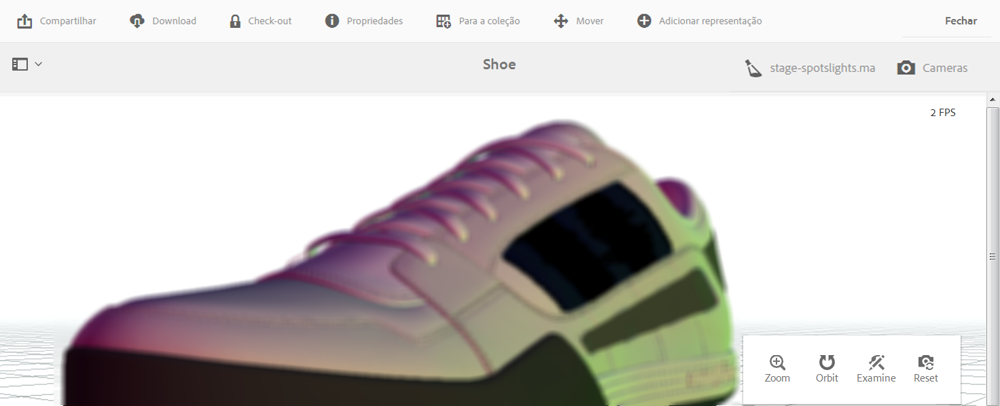

# Exibir ativos 3D {#viewing-d-assets}

>[!IMPORTANT]
>
>AEM 3D no AEM 6.4 não é mais suportado. O Adobe recomenda que você use o recurso de ativos 3D em [AEM como um Cloud Service](https://docs.adobe.com/content/help/en/experience-manager-cloud-service/assets/dynamicmedia/assets-3d.html) ou [AEM 6.5.3 ou superior.](https://docs.adobe.com/content/help/en/experience-manager-65/assets/dynamic/assets-3d.html) para visualização de ativos 3D.

Este documento descreve como visualização ativos 3D em detalhes de ativos e como visualização ativos que estão no componente 3D em sites.

## Exibição de ativos 3D na página Detalhes do ativo {#viewing-d-assets-in-the-asset-details-page}

 O visualizador 3D interativo está disponível na página de detalhes do ativo no AEM. O visualizador inclui, entre outras coisas, uma coleção de controles de câmera interativos que permitem girar, aplicar zoom e deslocar o ativo 3D.

Além de utilizar os palcos padrão no AEM 3D, também é possível usar os palcos criados em um aplicativo de terceiros e enviados por upload para o AEM.

Consulte [Sobre o uso de palcos no AEM 3D](about-the-use-of-stages-in-aem-3d.md).

>[!NOTE]
>
>Para ver um ativo 3D, seu dispositivo ou navegador de desktop devem ser habilitados para WebGL. Além disso, o hardware gráfico subjacente deve ter recursos e memória suficientes para renderizar modelos do tamanho e complexidade desejados. Determinados recursos de pré-visualização, como sombra projetada, não estão disponíveis em todos os navegadores.

### Considerações de desempenho ao visualizar os ativos 3D {#performance-considerations-when-you-view-d-assets}

O tempo que leva para abrir um ativo 3D na exibição de página dos detalhes do ativo depende de vários fatores. Esses fatores incluem informações como as seguintes:

* Largura de banda e latências ao servidor.
* Tamanho modelo (número de faces).
* Número e tamanho dos mapas.
* Complexidade do palco. Por exemplo, o tamanho da imagem IBL.

Além disso, os recursos do computador cliente, como uma estação de trabalho, um notebook ou um dispositivo de toque móvel, também são importantes de se considerar ao manipular a câmera interativamente. Um sistema bastante eficiente com bons recursos gráficos pode tornar a experiência de visualização interativa em 3D mais fácil e favorável.

**Para exibir os ativos 3D**:

1. Verifique se você fez upload dos ativos 3D no AEM.

   Consulte [Sobre o upload e o processamento de ativos 3D no AEM](upload-processing-3d-assets.md).

1. From AEM, on the **[!UICONTROL Navigation]** page, tap **[!UICONTROL Assets]**.
1. Near the upper-right corner of the page, from the **[!UICONTROL View]** drop-down list, tap **[!UICONTROL Card View]**.
1. Navegue até o ativo 3D que deseja visualizar.
1. Toque no cartão de ativo 3D para abri-lo na página de detalhes do ativo.
1. Siga um destes procedimentos:

   * No canto inferior direito da página de detalhes do ativo, use a paleta de controle de câmera para alterar as diferentes exibições do ativo.

      Se você usar um dispositivo sem entrada de toque e sem botão de rolagem, como o mouse clássico de um único botão da Apple, ainda poderá alterar o zoom ou a perspectiva de um ativo 3D nos respectivos modos. Você executa a ação pressionando e mantendo a tecla `SHIFT` pressionada ao soltar o botão do mouse e arrastar para cima ou para baixo.

      Ao usar um teclado de toque em um notebook típico, geralmente é difícil controlar os comportamentos de zoom ou perspectiva com o gesto de dois dedos. Nesses casos, é possível pressionar e manter a tecla `SHIFT` pressionada durante a ação. Esse tipo de esforço reduz a velocidade do gesto de pinça e facilita atingir o nível exato de zoom ou perspectiva que você deseja. Como alternativa, é possível usar uma ação de arrastar um dedo para cima ou para baixo com a tecla `SHIFT` pressionada para afetar os comportamentos de zoom ou perspectiva.
   <table> 
    <tbody> 
      <tr> 
      <td><strong>Nome do controle da câmera</strong>  </td> 
      <td><strong>Descrição</strong></td> 
      </tr> 
      <tr> 
      <td>
Zoom
 
ou
 
Persp
 </td> 
      <td>
Toque ou clique para alternar entre os modos Zoom e Perspectiva.
 
Or, press and hold down the <code>ALT/OPTION</code> key during the action to temporarily toggle to Perspective  mode. Solte a tecla para reverter para o modo Zoom.
 
      <ul> 
      <li><strong>Comportamento de mais e menos zoom</strong>- Dolly que move a câmera mais perto ou mais longe do ativo  que você está visualizando. O zoom é o comportamento padrão para o botão de rolagem do mouse (se disponível), para os gestos de pinça com dois dedos em dispositivos móveis ou com se mantém a tecla Shift pressionada ao arrastar para cima ou para baixo usando o botão esquerdo do mouse.</li> 
      <li><strong>Perspectiva</strong>- Altera a duração focal (também conhecida como campo de visualização) da câmera, mantendo o tamanho relativo do ativo na visualização. A perspectiva é o comportamento alternativo para o botão de rolagem (se disponível), para os gestos de pinça com dois dedos em dispositivos móveis ou com se mantém a tecla Shift pressionada ao arrastar para cima ou para baixo usando o botão esquerdo do mouse.</li> 
      </ul> </td> 
      </tr> 
      <tr> 
      <td>
Órbita
 
ou
 
Panorâmica
 </td> 
      <td>
Toque ou clique para alternar entre os modos de órbita e Deslocamento.
 
Or, press and hold the <code>ALT/OPTION</code> key during the action to temporarily toggle to Pan mode. Solte a tecla para reverter para o modo Órbita.
 
      <ul> 
      <li><strong>Órbita</strong>- Move a câmera de visualização em uma esfera centralizada em um ponto de público alvo que está localizado perto do centro do ativo 3D para ser o padrão. Órbita é o comportamento padrão ao arrastar com o botão esquerdo ou com um único toque em dispositivos móveis.</li> 
      <li><strong>Deslocamento</strong>-Move a câmera no plano de visualização. O ponto de destino é movido de modo correspondente; assim, as ações de órbita subsequentes moverão a câmera ao redor de um novo ponto de destino. Deslocamento é o comportamento alternativo para arrastar com o botão esquerdo e arrastar com um único toque.</li> 
      </ul> </td> 
      </tr> 
      <tr> 
      <td>
Examinar
 
ou
 
Target
 </td> 
      <td>
Toque ou clique para alternar entre os modos Examine e Público alvo.
 
      <ul> 
      <li><strong>Pressione a tecla Examine</strong>ou clique para entrar no modo de Público alvo.</li> 
      <li><strong>Público alvo</strong>- Toque ou clique em um ponto em qualquer lugar do ativo 3D para centralizar a visualização nessa parte do ativo.  As ações de órbita usam o novo ponto de destino.</li> 
      </ul> </td> 
      </tr> 
      <tr> 
      <td>Redefinir</td> 
      <td>Toque ou clique para restaurar o ponto de público alvo da visualização para o centro do modelo. Reset also moves the camera  closer or further away to show the asset in its entirety and at a reasonable viewing size.</td> 
      </tr> 
    </tbody> 
    </table>

   * Near the upper-right corner of the asset details page, tap the **[!UICONTROL Stage Selector]** icon. Selecione um nome de palco com o plano de fundo e a iluminação que deseja aplicar ao ativo 3D.

   

   As etapas fornecem o plano de fundo do ambiente, plano de solo e iluminação em que o modelo 3D é visualizado.

   Consulte [Sobre o uso de palcos no AEM 3D](about-the-use-of-stages-in-aem-3d.md).

   * Near the upper-right corner of the asset details page, tap the **[!UICONTROL Camera Selector]** icon, then select a camera view that you want to apply to the 3D asset.

   

   Os palcos geralmente fornecem câmeras predefinidas. É possível selecionar novamente a câmera atual para restaurar as configurações predefinidas.

   Consulte [Sobre o uso de palcos no AEM 3D](about-the-use-of-stages-in-aem-3d.md).

1. No canto superior direito da página, toque **[!UICONTROL Salvar]**.
1. Faça uma das seguintes opções:

   * Renderizar o ativo 3D.

      Consulte [Renderizar ativos 3D](rendering-3d-assets.md).

   * No canto superior direito da página, toque em **[!UICONTROL Fechar]** para voltar à página Assets.

## Exibição de ativos 3D no componente 3D do Sites {#viewing-d-assets-in-the-sites-d-component}

>[!NOTE]
>
>Esta seção se aplica somente ao visualizador webGL clássico usado para tipos de ativos 3D diferentes do Adobe Dimension.

Dependendo do tipo de dispositivo, você acessa os recursos do componente 3D de várias maneiras.

Para obter mais informações, consulte:

* [Dispositivos para ecrã táctil](#touchscreen-devices)
* [Dispositivos de touch pad](#touchpad-devices)
* [Dispositivos para mouse e trackball](#mouse-and-trackball-devices)

Consulte também [Visualizar uma página da Web que tenha um componente](using-the-3d-sites-component.md#previewing-a-web-page-that-has-a-d-component)3D.

### Dispositivos para ecrã táctil {#touchscreen-devices}

Para trabalhar com componentes 3D com dispositivos de tela sensível ao toque:

1. Use um dedo para arrastar ou deslizar para mover (&quot;órbita&quot;) o ponto de vista (&quot;câmera&quot;) ao redor do objeto. É possível visualização o objeto de qualquer direção.

1. Use uma aproximação de dois dedos para aproximar a câmera do objeto ou afastá-la mais do objeto. Essa ação é semelhante a aumentar ou diminuir o zoom e permite que você inspecione os detalhes do objeto. Como alternativa, mantenha pressionados os botões + ou - para aproximar a câmera ou afastá-la do objeto.

1. Use um arraste com dois dedos para deslocar a câmera. Essa ação move a câmera lateralmente para permitir que você olhe para diferentes partes do objeto enquanto amplia o zoom. Como alternativa, toque no botão **[!UICONTROL Alternar]** órbita/deslocamento para alternar para o modo Deslocamento e, em seguida, use um arraste com um dedo para deslocar a câmera. Toque no botão **[!UICONTROL Orbit/Pan Toggle]** para reverter para o modo **[!UICONTROL Orbit]** .

1. Toque em **[!UICONTROL Redefinir visualizador]** para redefinir a câmera. Essa ação traz o objeto de volta à visualização completa e, se ativada, retoma a rotação automática.

1. Toque em Tela **[!UICONTROL cheia]** para entrar no modo de tela cheia (se suportado pelo dispositivo). Toque em Tela **[!UICONTROL cheia]** novamente para restaurar o visualizador 3D para o modo incorporado à página.

### Dispositivos de touch pad {#touchpad-devices}

Para trabalhar com componentes 3D com dispositivos de touch pad:

1. Use um arraste com um dedo enquanto segura o botão do touch pad (esquerda) para baixo para mover (&quot;órbita&quot;) o ponto de vista (&quot;câmera&quot;) ao redor do objeto. É possível visualização o objeto de qualquer direção.

1. Use um arraste com dois dedos para baixo ou para cima com botões do touch pad para cima para mover a câmera mais perto ou mais longe do objeto. Essa ação é semelhante a aumentar ou diminuir o zoom e permite inspecionar detalhes no objeto. Como alternativa, clique e mantenha pressionados os botões **[!UICONTROL Mais]** zoom ou Menos **[!UICONTROL zoom]** para aproximar a câmera ou afastá-la do objeto.

1. Pressione com um dedo para arrastar enquanto segura a tecla **ALT/opção** e o botão do touch pad (esquerdo) para deslocar a câmera. Essa ação move a câmera lateralmente para permitir que você olhe para diferentes partes do objeto enquanto amplia o zoom. Como alternativa, clique no botão **[!UICONTROL Alternar]** órbita/deslocamento para alternar para o modo **[!UICONTROL Deslocamento]** e, em seguida, use uma ação de arrastar com um dedo enquanto segura o botão (à esquerda) para deslocar a câmera. Clique novamente no botão **[!UICONTROL Orbit/Pan Toggle]** para reverter para o modo **[!UICONTROL Orbit]** .

1. Clique em **[!UICONTROL Redefinir visualizador]** para redefinir a câmera. Essa ação traz o objeto de volta à visualização completa e, se ativada, retoma a rotação automática.

1. Clique em Tela **[!UICONTROL cheia]** para entrar no modo de tela cheia. Use a tecla **Escape** no teclado ou clique em Tela **[!UICONTROL cheia]** novamente para restaurar o visualizador 3D para o modo incorporado à página.

### Dispositivos para mouse e trackball {#mouse-and-trackball-devices}

Para trabalhar com componentes 3D com dispositivos de mouse e trackball:

1. Arraste enquanto segura o botão esquerdo do mouse para baixo para mover (&quot;órbita&quot;) o ponto de visão (&quot;câmera&quot;) ao redor do objeto. É possível visualização o objeto de qualquer direção.

1. Use a roda de rolagem para mover a câmera para perto ou mais longe do objeto. Isso é semelhante a aumentar ou diminuir o zoom e permite que você inspecione os detalhes do objeto. Como alternativa, clique e mantenha pressionados os botões **[!UICONTROL Mais]** zoom ou Menos **[!UICONTROL zoom]** para aproximar a câmera ou afastá-la do objeto.

1. Arraste enquanto segura a tecla **ALT/option** e o botão esquerdo do mouse para deslocar a câmera. Isso move a câmera lateralmente para permitir que você veja diferentes partes do objeto enquanto amplia o zoom. Como alternativa, clique no botão **[!UICONTROL Alternar]** órbita/deslocamento para alternar para o modo **[!UICONTROL Deslocamento]** e arraste enquanto segura o botão esquerdo do mouse para deslocar a câmera. Clique novamente em **[!UICONTROL Orbit/Pan Toggle]** para reverter para o modo **[!UICONTROL Orbit]** .
1. Clique em **[!UICONTROL Redefinir visualizador]** para redefinir a câmera. Essa ação traz o objeto de volta à visualização completa e, se ativada, retoma a rotação automática.
1. Clique em Tela **[!UICONTROL cheia]** para entrar no modo de tela cheia. Use a tecla **[!UICONTROL Escape]** no teclado ou clique em Tela **[!UICONTROL cheia]** novamente para restaurar o visualizador 3D para o modo incorporado à página.

