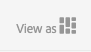

# Trabalho com seletores {#working-with-selectors}

>[!CAUTION]
>
>AEM 6.4 chegou ao fim do suporte estendido e esta documentação não é mais atualizada. Para obter mais detalhes, consulte nossa [períodos de assistência técnica](https://helpx.adobe.com/br/support/programs/eol-matrix.html). Encontre as versões compatíveis [here](https://experienceleague.adobe.com/docs/).

Ao trabalhar com uma Imagem interativa, Vídeo interativo ou Banner de carrossel, você seleciona ativos e seleciona sites e produtos para pontos de acesso e mapas de imagem para os quais vincular. Ao trabalhar com Conjuntos de imagens, Conjuntos de rotação e Conjuntos de multimídia, você também seleciona ativos com o Seletor de ativo.

Este tópico aborda como usar os seletores Produto, Site e Ativo, incluindo a capacidade de navegar, filtrar e classificar dentro dos seletores.

Você acessa os seletores ao criar conjuntos de carrossel, adicionar pontos de acesso e mapas de imagem, criar vídeos e imagens interativas.

Por exemplo, neste Banner de carrossel, você usa o seletor de produto se estiver vinculando um ponto de acesso ou mapa de imagem a uma página do Quickview; use o seletor de site se estiver vinculando um ponto de acesso ou mapa de imagem a um hiperlink; use o seletor de Ativos ao criar um novo slide.

Ao selecionar (em vez de inserir manualmente) para onde os pontos de acesso ou mapas de imagem são direcionados, você está usando o seletor. O seletor de site só funcionará se você for um cliente do AEM Sites. O seletor de produto também requer AEM Commerce.

## Seleção de produtos {#selecting-products}

Use o seletor de produto para escolher um produto quando quiser um ponto de acesso ou mapa de imagem para fornecer uma exibição rápida a um produto específico em seu catálogo de produtos.

1. Navegue até o Conjunto de carrosséis, Imagem interativa ou Vídeo interativo e toque na guia **[!UICONTROL Ações]** (disponível somente se tiver definido um ponto de acesso ou mapa de imagem).

   O seletor de Produto está no **[!UICONTROL Tipo de ação]** área.

   

1. Toque no **[!UICONTROL Seletor de produto]** ícone (lupa) e navegue até um produto no catálogo.

   

   Também é possível filtrar por palavra-chave ou tag ao tocar em **[!UICONTROL Filtro]** e inserir palavras-chave, ou selecionar tags, ou ambos.

   

   Você pode alterar o local em que AEM procura dados do produto ao tocar em **[!UICONTROL Procurar]** e navegar para outra pasta.

   

   Toque **[!UICONTROL Classificar]** para alterar se o AEM classifica do mais novo para o mais antigo ou do mais antigo para o mais recente.

   

   Toque em **[!UICONTROL Visualizar como]** para alterar a exibição de produtos - **[!UICONTROL Exibição em lista]** ou **[!UICONTROL Exibição de cartão]**.

   

1. Após a seleção do produto, o campo é preenchido com a miniatura e o nome do produto.

   

1. Quando em **[!UICONTROL Visualizar]** , você pode tocar no ponto de acesso ou mapa de imagem e ver a aparência do Quickview.

   

## Seleção de sites {#selecting-sites}

Use o seletor de site para escolher uma página da Web quando quiser um ponto de acesso ou mapa de imagem para vincular a uma página da Web que seja gerenciada em AEM sites.

1. Navegue até o Conjunto de carrosséis, Imagem interativa ou Vídeo interativo e toque na guia **[!UICONTROL Ações]** (disponível somente se tiver definido um ponto de acesso ou mapa de imagem).

   O Seletor de site está na área **[!UICONTROL Tipo de ação]**.

   

1. Toque no ícone do **[!UICONTROL Seletor de sites]** (pasta com lupa) e navegue até uma página no AEM Sites a qual você deseja vincular o ponto de acesso ou mapa de imagem.

   

1. Após a seleção do site, o campo é preenchido com o caminho.

   

1. Quando em **[!UICONTROL Visualizar]** modo , se você tocar no ponto de acesso ou mapa de imagem, navegará até a página do site AEM que você especificou.

## Seleção de ativos {#selecting-assets}

Use este seletor para escolher imagens para usar em um Banner de carrossel, um Vídeo interativo, conjuntos de imagens, conjuntos de mídia mista e conjuntos de rotação. Em Vídeo interativo, o seletor de ativos fica disponível ao tocar em **[!UICONTROL Selecionar ativos]** no **[!UICONTROL Conteúdo]** guia . Em Conjuntos de carrossel, o seletor de ativos fica disponível ao criar um novo slide. Em Conjuntos de imagens, Conjuntos de mídias mistas e Conjuntos de rotação, o seletor de ativo estará disponível ao criar um novo Conjunto de imagens, Conjunto de mídias mistas ou Conjunto de rotação, respectivamente.

Consulte também [Seletor de ativos](asset-selector.md) para obter mais informações.

1. Navegue até o Conjunto de carrossel e crie um novo slide. Ou navegue até o Vídeo interativo, vá para **[!UICONTROL Conteúdo]** e selecione ativos. Ou crie um Conjunto de mídias mistas, um Conjunto de imagens ou um Conjunto de rotação.
1. Toque no ícone **[!UICONTROL Seletor de ativos]** (pasta com uma lupa) e navegue até um ativo.

   

   Também é possível filtrar por palavra-chave ou tag ao tocar em **[!UICONTROL Filtro]** e inserir palavras-chave, adicionar critérios ou ambos.

   

   Você pode alterar o local em que o AEM procura por ativos navegando até outra pasta no **[!UICONTROL Caminho]** campo.

   Toque **[!UICONTROL Coleção]** para pesquisar apenas ativos nas coleções.

   

   Toque em **[!UICONTROL Visualizar como]** para alterar a exibição de produtos - **[!UICONTROL Exibição em lista]**, **[!UICONTROL Exibição em coluna]** ou **[!UICONTROL Exibição de cartão]**.

   

1. Toque na marca de seleção para selecionar o ativo. O ativo é exibido.

   
